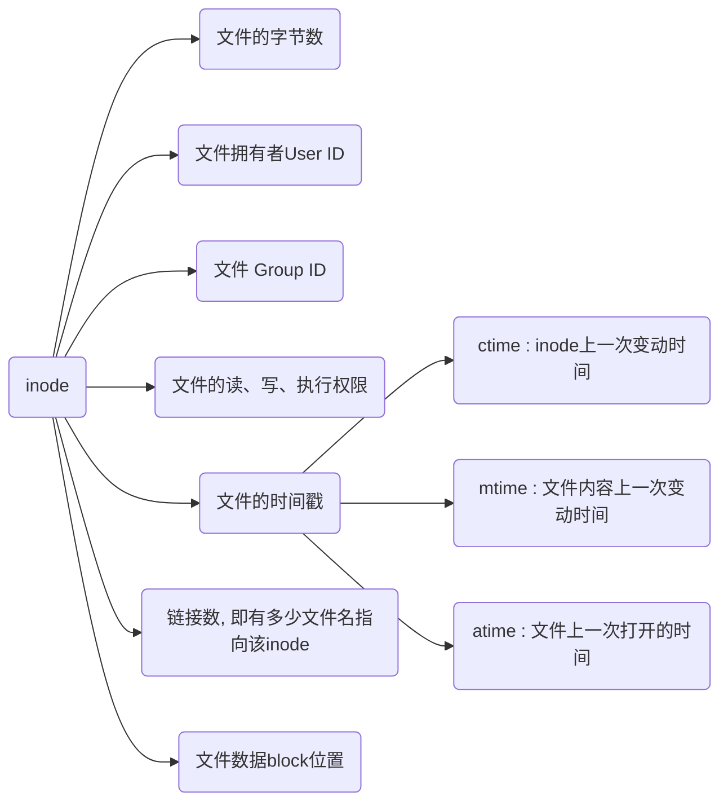

# inode

## 扇区

扇区($sector$)是硬盘的最小存储单位, 每个扇区储存512字节(0.5KB)

操作系统读取硬盘时为提高效率, 会一次性连续读取多个扇区

## 块(block)

块($block$)由多个扇区组成, 是文件存取的最小单位, 大小常见为4KB, 即连续八个扇区组成

文件数据与文件的创建者, 文件的创建日期, 文件的大小等文件的元信息都储存在块中

储存文件元信息的区域就是inode(索引节点)

## inode区

硬盘格式化的时候OS自动将硬盘分为:

- 数据区, 存放文件数据

- inode区($inode$ $table$), 存放inode所包含的信息

每个inode节点的大小一般是128字节或256字节, 硬盘格式化时就会给定inode节点的总数, 一般是每1KB或2KB设置一个inode

如1GB的硬盘中, 每个inode节点的大小为128字节, 每1KB就设置一个inode, 那么inode table的大小为128MB, 占硬盘空间的12.8\%

## inode内容

每个文件对应的inode内容包含




## inode作用

- 删除文件

当文件名包含特殊字符无法正常删除时, 可直接删除inode节点, 即可删除文件

- 移动/重命名文件

只会改变文件名, 不影响inode号码

- 文件操作

打开文件后, 系统就以inode号码来识别它, 而不再考虑文件名

更新文件时, 新版文件以同样的文件名, 生成一个新的inode, 不会影响到运行中的文件, 

下次运行软件的时候, 文件名就自动指向新版文件, 旧版文件inode则被回收

## indoe命令

### indeo信息

- 查看分区的indoe信息
  
```sh
df -i
```


- 查看文件indoe信息
  
```sh
stat 文件
```


- 查看文件的indoe号码
  
```sh
ls -il
```


### indoe号码

- 硬链接

indoe号码与源文件相同

```sh
ln [源文件] [链接文件]
```


- 软链接

inode号码不同, 但是indoe号码指向的是源文件的名字

```sh
ln -s [源文件] [链接文件]
```

### 删除

```sh
find [搜索的路径] -inum [文件的indoe号码] -delete
```
