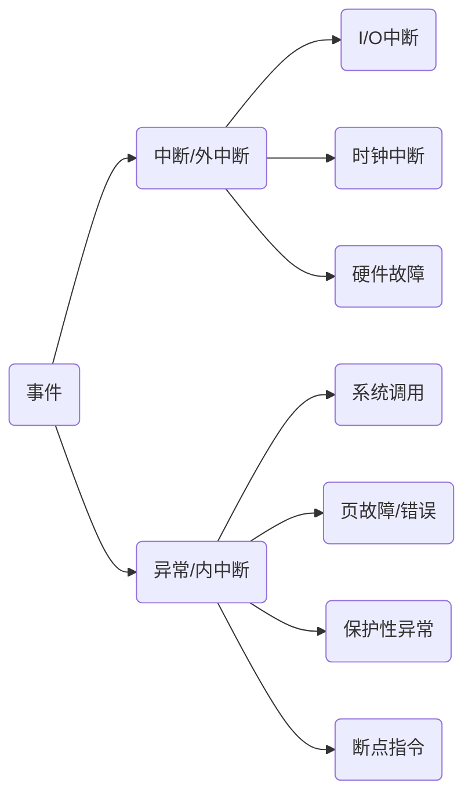
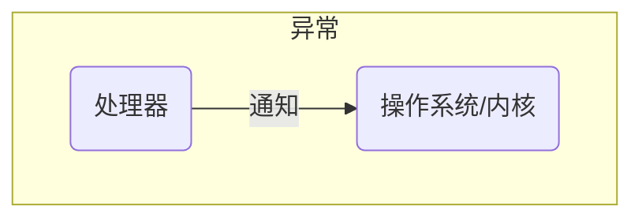
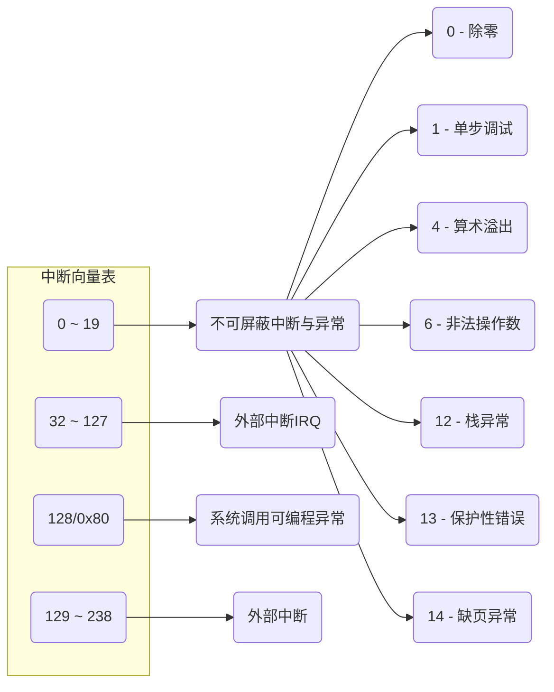
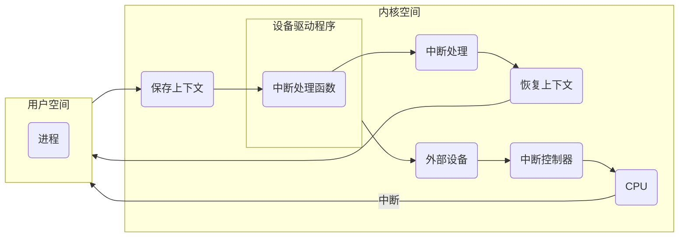

> - [键盘敲入 A 字母时, 期间发生了什么....](https://juejin.cn/post/6864158680028774407)
> - [操作系统学习(十三) 、中断和异常](https://www.cnblogs.com/ay-a/p/9189284.html)

# 中断与异常

中断是指 **CPU** 对系统发生某事件时, 暂停正在执行程序, 在保留现场后自动地转去执行该事件中断处理程序, 执行完后, 再返回到原程序断点处继续执行的一种响应

发生异常(exception)和中断(interrupt)事件后, 系统将进入 OS 内核态对相应事件进行处理

## 类别

### 外中断(中断)

指中断, 是指由于外部设备事件所引起的中断, 如磁盘中断、打印机中断等

中断是由于系统中某事件引起, 该事件与现行指令无关

### 可屏蔽中断

I/O设备发出的所有中断请求(IRQ)都产生可屏蔽中断

通过 INTR(中断请求信号, 高电平有效)向 CPU 请求, 可通过设置屏蔽字来屏蔽请求

若中断请求被屏蔽, 则不会被送到CPU

### 非屏蔽中断

危急时机, 如硬件故障引起, 由CPU辨认, 通过 NMI (不可中断信号)向 CPU 请求

一旦产生, 就被立即送 CPU以便快速处理, 中断服务程序会尽快保存系统重要信息, 然后在屏幕上显示相应的消息或直接重启系统

- 网卡中断

1. 数据到达网卡

2. 网卡产生一个中断给内核

3. 内核使用I/O指令, 从网卡I/O区域中去读取数据

### 内中断(异常)

指异常, 是指由于CPU内部事件所引起的中断, 如程序出错(非法指令、地址越界), 也被译为"捕获"或"陷入"

异常是由于执行了现行指令所引起的. 由于系统调用引起的中断属于异常

- 故障

执行指令引起的异常, 如缺页、越权、越级、溢出、非法指令, 断点为故障发生的地方

- 陷阱

预先安排的事件, 如调试程序时打的断点, 单步跟踪, 系统调用, 是一种自愿中断, 断点为自陷指令的下一条指令

- 终止

不可恢复的错误, 如硬件故障事件, 此时机器会终止, 调出中断服务程序来终止程序甚至重启操作系统

### 类别

- 除零异常

当系统返现除零时, 会抛出异常, 若程序不处理这个异常, 那么操作系统将发出一个异步信号终止当前执行的程序

## 概念

- 中断向量

每个异常和中断由0~255间的数标识, 称为中断向量(vector)

- 中断向量表

存放中断向量到中断执行程序地址的映射

部分映射需在内核初始化开启中断前完成设置, 也能够后续执行过程中动态修改与添加映射

通过在指令操作数中提供中断向量号,  INT n 指令可用于从软件中产生中断

例如, 指令 INT 0x80 会执行Linux的系统系统中断调用中断0x80. 向量0到255中的任何一个都可以用作INT指令的中断号

- 中断执行程序

中断向量对应的执行程序, 用于执行具体中断逻辑, 需用户自定义

- 中断执行流程

CPU在执行过程中, 触发中断, 而后CPU根据触发中断携带的中断向量, 从中断向量表中找出中断执行程序, 跳转执行中断执行程序, 执行完成再跳回中断前程序执行

## 中断处理流程

### 准备

- 保护现场

将各寄存器的内容压入堆栈保存

- 判断中断

是否能够中断切换

- 开中断

允许高级版中断, 实现中断嵌套

### 执行

- 中断处理

跳转到中断处理代码处

中断控制器中有一个中断优先级判别器, 它自动判别出目前提出中断请求的优先级最高的中断源, 并将它的中断向量码送到数据总线, CPU接收中断向量码并据此找到它的中断服务程序

### 收尾

- 关中断

保护恢复现场过程

- 恢复现场

将保存在堆栈中的现场信息弹出到原来的寄存器中

- 开中断

响应下一次中断

## 示例

### 键盘输入

那当用户输入了键盘字符, 键盘控制器就会产生扫描码数据, 并将其缓冲在键盘控制器的寄存器中, 紧接着键盘控制器通过总线给 CPU 发送中断请求

CPU 收到中断请求后, 操作系统会保存被中断进程的 CPU 上下文, 然后调用键盘的中断处理程序

键盘的中断处理程序是在键盘驱动程序初始化时注册的, 键盘中断处理函数的功能就是从键盘控制器的寄存器的缓冲区读取扫描码, 再根据扫描码找到用户在键盘输入的字符, 若输入的字符是显示字符, 那就会把扫描码翻译成对应显示字符的  ASCII 码, 比如用户在键盘输入的是字母 A, 是显示字符, 于是就会把扫描码翻译成 A 字符的 ASCII 码. 

得到了显示字符的 ASCII 码后, 就会把 ASCII 码放到「读缓冲区队列」, 接下来就是要把显示字符显示屏幕了, 显示设备的驱动程序会定时从「读缓冲区队列」读取数据放到「写缓冲区队列」, 最后把「写缓冲区队列」的数据一个一个写入到显示设备的控制器的寄存器中的数据缓冲区, 最后将这些数据显示在屏幕里. 
显示出结果后, 恢复被中断进程的上下文

## 对比

- 相同点

都是CPU对系统发生的某个事情做出的一种反应, 最后都是由CPU发送给内核, 由内核去处理

- 区别

| 分类             | 中断                                             | 异常                      |
| ---------------- | ------------------------------------------------ | ------------------------ |
| 产生地点          | 处理器外部, 由与运行程序无关的中断信号触发          | 处理器内部, CPU控制单元产生 |
| 能否被屏蔽        | 高优先级中断可屏蔽低优先级中断                      | 不可被屏蔽                |
| 处理程序能否被阻塞 | 不能被阻塞, 处理器休要即使响应中断信号              | 可以被阻塞                |
| CPU              | 与CPU异步, 无论处理器处于什么状态都需处理外部中断请求 | 与CPU异步                |
| 能否嵌套          | 允许嵌套, 一般不超过三重                           | 大多为一重                |
| 相互之间影响      | 中断过程不会产生异常                               | 异常处理过程中可能产生中断  |