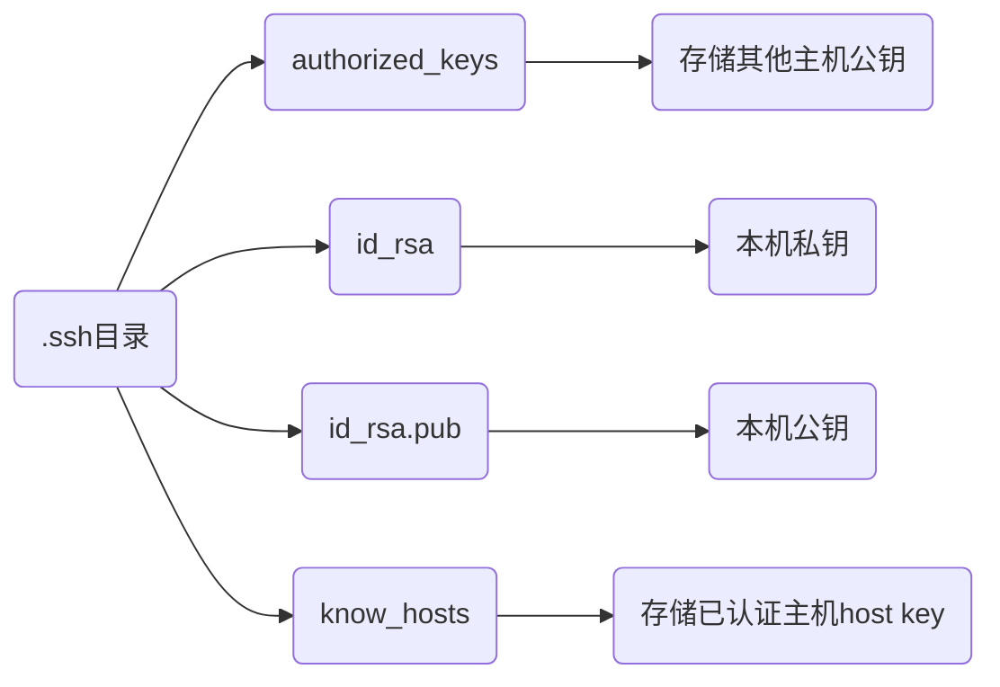

> - [SSH 穿越多个跳板机的连接方法](https://murphypei.github.io/blog/2021/12/ssh-proxyjump.html)
> - [win10 ssh 上传密钥过程，出现 无法将"ssh-copy-id"项识别](https://blog.csdn.net/Defiler_Lee/article/details/116278442)
> - [iSH ssh 安装](https://blog.csdn.net/u010953692/article/details/108582389)

# SSH

## 配置

### 安装

```sh
# Ubuntu
sudo apt install openssh-server

# apk
apk add openssh
```

### 生成密钥

```sh
ssh-keygen -t rsa
```

- 清除密钥

```sh
ssh-keygen -R [远程主机IP]
```

### .ssh目录

生成密钥后在根目录(/root/或/home/用户名)下生成 .ssh目录

```sh
.
├── authprized_keys
├── id_rsa
├── id_rsa.pub
└── known_hosts
```



## 操作

### 连接

```sh
ssh 用户名@IP地址 (-p 端口号)
```

连接192.168.3.3 dmjcb用户, 端口号默认20


### 免密登录

#### 手动

将本地`id_rsa.pub` 复制到远程主机`.ssh/authorized_keys`里

#### 指令

- Linux

```sh
ssh-copy-id -i ~/.ssh/id_rsa.pub [远程用户]@[远程主机IP]
```

- Windows

powershell中先执行

```powershell
function ssh-copy-id([string]$userAtMachine, $args){   
    $publicKey = "$ENV:USERPROFILE" + "/.ssh/id_rsa.pub"
    if (!(Test-Path "$publicKey")){
        Write-Error "ERROR: failed to open ID file '$publicKey': No such file"            
    }
    else {
        & cat "$publicKey" | ssh $args $userAtMachine "umask 077; test -d .ssh || mkdir .ssh ; cat >> .ssh/authorized_keys || exit 1"      
    }
}
```

```sh
ssh-copy-id [远程用户]@[远程主机IP]
```

### scp

```sh
scp -r 本地路径 远程用户@IP地址:远程目标路径
```

### 指令

#### 开启

```sh
sudo service ssh start
```

#### 停止

```sh
sudo service ssh stop
```

#### 重启

```sh
sudo service ssh restart

或

sudo systemctl restart sshd
```