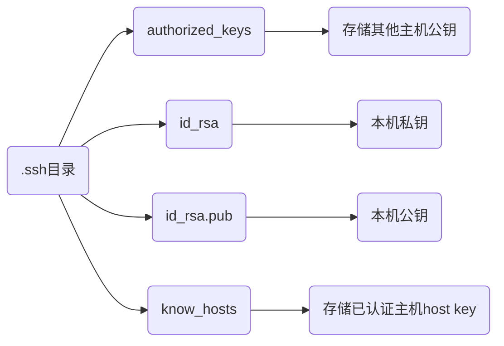

> - [win10 ssh 上传密钥过程，出现 无法将"ssh-copy-id"项识别](https://blog.csdn.net/Defiler_Lee/article/details/116278442)

# SSH

## 命令

### 连接

```sh
ssh 用户名@IP地址 (-p 端口号)
```

连接192.168.3.3 dmjcb用户, 端口号默认20

```sh
ssh dmjcb@192.168.3.3
```


### 清除密钥

```sh
ssh-keygen -R [远程主机IP]
```

### 免密登录

可以手动将 本地`id_rsa.pub` 复制到远程主机`.ssh/authorized_keys`里

#### Linux设备

```sh
ssh-copy-id -i ~/.ssh/id_rsa.pub [远程用户]@[远程主机IP]
```


#### Windows设备

powershell中先执行

```powershell
function ssh-copy-id([string]$userAtMachine, $args){   
    $publicKey = "$ENV:USERPROFILE" + "/.ssh/id_rsa.pub"
    if (!(Test-Path "$publicKey")){
        Write-Error "ERROR: failed to open ID file '$publicKey': No such file"            
    }
    else {
        & cat "$publicKey" | ssh $args $userAtMachine "umask 077; test -d .ssh || mkdir .ssh ; cat >> .ssh/authorized_keys || exit 1"      
    }
}
```

```sh
ssh-copy-id [远程用户]@[远程主机IP]
```


### scp

```sh
scp -r 本地路径 远程用户@IP地址:远程目标路径
```

## 配置

### .ssh目录

在根目录(/root/或者/home/用户名)下生成 .ssh目录

```sh
ssh-keygen -t rsa
```




### 配置文件

路径

```sh
/etc/ssh/sshd_condfig
```

内容

```sh
# 允许密钥登录
RSAAuthentication yes

# 允许公钥验证 
PubkeyAuthentication yes

# 禁止密码登录
PasswordAuthentication no
```

### 参数

- SSH版本

```sh
OpenSSH_7.4p1, OpenSSL 1.0.2k-fips  26 Jan 2017
```

- 读取本地主机ssh_config文件

```sh
debug1: Reading configuration data /etc/ssh/ssh_config

debug1: /etc/ssh/ssh_config line 58: Applying options for *
```

- 尝试链接远程主机 

```sh
debug1: Connecting to 192.168.43.96 [192.168.43.96] port 22.
```

- 链接成功建立

```sh
debug1: Connection established.
debug1: permanently_set_uid: 0/0
debug1: identity file /root/.ssh/id_ed25519-cert type -1
debug1: Enabling compatibility mode for protocol 2.0
debug1: Local version string SSH-2.0-OpenSSH_7.4
```

- 远程控制版本

```sh
debug1: Remote protocol version 2.0, remote software version OpenSSH_7.4
debug1: match: OpenSSH_7.4 pat OpenSSH* compat 0x04000000
```

- 验证远程主机IP 端口与登录用户

```sh
debug1: Authenticating to 192.168.43.96:22 as 'root'

# 发送
debug1: SSH2_MSG_KEXINIT sent

# 接收
debug1: SSH2_MSG_KEXINIT received
debug1: kex: algorithm: curve25519-sha256
debug1: kex: host key algorithm: ecdsa-sha2-nistp256
debug1: kex: server->client cipher: chacha20-poly1305@openssh.com MAC: <implicit> compression: none
debug1: kex: client->server cipher: chacha20-poly1305@openssh.com MAC: <implicit> compression: none
debug1: kex: curve25519-sha256 need=64 dh_need=64
debug1: kex: curve25519-sha256 need=64 dh_need=64
debug1: expecting SSH2_MSG_KEX_ECDH_REPLY
debug1: Server host key: ecdsa-sha2-nistp256 SHA256:lsEahI9aF7pwetF/JFWve4GvvsepzuYPc24/r2qxLZ8
debug1: Host '192.168.43.96' is known and matches the ECDSA host key.
```

- 在远程主机的known_hosts文件中查找密钥

```sh
debug1: Found key in /root/.ssh/known_hosts:7
debug1: rekey after 134217728 blocks
debug1: SSH2_MSG_NEWKEYS sent
debug1: expecting SSH2_MSG_NEWKEYS
debug1: SSH2_MSG_NEWKEYS received
debug1: rekey after 134217728 blocks
debug1: SSH2_MSG_EXT_INFO received
debug1: kex_input_ext_info: server-sig-algs=<rsa-sha2-256, rsa-sha2-512>
debug1: SSH2_MSG_SERVICE_ACCEPT received

debug1: Authentications that can continue: publickey, gssapi-keyex, gssapi-with-mic, password
debug1: Next authentication method: gssapi-keyex
debug1: No valid Key exchange context
debug1: Next authentication method: gssapi-with-mic
debug1: Unspecified GSS failure.  Minor code may provide more information
No Kerberos credentials available (default cache: KEYRING:persistent:0)

debug1: Unspecified GSS failure.  Minor code may provide more information
No Kerberos credentials available (default cache: KEYRING:persistent:0)

# 密钥确认
debug1: Next authentication method: publickey

# 提供公钥
debug1: Offering RSA public key: /root/.ssh/id_rsa

debug1: Server accepts key: pkalg rsa-sha2-512 blen 279
# 确认成功
debug1: Authentication succeeded (publickey).Authenticated to 192.168.43.96 ([192.168.43.96]:22).
debug1: channel 0: new [client-session]
debug1: Requesting no-more-sessions@openssh.com
debug1: Entering interactive session.
debug1: pledge: network
debug1: client_input_global_request: rtype hostkeys-00@openssh.com want_reply 0
debug1: Sending environment.
debug1: Sending env LANG = zh_CN.UTF-8

# 上一次登录信息
Last login: Thu Mar 11 17:51:04 2021 from 192.168.43.231
```

### 登陆日志

很多Linux新发行版已经不再使用, 改为使用rsyslog, 配置目录/etc/rsyslog.d

```sh
/var/log/secure
```

日志实例

```sh
Mar 10 10:51:44 localhost sshd[10616] pam_unix(sshd:session) session opened for user root by (uid=0)
```

| 信息             | 值                                      |
| ---------------- | --------------------------------------- |
| 月份             | Mar                                     |
| 日期             | 10                                      |
| 时分秒           | 10:51:44                                |
| 服务器主机       | localhost                               |
| 程序(sshd或则su) | sshd[10616]                             |
| 模块             | pam_unix(sshd:session)                  |
| 详细信息         | session opened for user root by (uid=0) |

- 登录

```sh
Mar 10 10:51:44 localhost sshd[10616]: Accepted publickey for root from 192.168.43.231 port 52131 ssh2: RSA SHA256:D2xE2Ju/pNEVJBTGjYCb+kZb+TwclJjxsQFJcfTCnZ4

Mar 10 10:51:44 localhost sshd[10616]: pam_unix(sshd:session): session opened for user root by (uid=0)
```

- 登出

```ini
Mar 10 10:52:12 localhost sshd[10616]: Received disconnect from 192.168.43.231 port 52131:11: disconnected by user

Mar 10 10:52:12 localhost sshd[10616]: Disconnected from 192.168.43.231 port 52131

Mar 10 10:52:12 localhost sshd[10616]: pam_unix(sshd:session): session closed for user root
```

- 切换用户

```ini
Mar 10 10:53:56 localhost su: pam_unix(su:session): session opened for user dmjcb by (uid=0)
```

- 提示输入密码时取消

```ini
Mar 10 10:53:56 localhost sshd[19046]: Received disconnect from 192.168.43.231: 13: The user canceled authentication.
```

- 密码输入错误

```ini
Aug  8 02:33:28 imzcy sshd[19125]: pam_unix(sshd:auth): authentication failure; logname= uid=0 euid=0 tty=ssh ruser= rhost=192.168.217.10  user=root

Aug  8 02:33:31 imzcy sshd[19125]: Failed password for root from 192.168.217.10 port 57994 ssh2
```

- 密码错误次数太多

```ini
Aug  8 02:33:28 imzcy sshd[19125]: pam_unix(sshd:auth): authentication failure; logname= uid=0 euid=0 tty=ssh ruser= rhost=192.168.217.10  user=root
Aug  8 02:33:31 imzcy sshd[19125]: Failed password for root from 192.168.217.10 port 57994 ssh2
Aug  8 02:34:06 imzcy last message repeated 3 times
Aug  8 02:34:13 imzcy last message repeated 2 times
Aug  8 02:34:47 imzcy sshd[19126]: Disconnecting: Too many authentication failures for root
Aug  8 02:34:47 imzcy sshd[19125]: Failed password for root from 192.168.217.10 port 57994 ssh2
Aug  8 02:34:47 imzcy sshd[19125]: PAM 6 more authentication failures; logname= uid=0 euid=0 tty=ssh ruser= rhost=192.168.217.10  user=root
Aug  8 02:34:47 imzcy sshd[19125]: PAM service(sshd) ignoring max retries; 7 > 3
```

## 软件

### 安装

Ubuntu

```sh
sudo apt install openssh-server
```

### 获取登录信息

/etc/ssh/目录下新建sshrc

```sh
#!/bin/bash

# 获取登录者的用户名
user=${USER}

# 获取登录者的IP地址
ip=${SSH_CLIENT%% *}

# 获取登录的时间
time=${date +%F%t%k:%M}

# 服务器的IP地址
server=${ifconfig wlp2s0 | sed -n '2p' | awk '{print $2}'}

echo ${user} ${ip} ${time} ${server}
```

### Web工具

> [WebSSH](https://github.com/huashengdun/webssh)

```sh
pip3 install webssh
```

- 直接运行wssh, 默认8888端口

```sh
wssh
```

- 绑定IP地址端口

```sh
wssh --address='IP地址' --port=端口
```