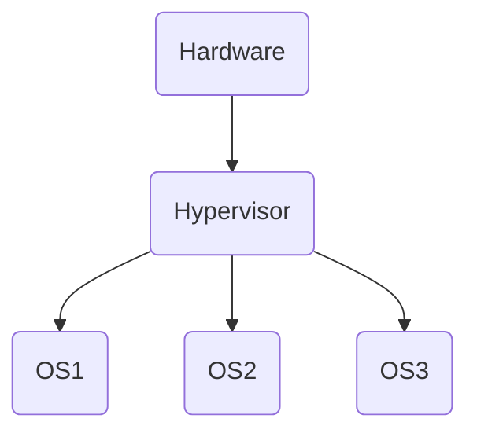
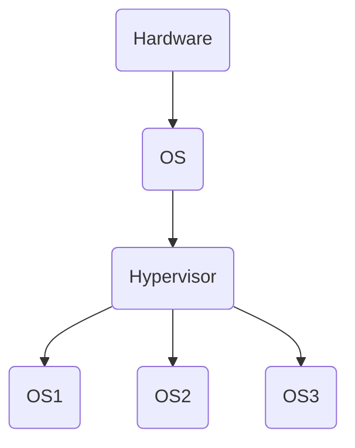

<!--
 * @Brief        : 
 * @Author       : dmjcb
 * @Date         : 2021-02-07 14:02:02
 * @LastEditors  : dmjcb@outlook.com
 * @LastEditTime : 2024-09-28 17:54:16
-->

# Hypervisor

## 概念

虚拟机监视器(virtual machine monitor, VMM), 是用来建立与执行虚拟机器的软件、固件或硬件

被Hypervisor用来运行一个或多个虚拟机的电脑称为宿主机(host machine), 这些虚拟机则称为客户机(guest machine)

Hypervisor 提供虚拟的作业平台来运行客户操作系统(guest operating systems), 负责管理其他客操作系统的运行阶段, 这些客操作系统, 共同分享虚拟化后的硬件资源

Hypervisor是一种在虚拟环境中的"元"操作系统

他们可以访问服务器上包括磁盘和内存在内的所有物理设备

Hypervisor不但协调着这些硬件资源的访问, 也同时在各个虚拟机之间施加防护

当服务器启动并执行Hypervisor时, 它会加载所有虚拟机客户端的操作系统同时会分配给每一台虚拟机适量的内存, CPU, 网络和磁盘

## 原生或裸机hypervisor

虚拟机管理程序直接运行在宿主机的硬件上来控制硬件和管理客操作系统

- 需要硬件支持

- 虚拟机监视器作为主操作系统

- 运行效率高



## 寄居或托管hypervisor

虚拟机管理程序运行在传统的操作系统上, 就像其他计算机程序那样运行

特点

- 虚拟机监视器作为应用程序运行在主操作系统环境内

- 运行效率一般较原生低




## Hyper-v

### 嵌套虚拟化

请确保虚拟机为关闭状态
  
```sh
Get-VM
```


此处虚拟机名为CentOS 7

```sh
Get-VMProcessor -VMName 虚拟机名 | fl
```


显示嵌套虚拟化选项值为False

```sh
Set-VMProcessor -ExposeVirtualizationExtensions $true -VMName 虚拟机名
```

正常情况没有输出


### Vmware于Hyper共存

在Vmware中创建虚拟机的时候, Vmware提示

```sh
VMware Workstation和Hyper-V不兼容.

请先从系统中移除Hyper-V角色, 然后再运行VMware Workstation
```

两者都是基于 $CPU$ 等底层硬件的 $Hypervisor$ 机制来实现的, 而他们必须独占管理 $Hypervisor$, 因此不能在一台电脑中同时运行

- 关闭Hyper-v

```sh
bcdedit /set hypervisorlaunchtype off
```

- 开启Hyper-v

```sh
bcdedit /set hypervisorlaunchtype auto
```
