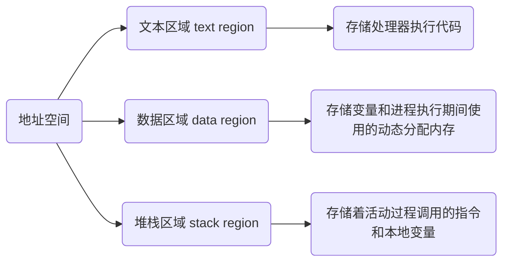

<!--
 * @Description:
 * @Version: 1.0
 * @Author: dmjcb
 * @Email: 
 * @Date: 2023-03-13 01:44:09
 * @LastEditors: dmjcb
 * @LastEditTime: 2023-04-23 10:05:11
-->

# 进程与线程

## 程序

程序是指令、数据及其组织形式的描述, 进程是程序的实体

## 进程

进程(Process)是计算机中的程序关于某数据集合上的一次运行活动, 是系统进行资源分配和调度的基本单位, 是操作系统结构的基础

在早期面向进程设计的计算机结构中, 进程是程序的基本执行实体

在当代面向线程设计的计算机结构中, 进程是线程的容器

进程是一个具有独立功能的程序关于某个数据集合的一次运行活动, 可以申请和拥有系统资源, 是一个动态的概念, 是一个活动的实体, 不只是程序的代码, 还包括当前的活动, 通过程序计数器的值和处理寄存器的内容来表示

### 概念

#### 进程是一个实体

每个进程都有自己的地址空间, 一般包括,

#### 进程是一个"执行中的程序"

程序是一个没有生命的实体, 只有处理器赋予程序生命时(操作系统执行时), 就成为一个活动的实体, 称为进程

进程是具有一定独立功能的程序关于某个数据集合上的一次运行活动, 进程是系统进行资源分配和调度的一个独立单位

每个进程都有自己的独立内存空间, 不同进程通过`进程间通信`来通信

由于进程比较重量, 占据独立的内存, 所以上下文进程间的切换开销(栈、寄存器、虚拟内存、文件句柄等)比较大, 但相对比较稳定安全

## 线程

线程是进程的一个实体, 是CPU调度和分派的基本单位, 它是比进程更小的能独立运行的基本单位

线程自己基本上不拥有系统资源, 只拥有一点在运行中必不可少的资源(如程序计数器, 一组寄存器和栈), 但是它可与同属一个进程的其他的线程共享进程所拥有的全部资源

### 线程间通信

线程间通信主要通过`共享内存`, 上下文切换很快, 资源开销较少, 但相比进程不够稳定容易丢失数据

一个线程可以创建和撤消另一个线程, 同一进程中的多个线程之间可以并发执行

由于线程之间的相互制约, 致使线程在运行中呈现出间断性

### 状态

线程也有就绪、阻塞和运行三种基本状态

- 就绪状态

指线程具备运行的所有条件, 逻辑上可以运行, 在等待处理机

- 运行状态

指线程占有处理机正在运行

- 阻塞状态

指线程在等待一个事件(如某个信号量), 逻辑上不可执行

### 多线程

每一个程序都至少有一个线程, 若程序只有一个线程, 那就是程序本身

线程是程序中一个单一的顺序控制流程. 进程内一个相对独立的、可调度的执行单元, 是系统独立调度和分派CPU的基本单位指运行中的程序的调度单位

在单个程序中同时运行多个线程完成不同的工作, 称为多线程

## 锁机制

包括互斥锁、条件变量、读写锁

### 互斥锁

提供以排他方式防止数据结构被并发修改的方法

### 读写锁

允许多个线程同时读共享数据, 而对写操作是互斥的

### 条件变量

可以以原子的方式阻塞进程, 直到某个特定条件为真为止. 对条件的测试是在互斥锁的保护下进行的

条件变量始终与互斥锁一起使用

wait/notify 等待

Volatile 内存共享

CountDownLatch 并发工具

CyclicBarrier 并发工具

- 信号量机制(Semaphore)

包括无名线程信号量和命名线程信号量

- 信号机制(Signal)

类似进程间的信号处理

线程间的通信目的主要是用于线程同步, 所以线程没有像进程通信中的用于数据交换的通信机制

## 协程

协程是一种用户态的轻量级线程, 协程的调度完全由用户控制, 有自己的寄存器上下文和栈

协程调度切换时, 将寄存器上下文和栈保存到其他地方, 在切回来的时候, 恢复先前保存的寄存器上下文和栈, 直接操作栈则基本没有内核切换的开销, 可以不加锁的访问全局变量, 所以上下文切换非常快

### 进程、线程、协程的区别

对于进程来说, 子进程是父进程的复制品, 从父进程那里获得父进程的数据空间, 堆和栈的复制品

线程相对于进程而言, 是一个更加接近于执行体的概念, 可以和同进程的其他线程之间直接共享数据, 而且拥有自己的栈空间, 拥有独立序列

#### 共同点

都能提高程序的并发度, 提高程序运行效率和响应时间

#### 不同点

线程执行开销比较小, 但不利于资源的管理和保护, 而进程相反

线程适合在SMP机器上运行, 而进程可以跨机器迁移

- 地址空间

多进程中每个进程有自己的地址空间, 线程则共享地址空间

所有其他区别都是因为这个区别产生的. 比如

1) 地址空间:线程是进程内的一个执行单元, 进程内至少有一个线程, 它们共享进程的地址空间, 而进程有自己独立的地址空间
2) 资源拥有:进程是资源分配和拥有的单位, 同一个进程内的线程共享进程的资源
3) 线程是处理器调度的基本单位, 但进程不是
4) 二者均可并发执行

5) 每个独立的线程有一个程序运行的入口、顺序执行序列和程序的出口, 但是线程不能够独立执行, 必须依存在应用程序中, 由应用程序提供多个线程执行控制

6) 速度. 线程产生的速度快, 通讯快, 切换快, 因为他们处于同一地址空间
7) 线程的资源利用率好
8) 线程使用公共变量或者内存的时候需要同步机制, 但进程不用

而他们通信方式的差异也仍然是由于这个根本原因造成的

### 线程、协程比较

1) 一个线程可以多个协程, 一个进程也可以单独拥有多个协程, 这样python中则能使用多核CPU

2) 线程进程都是同步机制, 而协程则是异步

3) 协程能保留上一次调用时的状态, 每次过程重入时, 就相当于进入上一次调用的状态

### 通信方式之间的差异

因为那个根本原因, 实际上只有进程间需要通信, 同一进程的线程共享地址空间, 没有通信的必要, 但要做好同步/互斥, 保护共享的全局变量

而进程间通信无论是信号, 管道pipe还是共享内存都是由操作系统保证的, 是系统调用

- 进程通信

管道(pipe)
管道是一种半双工的通信方式, 数据只能单向流动, 而且只能在具有亲缘关系的进程间使用. 进程的亲缘关系通常是指父子进程关系

- 有名管道 (namedpipe)

有名管道也是半双工的通信方式, 但是它允许无亲缘关系进程间的通信

- 信号量(semaphore)

信号量是一个计数器, 可以用来控制多个进程对共享资源的访问. 它常作为一种锁机制, 防止某进程正在访问共享资源时, 其他进程也访问该资源. 因此, 主要作为进程间以及同一进程内不同线程之间的同步手段

- 消息队列(messagequeue)

消息队列是由消息的链表, 存放在内核中并由消息队列标识符标识. 消息队列克服了信号传递信息少、管道只能承载无格式字节流以及缓冲区大小受限等缺点

- 信号 (sinal)

信号是一种比较复杂的通信方式, 用于通知接收进程某个事件已经发生

- 共享内存(shared memory)

共享内存就是映射一段能被其他进程所访问的内存, 这段共享内存由一个进程创建, 但多个进程都可以访问. 共享内存是最快的 IPC 方式, 它是针对其他进程间通信方式运行效率低而专门设计的. 它往往与其他通信机制, 如信号量, 配合使用, 来实现进程间的同步和通信

- 套接字(socket)

套接口也是一种进程间通信机制, 与其他通信机制不同的是, 它可用于不同设备及其间的进程通信

## 参考

[进程间通信和线程间通信的几种方式](https://www.cnblogs.com/fanguangdexiaoyuer/p/10834737.html#_label6_1)
