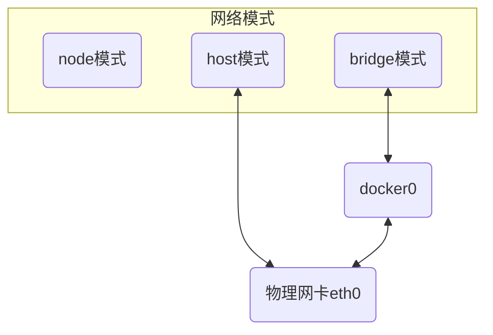

# docker网络

Docker进程启动时会在主机上创建虚拟网桥 $docker0$, 处于七层网络模型数据链路层

启动容器时若不指定网络模式, 则容器网络默认连接到$docker0$

虚拟网桥工作方式和物理交换机类似, 此时所有容器就通过交换机连在一个二层网络中



## bridge

docker默认网络模式, 为容器创建独立网络命名空间, 容器具有独立网卡等所有单独网络栈

桥接模式下创建容器, $docker0$ 会创建一组对等虚拟设备接口 $veth$ 与 容器内部虚拟网卡$eth0$

### 创建

#### 默认IP网关

```sh
docker network create --driver [类型] [网络名]
```

- 创建一个 docker 网络, 命名MyBridge

```sh
dmjcb@Casper:~$ docker network create --driver bridge MyBridge
8b832759551f28b7065fc84e9dfe208d3ca0bafa9052a61edabbdd6a573b0709
dmjcb@Casper:~$ docker network ls
NETWORK ID     NAME       DRIVER    SCOPE
8b832759551f   MyBridge   bridge    local
fb84ea011aca   bridge     bridge    local
51168768da46   host       host      local
366da5a2b38d   none       null      local
```

创建好自定义网络后docker会自定义为其分配IP网段和网关

#### 自定义IP网关

```sh
docker network create --driver [类型] --subnet [网段] --gateway [网关IP] [网络名]
```

- 创建网段172.20.0.0/24, 网关172.20.0.1网络SelfBridge

```sh
dmjcb@Casper:~$ docker network create --driver bridge --subnet 172.20.0.0/24 --gateway 172.20.0.1 SelfBridge
6ae797a98bc3174fd88bdd02dcdc1fb609e58045159ffdcf89763533c25caedc

...
dmjcb@Casper:~$ ip addr
125: br-6ae797a98bc3: <NO-CARRIER,BROADCAST,MULTICAST,UP> mtu 1500 qdisc noqueue state DOWN group default
    link/ether 02:42:5f:58:85:2a brd ff:ff:ff:ff:ff:ff
    inet 172.20.0.1/24 brd 172.20.0.255 scope global br-6ae797a98bc3
       valid_lft forever preferred_lft forever
```

#### 使用

创建容器ubuntu1, 使用MyBridge网络与默认IP

```sh
dmjcb@Casper:~$ docker run -it --name ubuntu1 --network=MyBridge busybox
/ # ip addr
1: lo: <LOOPBACK,UP,LOWER_UP> mtu 65536 qdisc noqueue qlen 1000
    link/loopback 00:00:00:00:00:00 brd 00:00:00:00:00:00
    inet 127.0.0.1/8 scope host lo
       valid_lft forever preferred_lft forever
126: eth0@if127: <BROADCAST,MULTICAST,UP,LOWER_UP,M-DOWN> mtu 1500 qdisc noqueue
    link/ether 02:42:ac:12:00:02 brd ff:ff:ff:ff:ff:ff
    inet 172.18.0.2/16 brd 172.18.255.255 scope global eth0
       valid_lft forever preferred_lft forever
```

创建容器busybox2, 使用SelfBridge网络并指定IP

```sh
dmjcb@Casper:~$ docker run -it --name busybox2 --network=SelfBridge --ip=172.20.0.100 busybox
/ # ip addr
1: lo: <LOOPBACK,UP,LOWER_UP> mtu 65536 qdisc noqueue qlen 1000
    link/loopback 00:00:00:00:00:00 brd 00:00:00:00:00:00
    inet 127.0.0.1/8 scope host lo
       valid_lft forever preferred_lft forever
128: eth0@if129: <BROADCAST,MULTICAST,UP,LOWER_UP,M-DOWN> mtu 1500 qdisc noqueue
    link/ether 02:42:ac:14:00:64 brd ff:ff:ff:ff:ff:ff
    inet 172.20.0.100/24 brd 172.20.0.255 scope global eth0
       valid_lft forever preferred_lft forever
```

#### 互联

```sh
docker network connect [网络名] [容器名]
```

将容器busybox2与容器ubuntu1网络进行连接, 并在容器busybox2内 ping 容器ubuntu1, 可发现busybox2内新增属于MyBridge网络IP

```sh
dmjcb@Casper:~$ docker network connect MyBridge busybox2
dmjcb@Casper:~$ docker exec -it busybox2 sh
/ # ip addr
1: lo: <LOOPBACK,UP,LOWER_UP> mtu 65536 qdisc noqueue qlen 1000
    link/loopback 00:00:00:00:00:00 brd 00:00:00:00:00:00
    inet 127.0.0.1/8 scope host lo
       valid_lft forever preferred_lft forever
132: eth0@if133: <BROADCAST,MULTICAST,UP,LOWER_UP,M-DOWN> mtu 1500 qdisc noqueue
    link/ether 02:42:ac:14:00:64 brd ff:ff:ff:ff:ff:ff
    inet 172.20.0.100/24 brd 172.20.0.255 scope global eth0
       valid_lft forever preferred_lft forever
134: eth1@if135: <BROADCAST,MULTICAST,UP,LOWER_UP,M-DOWN> mtu 1500 qdisc noqueue
    link/ether 02:42:ac:12:00:03 brd ff:ff:ff:ff:ff:ff
    inet 172.18.0.3/16 brd 172.18.255.255 scope global eth1
       valid_lft forever preferred_lft forever
/ # ping 172.18.0.2
PING 172.18.0.2 (172.18.0.2): 56 data bytes
64 bytes from 172.18.0.2: seq=0 ttl=64 time=0.262 ms
64 bytes from 172.18.0.2: seq=1 ttl=64 time=0.202 ms
64 bytes from 172.18.0.2: seq=2 ttl=64 time=0.199 ms
64 bytes from 172.18.0.2: seq=3 ttl=64 time=0.200 ms
64 bytes from 172.18.0.2: seq=4 ttl=64 time=0.201 ms
```

### 运行时指定

```sh
docker run -itd --net=bridge [容器名]
```

## host

直接使用容器宿主机网络命名空间, 此时容器不会拥有独立网络命名空间, 而与宿主机共用

容器除了网络,其他比如文件系统、进程等依然隔离

### 运行时指定

```sh
docker run -itd --net=host [容器名]
``` 

## none

没有任何网络资源, 不能和容器和宿主机之间进行正常访问互动
