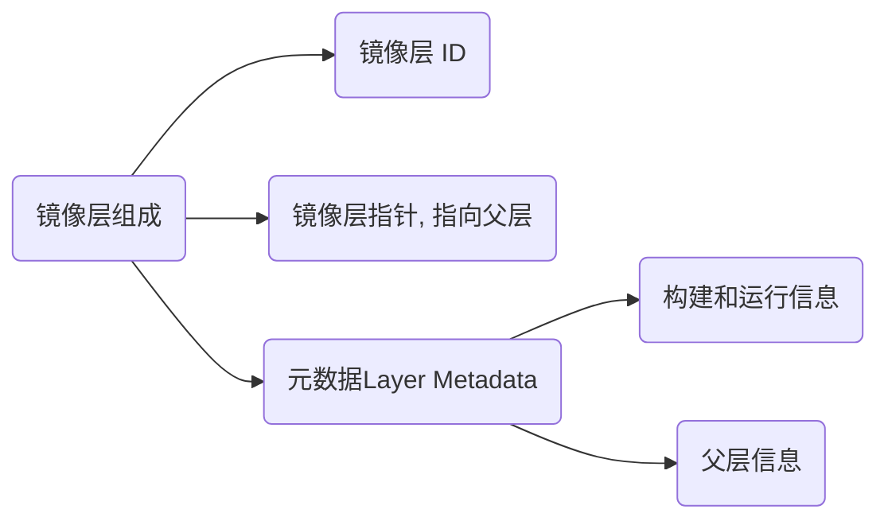

# Docker概念

## 镜像

### 镜像层 Image Layer

镜像可看成是由多个镜像层叠加构成出一个文件系统, 通过UnionFS与AUFS文件联合系统实现

也可以简单理解为一个基本镜像, 每个镜像层之间通过指针形式进行叠加



只读层和读写层(Top Layer)组成部分基本一致, 同时读写层可通过docker commit转换成只读层

元数据(metadata)是关于该层额外信息, 能够让Docker获取运行和构建时信息, 及父层层次信息

需要注意, 只读层和读写层都包含元数据

每一层都包括了一个指向父层指针. 若一个层没有这个指针, 说明它处于最底层

容器元数据好像是被分成了很多文件, 但或多或少能够在/var/lib/docker/containers/目录下找到, 就是一个可读层id

这个目录下文件大多是运行时数据, 比如说网络, 日志等等

### 镜像 Image

镜像是只读层集合

镜像包含多个只读层, 它们重叠在一起, 除了最下面一层, 其它层都会有一个指针指向下一层

这些层是Docker内部实现细节, 并且能够在docker主机文件系统上访问

统一文件系统(union file system, 升级版为AUFS)技术能够将不同层整合成一个文件系统, 为这些层提供了统一视角

这样就隐藏了多层存在, 在用户角度看来, 只存在一个文件系统

可在主机文件系统上找到有关这些层的文件. 需要注意, 在一个运行中容器内部, 这些层不可见

Image存在于/var/lib/docker/aufs目录下

## 容器

### Container

容器是一层读写层+多层只读层

容器(container)定义和镜像(image)几乎一模一样, 也是一堆层统一视角, 唯一区别在于容器最上面那一层可读可写

容器 = 镜像 + 读写层, 并且容器定义并没有提及是否要运行容器

### Running Container

运行态容器为一层读写层+多层只读层+隔离的进程空间和包含其中的进程

运行状态容器「Running Container」是由一个可读写文件系统「静态容器」+ 隔离进程空间和其中进程构成

正是文件系统隔离技术使得Docker成为了一个前途无量技术. 一个容器中进程可能会对文件进行修改、删除、创建, 这些改变都将作用于可读写层(read-write layer)

```sh
# 即便是这个ubuntu容器不再运行, 依旧能够在主机的文件系统上找到这个新文件
docker run ubuntu touch happiness.txt
　　
find / -name happiness.txt

/var/lib/docker/aufs/diff/860a7b...889/happiness.txt
```

通过上述内容, 已经详细介绍了镜像与容器区别, 镜像由一层层只读层堆在一起, 容器为镜像只读层+读写层

运行态容器为由一个可读写的文件系统「静态容器」+ 隔离的进程空间和其中的进程构成
