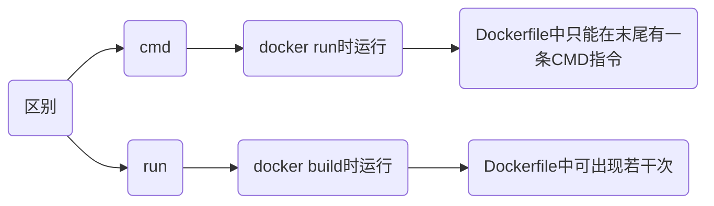

# Dockerfile

## 指令

### run

执行指令

```sh
run [指令]
```

- 构建时执行更新源命令

```docker
run apt udpate && apt upgrade -y
```

### copy

`copy` 将从构建上下文目录中源路径文件/目录复制到新一层镜像内目标路径/位置

```sh
copy [源路径] [目标路径]
```

### add

复制文件

```sh
add [源路径] [目标路径]
```

若源路径为tar压缩文件且压缩格式为 gzip, bzip2, xz, ADD 指令将会自动解压缩文件到目标路径

### cmd

#### shell格式

```sh
cmd [命令]
```

- 执行Python指令

```sh
cmd python3 manage.py runserver 0.0.0.0:8000
```

#### exec格式

```sh
cmd ["可执行文件", "参数1", "参数2", ...]
```

- 执行Python指令

```sh
cmd ["python3", "manage.py", "runserver 0.0.0.0: 8000"]
```



## 构建

### 多阶段构建

#### 连续构建

```docker
from 镜像名1 as 阶段名1

...

from 镜像名2 as 阶段名2
```

- 多阶段构建go语言可执行程序

App.go

```go
package main

import "fmt"

func main(){
    fmt.Printf("Hello World!");
}
```

Dockerfile

```docker
# 第一阶段
from golang:1.9-alpine as builder

workdir /go/src/github.com/go/helloworld/

run apk --no-cache add git

run go get -d -v github.com/go-sql-driver/mysql

copy App.go .

run CGO_ENABLED=0 GOOS=linux go build -a -installsuffix cgo -o App .

# 第二阶段
from alpine:latest as prod

workdir /root/

run apk --no-cache add ca-certificates

# 从第一阶段中拷贝文件
copy --from=builder /go/src/github.com/go/helloworld/App .

cmd ["./App"]
```

#### 仅单阶段构建


```sh
docker build --target=[阶段名] -t [新镜像名:tag] .
```

- 仅构建 builder 阶段镜像


```sh
from golang:1.9-alpine as builder

···

docker build --target=builder -t only_builder:v1 .
```

#### 构建时复制文件

```sh
copy --from=[镜像名] [源路径] [当前路径]
```

- 复制nginx:latest镜像中nginx.conf文件

```sh
copy --from=nginx:latest /etc/nginx/nginx.conf /nginx.conf
```

## 示例

- 搭建g++编译环境

```dockerfile
from alpine as builder

label dmjcb <>

workdir /

run sed -i 's/dl-cdn.alpinelinux.org/mirrors.aliyun.com/g' /etc/apk/repositories && apk add g++
```

```sh
docker build -t gpp:v1 .
```

- 拉取qemu

```sh
docker run --rm --privileged multiarch/qemu-user-static --reset --persistent yes
```

```sh
docker pull arm32v7/gcc:9
```