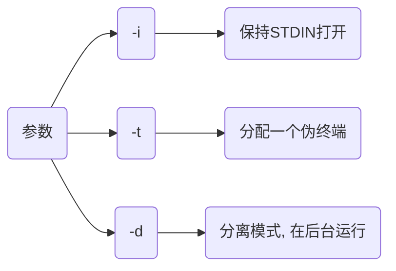

# 容器指令

## 启动

#### 新建启动

```sh
docker run (启动参数) [镜像名]
```

- 运行qemu

```sh
docker run --rm --privileged multiarch/qemu-user-static --reset --persistent yes
```

#### 启动已终止容器

```sh
docker start [容器名]
```

### 启动参数

#### -itd

| 参数 | 含义                         |
| ---- | --------------------------- |
| `-i` | 以交互模式运行容器            |
| `-t` | 为容器重新分配一个伪输入终端   |
| `-d` | 后台运行并返回容器ID          |

#### -p

将本地指定端口映射到容器指定端口

````sh
-p [主机端口]:[容器端口]
````

- 将本机7890端口映射到nginx容器80端口

```sh
docker run -itd --name=nginx_test -p 7890:80 nginx
```

访问本地7890端口就相当于访问容器80端口

#### -e

设置环境变量

```sh
-e 变量名=值
```

- 设置mysql用户密码为123

```sh
docker run -itd -e MYSQL_ROOT_PASSWORD=123 mysql:5.6
```

- 设置环境变量STR_VEN值为abcdefg


#### --mount

挂载**本地绝对路径**目录到容器中, 若目录不存在会报错, 默认权限读写, 可增加 `readonly` 指定为只读

```sh
--mount type=bind, source="本地绝对路径", target="容器路径",(readonly)
```

- 将本地/Code 挂载到容器/Code

```sh
docker run -itd --mount type=bind,source="${HOME}/Code",target="/Code" busybox
```


#### -v

挂载本地目录到容器中, 若本地目录不存在, 会自动创建文件夹

```sh
-v [本地目录]:[容器目录]
```

- 配置时区

```sh
-v /etc/localtime:/etc/localtime:ro
```

#### --net

指定容器网络连接类型

```sh
--net=[类型]
```

支持 bridge, host, none, container四种类型

#### --link

链接到另一个容器

```sh
--link=[]
```

- 从 Ubuntu 容器中访问 MySQL容器中mysql服务

```sh
docker run -itd --name mysql_server -e MYSQL_ROOT_PASSWORD=123 mysql:5.7

# 链接 MySQL 容器, db为别名
docker run -itd --name ubuntu_test --link mysql_server:db ubuntu:18.04 
```

## 操作

### 执行命令

```shell
docker exec [参数] 镜像ID {命令}
```



- busybox容器创建目录test


#### 多指令

```sh
docker exec [容器ID] [shell解释器] -c '命令1 && 命令2'
```

- ubuntu安装mysql-clinet

```sh
docker run -itd --name=ubuntu_test ubuntu:18.04

docker exec -it ubuntu_test bash -c 'apt-get update && apt-get install -y mysql-client'
```

### cp

用于宿主机与容器内文件拷贝


```sh
docker cp [宿主机文件路径] [容器ID]:[容器目标路径]
```


```sh
docker cp [容器ID]:[容器文件路径] [宿主机目标路径]
```

### export/import

- 打包

```sh
docker export [容器ID] > [压缩包.tar]
```

- 加载

```sh
docker import [压缩包.tar] [容器:tag]
```

### inspect

- IP地址

```sh
docker inspect 容器ID | grep IPAddress
```

```sh
dmjcb@Casper:~$ docker inspect 660 | grep IPAddress
            "SecondaryIPAddresses": null,
            "IPAddress": "172.17.0.2",
                    "IPAddress": "172.17.0.2",
```

#### 获取容器ID

```sh
$(docker ps | grep "容器名" | awk '{print $1}')

或

$(docker ps -aqf "name=容器名")
```

| 参数 | 说明                    |
| ---- | ---------------------- |
| a    | 即使容器没运行也能获取   |
| q    | 仅输出容器ID            |
| f    | filter                 |

## 停止

### stop

```sh
docker stop [容器ID]
```

## 删除

### 强制删除

```sh
docker rm -f [容器ID]
```

### 删除所有容器

```sh
docker rm $(docker ps -aq)
```

### 先停用删除

```sh
docker stop $(docker ps -aq) && docker rm $(docker ps -aq)
```

### 删除异常容器

```sh
docker rm $(docker ps -a | grep Exited | awk '{print $1}')
```

## 问题

- 执行命令后容器停止

```sh
docke run -itd --name=box busybox mkdir test
```

本意为run时创建test目录, 实际发现执行命令后即容器停止运行

原因为基于Docker原理, 当run时执行命令结束时, 容器也会停止