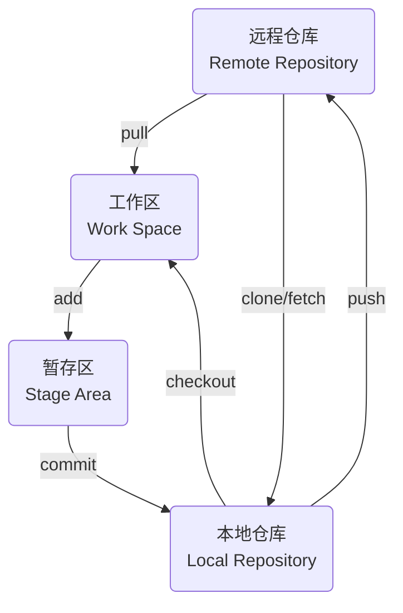
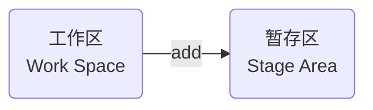

> - [廖雪峰git教程](https://liaoxuefeng.com/books/git/introduction/index.html)

# git指令



## 版本管理

### 创建

目录下执行

```sh
git init
```


自动创建.git目录, 用于管理版本库

### 查看状态

添加Main.cpp, 查看文件状态

```sh
git status
```


红色表示该文件未添加至暂存区

### 添加暂存区



- 添加指定文件

```sh
git add [文件名]
```

- 添加全部文件

```sh
git add .
```


添加后文件变为绿色, 此时文件就位于暂存区中

#### 撤回

将添加至暂存区文件撤回至工作区

```sh
git restore --staged [文件名]
```


### 提交

若添加至暂存区文件确认无误, 则可使用`commit` 提交至工作区

- 编写commit信息后提交

```sh
# 
git commit 
```

- 一步提交

```sh
git commit -m "[commit 信息]"
```

#### 查看记录

```sh
git log
```


#### 修改提交

- 修改最近一次 `commit`

```sh
git commit --amend
```

### 撤回

设原始 Main.cpp如下

```c++
#include<iostream>
int main() {
    std::cout << "[Master] Hello World" << std::endl;
    return 0;
}
```

设修改后Main.cpp如下

```c++
#include<iostream>
int main() {
    std::cout << "[Update] Hello World" << std::endl;
    return 0;
}
```

#### 未暂存修改

作用范围: 已修改还未执行`git add`

- 放弃指定文件修改

```sh 
git checkout -- [文件名]
```

- 放弃所有修改

```sh
git checkout .
```

修改Main.cpp, 还未添加到暂存区, 撤销修改


#### 已暂存修改

作用范围: 已修改, 已添加到暂存区

- 放弃已暂存指定文件修改

```sh
git reset HEAD [文件名]
```

- 放弃所有已暂存修改

```sh
git reset
```

只撤销添加操作, 若想撤销修改还需执行上面未暂存修改撤回指令


#### 已commit修改

作用范围: 已修改并已commit

git中用`HEAD` 表示当前提交, 上个版本表示为`HEAD^`, 前100个版本表示为`HEAD~100`

- reset --hard

删除工作空间改动, 撤销`commit`, 撤销`git add .`

```sh
# 回退到上次commit
git reset --hard HEAD^

# 回退到任意版本
git reset --hard [commit id]
```

修改后commit


回退至上次commit, 此时暂存区和工作区均会回到上次提交时状态, 所有自上次后修改全被恢复


- reset --soft

`不删除`工作空间改动, 撤销`commit`, 不撤销`git add .`

```sh
git reset --soft HEAD^
```

修改后commit


回退至上次commit, 修改后文件仍在暂存区, 且修改后内容未删除


- reset --mixed

不删除工作空间改动代码, 撤销`commit`, 并撤销`git add .`

```sh
git reset --mixed HEAD^
```

修改后commit


回退至上次commit, 修改后文件在工作区, 且修改后内容未删除


## 分支

每次提交git串成一条时间线, 表示一个分支, 初始时git里只有主分支, 即master(main)分支

### 操作

#### 创建

创建分支并切换至该分支

```sh
git switch -c dev
```

- 查看当前分支

```sh
git branch 
```

#### 切换

```sh
git switch [分支名]
```

- 删除分支

```sh
git branch -d [分支名]
```

### 合并

#### 合并到main分支

```sh
git switch main

git merge [待合并分支名]
```

### 解决冲突

假设master分支上修改Main.cpp, 并提交

```c
#include<iostream> 
int main() {
    std::cout << "Hello World" << std::endl;

    return 0;
}
```

创建dev分支, 修改该分支上Main.cpp, 并提交

```c
#include<iostream> 
int main() {
    std::cout << "[Dev] Hello World" << std::endl;

    return 0;
}
```


切换回master分支, 此时再修改Main.cpp, 并提交

```c
#include<iostream> 
int main() {
    std::cout << "[Fix Master] Hello World" << std::endl;

    return 0;
}
```


此时使用`git merge`将dev分支合并到master分支, 提示冲突, Main.cpp显示


```c
#include<iostream>

int main() {
<<<<<<< HEAD
    std::cout << "[Fix Master] Hello World" << std::endl;
=======
    std::cout << "[dev] Hello World" << std::endl;
>>>>>>> dev

    return 0;
}
```

`<<<<<<<` 与 `>>>>>>>` 表示当前修改与传入修改, 需自主选择保留何处

假设此处需保留双方更改, 则修改后提交, 此时冲突解决

```c
#include<iostream>

int main() {
    std::cout << "[Fix Master] Hello World" << std::endl;
    std::cout << "[dev] Hello World" << std::endl;
    return 0;
}
```


## 标签

### 创建

- 以最新commit打标签

```sh
git tag [标签名]
```

- 指定commit打标签

```sh 
git tag [标签名] [commit id]
```

- 添加描述信息

```sh 
git tag -a [标签名] -m [描述信息] [commit id] 
```

### 查看

```sh
git tag
```

## 远程仓库

### pull

`git pull` 将远程主机最新内容拉下来后直接合并, 可能会产生冲突, 需手动解决

```sh
git pull [远程主机名] [远程分支名]:[本地分支名]
```

若远程分支是与当前分支合并, 则冒号后部分可省略

```sh
git pull origin master
```

#### fetch

`git fetch` 将远程最新内容拉到本地, 用户在检查了以后决定是否合并到本地分支中

```sh
git fetch [远程主机名] [远程分支名]
```

取回origin主机master分支

```sh
git fetch origin master
```

取回更新后, 会返回一个`FETCH_HEAD`, 指某个`branch`在服务器上最新状态

- 查看更新文件名, 作者和时间, 代码

```sh
git log -p FETCH_HEAD
```


可以通过这些信息来判断是否产生冲突, 以确定是否将更新merge到当前分支

#### 原理

`git pull`过程可分解为

- 从远程主机分支拉取最新内容

```sh
git fetch origin 远程分支名
```

- 将拉取下来最新内容合并到当前所在分支中

```sh
git merge FETCH_HEAD
```

### push

`push` 将本地分支版本上传到远程并合并

```sh
git push [远程主机名] [本地分支名]:[远程分支名]
```

#### 上传到远程分支

建立本地到上游(远端)仓链接

```sh
git branch --set-upstream-to=origin/[分支]

git push origin [分支]
```

#### 上传所有标签

```sh
git push origin master --tags
```

### remote

操作远程仓库

#### 查看

```sh
git remote -v
```

#### 删除

- 名称

```sh
git remote rm [远程分支名]
```

- URL

```sh
git remote set-url --del origin [远程 URL]
```

#### 添加

```sh
git remote add [远程用户名] [远程 URL]
```

- 多地址

```sh
git remote set-url --add origin [远程 URL]
```

此时`git push origin master` 就可一次性`push`到多个库