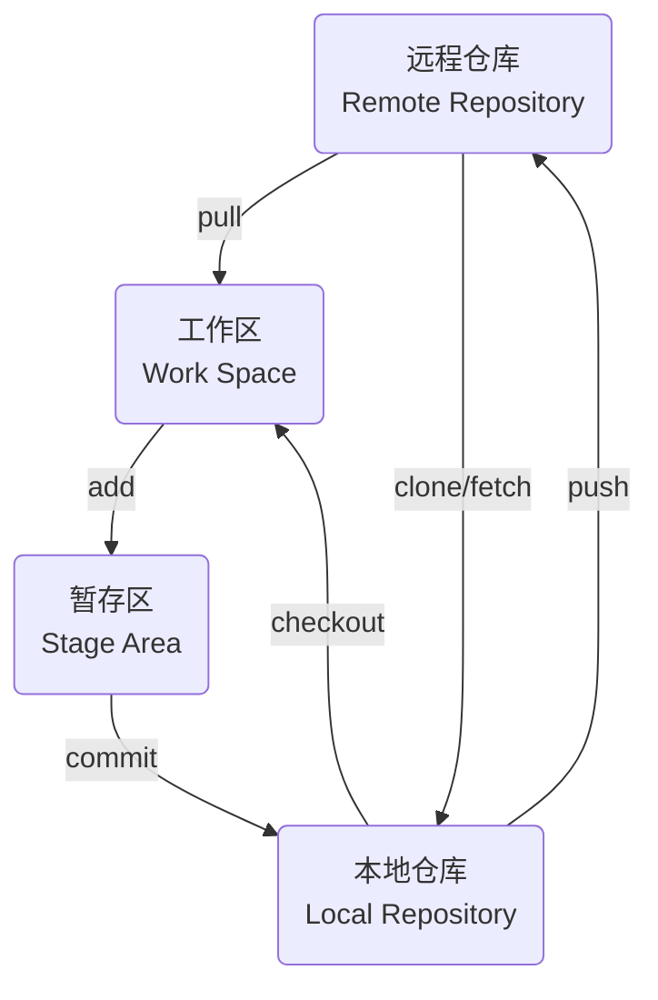
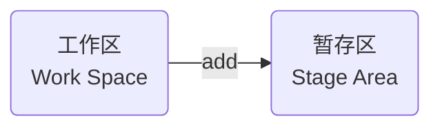

> - [廖雪峰git教程](https://liaoxuefeng.com/books/git/introduction/index.html)
> - [Git 如何移除一个子模块](https://geek-docs.com/git/git-questions/26_git_how_do_i_remove_a_submodule.html)

# git指令



## 版本管理

### 创建

在需创建git仓库目录下执行

```sh
git init
```

自动创建.git目录, 用于管理版本库


### 状态

查看目录中文件状态

```sh
git status
```

添加Main.cpp, 红色表示该文件未添加至暂存区


### 添加暂存区



- 添加指定文件

```sh
git add [文件名]
```

- 添加全部文件

```sh
git add .
```

添加后文件变为绿色, 此时文件已添加进暂存区


#### 撤回

将添加至暂存区文件撤回至工作区

```sh
git restore --staged [文件名]
```


### 提交

若添加至暂存区文件确认无误, 则可使用`commit` 提交至工作区

- 编写commit信息后提交

```sh
# 
git commit 
```

- 一步提交

```sh
git commit -m "[commit 信息]"
```

#### 提交记录

```sh
git log
```


#### 修改提交

- 修改最近一次 `commit`

```sh
git commit --amend
```

### 撤回

设原始 Main.cpp如下

```c++
#include<iostream>
int main() {
    std::cout << "[Master] Hello World" << std::endl;
    return 0;
}
```

设修改后Main.cpp如下

```c++
#include<iostream>
int main() {
    std::cout << "[Update] Hello World" << std::endl;
    return 0;
}
```

#### 未暂存修改

作用范围: 已修改还未执行`git add`

- 放弃指定文件修改

```sh 
git checkout -- [文件名]
```

- 放弃所有修改

```sh
git checkout .
```

修改Main.cpp, 还未添加到暂存区, 撤销修改, Main.cpp恢复至修改前状态


#### 已暂存修改

作用范围: 已修改, 已添加到暂存区

- 放弃已暂存指定文件修改

```sh
git reset HEAD [文件名]
```

- 放弃所有已暂存修改

```sh
git reset
```

此时只撤销添加操作, 文件修改并未撤销, 若想撤销修改还需执行上面未暂存修改撤回指令


#### 已commit修改

作用范围: 已修改并已commit

git中用`HEAD` 表示当前提交, 上个版本表示为`HEAD^`, 前100个版本表示为`HEAD~100`

- reset --hard

删除工作空间改动, 撤销`commit`, 撤销`git add .`

```sh
# 回退到上次commit
git reset --hard HEAD^

# 回退到任意版本
git reset --hard [commit id]
```

修改后commit


回退至上次commit, 此时暂存区和工作区均会回到上次提交时状态, 所有自上次后修改全被恢复


- reset --soft

`不删除`工作空间改动, 撤销`commit`, 不撤销`git add .`

```sh
git reset --soft HEAD^
```

修改后commit


回退至上次commit, 修改后文件仍在暂存区, 且修改后内容未删除


- reset --mixed

不删除工作空间改动代码, 撤销`commit`, 并撤销`git add .`

```sh
git reset --mixed HEAD^
```

修改后commit


回退至上次commit, 修改后文件在工作区, 且修改后内容未删除


## 分支

每次提交git串成一条时间线, 表示一个分支, 初始时git里只有主分支, 即master(main)分支

### 操作

#### 创建

创建分支并切换

```sh
git switch -c [分支名]
```

- 查看当前分支

```sh
git branch 
```

- 切换分支

```sh
git switch [分支名]
```

#### 删除

```sh
git branch -d [分支名]
```

### 合并

#### 合并至当前分支

```sh
git switch main

git merge [待合并分支名]
```

### 解决冲突

假设master分支上修改Main.cpp, 并commit

```c
#include<iostream> 
int main() {
    std::cout << "Hello World" << std::endl;

    return 0;
}
```

创建dev分支, 修改该分支上Main.cpp, 并commit

```c
#include<iostream> 
int main() {
    std::cout << "[Dev] Hello World" << std::endl;

    return 0;
}
```


切换回master分支, 此时再修改Main.cpp, 并提交

```c
#include<iostream> 
int main() {
    std::cout << "[Fix Master] Hello World" << std::endl;

    return 0;
}
```


此时使用`git merge`将dev分支合并到master分支, 提示冲突


Main.cpp显示

```c
#include<iostream>

int main() {
<<<<<<< HEAD
    std::cout << "[Fix Master] Hello World" << std::endl;
=======
    std::cout << "[dev] Hello World" << std::endl;
>>>>>>> dev

    return 0;
}
```

`<<<<<<<` 与 `>>>>>>>` 表示当前修改与传入修改, 需自主选择保留何处

假设此处需保留双方更改, 则修改后提交, 此时冲突解决

```c
#include<iostream>

int main() {
    std::cout << "[Fix Master] Hello World" << std::endl;
    std::cout << "[dev] Hello World" << std::endl;
    return 0;
}
```


## 标签

### 创建

- 以最新commit打标签

```sh
git tag [标签名]
```

- 指定commit打标签

```sh 
git tag [标签名] [commit id]
```

- 添加描述信息

```sh 
git tag -a [标签名] -m [描述信息] [commit id] 
```

### 查看

```sh
git tag
```

## 远程仓库

设存在远程仓库`http://192.168.3.3:13000/UserA/Test.git`

本地创建GitTest目录作为仓库, 创建Main.cpp文件

### 推送

`push` 将本地分支版本上传到远程并合并

```sh
git push [远程主机名] [本地分支名]:[远程分支名]
```

#### 推送已创建仓库

```sh
git remote add origin [仓库地址]

git push origin [分支]
```

- 将本地仓库master分支推送到远程仓库master分支


#### 普通推送

```sh
git push [远程主机名] [本地分支名]:[远程分支名]
```

- 此时在master分支修改Main.cpp, commit后推送到远程仓库

若本地分支与远程分支一致, 则可简写为`git push`


#### 上传到远程分支

建立本地到上游(远端)仓链接

```sh
git branch --set-upstream-to=origin/[分支]

git push origin [分支]
```

- 本地建立dev分支并上传到远程


#### 上传所有标签

```sh
git push origin master --tags
```

- 本地master分支建立tag:v0.1并上传


### 配置

#### 查看

```sh
git remote -v
```


#### 删除

- 名称

```sh
git remote rm [远程分支名]
```

- URL

```sh
git remote set-url --delete origin [远程 URL]
```

#### 添加

```sh
git remote add [远程用户名] [远程 URL]
```

- 多地址

```sh
git remote set-url --add origin [远程 URL]
```

此时`git push origin master` 就可一次性`push`到多个库

### 克隆

```sh
git clone [仓库地址] (存放路径)
```

#### 默认路径


#### 指定路径

- 克隆到当前目录


- 克隆到任意目录

 

### 拉取

`git pull` 将远程主机最新内容拉下来后直接合并, 可能会产生冲突, 需手动解决

```sh
git pull [远程主机名] [远程分支名]:[本地分支名]
```

#### 直接拉取合并

```sh
git pull origin master
```

若远程分支是与当前分支合并, 则可简写为`git pull`

- 无冲突情况

设此时远程仓库master分支存在修改, 本地master分支直接拉取


- 有冲突情况

设此时远程仓库master分支与本地master分支都修改了Main.cpp

直接`git pull`会提示冲突, 按照教程中解冲突步骤处理后提交即可


#### 拉取后手动合并

`git pull`过程可分解为

(1) 通过`git fetch`从远程主机将远程最新内容拉到本地, 用户可决定是否合并到本地分支中

```sh
git fetch [远程主机名] [远程分支名]
```

取回更新后, 会返回一个`FETCH_HEAD`, 指某个`branch`在服务器上最新状态

通过`git log -p FETCH_HEAD`查看更新文件名、作者和时间、代码, 可以通过这些信息来判断是否产生冲突

(2) 通过`git merge`将拉取下来最新内容合并到当前所在分支中

将远程更新merge到当前分支

```sh
git merge FETCH_HEAD
```

- 冲突情况处理

假设此时本地master分支与远程master分支都修改了Main.cpp, 执行拉取后手动合并

执行`git fetch`, 并查看更新内容


执行`git merge`, 提示冲突


按照教程中解冲突步骤处理后提交即可


此时本地和远程分支已一致


## 子模块

### 查看

```sh
git submodule
```


### 添加

```sh
git submodule add [子模块地址]
```


### 克隆

#### 同时拉取子模块

克隆项目同时拉取子模块

```sh
git clone --recursive [仓库地址] (克隆路径)
```


#### 手动拉取子模块

若克隆项目时未拉取子模块, 则进入主项目根目录, 使用以下命令使Git意识到项目包含子模块

```sh
git submodule init
```

更新子模块内容

```sh
git submodule update
```


### 更新

主项目根目录中, 更新子模块以获取最新改动

```sh
git submodule update --remote
```

### 修改

在子模块中修改完毕后, 与普通项目一致提交就行

```sh
git add 

git commit -m "" 

git push
```

### 删除

移除子模块

```sh
git submodule deinit -f [子模块路径]
```

删除子模块目录

```sh
git rm [子模块路径]
```

- 移除Imgur子模块


