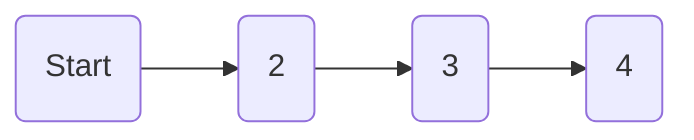
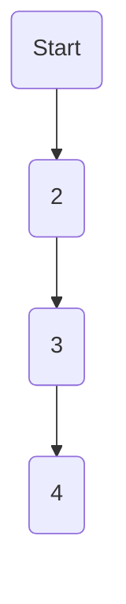

## 分类

### 从$n$个数的数组, 取出若干个数两两不相邻的数, 求取出的数最大和

- 原问题

$n$ 个数取出和最大的最优解

- 子问题

前 $1$ 个数的最优解, 前 $2$ 个数的最优解......前 $n$ 个数的最优解

- 中间状态

$dp[i]$代表前 i 个数的最优解, 最终求 $dp[n]$

- 边界值

$dp[1] = a[1], dp[2] = max(dp[1], a[2])$

- 状态转移方程

前 $i$ 个数的最优解, 重点是考虑加不加第 i 个数 $a[i]$

若不加可从$dp[i-1]$转移过来

若加只能从$dp[i-2]$转移过来(选择的数不能相邻), 然后再取两种情况的最大值

因此, $dp[i] = max( dp[i-1], dp[i-2]+a[i])$ 且$i>=2$

### 数组$a[n]$中有正数有负数, 求取出的连续子数组中最大和

- 原问题, 前 $n$个数中连续子数组最大和

- 子问题, 前 $1$ 个数的最大和, 前 $2$ 个数的最大和...前 $n$ 个数的最大和

- 中间状态, $dp[i]$代表前 $i$ 个数的最大和, 最终需求 $dp[n]$

- 边界值, $dp[1] = a[1], dp[2] = max(dp[2], dp[2]+a[1])$

- 状态转移方程, 对于状态$i$来说

    若前一状态$dp[i-1]$为负数, 则不需要前面的数, 新状态为 $a[i]$

    若$dp[i-1]$是正数, 那就可以加上 $a[i]$, 关键就在于前面的状态是否加上

- $dp[i]=max(a[i], dp[i-1] + a[i]) 且 i >= 1$

### 有面值为 1, 3, 5 的硬币若干枚, 如何用最少的硬币凑够 n 元

- 原问题, 凑够 n 元所需最少硬币

- 中间状态, $dp[i]$代表凑够 i 元所需最少硬币, 最终需求 $dp[n]$

- 边界值, $dp[1] = 1$

- 状态转移方程, $dp[i] = min(dp[i-1], dp[i-3], dp[i-5]) + 1$

```c
// v[i]代表硬币的面额
v[1] = 1;
v[2] = 3;
v[3] = 5;
for(int i = 1; i <= n; i++){
    for(int j = 3; j >= 1; j--){
        if(i > v[j]){
            dp[i] = min(dp[i], dp[i-v[j]]+1)
        }
    }
}
```

### 无向图 G 有个 n 结点及一些带有正的权重值边, 找到结点 1 到 n 的最短路径

- 原问题

找到节点 1 到节点 n 的最短路径

- 中间状态

$dp[i]$表示1 到节点 i 的最短路径, 最终求 $dp[n]$

- 边界值

$dp[1] = 0$

- 状态转移方程

$dp[i] = min(dp[i], dp[j]+dis[i][j])$, $dis[i][j]$ 代表 $j$ 到 $i$ 的距离

```c
const int MAX = 0x7fffffff;

dp[1] = 0;
for(int i = 1; i <= n; i++){
    for(int j = 1; j < i; j++){
        // i能到j
        if(dis[i][j] < MAX){
            dp[i] = min(dp[i], dp[j] + dis[i][j])
        }
    }
}
```

## 示例

### 最长上升子序列

#### 原问题

前 $n$ 个数中最长上升子序列

#### 子问题

前 $1$ 个数的最长上升子序列...前 $n$ 个数的最长上升子序列

#### 中间状态

$dp[i]$代表前 $i$ 范围内的中的最长上升子序列, 最终求 $dp[n]$

#### 边界值

$dp[1] = 1$

#### 状态转移方程

- 状态 $i = 2$, $dp[2] = max(dp[1], dp[1] + 1)$

- 状态 $i$, $dp[i] = max(dp[i], dp[j] + 1)$, $j < i$ 且 $a[j] < a[i]$

```c++
memset(dp, 1, sizeof(dp));

for (int i = 2; i <= n; i++) {
    for (int j = 1; j < i; j++) {
        if (a[j] < a[i]) {
            dp[i] = dp[i] > (dp[j] + 1) ? dp[i] : (dp[j] + 1);
        }
    }
}
```

### 路径获取值

平面上有 $n*m$ 个格子, 每个格子中放一定数量的苹果

从左上角开始, 每一步只能向下或向右走, 走到一个格子获得格子内苹果, 走到右下角最多能收集到多少苹果

#### 中间状态

$a[i][j]$代表i行j列格子里放的苹果数

$dp[i][j]$代表走到i行j列格子时获得的总苹果数

#### 边界值

- 若在第0行, 则只能从左边过来

$dp[0][j] = dp[0][j - 1] + a[0][j]$



- 若在第0列, 则只能从上边过来

$dp[i][0] = dp[i - 1][0] + a[i][0]$



#### 状态转移方程

- $dp[i][j] = max(dp[i - 1][j]+ dp[i][j - 1]) + a[i][j]$

```c
dp[0][0] = a[0][0];

for(int i = 0; i <= n; ++i) {
    for(int j = 0; j <= m; ++j){
        if(i == 0 && j == 0){
            dp[0][0] = a[0][0];
        }
        else if(i == 0){
            dp[0][j] = dp[0][j - 1] + a[0][j]
        }
        else if(j == 0){
            dp[i][0] = dp[i - 1][0] + a[i][0]
        }
        else{
            dp[i][j] = max(dp[i - 1][j] + dp[i][j - 1]) + a[i][j]
        }
    }
}
```


