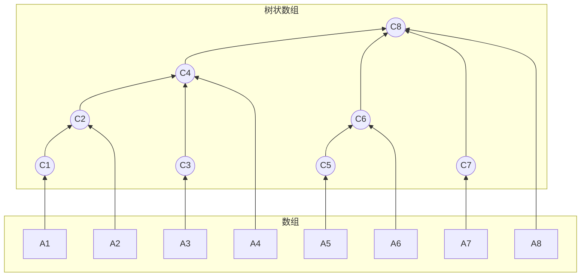
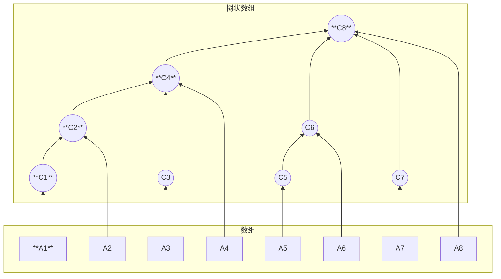
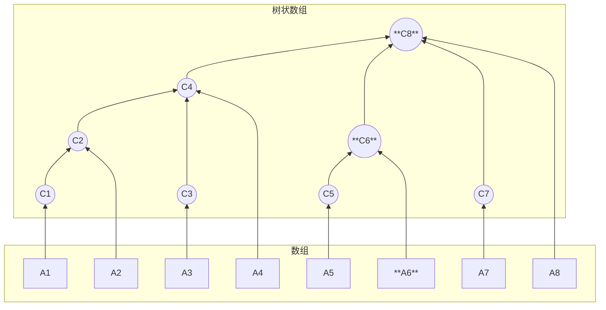

# 树状数组

## 概念

- $A[i]$表示数组元素

- $C[i]$表示对应的树状数组, 值为它所有子结点值和 $A[i]$的总和

- $C[i]$中一定包含$A[i]$的值

- $i$ 为奇数时, 有 $C[i] = A[i]$



## 区间范围

$C[i]$管辖数组 $A$ 的一段连续区间和, 区间的末尾元素是 $A[i]$

$C[i$]所管辖元素的个数为$2^{k}$个($k$ 为 $i$ 的二进制中最低位到最高位`连续0`的长度)

- $C[8]$

$(8)_{10}$ =$(1000)_{2}$, 最低位到最高位连续 $0$ 的长度为 $3$, 故 $k=3$, 管辖数有$2^{3}$个

$C[8]$是$8$ 个数($A[1]-A[8]$)的和

- $C[5]$

$(5)_{10}$ =$(0101)_{2}$, 最低位到最高位连续 $0$ 的长度为 $0$, 故 $k=0$, 管辖数有$2^{0}$个

$C[5]$是 $1$ 个数($A[5]$)的和

- $C[4]$

$(4)_{10}$ =$(0100)_{2}$, 最低位到最高位连续 $0$ 的长度为 $2$, 故 $k=2$, 管辖数有$2^{2}$个

$C[4$]是 4 个数($A[1]-A[4]$)的和

给定 $i$, $C[i]$的管辖范围$2^{k}$, $2^{k}$ = $i$ & $(-i)$

```c
// 根据C[i]的下标i获取管辖范围
int lowbit(int i){
    return i & (-i);
}
```

## 操作

### 更新

若更新 $A[i]$的值, 则需更新 $C[i]$与它祖先节点的值

- 更新 $A[1]$

更新所有包含$A[1]$的 $C[i]$, 即 $C[1]$和其祖先节点$C[2], C[4], C[8]$

$i = 1$

$C[1] += A[1]$

$lowbit(1) = 1; 1+lowbit(1) = 2 ; C[2]+=A[1]$

$lowbit(2) = 2; 2+lowbit(2) = 4 ; C[4]+=A[1]$

$lowbit(4) = 4; 4+lowbit(4) = 8 ; C[8]+=A[1]$




- 更新 $A[6]$

更新所有包含 $A[6]$的 $C[i]$, 即 $C[6]$和其祖先节点 $C[8]$  

$i = 6$

$C[6]+=A[6]$  

$lowbit(6) = 2; 6+lowbit(6) = 8 ; C[8]+=A[6]$



```c
// pos 更新位置
// value 增加或减少值
// len 数组长度
void UpdateValue(int pos, int value, int len){
    a[pos] += value;
    // i代表更新位置
    for(int i = pos; i <= len; i += lowbit(i)){
        c[i] += value;
    }
}
```

### 区间和

```c
// 求A[1] ~ A[X]的和
int GetIntervalSum(int x){
    int sum = 0;
    for(int i = x; i > 0; i -= lowbit(i)){
        sum += c[i];
    }
    return sum;
}
```