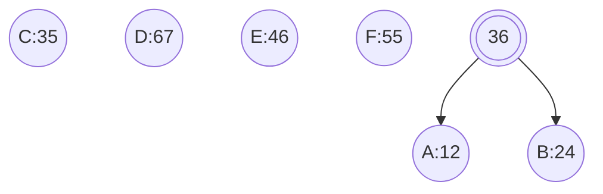
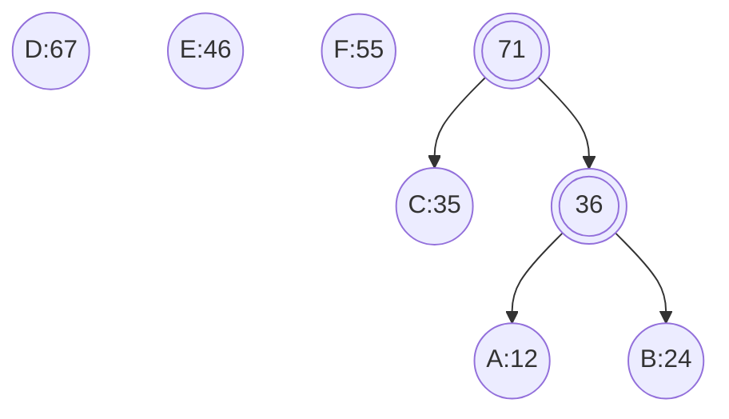
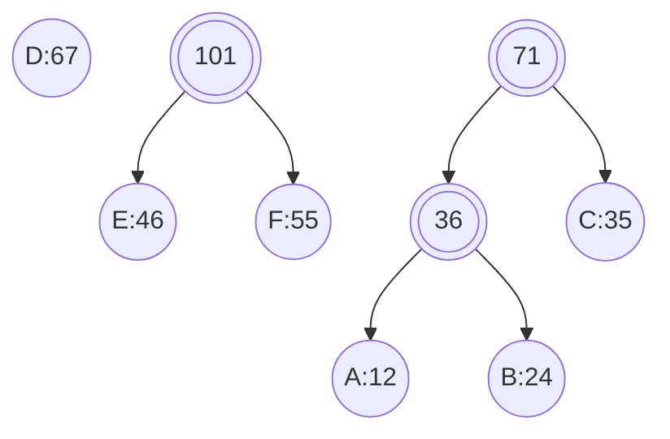
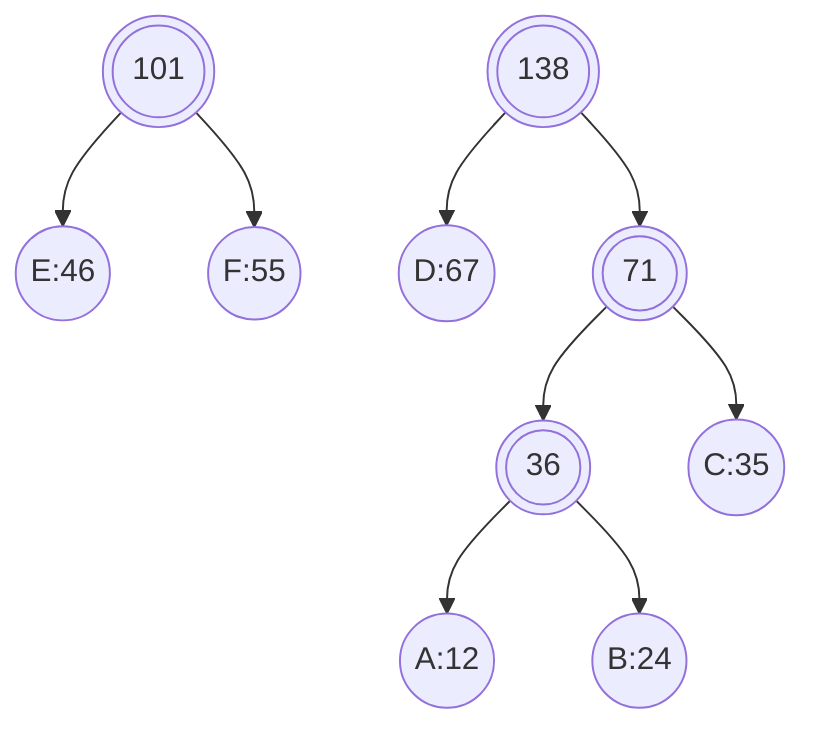
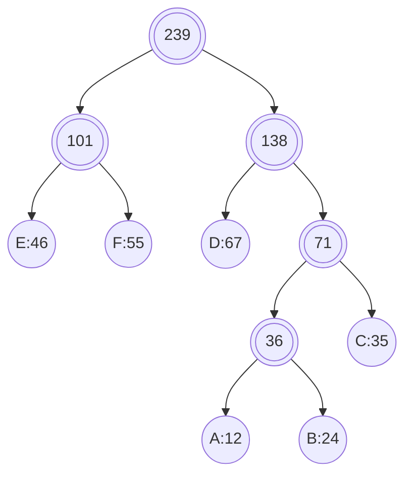
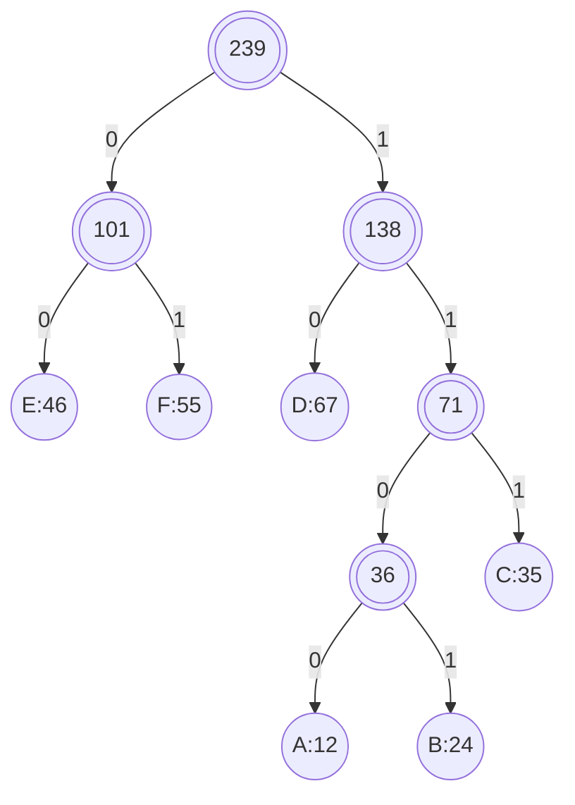

## 定义

给定 $N$ 个权值作为 $N$ 个叶子结点, 构造一棵二叉树, 若该树的带权路径长度达到最小, 称这样的二叉树为哈夫曼树

哈夫曼树是带权路径长度最短的树, 权值较大的结点离根较近

### 构建


每次从所有节点中选出最小权值节点与次小权值节点合并为新节点, 重复操作至所有节点合并为一棵树

- 选择节点$A、B$合并, 产生节点$36$



- 选择节点$C$与节点$36$合并, 产生节点$71$



- 选择节点$E、F$合并, 产生节点$101$



- 选择节点$D$与节点$71$合并, 产生节点$138$



- 合并节点$101$与$138$, 完成构建



对建立好的哈夫曼树, 所有节点左儿子编为 $0$, 右儿子编为 $1$, 从根节点走到叶子节点实现编码



## 实现

```c++
#include <iostream>
#include <utility>
#include <vector>
#include <memory>
#include <queue>
#include <map>

template<typename NodeType, typename WeightType>
struct Node {
    NodeType              mName;
    WeightType            mFrequency;
    std::shared_ptr<Node> mLeftChild;
    std::shared_ptr<Node> mRightChild;

    Node(NodeType name, WeightType freq, std::shared_ptr<Node> left, std::shared_ptr<Node> right) :
        mName(name), mFrequency(freq), mLeftChild(std::move(left)), mRightChild(std::move(right)) {}
};


template<typename NodeType, typename WeightType>
class HuffmanTree {
public:
    using NodePtr = std::shared_ptr<Node<NodeType, WeightType>>;

    explicit HuffmanTree(std::map<NodeType, WeightType>& table) {
        auto Compare = [](NodePtr node1, NodePtr node2) {return node1->mFrequency > node2->mFrequency; };
        std::priority_queue<NodePtr, std::vector<NodePtr>, decltype(Compare)> minHeap(Compare);

        for (auto it = table.begin(); it != table.end(); ++it) {
            minHeap.push(std::make_shared<Node<NodeType, WeightType>>(it->first, it->second, nullptr, nullptr));
        }

        while (minHeap.size() > 1) {
            NodePtr left = minHeap.top();
            minHeap.pop();

            NodePtr right = minHeap.top();
            minHeap.pop();

            minHeap.push(std::make_shared<Node<NodeType, WeightType>>('\0', left->mFrequency + right->mFrequency, left, right));
        }

        NodePtr root = minHeap.top();
        BuildCodes(root, "");
    }

    ~HuffmanTree() = default;

    void BuildCodes(const NodePtr& node, const std::string& code) {
        if (!node) {
            return;
        }
        if (node->mLeftChild == nullptr && node->mRightChild == nullptr) {
            mCodeTable[node->mName] = code;
        }

        BuildCodes(node->mLeftChild, code + "0");
        BuildCodes(node->mRightChild, code + "1");
    }

    void PrintCodeTable() const {
        for (auto it = mCodeTable.begin(); it != mCodeTable.end(); ++it) {
            std::cout << it->first << ": " << it->second << std::endl;
        }
    }

private:
    std::map<NodeType, std::string> mCodeTable;
};

int main() {
    std::map<char, int> table = {
        {'A', 12}, {'B', 24}, {'C', 35},
        {'D', 67}, {'E', 46}, {'F', 55}
    };

    HuffmanTree<char, int> tree(table);
    tree.PrintCodeTable();
    
    return 0;
}
```