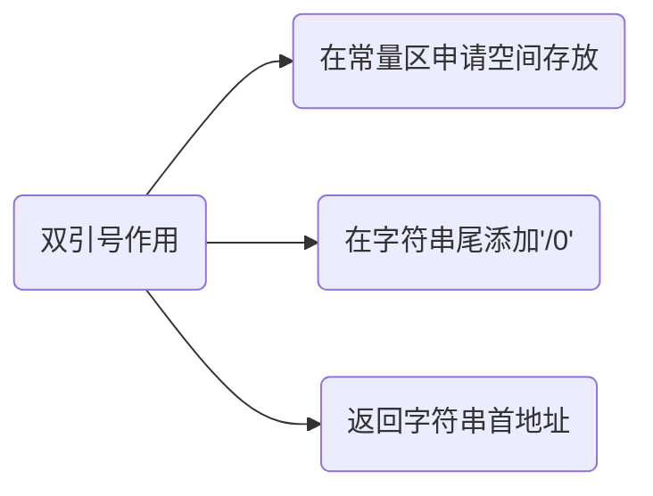
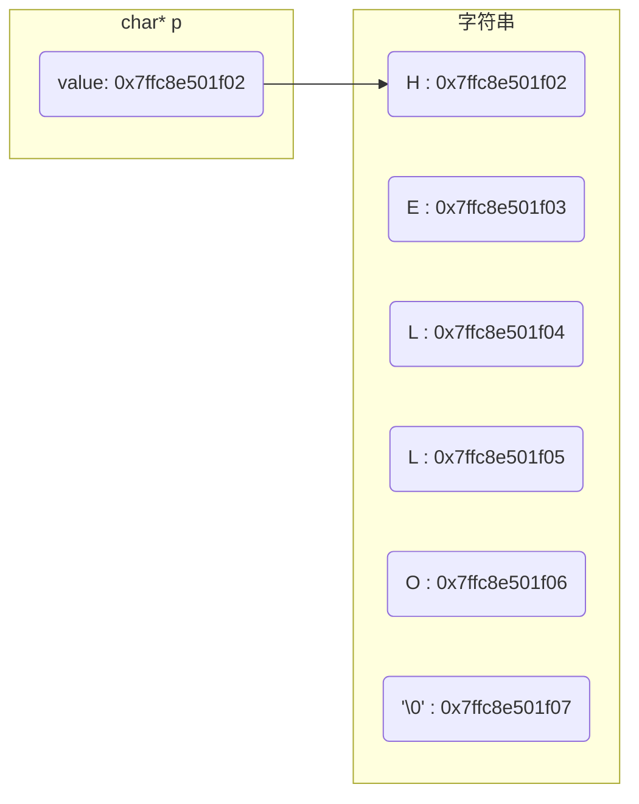

## char

char是字符数据类型, 用于存储单个字符(如字母、数字或符号)

```c
char a = 'A';
```

变量a实际存储整数值65, 即'A'ASCII 码值

- 输入输出

```c
#include<stdio.h>

int main() {
    char a;
    scanf("%c", &a);
    printf("%c\n", a);
    return 0;
}
```


### char[]

char[]是字符数组, 可存储多个字符, 以空字符`\0`作为结尾标志, 通常用以表示字符串

```c
char a[] = "HELLO";
```



#### '\0'

`'\0'`是 ASCII 码表中第 0 个字符, 它不能显示也无控制功能, 唯一作用是作为字符数组结束标志

- 字符与字符串对比

'a'为字符, 单引号只能定义一个字符

"a" 为字符串, 双引号可以定义多个字符, 由`" "`所包围字符串会自动在末尾添加`'\0'`

#### 属性

- 长度

字符数组长度可通过`strlen`函数获取, 不含`'\0'`

- 空间

字符数组所占内存空间可通过`sizeof`关键字获取, 包含`'\0'`

示例, 打印字符数组长度和所占空间

```c
#include <stdio.h>
#include <string.h>

int main() {
    char a[] = "HELLO";
    int len_sizeof = sizeof(a);
    int len_strlen = strlen(a);
    printf("sizeof(a) = %d\nstrlen(a) = %d\n", len_sizeof, len_strlen);
    return 0;
}
```


## char \*

`char *`是字符指针, 指向字符或字符数组**首地址**(存储字符变量地址)

```c
// 将常量存储区字符串首地址赋值给p
char *p = "Hello";
```

- 示例, 定义字符指针指向字符串

```c
#include <stdio.h>
#include <string.h>

int main() {
    char a[] = "HELLO";
    char *p = a;

    printf("str first char's address = %p\n", p);
    for(int i = 0; i < strlen(a); i++) {
        printf("char address = %p, value = %c\n", &a[i], a[i]);
    }

    return 0;
}
```




#### const char *

`const char *` 是指向常量字符(存储常量地址), 指向字符内容不可修改(不能通过地址间接修改常量)

### 使用

#### 显示

由于系统会先输出`char*`所指向字符串首字符, 然后会自增指向下个字符, 直到`'\0'`

所以打印`char *`所指向字符串时不能用`*`, 否则只会输出首字符值

- 示例, 打印字符串

```c
#include <stdio.h>
#include <string.h>

int main() {
    char *p = "ABCDEF";
    // A
    printf("*p = %c\n", *p);
    // ABCDEF
    printf("p = %s\n", p);
    return 0;
}
```


#### 输入

输入时`char *`必须指向一段存在地址, 若未初始化就调用, 运行时会报错 `Segmentation fault`

```c
char *p = (char *)malloc(sizeof(char) * 10);
scanf("%s", p);
```

#### 修改

- 指针在栈区, 分配字节在堆区, 可以通过指针修改

```c
char *p = (char *)malloc(sizeof(char) * 10);
scanf("%s", p);

// 可以
*(p + 2) = 'X';
```

- 指针在栈区, 字符串在常量区(只读), 不可修改

```c
char *p = "aaaaa";

// 错误, 指针只知道所指向内存单元地址, 而并不知道内存单元大小
*(p + 2) = 'X';
```

#### 转换

- `char[]` 到 `char *`

字符数组名(不带索引)可隐式转换为指向其首元素指针

### 函数

包含头文件

```c
#include<string.h>
```

#### strcmp

比较两个字符串值

```c
int strcmp(const char *s1, const char *s2)
```

若 s1 = s2, 返回值 0

若 s1 < s2, 返回值小于 0

若 s1 > s2, 返回值大于 0

#### strstr

查找src在dest中首次出现位置并返回, 若未找到则返回NULL

```c
char *strstr(const char *dest, const char *src)
```

```c
#include<stdio.h>
#include<string.h>
int main(){
    const char dest[20] = "RUNOOB";
    const char src[10] = "NOOB";
    // NOOB
    char *ret = strstr(dest, src);
    return 0;
}
```

#### strcpy

```c
char *strcpy(char *dest, const char *src)
```

把src所指向字符串复制到 dest所指向字符串

```c
#include<stdio.h>
#include<string.h>

int main() {
    char dest[7] = "abcdef";
    char src[4] = "ABC";
    strcpy(dest, src);
    // ABC
    printf("%s\n", dest);
    return 0;
}
```

#### strcat

把 src 所指向字符串追加到 dest 所指向字符串结尾

```c
char *strcat(char *dest, const char *src)
```

```c
#include<stdio.h>
#include<string.h>

int main() {
    char src[50];
    char dest[50];
    strcpy(src, "AAAA");
    strcpy(dest, "BBBB");
    strcat(dest, src);
    // BBBBAAAA
    printf("%s\n", dest);
    return 0;
}
```

#### strncpy

把 src 所指向字符串中最多n个字符复制到 dest 所指向字符串

当 src 长度小于 n 时, dest 剩余部分将用空字节填充

```c
char *strncpy(char *dest, const char *src, size_t n)
```

#### memset

将指定内存块前num个字符设置为value

```c
/**
* @brief 将指定内存块前num个字符设置为value
* @param ptr 指向要填充内存块指针  
* @param value 要设置值(仅使用其低8位)
* @param num 要设置字节数
* @return 返回指向已填充内存块指针(与输入参数ptr相同)
* @note 使用时请确保ptr指向内存区域足够大, 以容纳num个字节. 否则可能会导致未定义行为(如内存越界)
* @example
* char buffer[10];
* // 将buffer所有字节设置为0
* memset(buffer, 0, sizeof(buffer));
*/
void *memset(void *ptr, int value, size_t num)
```