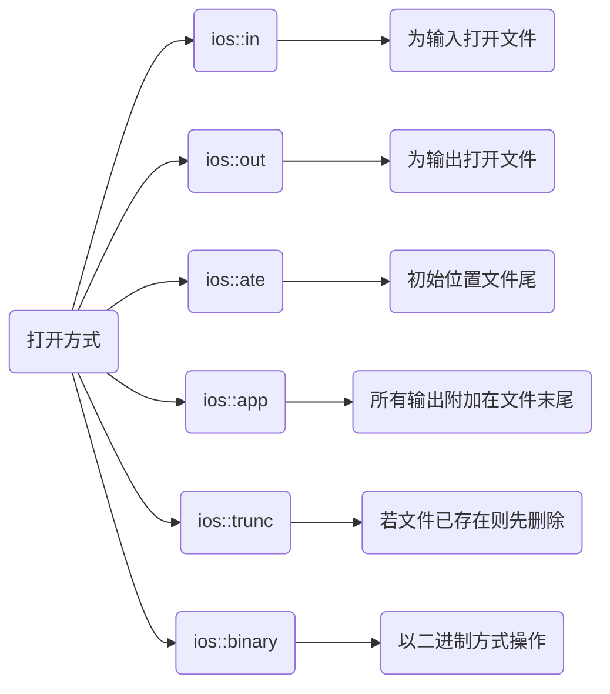
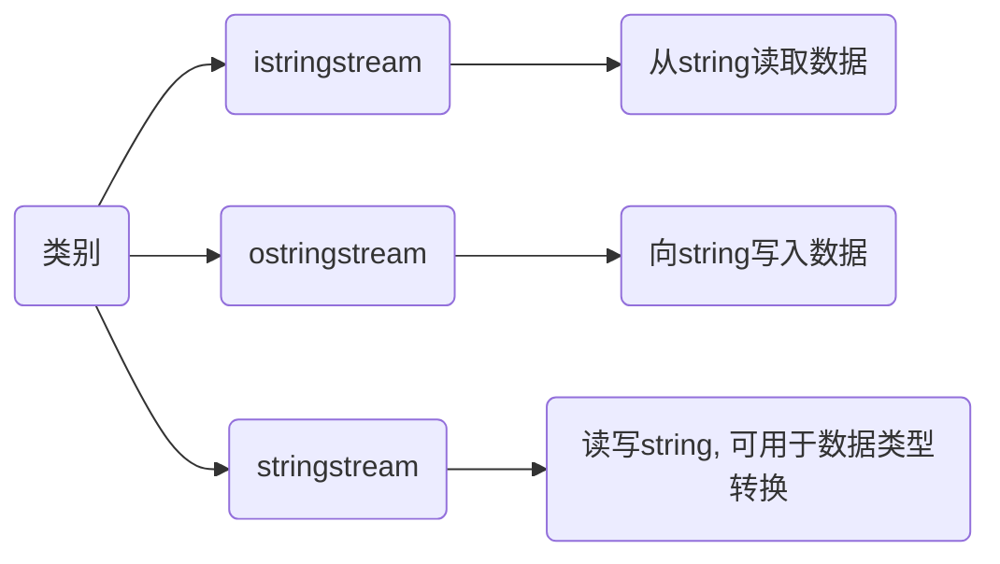

# stream

C++中把数据之间传输操作称为流

- 输出流

流数据从内存传送到某个载体或设备中

- 输入流

数据从某个载体或设备传送到内存缓冲区变量中

## 种类

### 标准I/O流

内存与标准输入输出设备之间信息传递

- istream 从流读取数据

- ostream 向流写入数据

- iostream 读写流

#### cin

输入流

```c
std::cin
```

- 回车结束输入

```c++
std::vector<T> v;

T value;

while (std::cin >> value) {
    v.push_back(value);
    if (std::cin.get() == '\n') {
        break;
    }
}
```

#### cout

输出流

```c
std::cout
```

#### cerr

错误输出

cerr不经过缓冲而直接输出,一般用于迅速输出出错信息,是标准错误

#### clog

日志输出

### 文件I/O流

内存与外部文件之间信息传递

- ifstream 从文件读取数据

- ofstream 向文件写入数据

- fstream 读写文件

#### ifstream

输入文件流

#### ofstream

输出文件流, 用于创建文件并向文件写入信息

#### fstream



```c
const std::string path = "main.txt";

// 显式调用
ofstream out;

// 以追加方式为输出打开
out.open(path,  ios::out|ios::app);

// 隐式调用
ofstream out(path, ios::out|ios::app);
```

- 写入

普通文件

```c
<<
```

```c
const std::string path = "main.txt";

ofstream out(path, ios::out|ios::app);

out << "Hello ";

out << "World\n";
```

二进制文件

```c
write()
```

```c
uint32_t value = 0xFF00FF00;

const std::string path = "image.rgb";

ofstream out(path, ios::out|ios::app);

// 将value的值写入4byte二进制文件中
out.write((char *)&value, 4);
```

- 关闭

```sh
close()
```

### 字符串I/O流

内存变量与表示字符串流的字符数组之间信息传递



- string 转 int32_t

```c++
#include <iostream>
#include <sstream>

template <class SourceType, class TargetType>
void ChangeType(SourceType &source, TargetType &target){
    std::stringstream ss;
    ss << source;
    ss >> target;

    ss.str("");
    ss.clear();
}

int main() {
    std::string source = "123456";
    int32_t target = 0;

    ChangeType(source, target);
    // 123456
    std::cout << target << std::endl;

    return 0;
}
```
