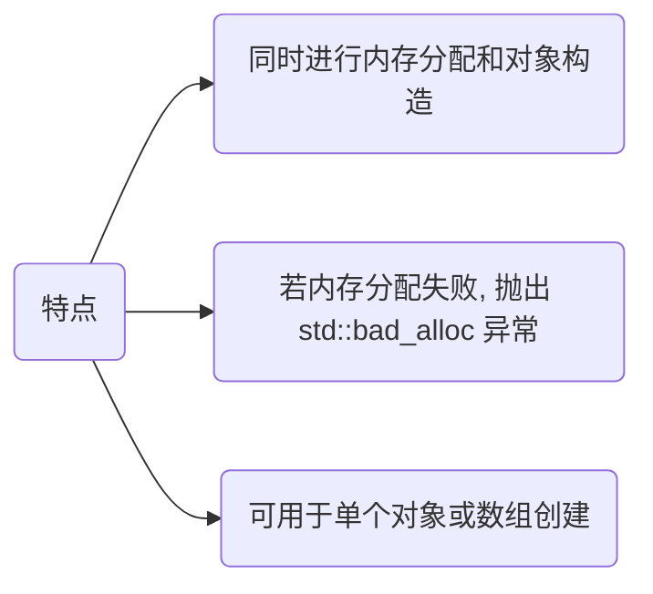
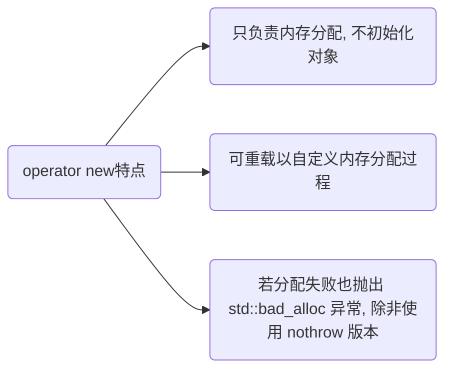
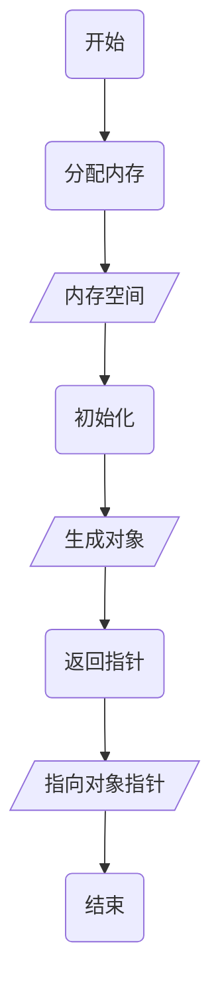

> [C++ 中 malloc 和 new 区别](https://murphypei.github.io/blog/2021/03/malloc-new-diff.html)

## 概念

`new` 是 C++ 中关键字, 用来分配内存并构造对象

```c++
T *p = new T();
```



### 函数

#### operator new

`operator new` 是可重载函数, 只负责从自由存储区(堆)中分配内存(类似于malloc 函数), 不调用构造函数

```c++
void* operator new(std::size_t size) {
    // 调用全局::operator new 分配内存
    return ::operator new(size);
}
```



- 重载 `operator new` 作用

(1) 内存池管理: 通过自定义 `operator new`, 可实现内存池来减少动态内存分配时开销

(2) 调试: 可在 `operator new` 中记录日志, 跟踪每次内存分配调用

(3) 性能优化: 对于特定类型对象, 可以通过自定义 `operator new` 来优化内存分配策略

(4) 异常处理: 可自定义 `operator new` 来处理分配失败时异常, 甚至返回 nullptr 而不是抛出异常

#### ::operator new

全局 operator new, 用于分配内存

- 与`operator new` 区别

(1) `::operator new` 强制调用作用域为全局, 即标准库提供的默认版本

(2) `operator new` 作用域可能是全局, 也可是自定义重载版本

#### placement new

用于在指定的内存地址上构造对象

new 操作符会在堆上分配内存并构造对象, 而 `placement new` 则允许指定一个已经分配好的内存区域, 然后在这个区域上调用对象的构造函数

```c
// 指向已分配内存的指针
void* memory = ....
// 在指定内存上构造对象
T* object = new (memory) T(args...);
```

## 流程



### 分配内存

`new` 调用 `operator new` 函数 默认从堆(自由存储区)中分配内存来存储对象

#### 流程

(1) `operator new` 内存分配失败时会抛出 std::bad_alloc 异常(而不像 malloc 返回 NULL)

(2) 自定义 `operator new` 函数会优先调用, 否则调用全局 `::operator new`

```c++
void* operator new(std::size_t size) {
    // 分配 size 大小内存
    void* p = ::malloc(size);
    // 内存分配失败时抛出异常
    if (!p) {
        throw std::bad_alloc();
    }
    return p;
}
```

### 初始化

分配内存后 `new` 会在刚分配内存上调用对象构造函数初始化, 本质是通过定位 new机制, 确保构造函数在分配的内存地址上正确执行

#### 流程

- 构造对象

(1) 使用`placement new` 构造函数会在已经分配内存位置上构造对象

(2) 对象构造函数会根据传入参数初始化对象成员变量和状态

```c++
// 在已分配好内存 ptr 上调用构造函数
T* obj = new(ptr) T();
```

- 处理异常

(1) 若内存分配失败`::operator new` 会抛出 std::bad_alloc 异常

(2) 若构造函数抛出异常:会释放已经分配的内存, 并传播异常, C++ 通过 RAII异常处理机制, 确保不会泄漏资源

```c++
// 1. 分配内存
T* obj = static_cast<T*>(operator new(sizeof(T)));

try {
    // 2. 定位 new, 调用构造函数
    new (obj) T();
} catch (...) {
    // 3. 构造失败, 释放内存
    operator delete(obj);
    // 4. 重新抛出异常
    throw;
}
```

### 返回指针

若内存分配和对象构造均成功, `new`返回指向已初始化对象的指针, 此时对象已完全初始化

```c++
#include <iostream>

class ExampleUseNew {
public:
    ExampleUseNew() = default
    ~ExampleUseNew() = default

    // 重载 operator new
    void* operator new(std::size_t size) {
        std::cout << "operator new called, size: " << size << std::endl;
        // 调用全局 operator new
        return ::operator new(size);
    }

    // 重载 operator delete
    void operator delete(void* p) {
        std::cout << "operator delete called" << std::endl;
        // 调用全局 operator delete
        ::operator delete(p);
        }
};

int main() {
    ExampleUseNew* obj = new ExampleUseNew();
    delete obj;
    return 0;
}
```

## 对比

### 与系统函数

|操作符/函数         |作用                                            |是否调用构造函数  |是否抛出异常       |
| ----------------- | ---------------------------------------------- |----------------|------------------|
|`new`              |分配内存并构造对象                                | 是             |是(若内存分配失败) |
|`operator new`     |只分配内存, 不构造对象, 允许类自定义内存分配策略    | 否             | 是(若内存分配失败)|
|`::operator new`   |全局`operator new`,只分配内存, 调用默认内存分配实现| 否             |是(若内存分配失败) |

### 与malloc

#### 申请位置不同

- malloc

从堆上动态分配内存

- new

操作符从自由存储区(free store)上为对象动态分配内存空间

自由存储区是 C++ 基于 `new`的抽象概念, 可以是堆还可以是静态存储区, 取决于 `operator new` 在哪里为对象分配内存, 凡通过 `new`进行申请的内存即为自由存储区

#### 返回类型安全性

- new

操作符内存分配成功时, 返回对象类型指针, 类型严格与对象匹配, 无须进行类型转换, 故 `new` 是符合类型安全性操作符

- malloc

内存分配成功则是返回 void 指针, 需要通过强制类型转换将 void 指针转换成指定类型

#### 内存分配失败时返回值

new, 内存分配失败时, 会抛出 bac_alloc 异常, 不会返回 NULL

malloc, 分配失败时返回 NULL

#### 分配内存大小

new, 操作符申请内存分配时无须指定内存块大小, 编译器会根据类型信息自行计算

malloc, 则需要明确指出所需内存尺寸

#### 是否调用构造/析构函数

- new

`new`分配对象内存时会经历三个步骤,
(1) 调用 `operator new` 函数(对于数组是 `operator new[]`)分配一块足够大原始, 未命名内存空间, 存储特定类型对象

(2) 编译器运行相应构造函数以构造对象,并为其传入初值

(3) 对象构造完成后,返回一个指向该对象指针

`delete` 操作符来释放对象内存时会经历两个步骤, 

(1) 调用对象析构函数

(2) 编译器调用`operator` `delete`(或`operator[]` `delete[]`)函数释放内存空间

- malloc

不会调用构造函数, free也不会调用析构函数

#### 对于数组处理

- new

对数组会分别调用构造函数函数初始化每一个数组元素

C++ 提供`new[]` 与 `delete[]` 来专门处理数组类型分配

释放对象时为每个对象调用析构函数, `delete[]` 要与 `new[]` 配套使用,不然会找出数组对象部分释放现象, 造成内存泄漏

- malloc

只提供开辟出内存地址, 若动态分配一个数组内存,还需要手动自定数组大小

#### 是否支持内存扩充

new, 不支持内存扩充

malloc, 在分配内存后若内存不足, 可使用 realloc 进行内存重新分配, 实现扩充