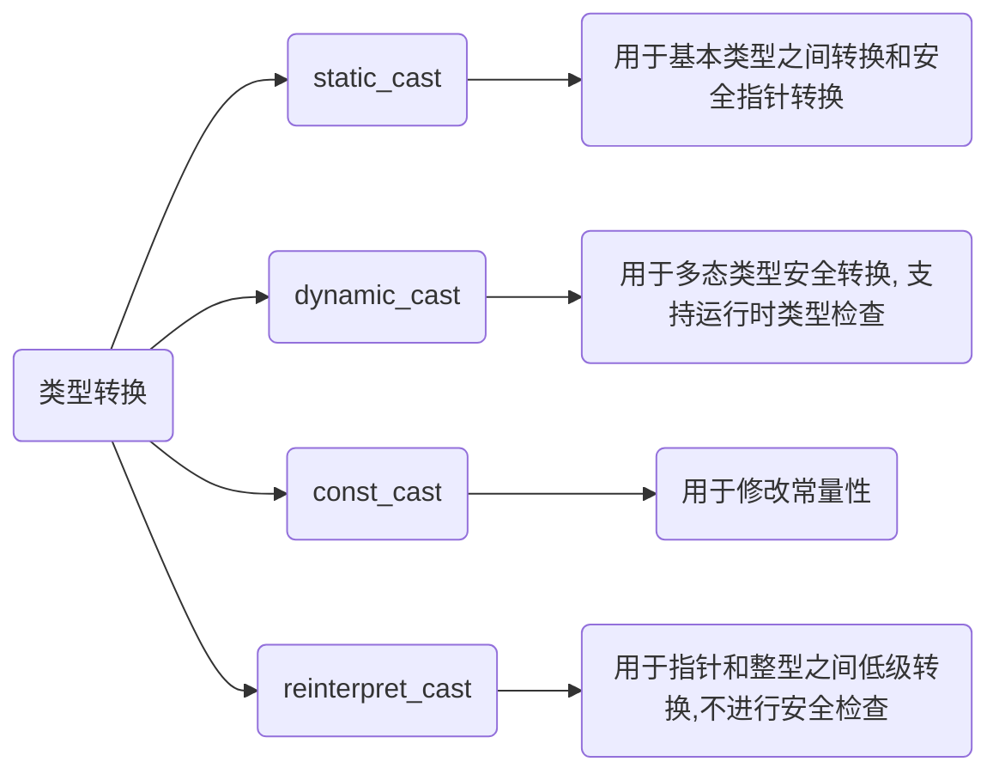

## 种类



### static_cast

用于基本数据类型、指针和引用之间显式转换, 适用于非多态类型转换, 其在编译时检查类型安全性

#### 类型转换

```c++
int a = 10;

// int转为double
double b = static_cast<double>(a); 
```

#### 多态类型转换

- 示例, 将父类指针转换为子类指针

```c++
#include <iostream>

class Base {};
class Derived : public Base {};

int main() {
    Base* base = new Derived();

    // 向下转换
    Derived* derived = static_cast<Derived*>(base);
    return 0;
} 
```

### dynamic_cast

用于进行安全多态类型转换, 主要在有虚函数类之间使用, 其在运行时检查类型

若转换不成功, 对于指针类型返回nullptr, 对于引用类型抛出异常

```c++
#include <iostream>

class Base {
public:
    virtual void DoFunc() {}
};

class Derived : public Base {};

int main() {
    Base* base = new Derived();
    // 安全地向下转换
    Derived* derived = dynamic_cast<Derived*>(base); 
    if (derived) {
        // 转换成功
    } else {
        // 转换失败
    }

    return 0;
}
```

### const_cast

用于修改对象常量性, 可添加或去除对象const或volatile属性

```c++
#include <iostream>

int main() {
    const int x = 5;
    // 去掉const修饰符
    int* y = const_cast<int*>(&x); 
    // 若x原本是常量, 修改它会导致未定义行为
    *y = 10;
    return 0; 
}
```

### reinterpret_cast

用于在指针类型之间进行低级别强制转换, 例如将一个类型指针转换为另一个不相关类型指针, 此转换不进行类型安全检查