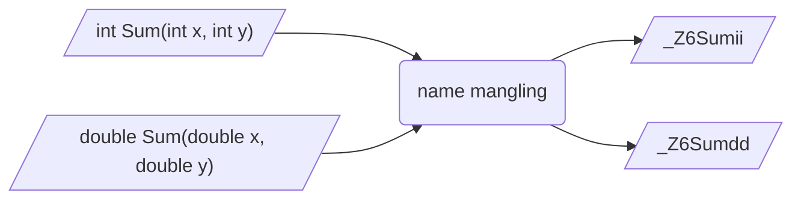

## 定义

C++为支持函数重载, 存在命名修饰(Name Mangling)机制

编译阶段C++编译器会通过添加参数类型、参数个数等额外信息重命名函数, 生成唯一符号名, 以区分同名但不同参数函数

链接阶段链接器会按照符号名来解析不同目标文件和库文件中所引用符号, 以正确区分和链接函数

- 示例, 两个同名函数Sum经过C++`Name Mangling`后生成唯一修饰名



## 使用

函数和变量在本质上都是地址助记符, 在链接过程中称为`符号`(Symbol)

### C语言

C语言不支持重载, 故无命名修饰机制, 每个函数都有唯一未修饰名称, 链接器可直接使用名称解析符号

- 示例, .c文件生成目标文件

```c
// c_module.h
#include <stdio.h>

int AddNum(int x, int y);
void PrintValue(double num);
```

```c
// c_module.c
#include "c_module.h"

int AddNum(int x, int y) {
    return x + y;
}

void PrintValue(double num) {
    printf("res = %f\n", num);
}
```

编译为目标文件

```sh
gcc c_module.c -c -o c_module.o
```

查看符号表

```sh
nm c_module.o
```


C语言编译器不会对函数名增加任何修饰, 因此函数名必须唯一

- 错误情况

设error.c中有两个同名函数

```c
#include <stdio.h>

int Add(int x) {
    return x + 1;
}
double Add(double x) {
    return x + 0.1;
}
```

编译时报错定义类型冲突


### C++

```c
// cpp_module.hpp
#include <iostream>

int AddNum(int x, int y);
double AddNum(double x, double y);
void PrintValue(int num);
void PrintValue(double num);
```

```c
// cpp_module.cpp
#include "cpp_module.hpp"

int AddNum(int x, int y) {
    return x + y;
}

double AddNum(double x, double y) {
    return x + y;
}

void PrintValue(int num) {
    printf("int = %d\n", num);
}

void PrintValue(double num) {
    printf("double = %f\n", num);
}
```

编译为目标文件

```sh
g++ cpp_module.cpp -c -o cpp_module.o
```

查看符号表

```sh
nm cpp_module.o
```


函数名被完全修改, 原本同名函数也变为唯一名称

C++编译器通过命名修饰机制, 对于同名函数, 只要参数类型、参数个数或返回值类型不一致也可通过编译

### C/C++混合

```c
// math_module.h
#include <stdio.h>

int Add(int x, int y);
double GetSquareArea(double length);
```

```c
// math_module.c
#include "math_module.h"

int Add(int x, int y) {
    return x + y;
}

double GetSquareArea(double length) {
    return length * length;
}
```

```cpp
// main.cpp
#include "math_module.h"
#include <iostream>

int main() {
    int res = Add(1, 2);
    double area = GetSquareArea(3.74);
    std::cout << "Add = " << res << std::endl;
    std::cout << "SquareArea = " << area << std::endl;
    return 0;
}
```

#### 同步编译

```sh
g++ math_module.c main.cpp -o main
```

查看符号表


由于直接使用C++编译器, 原.C文件中Add、GetSquareArea函数名也执行命名修饰, 修改为_Z3Addii、_Z13GetSquareAread

#### 库链接

日常编程中更多是通过库进行调用, 当C/C++混合编程时可能会出现错误

##### 未定义错误

设其他人已用C语言编译器将math_module.c生成math_module.o

```sh
gcc math_module.c -c -o math_module.o
```

现在使用C++编译器将main.cpp生成目标文件

```sh
g++ main.cpp -c -o main.o
```

将math_module.o、main.o链接为可执行文件, 出现符号未定义错误

```sh
g++ math_module.o main.o -o main
```


分别查看math_module.o与main.o符号表, 发现同一个函数名居然出现两个不同符号


##### 原因分析

(1) main.cpp 预处理时, 内容展开

```diff
+ #include<stdio.h>
+ int Add(int x, int y);
+ double GetSquareArea(double length);

#include<iostream>
int main() {
    int res = Add(1, 2);
    double area = GetSquareArea(3.74);
    std::cout << "Add = " << res << std::endl;
    std::cout << "SquareArea = " << area << std::endl;
    return 0;
}
```

生成main.o时, 编译器对main.cpp中两个原本C语言函数名`Add`、`GetSquareArea`使用命名修饰机制, 生成全新函数名`_Z3Addii`、`_Z13GetSquareAread`

(2) math_module.o因为是C编译器编译生成, 因此没有经过命令修饰, 函数名未改变

(3) 链接时main.o按照`_Z3Addii`符号名到各模块查找函数引用, 结果math_module.o里符号名是`Add`、`GetSquareArea`, 无法匹配, 自然出现函数未定义错误

这种情况需通过`extern "C"`处理

## extern "C"

### 定义

C++各编译器中提供 `extern "C"`/ `extern "C" {}`语句, 表示后续或范围内函数强制禁用命名修饰机制, 按C语言风格编译

通常用于C++代码中调用C语言代码

### 语法

#### 函数声明

函数按照C语言规则编译

```c
extern "C" 函数声明
```

#### 代码块作用

花括号内所有函数声明都按照C语言规则处理

```c
extern "C" {
    函数声明1;
    函数声明2;
}
```

#### 仅C++编译时使用

预处理宏`__cplusplus`仅在C++编译器中被定义

- 示例, 若使用C++编译器编译, 则对花括号内函数按C语言规则出

```c++
#if __cplusplus
extern "C" {
#endif
    void Func1();
    void Func2();
#if __cplusplus
}
#endif
```

### 应用

#### C++调用C语言代码

例如对于上述未定义错误, 有两种方式修正

##### 方式1

仅修改math_module.h

使用`extern "C" {}`包裹函数接口, 表示若C++引用math_module.h时, 对函数名按C语言规则编译

```c++
#include <stdio.h>

#if __cplusplus
extern "C" {
#endif
    int Add(int x, int y);
    double GetSquareArea(double length);
#if __cplusplus
}
#endif
```

main.cpp预处理展开

```c++
// math_module.h
#include <stdio.h>

#if __cplusplus
extern "C" {
#endif
    int Add(int x, int y);
    double GetSquareArea(double length);
#if __cplusplus
}
#endif

#include <iostream>

int main() {
    int res = Add(1, 2);
    double area = GetSquareArea(3.74);
    std::cout << "Add = " << res << std::endl;
    std::cout << "SquareArea = " << area << std::endl;
    return 0;
}
```

现在对引用C语言函数名就不会使用命名修饰处理

##### 方式2

仅修改main.cpp

对于所引用C语言头文件使用`extern "C" {}`包裹

```c++
extern "C" {
    #include "math_module.h"
}

#include <iostream>

int main() {
    int res = Add(1, 2);
    double area = GetSquareArea(3.74);
    std::cout << "Add = " << res << std::endl;
    std::cout << "SquareArea = " << area << std::endl;
    return 0;
}
```

main.cpp预处理时展开

```c++
extern "C" {
    #include <stdio.h>

    int Add(int x, int y);
    double GetSquareArea(double length);
}

#include <iostream>

int main() {
    int res = Add(1, 2);
    double area = GetSquareArea(3.74);
    std::cout << "Add = " << res << std::endl;
    std::cout << "SquareArea = " << area << std::endl;
    return 0;
}
```

##### 查看符号表

两种方式因`extern "C"`, 编译main.cpp中两个C语言函数生成符号时不受命名修饰影响, 依然保持原名称, 和math_module.o中符号一致

此时链接错误问题解决

