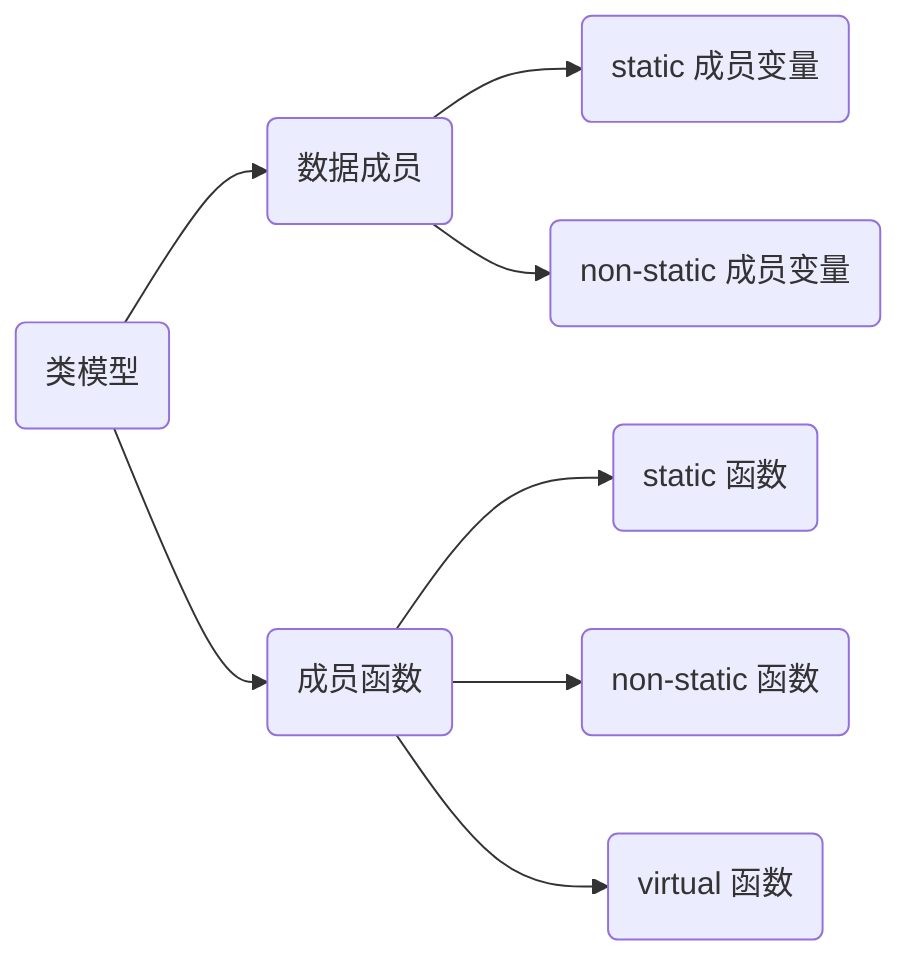
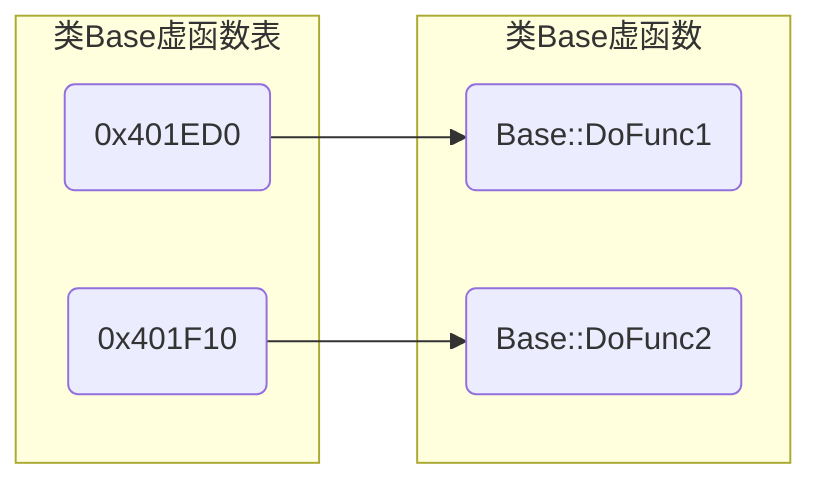
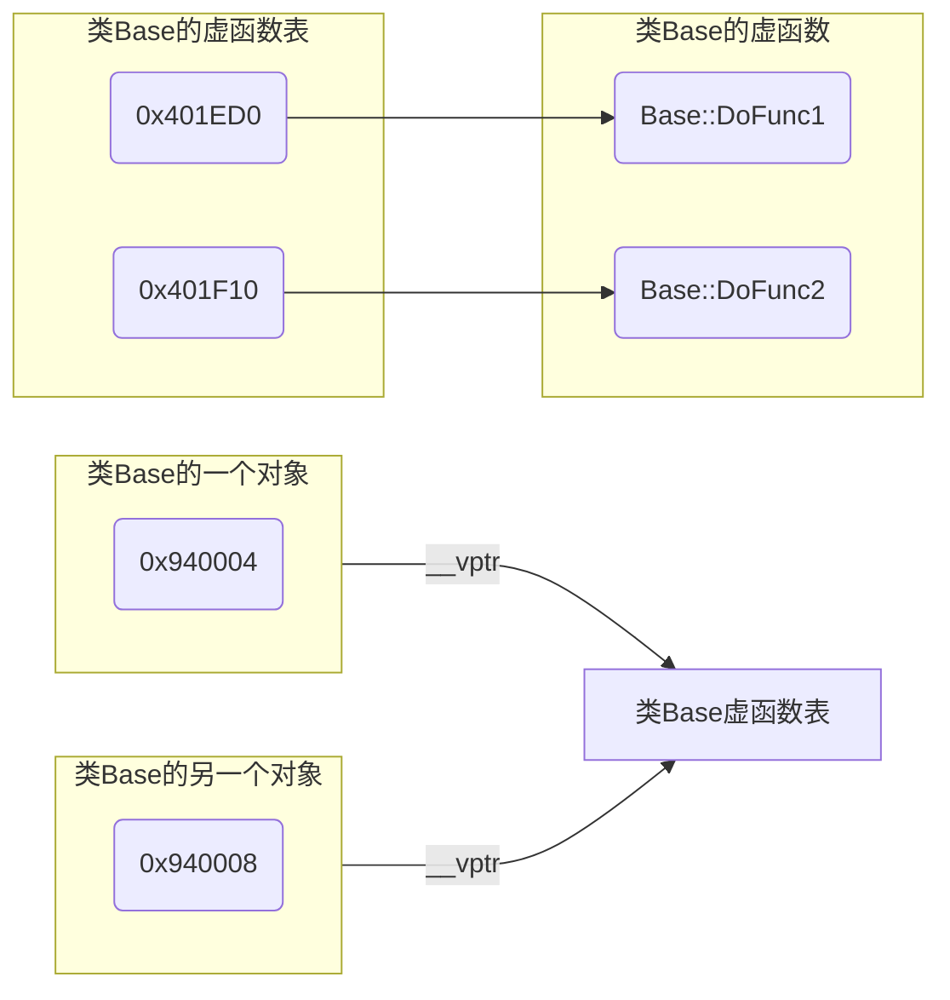

> [C++虚函数表剖析](https://leehao.me/C-%E8%99%9A%E5%87%BD%E6%95%B0%E8%A1%A8%E5%89%96%E6%9E%90/)

# 面向对象

## 封装



```c++
class Base {
public:
    static int GetCount();

    void Print();

    virtual void DoFunc();

    static int sCount; 
private:
    int mValue;
};
```

### 数据成员

#### static 成员变量

```c++
class Test {
public:
    static int value;
};

int Test::value = 1;
```

- 归属

静态成员变量不属于对象, 存放在全局区

- 初始化

不能再构造函数中被定义和初始化, 需要在类外部单独定义及初始化    发大打发手动阀手动阀手动阀回到法国航空记

- 访问

可通过类名直接访问, 也可通过对象访问

使用受到访问控制属性约束

#### non-static 成员变量

被置于每一个**对象中**

### 成员函数

#### 静态成员函数

- 访问函数

可以通过类名直接访问,也可以通过对象访问

- 访问成员变量

在静态成员函数中只能访问静态成员

在非静态成员函数既可以访问静态成员,也可以访问非静态成员

- 约束

静态成员函数没有this指针,因此也没有const属性

和普通成员函数一样受访问控制限定符约束

### this

this 是 C++ 中一个关键字, 是 const 指针

#### 指向

this 指针指向当前对象, 只能用在类内部

this 可以访问类所有private、protected、public 属性成员

#### 赋值

对象被创建后编译器自动给 this 赋值, 用户不能显式赋值

```c++
#include <iostream>

class Person {
public:
    Person(std::string name) {
        this->mName = name;
    };

    void PrintThis() {
        std::cout << "this pointer = " << std::hex << this << std::endl;
    };

private:
    std::string mName;
};

int main(void) {
    Person p{"Casper"};

    p.PrintThis();

    std::cout << "p address = " << std::hex << &p << std::endl;
}
```

运行结果

```sh
this pointer = 000000000014FC78
p address = 000000000014FC78
```

### 重载运算符

运算符重载允许定义运算符的行为

通过重载, 类对象可以像基本数据类型一样使用运算符

```c++
#include<iostream>

class Complex {
   public:
        Complex() = default;

        Complex(double read, double imag) : mReal(read), mImag(imag) {}

        friend istream & operator >> (istream &, Complex &) {
            std:: >> c.mReal >> c.mImag;
        }
        friend ostream & operator << (ostream &, Complex &) {
            std:: << c.mReal << " + " << c.mImag << "i" <<std::endl;
        }

        Complex operator + (Complex &) {
            return Complex(this->mReal + c.mReal, this->mImag + c.mImag);
        }
        Complex operator - (Complex &) {
            return Complex(this->mReal - c.mReal, this->mImag - c.mImag);
        }
    private:
        double mReal;
        double mImag;
};

int main() {
    Complex c1(1.0, 2.0);
    Complex c2(3.0, 4.0);
    Complex c3 = c1 + c2;
    return 0;
}
```

## 继承

### 多重继承

```c++
class A {
    ...
}

// B公有继承A
class B: public A{
    ...
}
```

#### 构造函数

派生类初始化时, 首先调用基类构造函数, 然后调用派生类构造函数

#### 派生类调用基类构造函数

```c++
class A {
    A() {}
};

class B: public A {
    B(): A() {}
};
```

```c++
class People {
    public:
        People() {}

        People(int age, std::string name) : mAge(age), mName(name) {}

        ~People() {}

        virtual void DoDisplay() = 0;

    protected:
        int         mAge;
        std::string mName;
};


class Student: public People {
    public:
        Student() {}

        Student(int age, std::string name, std::string num) : People(age, name), mNum(num) {}

        void DoDisplay() {
            std::cout << "age:" << mAge << "\nname:" << mName << "\nnum" << mNum << std::endl;
        }

        ~Student() {}
    
    private:
        std::string mNum;
}; 
```

## 多态

### 虚函数

虚函数是在基类中使用 $virtual$ 关键字修饰的函数

虚函数可有自己实现, 子类可选择使用基类实现, 也可在派生类中被重写(覆盖)

```c++
#include <iostream>

class Base {
public:
    Base() {}
    // 定义虚函数
    virtual void DoShow() override {
        std::cout << "Show Base" << std::endl;
    }
};

class SubA : public Base {
public:
    SubA(){}
    // 派生类对虚函数进行具体实现
    void DoShow() override {
        std::cout << "Show SubA" << std::endl;
    }
};

class SubB : public Base {
public:
    SubB(){}
    // 派生类中使用基类实现
};

int main() {
    Base *p = new SubA;
    // DoShow B
    p->DoShow();
    
    p = new SubB;
    // DoShow Base
    p->DoShow();
}
```

#### 纯虚函数

若虚函数在基类中没有实现, 则为纯虚函数, 使用 = 0 来表示

纯虚函数强制派生类必须实现该函数, 若类拥有纯虚函数则是抽象类, 不能直接实例化

```c++
virtual void DoFunc() = 0;
```

#### 虚函数表

每个拥有虚函数的类都由编译器在编译阶段生成一个虚函数表(vtable), 其是一个指针数组, 存放每个虚函数指针

虚函数表中存储了所有虚函数入口地址, 按声明顺序排列

若派生类重写虚函数, 虚函数表中对应地址会被更新重写后函数地址

```c++
class Base {
public:
    virtual void DoFunc1();
    virtual void DoFunc2();
}
```



#### 虚表指针

每个包含虚函数类生成对象时, 编译器会隐式添加一个指向虚函数表指针`vptr`, 保证运行时能够通该指针找到相应虚函数表, 从而调用正确虚函数



#### 调用

通过基类指针或引用调用虚函数时, C++会在运行时根据指针或引用指向的实际对象类型来决定调用何版本虚函数

(1) 编译器根据基类指针或引用在内存中对象查找到该对象虚函数指针(vptr)

(2) 通过虚函数指针(vptr), 找到该对象实际类型对应的虚函数表(vtable)

(3) 从虚函数表中查找到与虚函数对应的函数指针

(4) 最后调用函数指针指向的虚函数实现

```c++
#include <iostream>

class Base {
public:
    virtual void DoShow() {
        std::cout << "Base class DoShow function" << std::endl;
    }
};

class Derived : public Base {
public:
    void DoShow() override {
        std::cout << "Derived class DoShow function" << std::endl;
    }
};

int main() {
    // 1. 对象创建
    // 编译器为 Derived 类对象创建并初始化 vptr, 使其指向 Derived 类虚函数表
    Base* basePtr = new Derived();

    // 2. 函数调用
    // 编译器通过 basePtr 查找其指向对象 vptr, 发现它指向 Derived 类虚函数表
    // 通过虚函数表查找 DoShow() 函数实际实现, 发现 Derived 类重写DoShow()函数, 因此调用 Derived::DoShow
    basePtr->DoShow();  
    
    delete basePtr;
    return 0;
}
```

运行结果

```sh
Derived class DoShow function
```