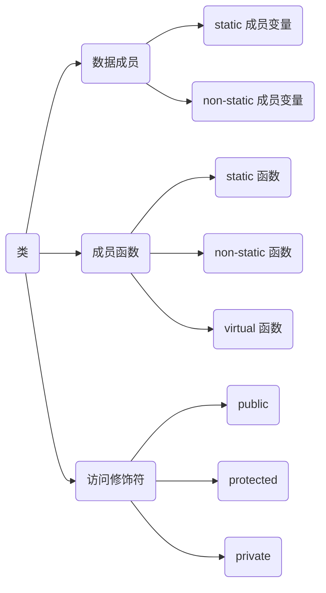
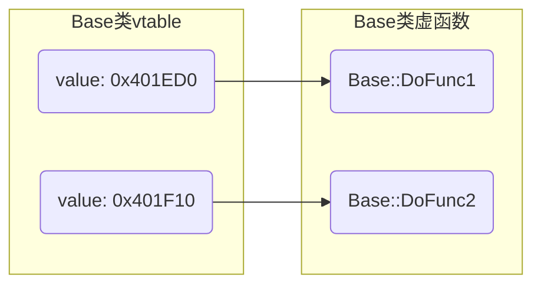
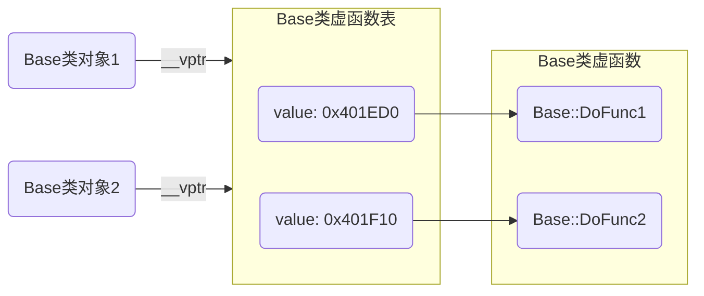

> [C++虚函数表剖析](https://leehao.me/C-%E8%99%9A%E5%87%BD%E6%95%B0%E8%A1%A8%E5%89%96%E6%9E%90/)

## encapsulation(封装)

封装是指将数据和操作数据函数分装成独立但愿, 称之为类(class), 并隐藏对象内部实现细节, 只对外暴露必要接口

封装通过访问控制机制通(如public、protected、private)来限制外部对类成员访问, 保护对象完整性

封装有效提高代码安全性和可维护性, 使得类内部状态只能被类本身方法(成员函数)修改

### class(类)

C++类(class)是实现封装的主要工具

类包含数据成员(也称为属性或字段)和成员函数(也称为方法或行为), 数据成员用于存储对象状态, 成员函数则定义了对象可执行操作



```c++
class Base {
public:
    void PrintSelfValue();
protected:
    double mValue;
private:
    int mSelfValue;
};
```

#### object(对象)

`object`是`class`实例, 根据`class`定义创建具体实体, 具有自己状态(由类数据成员存储)和行为(由类成员函数定义)

每个`object`都是`class`类型变量, 可访问该`class`所有公共成员, 包括数据成员和成员函数

创建时会调用构造函数来初始化`object`状态, 生命周期结束时, 会调用析构函数来执行清理操作

```c++
class Base;

Base b = Base;
```

#### 访问修饰符

通过private、protected和public关键字, 类可以控制其成员(包括数据成员和成员函数)访问级别, 允许类隐藏其内部实现细节, 只暴露必要接口给外部使用

```c++
class Base {
public:
    int mPublicValue;
protected:
    int mProtectedValue;
private:
    int mPrivateValue;
};
```

##### public

任何代码都可以访问该成员

##### protected

只有派生类(子类)和类本身可以访问该成员

##### private

只有类本身可以访问该成员, 派生类和其他外部代码都无法直接访问

#### 数据成员(属性)

数据成员(成员变量)是类中变量, 用于存储对象状态或数据

数据成员可以是基本数据类型、枚举类型、指针类型、其他类对象等

可用`private`、`protected`和`public`访问修饰符来控制成员访问级别, 数据成员通常被声明为private或protected, 以防止外部直接访问

##### 存储方式分类

- 静态数据成员

属于类本身, 在所有对象之间共享, 存放在全局区

不能再构造函数中被定义和初始化, 需在类外部单独定义及初始化

可通过类名直接访问, 也可通过对象访问, 使用受到访问控制属性约束

```c++
// static_member_variables_demo.cpp
#include <iostream>

class Base {
public:
    static int sValue;
};

// 单独初始化
int Base::sValue = 1;

int main() {
    std::cout << Base::sValue << std::endl;

    Base p = Base;
    std::cout << p.sValue << std::endl;
    return 0;
}
```

- 非静态数据成员

属于类每个对象, 每个对象都有自己独立副本

```c++
// no_static_member_variables_demo.cpp
#include <iostream>

class Base {
public:
    int mValue;
};

int main() {
    Base p1 = Base;
    Base p2 = Base;

    p1.mValue = 0x1;
    p2.mValue = 0x2;
    std::cout << "p1 mValue = " << p1.mValue << std::endl;
    std::cout << "p2 mValue = " << p2.mValue << std::endl;
    return 0;
}
```

##### 访问权限分类

- 公有数据成员

可以在类外部直接访问

在实际编程中, 通常不建议将数据成员设为公有, 因为这违反了封装原则

- 保护数据成员

只能在类内部和派生类中访问

```c++
class Base {
protected:
    int baseValue;
};

class Derived : public Base {
public:
    void showValue() {
        // 派生类可以访问保护数据成员
        std::cout << baseValue << std::endl;
    }
};
```

- 私有数据成员

只能在类内部访问

```c++
class Circle {
private:
    double radius;

public:
    double getArea() {
        // 类内部可以访问私有数据成员
        return 3.14159 * radius * radius;
    }
};
```

#### 成员函数(方法)

成员函数也可以被声明为private、protected或public, 以控制访问级别, 通常提供public成员函数作为接口, 允许外部代码与对象进行交互

##### constructor/destructor(构造函数/析构函数)

- 构造函数

在创建对象时自动调用, 用于初始化对象状态

- 析构函数

在对象销毁时自动调用, 用于执行清理操作, 如释放动态分配内存

析构函数不接受任何参数, 也不能被显式调用

```c++
// constructor_demo.cpp
#include <iostream>
class Base {
public:
    Base() { std::cout << "constructor called" << std::endl; }
    ~Base() { std::cout << "destructor called" << std::endl; }
};

int main() {
    // 创建对象时调用构造函数
    Base obj;
    // 对象超出作用域时调用析构函数
    return 0;
}
```


- copy constructor(拷贝构造函数)

拷贝构造函数用于通过另一个同类型的对象来初始化新对象, 通常用于深拷贝或浅拷贝对象

```c++
// copy_constructor_demo.cpp
class Base {
public:
    Base() { std::cout << "constructor called" << std::endl; }
    ~Base() { std::cout << "destructor called" << std::endl; }

    Base(const Base& other) { std::cout << "copy constructor called" << std::endl; }
};

int main() {
    Base obj1;
    Base obj2 = obj1;
    return 0;
}
```

##### static member function(静态成员函数)

静态成员函数属于类本身, 而不是类实例

不能访问非静态成员变量(除非通过对象), 可通过类名直接访问, 也可通过对象访问

静态成员函数没有this指针,因此也没有const属性, 和普通成员函数一样受访问控制限定符约束

##### non-static member function(普通成员函数)

普通成员函数是类实例(对象)成员, 可以访问类私有和保护成员, 必须通过对象来调用

```c++
class Base {
public:
    void Display() {
        std::cout << "this is a regular member function." << std::endl;
    }
};

int main() {
    Base obj;
    obj.Display();
    return 0;
}
```

#### this

this是关键字, 是 const 类型指针, 指向当前对象, 只能用在类内部, 出现在类非静态成员函数

this可以访问类所有private、protected、public 属性成员

##### 赋值

对象被创建后编译器自动给 this 赋值, 用户不能显式赋值

```c++
// this_demo.cpp
#include <iostream>

class Person {
public:
    Person(std::string name) {
        this->mName = name;
    }
    void PrintThis() {
        std::cout << "this pointer = " << std::hex << this << std::endl;
    }
private:
    std::string mName;
};

int main(void) {
    Person p{"Casper"};
    p.PrintThis();
    std::cout << "p address = " << std::hex << &p << std::endl;

    return 0;
}
```


## inheritance(继承)

继承是面向对象编程中实现代码复用的机制, 允许一个新类(子类或派生类)继承一个或多个已有类(父类或基类)属性和方法

子类可以继承父类的公有(public)和保护(protected)成员, 不能继承私有(private)成员

继承支持层次结构分类, 使得代码更加模块化, 并且易于扩展和维护

### 单继承

派生类初始化时, 首先调用基类构造函数, 然后调用派生类构造函数

- 示例, 子类调用父类构造函数

```c++
// inheritance_demo.cpp
class People {
    public:
        People() {}
        People(int age, std::string name) : mAge(age), mName(name) {}
        ~People() {}
    protected:
        int         mAge;
        std::string mName;
};

class Student: public People {
    public:
        Student() {}
        Student(int age, std::string name, std::string num) : People(age, name), mNum(num) {}
        ~Student() {}
    private:
        std::string mNum;
};
```

## polymorphism(多态)

多态是指同一操作作用于不同对象时, 可以产生不同执行结果

多态分为编译时多态(如函数重载和运算符重载)和运行时多态(如虚函数和动态绑定)

#### 实现步骤

当通过基类指针或引用调用虚函数时, 会根据对象实际类型来调用相应派生类中函数版本, 称为动态绑定(dynamic binding)

##### 声明基类

在基类中声明虚函数, 可以有默认实现, 也可没有(即纯虚函数)

###### 派生类重写虚函数

在派生类中重写基类虚函数

重写意味着派生类提供与基类虚函数具有相同签名(函数名、参数列表和返回类型)新实现

##### 使用基类指针或引用

通过基类指针或引用来调用虚函数, 运行时会根据指针或引用所指向对象实际类型来调用相应虚函数版本

### 虚函数

虚函数在基类中使用`virtual`修饰, 子类可使用基类实现也可重写(override)

- 示例, 虚函数调用

```c++
// virtual_demo.cpp
#include <iostream>

class Base {
public:
    Base() { std::cout << "Base constructor called" << std::endl; }

    virtual void DoShow() { std::cout << "Show Base" << std::endl; }
    // 虚析构函数(确保派生类对象能够正确销毁)
    virtual ~Base() { std::cout << "Base destructor called" << std::endl; }
};

class SubA : public Base {
public:
    SubA() { std::cout << "SubA constructor called" << std::endl; }
    ~SubA() { std::cout << "SubA destructor called" << std::endl; }

    // 重写虚函数重写
    void DoShow() override { std::cout << "Show SubA" << std::endl; }
};

class SubB : public Base {
public:
    SubB() { std::cout << "SubB constructor called" << std::endl; }
    ~SubB() { std::cout << "SubB destructor called" << std::endl; }
    // 派生类中使用基类实现
};

int main() {
    Base *p1 = new SubA;
    p1->DoShow();
    delete p1;
   
    Base *p2 = new SubB;
    p2->DoShow();
    delete p1;
}
```


#### 纯虚函数

若虚函数在基类中没有实现, 则称为纯虚函数, 纯虚函数强制派生类必须实现该函数

含至少一个纯虚函数的类被称为抽象类, 抽象类不能被实例化, 通常用作接口或基类, 供其他类继承并实现纯虚函数

```c++
class AbstractShape {
public:
    // 纯虚函数
    virtual void draw() const = 0;

    // 虚析构函数
    virtual ~AbstractShape() {}
};
```

#### 虚函数表

每个含虚函数类(无论是基类还是派生类)都会在编译阶段由编译器生成虚函数表

虚函数表是一个指针数组, 按声明顺序存储类中虚函数入口地址(虚函数指针)

若派生类重写虚函数, 表中对应条目将指向派生类的实现, 如果派生类没有覆写基类虚函数, 则条目将指向基类中虚函数实现

- 示例, 虚函数表内容

```c++
class Base {
public:
    virtual void DoFunc1();
    virtual void DoFunc2();
}
```



#### 虚表指针

每个含虚函数类生成对象时, 编译器会隐式添加一个指向虚函数表指针`vptr`到对象中, 确保运行时能找到相应虚函数表



#### 调用

通过基类指针或引用调用虚函数时, C++会在运行时根据指针或引用指向的实际对象类型来决定调用何版本虚函数

(1) 编译器根据基类指针或引用在内存中对象查找到该对象虚函数指针(vptr)

(2) 通过虚函数指针(vptr), 找到该对象实际类型对应的虚函数表(vtable)

(3) 从虚函数表中查找到与虚函数对应函数指针

(4) 最后调用函数指针指向的虚函数实现

- 示例, 虚函数调用过程

```c++
#include <iostream>

class Base {
public:
    virtual void DoShow() { std::cout << "Base DoShow function" << std::endl; }
};

class Sub : public Base {
public:
    void DoShow() override { std::cout << "Sub DoShow function" << std::endl; }
};

int main() {
    Base* p = new Sub();
    p->DoShow(); 
    delete p;
    return 0;
}
```

### 重载运算符

运算符重载允许定义运算符行为

通过重载, 类对象可以像基本数据类型一样使用运算符

```c++
#include<iostream>

class Complex {
   public:
        Complex() = default;

        Complex(double read, double imag) : mReal(read), mImag(imag) {}

        friend istream & operator >> (istream &, Complex &) {
            std:: >> c.mReal >> c.mImag;
        }
        friend ostream & operator << (ostream &, Complex &) {
            std:: << c.mReal << " + " << c.mImag << "i" <<std::endl;
        }

        Complex operator + (Complex &) {
            return Complex(this->mReal + c.mReal, this->mImag + c.mImag);
        }
        Complex operator - (Complex &) {
            return Complex(this->mReal - c.mReal, this->mImag - c.mImag);
        }
    private:
        double mReal;
        double mImag;
};

int main() {
    Complex c1(1.0, 2.0);
    Complex c2(3.0, 4.0);
    Complex c3 = c1 + c2;
    return 0;
}
```