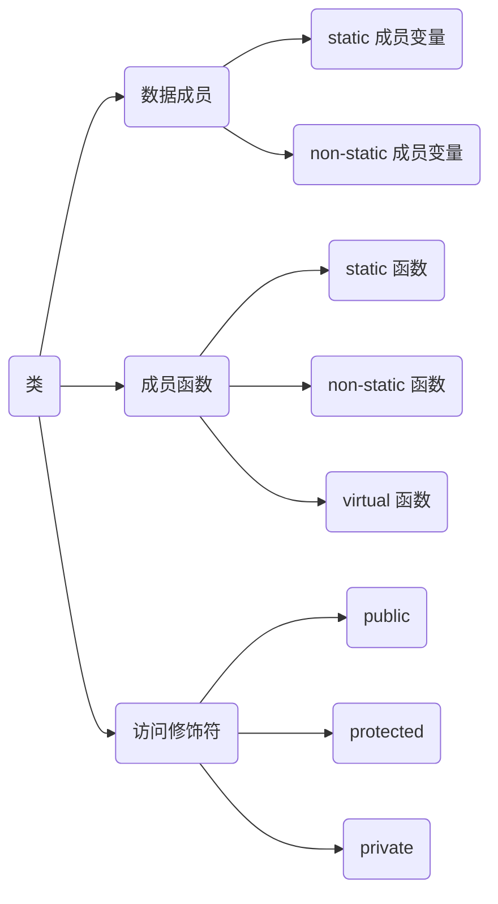
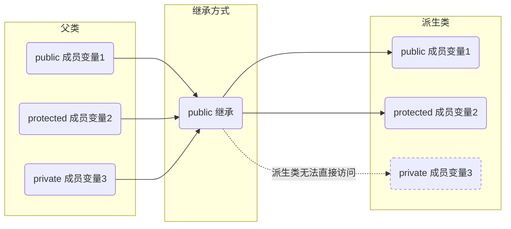
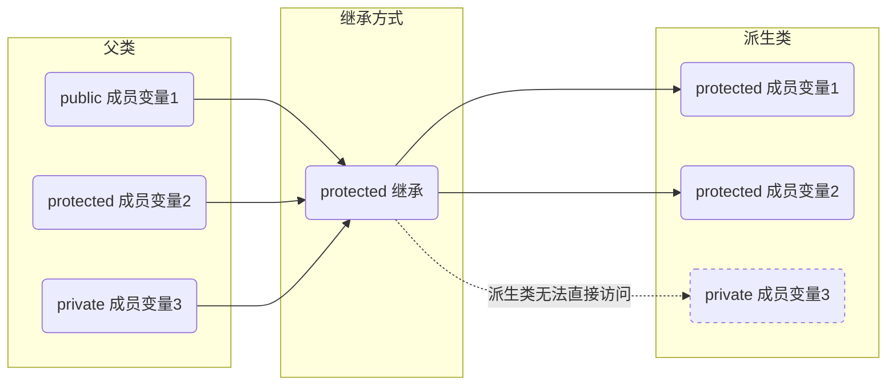
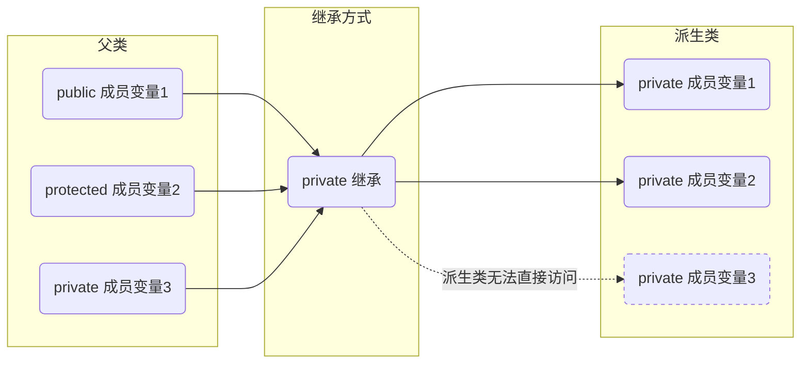
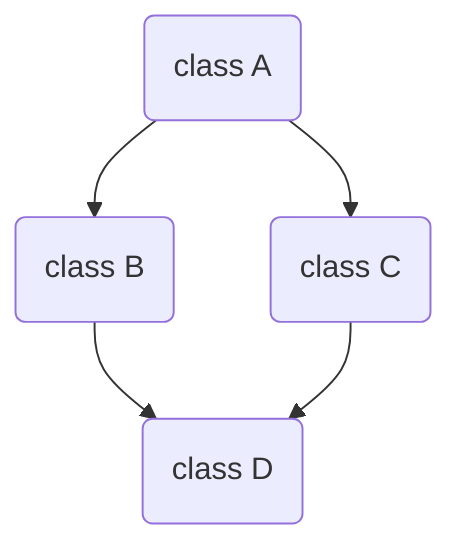
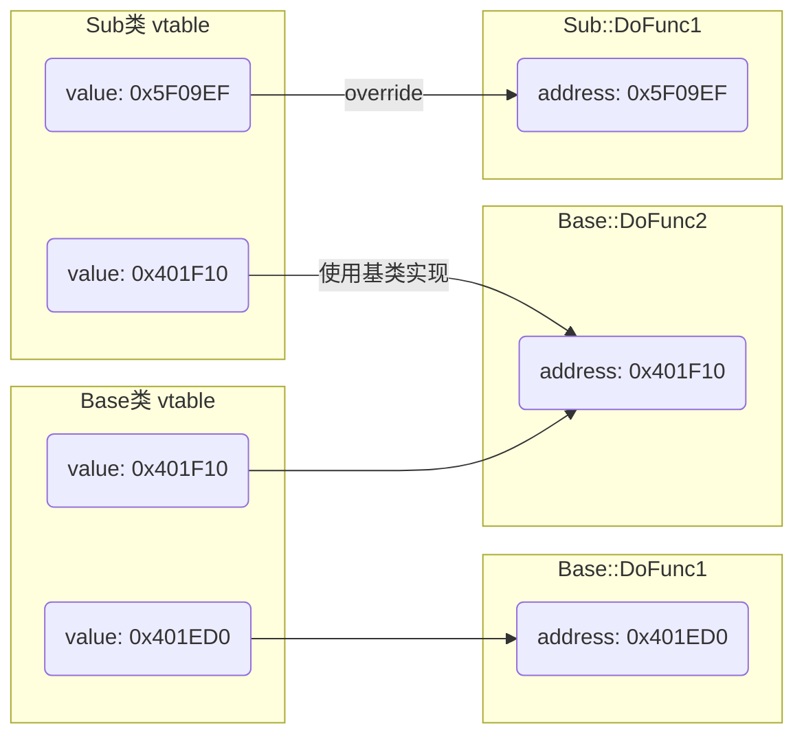
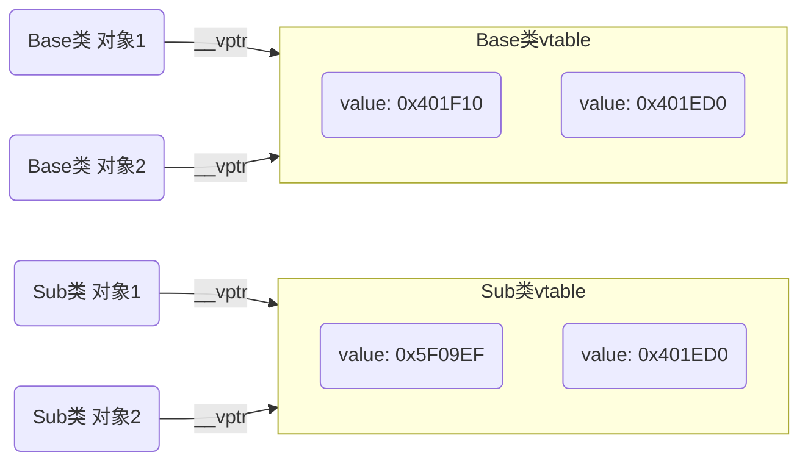

> [C++虚函数表剖析](https://leehao.me/C-%E8%99%9A%E5%87%BD%E6%95%B0%E8%A1%A8%E5%89%96%E6%9E%90/)

## encapsulation(封装)

封装是指将数据和操作数据函数分装成独立但愿, 称之为类(`class`), 并隐藏对象内部实现细节, 只对外暴露必要接口

封装通过访问控制机制通(如`public`、`protected`、`private`)来限制外部对类成员访问, 保护对象完整性

封装有效提高代码安全性和可维护性, 使得类内部状态只能被类本身方法(成员函数)修改

### class(类)

C++类(class)作为工具实现封装

类包含数据成员(也称为属性或字段)和成员函数(也称为方法或行为), 数据成员存储对象状态, 成员函数定义对象可执行操作



```c++
class Base {
public:
    void PrintSelfValue();
    static sCount;
protected:
    double mValue;
private:
    int mSelfValue;
};
```

#### object(对象)

`object`是根据`class`定义所创建具体实体, 具有自己状态(由类数据成员存储)和行为(由类成员函数定义)

每个`object`都是`class`类型变量, 可访问`class`所有公共成员, 包括数据成员和成员函数

创建时会调用构造函数来初始化`object`状态, 生命周期结束时, 会调用析构函数来执行清理操作

```c++
class Base;
Base b = Base;
```

#### 访问修饰符

通过`private`、`protected`和`public`关键字, 类可以控制其成员(包括数据成员和成员函数)访问级别, 允许类隐藏其内部实现细节, 只暴露必要接口给外部使用

```c++
class Base {
public:
    int mPublicValue;
protected:
    int mProtectedValue;
private:
    int mPrivateValue;
};
```

##### public

任何代码都可以访问该成员

##### protected

只有派生类(子类)和类本身可以访问该成员

##### private

只有类本身可以访问该成员, 派生类和其他外部代码都无法直接访问

#### 数据成员(属性)

数据成员(成员变量)是类中变量, 用于存储对象状态或数据, 可以是基本数据类型、枚举类型、指针类型、其他类对象等

可用访问修饰符来控制成员访问级别, 数据成员通常被声明为`private`或`protected`, 以防外部直接访问

##### 存储方式分类

(1) 静态数据成员

属于类本身, 在所有对象之间共享, 存放在全局区

不能再构造函数中被定义和初始化, 需在类外部单独定义及初始化

可通过类名直接访问, 也可通过对象访问, 使用受到访问控制属性约束

- 示例, 静态数据成员使用

```c++
#include <iostream>

class Base {
public:
    static int sValue;
};

// 单独初始化
int Base::sValue = 1;

int main() {
    std::cout << Base::sValue << std::endl;

    Base obj;
    obj.sValue++;
    std::cout << obj.sValue << std::endl;

    Base *p = new Base;
    std::cout << p->sValue << std::endl;
    return 0;
}
```


(2) 非静态数据成员

属于类每个对象, 每个对象都有自己独立副本

- 示例, 非静态数据成员使用

```c++
#include <iostream>

class Base {
public:
    int mValue;
};

int main() {
    Base p1;
    Base p2;
    p1.mValue = 0x1;
    p2.mValue = 0x2;
    std::cout << "p1 mValue = " << p1.mValue << std::endl;
    std::cout << "p2 mValue = " << p2.mValue << std::endl;
    return 0;
}
```


##### 访问权限分类

(1) 公有数据成员

可以在类外部直接访问

实际编程中, 通常不建议将数据成员设为公有, 因为违反封装原则

(2) 保护数据成员

只能在类内部和派生类中访问

- 示例, 访问保护数据成员

```c++
#include <iostream>

class Base {
protected:
    int mBaseValue;
};

class Derived : public Base {
public:
    void ShowValue() {
        // 派生类可以访问保护数据成员
        std::cout << mBaseValue << std::endl;
    }
};

int main() {
    Derived obj;
    obj.ShowValue();
    std::cout << obj.mBaseValue << std::endl;
    return 0;
}
```


(3) 私有数据成员

只能在类内部访问

```c++
#include <iostream>

class Circle {
private:
    double mRadius;

public:
    double GetArea() {
        // 类内部可以访问私有数据成员
        return 3.14159 * mRadius * radius;
    }
};
```

#### constructor/destructor(构造函数/析构函数)

##### 构造函数

在创建对象时自动调用, 用于初始化对象状态

###### 默认构造函数

默认构造函数是C++类中一种特殊构造函数, 不接受任何参数, 或者所有参数都有默认值

当创建类对象而没有提供初始化参数时, 默认构造函数会被调用

(1) 编译器自动生成

没有显式定义构造函数时, 编译器会自动生成一个默认构造函数

- 示例

```c++
class Base {
private:
    int value;
public:
    // 编译器自动生成默认构造函数
};

int main() {
    // 调用编译器所生成默认构造函数
    Base obj;
    return 0;
}
```

(2) 显式定义

- 示例

```c++
class Base {
private:
    int mValue;
public:
    // 用户定义默认构造函数
    Base() {
        mValue = 0xFF;
    }
};

int main() {
    // 调用用户定义默认构造函数
    Base obj;
    return 0;
}
```

###### 调用规则

(1) 自动调用, 当创建类对象而没有提供初始化参数时, 默认构造函数会被自动调用

(2) 隐式转换, 在某些情况下, 如果类只有一个默认构造函数, 可通过隐式转换将其他类型转换为该class类型对象, 但这种隐式转换可能会导致意外的行为, 建议避免使用

(3) 继承中调用, 在继承关系中, 如果基类有默认构造函数, 那么派生类在构造时会自动调用基类默认构造函数(除非派生类构造函数显式地调用了基类其他构造函数）

##### 析构函数

在对象销毁时自动调用, 用于执行清理操作, 如释放动态分配内存

析构函数不接受任何参数, 也不能被显式调用

- 示例, 构造析构函数使用

```c++
#include <iostream>

class Base {
public:
    Base() {
        std::cout << "constructor called" << std::endl;
    }

    ~Base() {
        std::cout << "destructor called" << std::endl;
    }
};

int main() {
    // 创建对象时调用构造函数
    Base obj;
    // 对象超出作用域时自动调用析构函数
    return 0;
}
```


##### copy constructor(拷贝构造函数)

拷贝构造函数通过另一个同类型对象来初始化新对象, 用于深拷贝或浅拷贝对象

- 示例, 拷贝构造函数使用

```c++
#include <iostream>

class Base {
public:
    Base() {
        std::cout << "constructor called" << std::endl;
    }

    ~Base() {
        std::cout << "destructor called" << std::endl;
    }
   
    // 拷贝构造函数
    Base(const Base& other) {
        std::cout << "copy constructor called" << std::endl;
    }
};

int main() {
    Base obj1;
    Base obj2 = obj1;
    return 0;
}
```


#### 成员函数(方法)

成员函数也可以被声明为private、protected或public, 以控制访问级别, 通常提供public成员函数作为接口, 允许外部代码与对象进行交互

##### static member function(静态成员函数)

静态成员函数属于类本身, 而不是类实例

不能访问非静态成员变量(除非通过对象), 可通过类名直接访问, 也可通过对象访问

静态成员函数没有this指针,因此也没有const属性, 和普通成员函数一样受访问控制限定符约束

##### non-static member function(普通成员函数)

普通成员函数是类实例(对象)成员, 可以访问类私有和保护成员, 必须通过对象来调用

- 示例, 普通成员函数调用

```c++
#include <iostream>

class Base {
public:
    void Display() {
        std::cout << "this is a regular member function." << std::endl;
    }
};

int main() {
    Base obj;
    obj.Display();
    return 0;
}
```

#### this

this是关键字, 是const类型指针, 指向当前对象, 只能用在类内部, 出现在类非静态成员函数

this可以访问类所有private、protected、public 属性成员

##### 赋值

对象被创建后编译器自动给 this 赋值, 用户不能显式赋值

- 示例, this指针使用

```c++
#include <iostream>

class Person {
public:
    Person(std::string name) {
        this->mName = name;
    }

    void PrintThis() {
        std::cout << "this pointer = " << std::hex << this << std::endl;
    }
private:
    std::string mName;
};

int main(void) {
    Person p{"Casper"};
    p.PrintThis();
    std::cout << "p address = " << std::hex << &p << std::endl;
    return 0;
}
```


## inheritance(继承)

继承是面向对象编程中用以实现代码复用机制, 允许一个新类(子类或派生类)继承一个或多个类(父类或基类)属性和方法

子类可以继承父类的公有(public)和保护(protected)成员, 不能继承私有(private)成员

继承支持层次结构分类, 使得代码更加模块化, 并且易于扩展和维护


### 继承类型

#### public 继承

派生类成员访问权限与基类相同

派生类中成员可以访问基类中`public`和`protected`成员(不能直接访问private成员)

基类`public`成员在派生类中仍然是 `public`

基类`protected`成员在派生类中仍然是 `protected`



- 示例, public继承使用

```c++
#include <iostream>

class Base {
public:
    int mPublicMember;
protected:
    int mProtectedMember;
private:
    int mPrivateMember;
};

class Derived : public Base {
public:
    void AccessMembers() {
        mPublicMember = 10;
        mProtectedMember = 20;
        // 错误：不能访问
        mPrivateMember = 30;
    }
};
```


#### protected 继承

基类public成员在派生类中变为protected

派生类中成员可以访问基类中public、protected和private成员(不能直接访问private成员)

派生类对象不能访问从基类所继承任何成员(因为它们都被视为protected或private)



- 示例, protected继承使用

```c++
#include <iostream>

class Base {
public:
    int mPublicMember;
protected:
    int mProtectedMember;
private:
    int mPrivateMember;
};

class Derived : protected Base {
public:
    void AccessMembers() {
        // 可以访问, 但在派生类中变为protected
        mPublicMember = 10;
        // 可以访问
        mProtectedMember = 20;
        // 错误, 不能直接访问, 但可以通过基类方法
        mPrivateMember = 30;  
    }
};

int main() {
    Derived obj;
    // 错误：不能从Derived类对象访问
    obj.mPublicMember = 5;
    return 0; 
}
```


#### private 继承

基类的public和protected成员在派生类中都变为private

派生类中成员可以访问基类中public、protected和private成员(通过基类的方法, 不能直接访问private成员)

派生类对象不能访问从基类所继承任何成员



- 示例, private 继承

```c++
class Base {
public:
    int mPublicMember;
protected:
    int mProtectedMember;
private:
    int mPrivateMember;
};

class Derived : private Base {
public:
    void accessMembers() {
        // 可以访问, 但在派生类中变为private
        mPublicMember = 10;
        // 可以访问, 但在派生类中视为private
        mProtectedMember = 20;
        // 错误：不能直接访问, 但可以通过基类方法(如果有的话)
        mPrivateMember = 30;  
    }
};

int main() {
    Derived obj;
    // 错误：不能从Derived类的对象访问
    obj.mPublicMember = 5;
    return 0;
}
```

### 函数

#### 构造函数和析构函数

派生类构造函数会隐式调用基类构造函数

如果基类没有默认构造函数, 派生类必须显式调用基类构造函数

派生类析构函数会自动调用基类析构函数(析构顺序与构造顺序相反)

- 示例, 基类有默认构造函数

```c++
#include <iostream>

class Base {
public:
    Base() {
        std::cout << "Base constructor called" << std::endl;
    }

    ~Base() {
        std::cout << "Base destructor called" << std::endl;
    }

};

class Sub: public Base {
public:
    // 派生类构造函数, 显式调用基类构造函数
    Sub(): Base() {
        std::cout << "Sub constructor called" << std::endl;
    }

    ~Sub() {
        std::cout << "Sub destructor called" << std::endl;
    }
};

int main() {
    Sub obj;
    return 0;
}
```


#### overriding(函数重写/覆盖)

overriding指派生类重新定义与基类虚函数具有相同函数签名(包括返回类型和参数列表)成员函数行为

通过基类指针或引用调用时, 动态绑定机制会调用派生类中版本

- 示例, 函数覆盖情况

Derived类覆盖了Base类中DoShow函数

```c++
#include <iostream>

class Base {
public:
    virtual void DoShow() {
        std::cout << "Base class show function" << std::endl;
    }
};

class Derived : public Base {
public:
    void DoShow() override {
        // Derived class show function
        std::cout << "Derived class show function" << std::endl;
    }
};

int main() {
    Base* p = new Derived();
    p->DoShow();
    delete p;
    return 0;
}
```


#### hiding(函数隐藏)

隐藏发生在派生类定义与基类同名非虚函数时

隐藏函数不会受到虚函数动态绑定机制影响, 无论对象是通过基类指针还是派生类指针调用, 始终是调用对应类中函数

- 示例, 函数隐藏情况

```c++
#include <iostream>

class Base {
public:
    void Show() {
        std::cout << "Base class show function" << std::endl;
    }
};

class Derived : public Base {
public:
    void Show() {
        std::cout << "Derived class show function (hidden)" << std::endl;
    }
};

int main() {
    Base *basePtr = new Derived();
    basePtr->Show();
    delete basePtr;

    Derived *derivedPtr = new Derived();
    derivedPtr->Show();
    delete derivedPtr;
    return 0;
}
```


### 虚继承

#### 多重继承

多重继承是指一个类可以从多个直接基类派生出来, 派生类可以继承多个基类属性和方法

#### diamond problem(菱形继承)

菱形继承(也称为钻石继承)是多重继承中的一种特殊情况

在这种结构中, 一个基类被两个派生类继承, 而这两个派生类又被另一个类继承, 这形成一个菱形(或钻石)形状继承结构

菱形继承可能导致基类数据成员在派生类中有多份副本, 引起二义性问题和数据冗余

- 示例, 菱形继承情况

D类通过B和C继承了A类

D类对象中会包含两个A类的例(即两份mData成员), 造成数据冗余

当尝试访问D类对象mData成员时, 编译器无法确定应该使用哪个A类的实例, 从而导致二义性错误



```c++
class A {
public:
    int mData;
};

class B : public A {};
class C : public A {};

class D : public B, public C {};
```

#### 虚继承

虚继承通过引入虚表(vtable)和虚指针(vptr)来解决菱形继承问题

虚表是用于存放虚基类成员地址, 虚指针则是指向虚表

当使用虚继承时, 编译器会给虚派生类分配一个虚指针, 并通过这个虚指针来访问虚基类成员

无论派生类通过哪个基类来访问虚基类的成员, 都会通过虚指针查表得到同一份成员, 避免数据冗余和二义性问题

- 示例, 虚继承使用

```c++
#include <iostream>

// 祖父类(虚基类)
class A {
private:
    int mA;
public:
    A(int a = 0) {
        std::cout << "A()" << std::endl;
        this->mA = a;
    }

    ~A() {
        std::cout << "~A()" << std::endl;
    }

    void Show() {
        std::cout << "a = " << mA << std::endl;
    }
};

// 基类B, 虚继承
class B : virtual public A {
private:
    int mB;
public:
    B(int a = 0, int b = 0) : A(a) {
        std::cout << "B()" << std::endl;
        this->mB = b;
    }
    ~B() {
        std::cout << "~B()" << std::endl;
    }
    void Show() {
        std::cout << "b = " << mB << std::endl;
    }
};

// 基类C, 虚继承
class C : virtual public A {
private:
    int mC;
public:
    C(int a = 0, int c = 0) : A(a) {
        std::cout << "C()" << std::endl;
        this->mC = c;
    }
    ~C() {
        std::cout << "~C()" << std::endl;
    }
    void Show() {
        std::cout << "c = " << mC << std::endl;
    }
};

// 派生类, 普通多继承
class D : public B, public C {
private:
    int mData;
public:
    D(int a = 0, int b = 0, int c = 0, int data = 0) : A(a), B(a, b), C(a, c) {
        std::cout << "D()" << std::endl;
        this->mData = data;
    }
    ~D() {
        std::cout << "~D()" << std::endl;
    }
    void Show() {
        std::cout << "data = " << mData << std::endl;
    }
};

int main() {
    D d(1, 2, 3, 4);
    d.Show();
    return 0;
}
```


## polymorphism(多态)

多态是指同一操作作用于不同对象时, 可以产生不同执行结果

多态分为编译时多态(如函数重载和运算符重载)和运行时多态(如虚函数和动态绑定)

### 虚函数

虚函数在基类中使用`virtual`修饰, 子类可使用基类实现也可重写(override)基类虚函数

当通过基类指针或引用调用虚函数时, 会根据对象实际类型来调用相应派生类中函数版本, 称为动态绑定(dynamic binding)

- 示例, 虚函数调用

```c++
#include <iostream>

class Base {
public:
    Base() {
        std::cout << "Base constructor called" << std::endl;
    }

    virtual void DoShow() {
        std::cout << "Show Base" << std::endl;
    }

    // 虚析构函数(确保派生类对象能够正确销毁)
    virtual ~Base() {
        std::cout << "Base destructor called" << std::endl;
    }
};

class SubA : public Base {
public:
    SubA() {
        std::cout << "SubA constructor called" << std::endl;
    }

    ~SubA() {
        std::cout << "SubA destructor called" << std::endl;
    }

    // 重写虚函数重写
    void DoShow() override {
        std::cout << "Show SubA" << std::endl;
    }
}

class SubB : public Base {
public:
    SubB() {
        std::cout << "SubB constructor called" << std::endl;
    }

    ~SubB() {
        std::cout << "SubB destructor called" << std::endl;
    }
    // 派生类中使用基类实现
};

int main() {
    Base *p1 = new SubA;
    p1->DoShow();
    delete p1;
  
    Base *p2 = new SubB;
    p2->DoShow();
    delete p1;
}
```


#### 纯虚函数

若虚函数在基类中没有实现, 则称为纯虚函数, 纯虚函数强制派生类必须实现该函数

含至少一个纯虚函数的类被称为抽象类, 抽象类不能被实例化, 通常用作接口或基类, 供其他类继承并实现纯虚函数

```c++
class AbstractShape {
public:
    // 纯虚函数
    virtual void draw() const = 0;

    // 虚析构函数
    virtual ~AbstractShape() {}
};
```

### 虚函数表(vtable)

虚函数表(virtual function table)是一个指针数组, 按声明顺序存储类中虚函数入口地址(虚函数指针)

每个含虚函数类(包括基类与派生类)都会在编译阶段由编译器生成虚函数表

若派生类重写虚函数, 表中对应地址将指向派生类的实现, 如果派生类没有`override`基类虚函数, 则地址将指向基类中虚函数实现

- 示例, 虚函数表内容

```c++
class Base {
public:
    virtual void DoFunc1() {
        std::cout << "Base DoFunc1" << std::endl;
    }

    virtual void DoFunc2() {
        std::cout << "Base DoFunc2" << std::endl;
    }
}

class Sub {
public:
    // Sub类只重写基类虚函数DoFunc1, DoFunc2使用基类实现
    void DoFunc1() override {
        std::cout << "Sub DoFunc1" << std::endl;
    }
}
```



#### 虚表指针(vptr)

每个含虚函数类示例化对象时, 编译器会在对象中隐式添加一个指向`vtable`指针`vptr`, 确保运行时能找到对应`vtable`

- 示例, vptr与vtable关系



#### 调用

通过基类指针或引用调用虚函数时, C++会在运行时根据指针或引用所指向实际对象类型来决定调用何版本虚函数

(1) 编译器根据基类指针或引用在内存中查找到该对象虚函数指针(vptr)

(2) 通过虚函数指针(vptr)找到该对象实际类型对应虚函数表(vtable)

(3) 从虚函数表中查找到与虚函数对应函数指针

(4) 最后调用函数指针指向的虚函数实现

- 示例, 虚函数调用过程

```c++
#include <iostream>

class Base {
public:
    virtual void DoShow() {
        std::cout << "Base DoShow function" << std::endl;
    }
};

class Sub : public Base {
public:
    void DoShow() override {
        std::cout << "Sub DoShow function" << std::endl;
    }
};

int main() {
    Base* p = new Sub();
    p->DoShow();
    delete p;
    return 0;
}
```


#### virtual destructor(虚析构函数)

当通过基类指针删除派生类对象时, 如果基类析构函数不是虚函数, 则只会调用基类析构函数, 而不会调用派生类析构函数

可能导致派生类特有的资源(如动态分配的内存、文件句柄等)无法被正确释放, 从而造成内存泄漏或其他资源泄漏

- 示例, 基类析构函数非虚函数

```c++
#include <iostream>

class Base {
public:
    Base() {
        std::cout << "Base constructor called" << std::endl;
    }

    ~Base() {
        std::cout << "Base destructor called" << std::endl;
    }
};

class Sub : public Base {
public:
    Sub() {
        std::cout << "Sub constructor called" << std::endl;
    }

    ~Sub() {
        std::cout << "Sub constructor called" << std::endl;
    }
};

int main() {
    Base* p = new Sub();
    delete p;
    return 0;
}
```


通过将基类的析构函数声明为虚函数, 可以确保当通过基类指针删除对象时, 会首先调用派生类析构函数(如果存在), 然后再调用基类的析构函数, 从而实现资源的正确释放

- 示例, 基类析构函数为虚函数

```c++
#include <iostream>

class Base {
public:
    Base() {
        std::cout << "Base constructor called" << std::endl;
    }

    virtual ~Base() {
        std::cout << "Base destructor called" << std::endl;
    }
};

class Sub : public Base {
public:
    Sub() {
        std::cout << "Sub constructor called" << std::endl;
    }

    ~Sub() {
        std::cout << "Sub constructor called" << std::endl;
    }
};

int main() {
    Base* p = new Sub();
    delete p;
    return 0;
}
```


### 重载运算符

运算符重载允许定义运算符行为

通过重载, 类对象可以像基本数据类型一样使用运算符

```c++
#include<iostream>

class Complex {
   public:
        Complex() = default;

        Complex(double read, double imag) : mReal(read), mImag(imag) {}

        friend istream & operator >> (istream &, Complex &) {
            std:: >> c.mReal >> c.mImag;
        }
        
        friend ostream & operator << (ostream &, Complex &) {
            std:: << c.mReal << " + " << c.mImag << "i" <<std::endl;
        }

        Complex operator + (Complex &) {
            return Complex(this->mReal + c.mReal, this->mImag + c.mImag);
        }

        Complex operator - (Complex &) {
            return Complex(this->mReal - c.mReal, this->mImag - c.mImag);
        }
    private:
        double mReal;
        double mImag;
};

int main() {
    Complex c1(1.0, 2.0);
    Complex c2(3.0, 4.0);
    Complex c3 = c1 + c2;
    return 0;
}
```