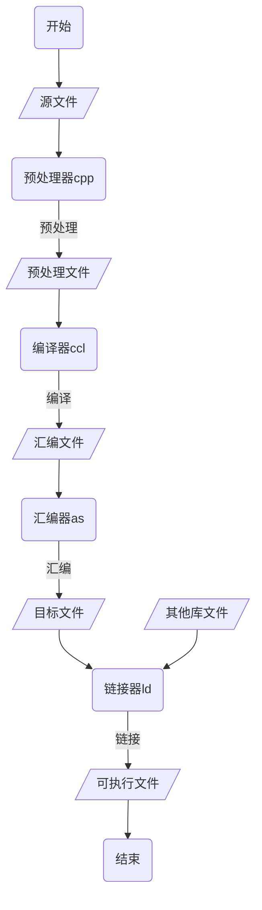
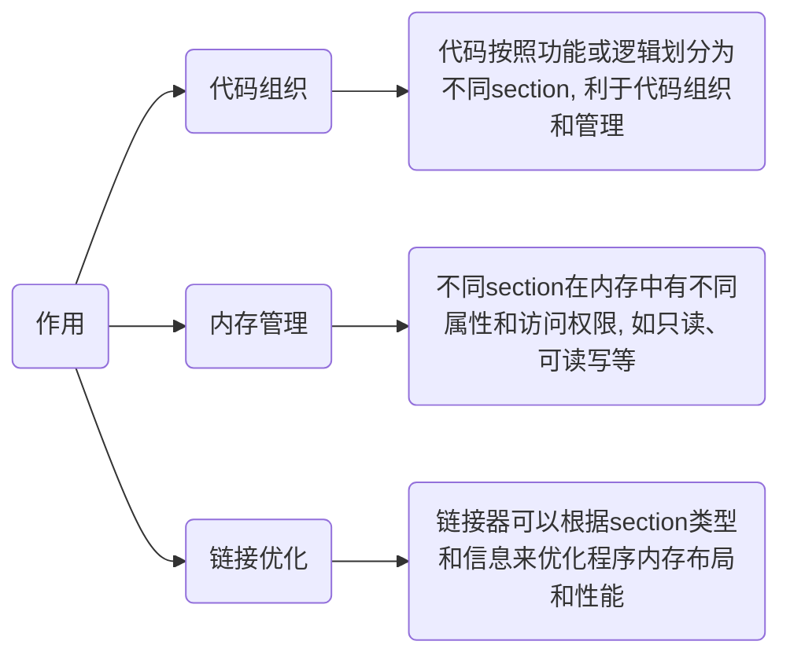
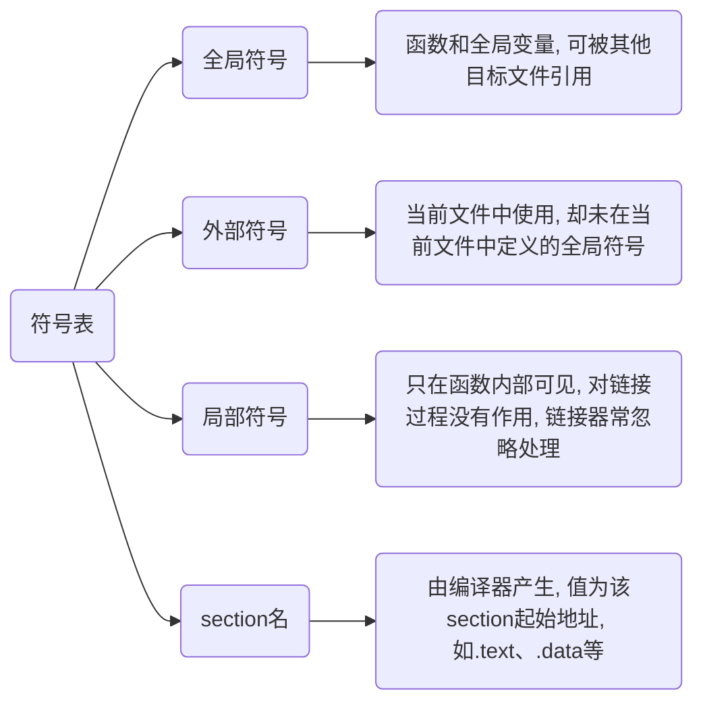
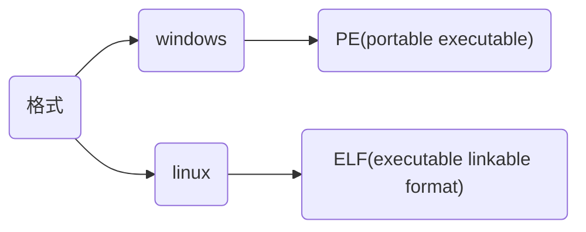
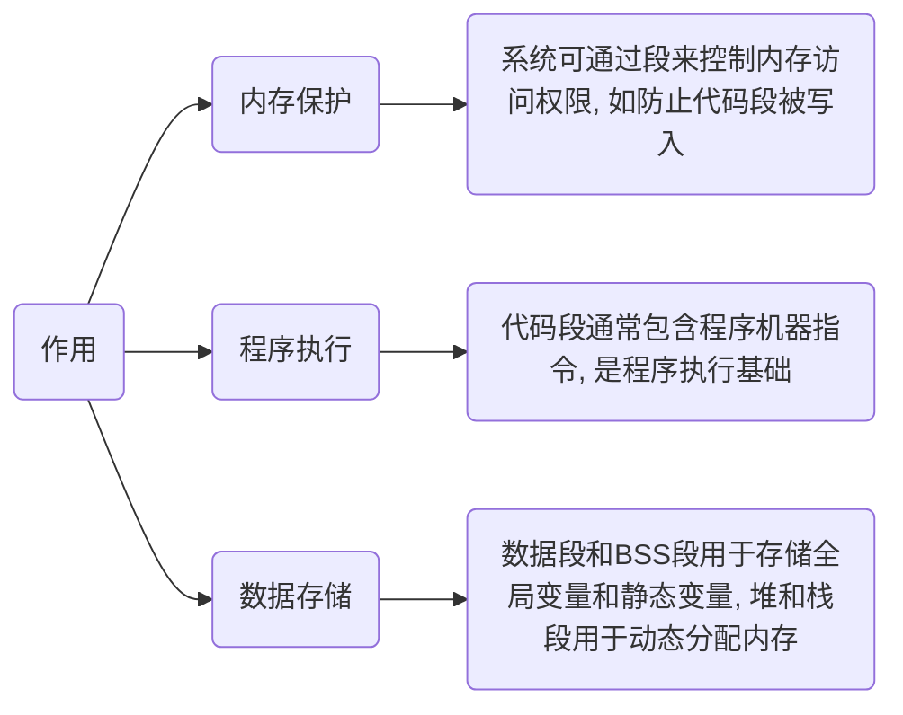

> [强符号和弱符号](https://www.cnblogs.com/zjuhaohaoxuexi/p/16221088.html)



```c
// main.c
#include <stdio.h>

int main() {
    printf("Hello World\n");
    return 0;
}
```

## 预处理(preprocess)

预处理器`cpp`按规则处理源文件, 生成`.i`预处理文件, 预处理过程不会检查源代码语法或语义正确性


- 预处理指令, 只执行到预处理

```sh
gcc main.c -E -o main.i
```

### 处理规则

#### 宏替换

预处理器在编译前将源代码中宏替换为对应值或代码片段

#### 条件编译

预处理器会根据条件编译指令(如#if, #ifdef, #ifndef, #else, #elif, #endif等)来决定是否包含或排除某些代码段

#### 文件包含

使用#include指令将其他文件内容插入到当前文件中

- #include ""

在包含当前include指令文件所在目录内搜索

- #include <>

在编译器所设置include路径内搜索

## 编译(compilation)

编译器`ccl`将预处理文件进行词法分析、语法分析、语义分析及优化后生成汇编文件


- 编译指令, 生成汇编文件

```sh
gcc main.i -S -o main.s
```

### 词法分析

编译器从左到右逐字符扫描预处理后源代码, 词法分析器根据词法规则提取符合规则字符序列

#### 词法分析器(lexical analyzer)

编译器或解释器中组成部分, 通常使用正则表达式、状态机、有限自动机(如DFA或NFA)或手动编写解析逻辑来实现, 以高效地识别和处理源代码中字符序列

任务是将输入源代码字符串转换成有意义记号(tokens), 通常包括关键字、标识符、常量、运算符和分隔符等

- 示例, 词法分析过程

```c
int main() {
    int a = 10;
    return 0;
}
```

(1) 读取"int"

识别"int"是关键字, 生成类型为"关键字"标记, 值为"int"

(2) 读取"main"

识别"main"是标识符(因为它不是关键字), 生成类型为"标识符"标记, 值为"main"

(3) 读取"("和")"

识别"("和")"是分隔符, 生成类型为"分隔符"标记, 值分别为"("和")"

(4) 读取"{"

识别"{"是分隔符, 生成类型为"分隔符"标记, 值为"{"

(5) 读取"int a = 10;"

识别并生成, 关键字"int"、标识符"a"、运算符"="、字面量"10"(类型为"整数常量")、分隔符";"

(5) 读取"return 0;"

识别并生成, 关键字"return"、字面量"0"(类型为"整数常量")、分隔符";"

(7) 读取"}"

识别"}"是分隔符, 生成类型为"分隔符"标记, 值为"}"

词法分析结果

|类型       |值    |
|----------|------|
|关键字     |int   |
|标识符     |main  |
|分隔符     |(     |
|分隔符     |)     |
|分隔符     |{     |
|关键字     |int   |
|标识符     |a     |
|运算符     |=     |
|整数常量   |10    |
|分隔符     |;     |
|关键字     |return|
|整数常量   |0     |
|分隔符     |;     |
|分隔符     |}     |

- 示例, 使用clang实现词法分析

```c
// main.c
int main() {
    int a = 10;
    return 0;
}
```

`-fsyntax-only`, 指示clang仅执行语法和词法分析, `-Xclang -dump-tokens`让clang在词法分析阶段输出记号信息

输出源文件中每个记号详细信息, 包括记号类型、位置和值

```sh
clang -fsyntax-only -Xclang -dump-tokens main.c
```


### 语法分析

编译器根据语法规则, 将标记序列组合成各类语法短语, 如表达式、语句、函数等, 并构建抽象语法树(AST)

#### 定义文法规则

编译器定义源语言文法规则, 通常使用上下文无关文法(CFG)来表示源语言语法结构

#### 构建语法分析器

编译器根据语法分析算法(如递归下降分析、LL(1)分析、LR(1)分析等)文法规则, 构建语法分析器

语法分析器负责将词法单元流转换为语法树或AST

#### 分析词法单元流

语法分析器从词法分析器接收词法单元流, 并根据文法规则进行推导

推导过程中, 语法分析器会检查词法单元组合是否符合语法规则

#### 构建语法树或AST

如果词法单元流组合符合语法规则, 语法分析器会构建出相应语法树或AST

树形结构反映源代码语法结构, 便于后续语义分析和代码生成阶段使用

#### 处理语法错误

如果在推导过程中发现词法单元流组合不符合语法规则, 语法分析器会生成语法错误信息, 并指示出错位置

- 示例, 语法分析过程

```c
int add(int a, int b) {
    return a + b;
}
```

词法分析器将源代码分解为标记, 如`int`、`add`、`(`、`)`、`{`、`return`、`+`等

语法分析器根据C++文法规则, 检查标记组合是否合法, 例如检查int add(int a, int b)是否符合函数定义的语法规则

如果符合, 语法分析器会构建出相应语法树或AST

如果不符合语法规则,如缺少分号、括号不匹配等, 语法分析器会生成语法错误信息并指示出错位置

### 语义分析

语义分析主要任务是编译器对抽象语法树进行包括类型检查、函数声明与定义匹配、变量作用域等语义检查, 确保代码符合C/C++语义规则

#### 检查处理

- 类型检查

确保表达式操作数类型与操作符兼容, 验证函数调用参数类型与函数声明中参数类型匹配

- 作用域解析

确定每个标识符(如变量、函数名)在其作用域内正确引用

- 变量声明和使用一致性

管理变量生命周期和可见性

- 表达式正确性

对表达式进行更深入分析, 以确保计算结果是有效

- 控制流语句正确性

检查如if、while、for循环和异常处理等控制流语句正确性

#### 记录标识符信息

记录程序中所有标识符信息, 如类型、位置、作用域等, 在编译期间提供快速查找和访问这些信息机制

#### 实施特定语义规则

实现如继承、多态、模板实例化等语言特定语义规则(针对面向对象或泛型编程语言)

#### 错误报告与恢复

当发现语义错误时, 提供清晰错误信息和位置, 尽可能地恢复并继续分析, 以找出其他潜在错误

#### 优化

在某些情况下, 语义分析阶段可能会进行初步优化工作, 如常量折叠(在编译时计算常量表达式值)和死代码消除(删除永远不会被执行代码段)等

语义分析通常通过遍历抽象语法树(AST)来实现, 因为AST已经捕获了源代码结构信息

分析器会逐个节点地检查AST, 执行必要类型推断和验证操作

## 汇编(assemble)

汇编器`as`将汇编文件转换为机器语言, 生成目标文件

- 汇编指令, 生成目标文件

```sh
gcc main.s -c -o main.o
```

### 目标文件

目标文件(object file)是二进制文件, 能被CPU直接识别, 由源文件经过编译器预处理、编译、汇编过程生成

目标文件与可执行文件在结构与组织形式上非常类似, 只是目标文件部分变量和函数地址未确定, 导致不能执行

#### 结构

- 文件头(file header)

描述整个目标文件属性, 包含文件类型、目标架构(如x86、x64)、入口点地址(对于可执行文件是程序开始执行处)以及其他元数据

- section

`section`是目标文件中一个逻辑分区, 由编译器生成, 存储如代码、数据或调试信息等特定类型信息, 用于链接阶段将不同目标文件中相同类型信息合并



在unix-like系统使用`objdump`或Windows上`dumpbin`查看目标文件中节信息

目标文件被划分为多个`section`,

| 名称       | 说明                                                 |
|-----------| -----------------------------------------------------|
| .text     | 存放编译后二进制代码                                   |
| .data     | 存放已初始化全局变量和静态变量                          |
| .bss      | 为未初始化全局变量和静态变量预留空间                    |
| .rodata   | 包含只读数据, 如常量字符串和常量值                      |
| .debug    | 包含调试信息(若编译时启用调试选项)                      |
| .rel.text | .text 重定位信息, 用于.text中地址重定位                |
| .rel.data | .data 重定位信息, 用于对被模块使用或定义全局变量重定位   |

- 符号表(symbol table)

包含目标文件中所有符号(如变量名、函数名等)名称、地址和类型信息, 并允许链接器解析不同目标文件之间的符号引用

- 重定位表(relocation table)

包含目标文件中待修正地址信息, 链接过程中链接器会根据符号表来更新重定位表中地址, 以确保程序在加载到内存时能正确访问变量和函数

- 字符串表(string table)

存储符号表中所使用字符串, 如符号名称

#### 分类

- 可执行文件(executable file)

包含可直接执行程序, 例如 linux下a.out, windows下.exe

- 可重定位文件(relocatable file)

包含代码和数据, 可被用来链接成可执行文件或者共享目标文件, 例如静态链接库

- 共享目标文件(shared object file)

包含代码和数据

链接器可将其跟其他可重定位文件链接, 产生新目标文件

也可将其与其他可执行文件结合作为进程一部分运行, 如动态链接库

- 核心转储文件(core dump file)

系统在进程意外终止时用与存储该进程地址空间内容以及其他信息, 如linux中core dump

## 链接(linking)

链接器`ld`对目标文件及库文件(静态库或动态库)解析符号引用, 将目标文件中符号与定义进行匹配合并成可执行文件(executable file)

- 链接指令, 生成可执行文件

```sh
gcc main.o -o main
```

链接器(Linking)通过`符号`处理各模块之间相互引用部分, 使各模块能够正确衔接, 最终组合成独立程序

### 过程

函数和变量在本质上都是地址助记符, 在链接过程中称为`符号`(symbol)

符号信息包括当前符号在字符串表中偏移、符号在section中偏移、符号所占用字节数、符号类型等

目标文件中符号表(symbol table), section名为`.symtab`, 记录文件中所用符号, 包括



#### 符号解析匹配

链接器首先读取所有目标文件和库文件, 收集符号信息, 查找各目标文件中每个引用符号在何目标文件、库文件中被定义

对于每个未解析符号引用, 链接器会在所有目标文件和库文件中进行搜索, 以找到对应符号定义

若找到匹配符号定义, 链接器会将该符号地址填充到引用该符号的目标文件中

#### 重定位

编译和汇编阶段, 目标文件中符号地址是相对于某个基地址偏移量

链接阶段, 符号解析和匹配完成后, 链接器会将目标文件中相对地址转换为可执行文件中绝对地址, 称为重定位

#### 合并section

目标文件通常包含多个section(如.text、.data、.debug等), 链接器需要将它们合并成一个可执行文件

合并section仅是简单叠加, 如合并有用段(例如`text section`、`data section`等), 删除如重定位section、`section table`, 增加如程序头表等其他section

合并过程中链接器会考虑section对齐要求、内存布局等因素, 以确保可执行文件正确性和性能

在完成符号解析匹配、重定位和合并section后, 最终生成可执行文件

可执行文件包含程序所有代码和数据, 以及必要元数据(如程序入口点、段信息等)

### 问题

#### 符号冲突

符号重复定义(Multiple Definition)错误是因为在多个源文件中定义同名全局变量, 并都进行初始化

- 示例, 重定义错误

file_1.c 中定义全局变量 gValue

```c
int gValue = 10;
```

file_2.c 中又对 gValue 进行定义

```c
int gValue = 20;
```

链接时就会出现错误

```sh
file_2.o: multiple definition of `gValue`
file_1.o: first defined here
```

### 类别

#### 静态链接

在程序运行之前确定符号地址为静态链接(static linking)

函数代码将从其所在静态链接库中被拷贝到最终可执行程序中, 该程序被执行时这些代码将被装入到该进程虚拟地址空间中

静态链接库实际上是一个目标文件集合, 其中每个文件含有库中一个或者一组相关函数代码

#### 动态链接

在程序运行期间再确定符号地址为动态链接(dynamic linking)

库文件所内符号地址是在程序运行期间确定, 所以称为动态链接库(dynamic linking library)

函数代码被放到动态链接库或共享对象某个目标文件中, 链接程序此时只是在最终可执行程序中记录下共享对象名字以及其它少量登记信息

可执行文件被执行时, 动态链接库全部内容将被映射到运行时相应进程虚地址空间, 根据可执行程序中记录信息找到相应函数代码执行

## 可执行文件

包含机器代码, 计算机可以直接执行以运行特定任务或程序



### 静态结构

可执行文件组织形式和目标文件非常类似

目标文件中`section table`用来描述各个`section`信息, 包括名字、长度、在文件中偏移、读写权限等, 通过其可以详细了解目标文件结构

可执行文件中`section table`被删除, 以程序头表(`program header table`)取代, 系统根据程序头表将可执行文件加载到内存, 并为各个`segment`分配内存空间、确定地址

| 名称                 | 说明                                                                               |
|---------------------| ---------------------------------------------------------------------------------- |
| ELF header          | 描述文件类型、目标架构、入口点地址、程序头表位置和大小、节头表位置和大小等ELF基本信息     |
| program header table| 描述各segment信息, 如类型、偏移、在进程虚拟地址空间中起始地址、物理装载地址、长度、权限等 |
| .text section       | 存放编译后二进制代码                                                                 |
| .data section       | 存放已初始化全局变量和静态变量                                                        |
| .bss section        | 存放未初始化全局变量和静态变量                                                       |
| .rodata             | 包含只读数据, 如常量字符串和常量值                                                   |
| .debug              | 包含调试信息(若编译时启用调试选项)                                                   |

#### .bss(block started by symbol)

存放程序中未初始化全局变量和静态变量

编译时分配空间, 在程序启动前由操作系统初始化为0(或NULL)

该部分在程序运行时才需要被初始化因此不占用磁盘空间

#### segment(段)

`segment`是内存中一个连续物理分区, 系统在程序加载时创建, 用于存储特定类型数据或代码, 由多个权限相同 section 构成



在unix-like系统使用`ps`命令或windows上使用任务管理器查看进程内存段信息

- 与section关系

(1) `section`是目标文件中逻辑分区, `segment`是内存中物理分区, 程序加载时操作系统在二者间建立映射

(2) `section`和`segment`都有各自属性和访问权限, 如.text节(代码段)通常只读, 以防止代码被意外修改

(3) 链接器链接各目标文件时, 会根据`section`类型和信息来合并和优化程序内存布局, 系统加载程序时根据这些信息来创建`segment`, 并将`section`映射到`segment`中


### 内存中结构

可执行文件在加载时实际上是被映射虚拟地址空间, 内存中结构如下

| 名称        | 说明                                        |
|-------------| ------------------------------------------ |
| .text       | 存放编译后二进制代码                         |
| .data       | 存放已初始化全局变量和静态变量                |
| .bss        | 存放未初始化全局变量和静态变量                |
| stack       | 用于存储函数调用局部变量、返回地址和参数等信息 |
| heap        | 用于动态分配内存                            |


#### .text(code segment)

存放程序执行时机器指令(二进制代码), 只读以防止意外修改

#### .data(data segment)

包含程序中被明确初始化全局变量、全局静态变量和局部静态变量、常量(如字符串常量)

在程序编译时就已经分配好空间, 并在程序启动前由操作系统初始化

#### stack

存放函数局部变量、函数参数、返回地址等

每当调用新函数时都会在栈上创建新栈帧(stack grame), 函数返回时栈帧被自动销毁

栈内存是连续内存区域, 其生长方向是向内存地址减小方向(即向下生长), 由编译器自动分配和释放

栈内存大小有限, 若申请栈内存超过剩余空间, 将会导致溢出错误

#### heap

程序运行时动态内存分配

可通过malloc、calloc、realloc等或new、new[]运算符来申请堆内存, 并通过free或delete、delete[]来释放

堆内存是不连续内存区域, 生命周期由用户控制, 由操作系统用链表来管理空闲内存地址,

### 加载过程

#### 启动程序

用户通过命令行或图形界面双击可执行文件触发程序执行

内核接收请求, 调用`execve()`系统调用启动程序

#### 解析文件

操作系统通过文件系统接口打开可执行文件

读取文件头, 验证格式是否正确(如ELF0x7f 45 4C 46和其他标识)如果文件格式非法, 返回错误(如"文件不可执行")

从文件头中提取关键信息, 包括文件类型(可执行文件、共享库等)、程序入口点(entry point)、`program header table`位置和大小、动态链接器位置(如果使用动态链接)等

#### 空间处理

如果装载是对已有进程执行, 系统会释放旧地址空间(如旧堆栈、代码段)

为新程序创建独立虚拟地址空间, 初始化页表结构

#### 按需加载(demand paging)

操作系统通常不一次性加载整个程序, 而是通过按需加载优化性能

遍历segment table, 逐一处理segment, 根据segment类型和权限, 决定如何加载

.text通过mmap映射为只读, 确保指令不能被修改

.data映射为读写, 允许数据修改

分配对应虚拟内存区域, 不从磁盘读取内容, 直接清零页表初始记录segment虚拟地址到磁盘映射关系

当程序第一次访问某个页面时触发缺页异常, 操作系统将对应页面从磁盘加载到物理内存

#### 环境设置

操作系统为程序运行设置必要环境, 包括堆栈、堆和寄存器

分配用户栈内存(通常为固定大小, 如8MB)

设置参数列表(如argv)、环境变量(如PATH)、程序名等

堆初始化：堆通常从数据段后开始, 随程序动态分配内存而增长

#### 加载动态链接库

如果程序依赖共享库(动态链接库), 动态链接器负责解析和加载

- 加载动态链接器

由可执行文件头指定动态链接器(如/lib/ld-linux.so.2)被加载到内存

- 解析依赖库

动态链接器读取动态段(.dynamic), 找到所依赖共享库路径

- 加载共享库

使用mmap将共享库映射到进程地址空间

- 符号解析

查找和绑定动态库中符号到程序中(如函数printf地址)

- 延迟绑定(lazy binding)

动态链接器可能延迟解析符号, 仅在程序第一次调用相关函数时解析

#### 启动

操作系统根据文件头记录入口点(entry point)地址, 将程序计数器(PC)设置为入口点

将堆栈指针(SP)指向初始化后用户栈

操作系统将控制权交给程序入口点, 从入口点开始, 程序按指令逐步执行