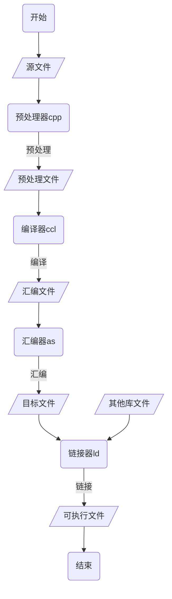
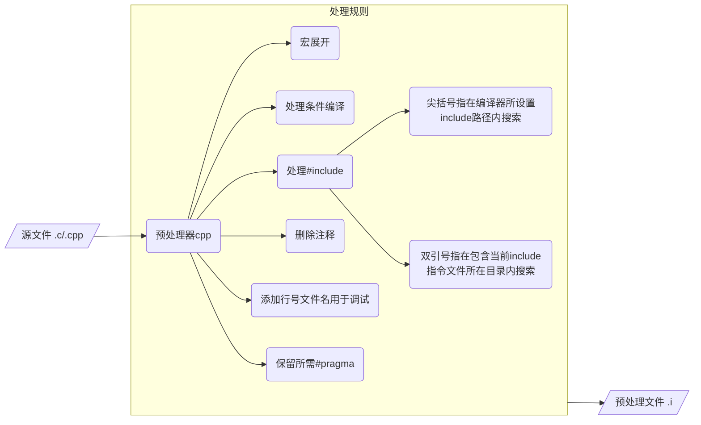
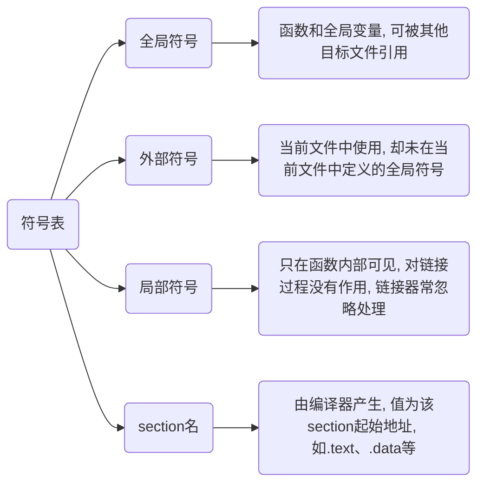
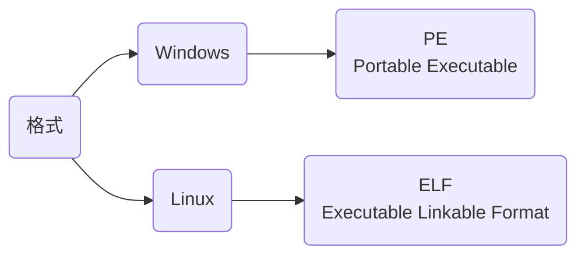
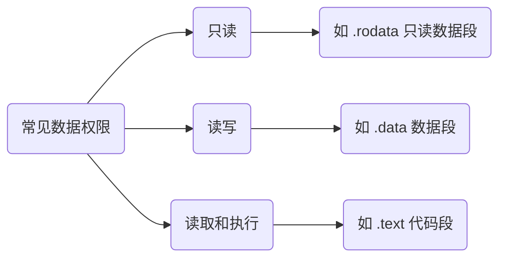
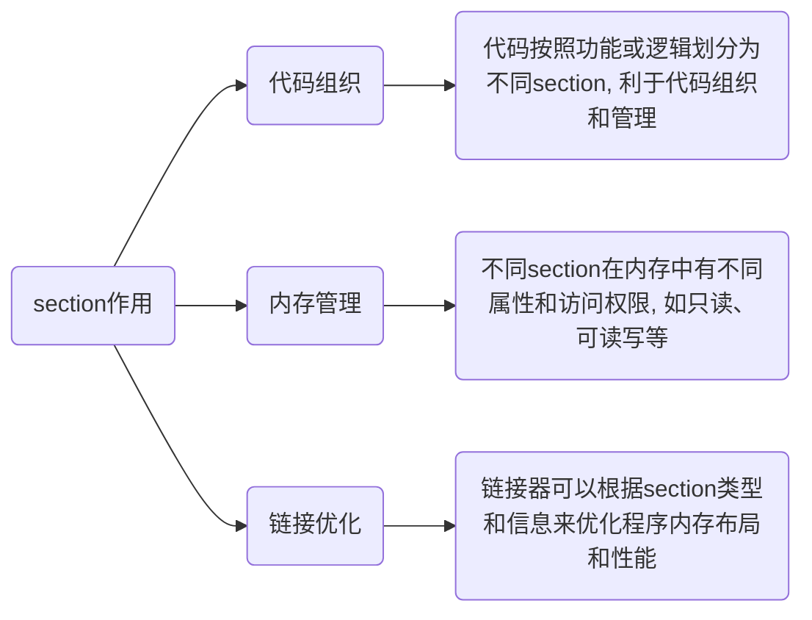
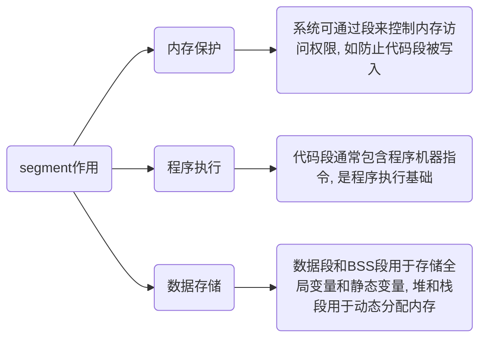

> [强符号和弱符号](https://www.cnblogs.com/zjuhaohaoxuexi/p/16221088.html)

## 流程



## 预处理(Preprocessing)



预处理器`cpp`处理源文件, 生成`.i`预处理文件

```sh
# -E 只执行到预处理
# -o 指定输出文件名
gcc *.c -E -o *.i
```

## 编译(Compilation)


编译器`ccl`将预处理`.i`文件进行词法分析、语法分析、语义分析及优化后生成`.s`汇编文件

```sh
# -S 只执行到预处理
gcc *.i -S -o *.s
```

## 汇编(Assemble)

汇编器`as`将汇编文件转换为机器语言, 生成`.o`目标文件

```sh
# -c 只执行到汇编阶段
gcc *.s -c -o *.o
```

### 目标文件

目标文件(Object File)是二进制文件, 能被CPU直接识别, 由源文件经过编译器预处理、编译、汇编过程生成

目标文件与可执行文件在结构与组织形式上非常类似, 只是目标文件部分变量和函数地址未确定, 导致不能执行

#### 结构

- 文件头(File Header)

描述整个目标文件属性, 包含文件类型、目标架构（如x86、x64）、入口点地址(对于可执行文件是程序开始执行处)以及其他元数据

- section

目标文件被划分为多个`section`, 都包含特定类型信息, 常见有,

| 名称      | 说明                                                                    |
|----------| -------------------------------------------------------------------------|
|.text     |存放编译后二进制代码                                                        |
|.data     |存放已初始化全局变量和静态变量                                               |
|.bss      |为未初始化全局变量和静态变量预留空间(在目标文件中不占实际空间, 但在内存中会分配) |
|.rodata   |包含只读数据, 如常量字符串和常量值                                           |
|.debug    |包含调试信息(若编译时启用调试选项)                                       |
|.rel.text |.text section重定位信息, 用于代码段指令中地址重定位                          |
|.rel.data |.data section重定位信息, 用于对被模块使用或定义全局变量重定位               |

- 符号表(Symbol table)

包含目标文件中所有符号(如变量名、函数名等)名称、地址和类型信息, 并允许链接器解析不同目标文件之间的符号引用

- 重定位表(Relocation Table)

包含目标文件中待修正地址信息, 链接过程中链接器会根据符号表来更新重定位表中地址, 以确保程序在加载到内存时能正确访问变量和函数

- 字符串表(String Table)

存储符号表中所使用字符串, 如符号名称

#### 分类

- 可执行文件(Executable File)

包含可直接执行程序, 例如 Linux下a.out, Windows下.exe

- 可重定位文件(Relocatable File)

包含代码和数据, 可被用来链接成可执行文件或者共享目标文件, 例如静态链接库

- 共享目标文件(Shared Object File)

包含代码和数据

链接器可将其跟其他可重定位文件链接, 产生新目标文件

链接器也可将其与其他可执行文件结合作为进程一部分运行, 如动态链接库

- 核心转储文件(Core Dump File)

系统在进程意外终止时用与存储该进程地址空间内容以及其他信息, 如Linux中core dump

## 链接 Linking

链接时链接器`ld`对目标文件及库文件(静态库或动态库)解析符号引用, 将目标文件中符号与定义进行匹配合并成可执行文件(executable file)

```sh
gcc 目标文件... -o 可执行文件
```

链接器(Linking)通过`符号`处理各模块之间相互引用部分, 使各模块能够正确衔接, 最终组合成独立程序

### 过程

函数和变量在本质上都是地址助记符, 在链接过程中称为`符号`(Symbol)

符号信息包括当前符号在字符串表中偏移、符号在section中偏移、符号所占用字节数、符号类型等

目标文件中符号表(Symbol table), section名为`.symtab`, 记录文件中所用符号, 包括



#### 符号解析匹配

链接器首先读取所有目标文件和库文件, 收集符号信息, 查找各目标文件中每个引用符号在何目标文件、库文件中被定义

对于每个未解析符号引用, 链接器会在所有目标文件和库文件中进行搜索, 以找到对应符号定义

若找到匹配符号定义, 链接器会将该符号地址填充到引用该符号的目标文件中

#### 重定位

符号解析和匹配完成后, 链接器会将目标文件中相对地址转换为可执行文件中绝对地址, 称为重定位

在编译和汇编阶段, 目标文件中符号地址是相对于某个基地址偏移量, 而在链接阶段, 需要将这些偏移量转换为可执行文件中实际地址

#### 合并section

目标文件通常包含多个section(如.text、.data、.debug等), 链接器需要将这些section合并成一个可执行文件

section合并仅是简单叠加过程, 如合并有用段(例如代码段、数据段等), 删除如重定位段、段表, 增加如程序头表等其他section

合并过程中链接器会考虑section对齐要求、内存布局等因素, 以确保可执行文件正确性和性能

#### 生成可执行文件

在完成符号解析匹配、重定位和合并section后, 链接器会生成最终可执行文件

可执行文件包含程序所有代码和数据, 以及必要元数据(如程序入口点、段信息等)

### 问题

#### 符号冲突

符号重复定义(Multiple Definition)错误是因为在多个源文件中定义同名全局变量, 并都进行初始化

例如file_1.c 中定义全局变量 gValue

```c
int gValue = 10;
```

在 file_1.c 中又对 gValue 进行定义

```c
int gValue = 20;
```

链接时就会出现错误

```sh
file_2.o: multiple definition of `gValue`
file_1.o: first defined here
```

### 类别

#### 静态链接

在程序运行之前确定符号地址为静态链接(Static Linking)

函数代码将从其所在静态链接库中被拷贝到最终可执行程序中, 该程序被执行时这些代码将被装入到该进程虚拟地址空间中

静态链接库实际上是一个目标文件集合, 其中每个文件含有库中一个或者一组相关函数代码

#### 动态链接

在程序运行期间再确定符号地址为动态链接(Dynamic Linking)

库文件所内符号地址是在程序运行期间确定, 所以称为动态链接库(Dynamic Linking Library)

函数代码被放到动态链接库或共享对象某个目标文件中, 链接程序此时只是在最终可执行程序中记录下共享对象名字以及其它少量登记信息

可执行文件被执行时, 动态链接库全部内容将被映射到运行时相应进程虚地址空间, 根据可执行程序中记录信息找到相应函数代码执行

## 可执行文件



### 结构

可执行文件组织形式和目标文件非常类似, 也被划分成多个部分, 下表显示新增部分

| 名称 | 说明 |
|--------------------| ----------------------------------------------------------------------------------- |
|ELF header | 描述文件类型、目标架构、入口点地址、程序头表位置和大小、节头表位置和大小等ELF基本信息 |
|Program Header Table| 描述各个segment信息, 如类型、偏移、在进程虚拟地址空间中起始地址、物理装载地址、长度、权限等 |

另外删除可重定位section(.rel.text,.rel.data)以及 section table



将一块连续、具有相同权限数据称为segment, 其由多个权限相同 section 构成

### section/segment

#### 节(section)

section是目标文件中一个逻辑分区, 由编译器生成, 存储特定类型信息, 如代码、数据或调试信息, 用于链接阶段将不同目标文件中相同类型信息合并



在Unix-like系统使用`objdump`或Windows上`dumpbin`查看目标文件中节信息

#### 段(segment)

segment是内存中一个连续物理分区, 用于存储特定类型数据或代码, 由系统在程序加载时创建, 并将目标文件中节映射到段中



在Unix-like系统上`ps`或Windows上任务管理器查看进程内存段信息

#### 关系

- 目标文件与内存

节是目标文件中逻辑分区, 段是内存中物理分区, 程序加载时操作系统在节与段之间建立映射

- 属性与权限

节和段都有各自属性和访问权限, 如.text节(代码段)通常只读, 以防止代码被意外修改

- 链接与加载

链接器链接各目标文件时, 会根据section类型和信息来合并和优化程序内存布局

程序加载时操作系统会根据这些信息来创建内存段, 并将节映射到这些段中

### 加载

目标文件中section table用来描述各个section信息, 包括名字、长度、在文件中偏移、读写权限等, 通过其可以详细了解目标文件结构

可执行文件中section table被删除, 以程序头表(program header table)取代, 操作系统根据程序头表将可执行文件加载到内存, 并为各个 segment 分配内存空间、确定地址

可执行文件在加载时实际上是被映射虚拟地址空间, 所以可执行文件很多时候又被叫做映像文件(Image)

