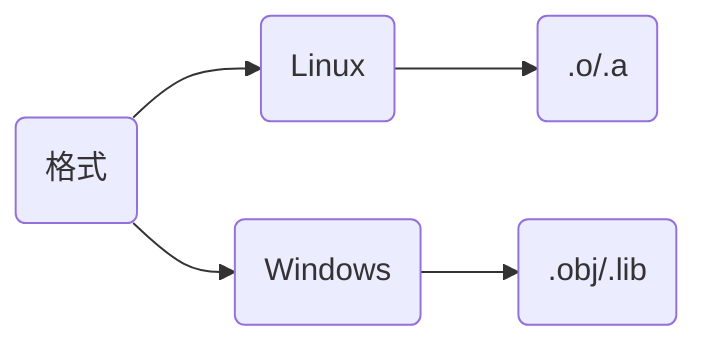
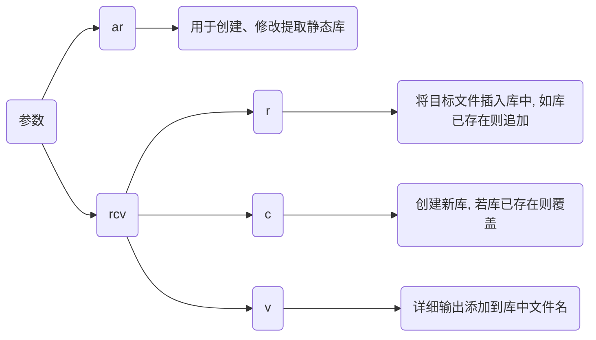

## 概念



## 开发

设生成static_api静态库

```c++
// static_api.hpp
#ifndef __STATIC_API_HPP__
#define __STATIC_API_HPP__
#include <iostream>

extern "C" int Add(int x, int y);
extern "C"void Hello();

#endif
```

```c
// static_api.cpp
#include "static_api.hpp"

int Add(int x, int y) {
    return x + y;
}
void Hello() {
    std::cout << "Hello World" << std::endl;
}
```

### 编译

#### 命令行

```sh
# -c 只执行到汇编阶段
g++ 源文件 -c -o 目标文件

# 生成静态库
ar rcv 库文件 目标文件
```




#### CMake

```cmake
# CMakeLists.txt
cmake_minimum_required(VERSION 3.16)
project(static_api)

add_library(${PROJECT_NAME} STATIC "")
target_sources(${PROJECT_NAME} PUBLIC ${CMAKE_SOURCE_DIR}/static_api.cpp)
```


## 使用

### 链接

```c
// main.cpp
#include "static_api.hpp"

int main(void) {
    Hello();
    std::cout << Add(0xA, 0xB) << std::endl;
    return 0;
}
```

#### 命令行

```sh
g++ 源文件 库 -o 可执行文件
```

