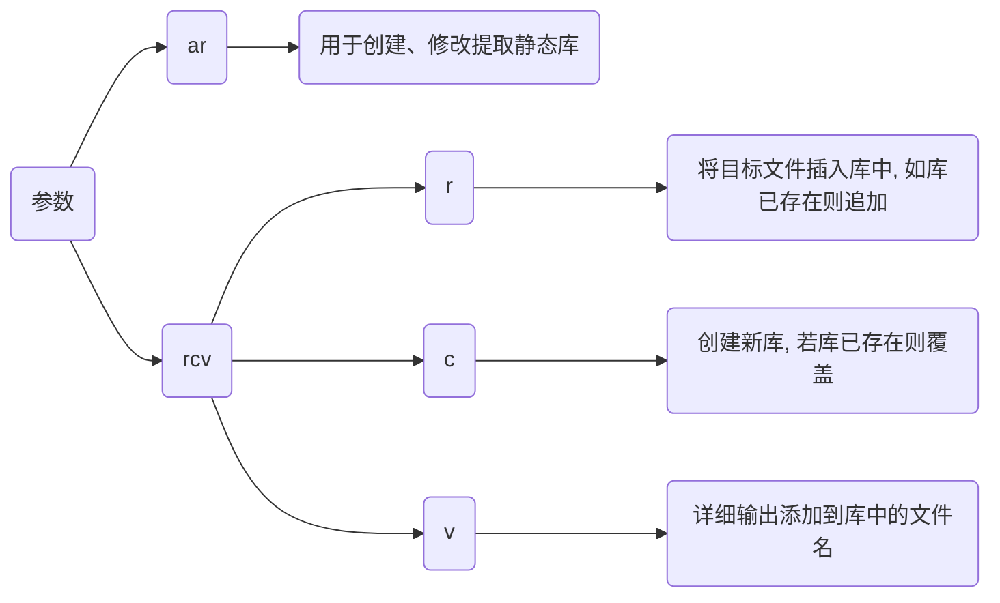

## 概念


## 开发

示例代码, 设生成目标静态库HelloAPI.a/lib

HelloStaticAPI.hpp

```c++
#ifndef __HELLO_STATIC_API_HPP__
#define __HELLO_STATIC_API_HPP__
#include <iostream>

int Add(int x, int y);
void Hello();

#endif
```

HelloStaticAPI.cpp

```c
#include "Hello.hpp"

int Add(int x, int y) {
    return x + y;
}
void Hello() {
    std::cout << "Hello World" << std::endl;
}
```

### 编译

#### 命令行

```sh
# -c 只执行到汇编阶段
g++ *.cpp -c -o *.o

# 生成静态库
ar rcv *.a/.lib *.o
```




#### CMake

```cmake
# CMakeLists.txt
cmake_minimum_required(VERSION 3.16)
project(HelloStaticAPI)

add_library(${PROJECT_NAME} STATIC "")
target_sources(${PROJECT_NAME} PUBLIC ${CMAKE_SOURCE_DIR}/HelloStaticAPI.cpp)
```

## 使用

### 链接

```c
// Main.cpp
#include "HelloStaticAPI.hpp"
int main(void) {
    Hello();
    std::cout << Add(0xA, 0xB) << std::endl;
    return 0;
}
```

#### 命令行

```sh
g++ <源文件> <库> -o <可执行文件>
```

