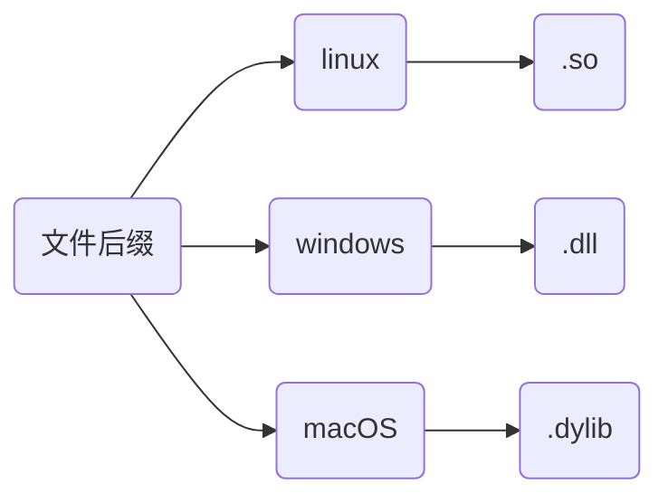
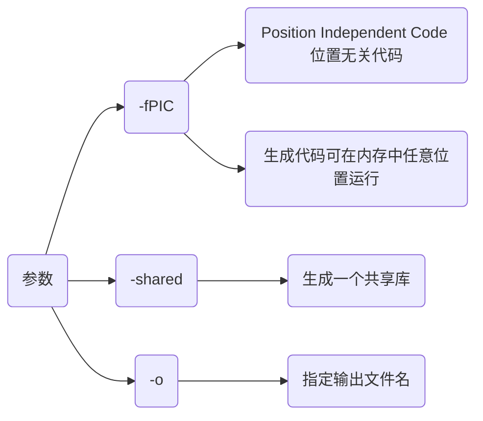
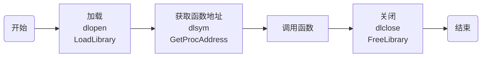

## 概念

动态库, 又称动态链接库($Dynamic$ $Link$ $Library$, $DLL$), 是包含程序代码和数据的可执行文件, 在运行时被程序加载和链接

动态库通过将功能封装, 实现代码模块化, 使程序更加灵活和易于维护, 还有助于共享数据和资源, 以减少内存占用, 并提高程序运行效率

其与静态库主要区别在于动态库代码并不在程序编译时直接包含, 而是在程序执行时根据需要动态加载



### 特点

- 运行时加载

运行时才被加载到内存, 而非编译时就包含在可执行文件中, 可节省内存

- 共享性

多程序可共享同个动态库, 共享内存中相同代码, 减少资源占用

- 版本控制

动态库可单独更新, 若功能更改只需替换库文件, 而不必重新编译所有相关程序

- 支持多语言

动态库通常可被多种编程语言调用, 可在不同开发环境中灵活使用

## 开发

### 特性

在创建C和C++动态库时有一些关键差异特性

#### 命名修饰(name mangling)

- 概念

C++编译器为支持函数重载, 会对函数名称进行修改生成唯一函数名, 称为名称修饰

C语言并无命名修饰机制, 因此直接调用C++动态库会导致链接错误

若要函数支持C调用, 需在函数名前添加 `extern "C"`, 或以 `extern "C" {...}`包裹, 使函数按C方式处理

- 使用

```c++
#ifdef __cplusplus
extern "C" {
#endif
    void Func();
#ifdef __cplusplus
}
#endif
```

(1) `extern "C"`只能用于函数和全局变量声明, 不能用于类成员或模板

(2) `extern "C"`修饰函数内不能出现C++所有特性

#### 导出符号(Export Symbol)

- 定义

为将函数从动态库中导出被其他程序调用, 需在函数前添加导出符号

- 使用

```c++
#ifdef _WIN32
    #define __EXPORT __declspec(dllexport)
#elif defined(__linux__)
    #define __EXPORT __attribute__((visibility("default")))
#endif

__EXPORT void Hello();
```

- 注意

若没有正确导出符号, 动态库中函数、变量或对象将无法被其他程序或库调用, 引发链接错误

### 编译

设将test_api.cpp编译成动态库

```c++
// test_api.hpp
#ifndef __INCLUDE_TEST_API_HPP__
#define __INCLUDE_TEST_API_HPP__

#include <iostream>

#if defined(_WIN32)
    #define __EXPORT __declspec(dllexport)
#elif defined(__linux__)
    #define __EXPORT __attribute__((visibility("default")))
#endif

#ifdef __cplusplus
extern "C" {
#endif
    __EXPORT int Add(int x, int y);
    __EXPORT void PrintHello();
#ifdef __cplusplus
}
#endif

#endif
```

```c++
// test_api.cpp
#include "test_api.hpp"

int Add(int x, int y) {
    return x + y;
}

void PrintHello() {
    std::cout << "Hello World" << std::endl;
}
```

#### 命令行

```sh
g++ 源文件 -fPIC -shared -o 库文件
```




#### cmake

```cmake
# CMakeLists.txt
cmake_minimum_required(VERSION 3.16)
project(test_api)

add_library(${PROJECT_NAME} SHARED "")
target_sources(${PROJECT_NAME} PUBLIC ${CMAKE_SOURCE_DIR}/test_api.cpp)
```


#### xmake

```lua
-- xmake.lua
add_rules("mode.debug", "mode.release")

target("test_api")
    set_kind("shared")
    add_files("test_api.cpp")
```


### 分类

#### 源文件不含类

不含类时生成动态库可直接调用, 例如上面HelloAPI.hpp与HelloAPI.cpp

#### 源文件含类

```c++
// class_api.hpp
#ifndef __INCLUDE_CLASSS_API_HPP__
#define __INCLUDE_CLASSS_API_HPP__

#include <iostream>

class ClassAPI {
public:
    ClassAPI() = default;
    ~ClassAPI() = default;
    
    void SetValue(const int val);
    void Print() const;
private:
    int mValue;
};
```

```c++
// class_api.cpp
#include "class_api.hpp"

void ClassAPI::SetValue(const int val) {
    this->mValue = val;
}

void ClassAPI::Print() const {
    std::cout << "mValue = " << mValue << std::endl;
}
```

- 类调用(仅支持C++)

以类调用时需增加导出符号, 修改头文件

```c++
// class_api.hpp
#include <iostream>

#ifdef _WIN32
    #define __EXPORT __declspec(dllexport)
#else
    #define __EXPORT __attribute__((visibility("default")))
#endif

class __EXPORT ClassAPI {
public:
    ClassAPI() = default;
    ~ClassAPI() = default;

    void SetValue(const int val);
    void Print() const;
private:
    int mValue;
};
```

测试

```c++
// main.cpp
#include "class_api.hpp"
int main() {
    ClassAPI api;
    api.SetValue(0xFFFF);
    api.Print();
    return 0;
}
```

```cmake
# CMakeLists.txt
cmake_minimum_required(VERSION 3.16)
project(class_api)

add_library(${PROJECT_NAME} SHARED "")
target_sources(${PROJECT_NAME} PUBLIC ${CMAKE_SOURCE_DIR}/class_api.cpp)

add_executable(main main.cpp)
target_link_libraries(main ${PROJECT_NAME})
```


- 函数式调用(可支持C/C++)

为支持C语言调用, 需在类外再封装一层接口, 并使用`extern "C"`

```c
// c_class_api.hpp
#include "class_api.hpp"

#ifdef _WIN32
    #define __EXPORT __declspec(dllexport)
#else
    #define __EXPORT __attribute__((visibility("default")))
#endif

#ifdef __cplusplus
extern "C" {
#endif
    __EXPORT void* ClassAPICreate();
    __EXPORT void  ClassAPIDestroy(void* handle);
    __EXPORT void  ClassAPISetValue(void* handle, int val);
    __EXPORT void  ClassAPIPrint(void* handle);   
#ifdef __cplusplus
}
#endif
```

```c++
// c_class_api.cpp
#include "c_class_api.hpp"

__EXPORT void* ClassAPICreate() {
    return new ClassAPI();
}

__EXPORT void ClassAPIDestroy(void* handle) {
    delete static_cast<ClassAPI*>(handle);
}

__EXPORT void ClassAPISetValue(void* handle, int val) {
    ClassAPI* obj = static_cast<ClassAPI*>(handle);
    obj->SetValue(val);
}

__EXPORT void ClassAPIPrint(void* handle) {
    ClassAPI* obj = static_cast<ClassAPI*>(handle);
    obj->Print();
}
```

测试

```c++
// main.cpp
#include "c_class_api.hpp"
int main() {
    void* handle = ClassAPICreate();
    ClassAPISetValue(handle, 0xFFFF);
    ClassAPIPrint(handle);
    ClassAPIDestroy(handle);
    return 0;
}
```

```cmake
# CMakeLists.txt
cmake_minimum_required(VERSION 3.16)
project(c_class_api)

add_library(${PROJECT_NAME} SHARED "")
target_sources(${PROJECT_NAME} PUBLIC
    ${CMAKE_SOURCE_DIR}/class_api.cpp
    ${CMAKE_SOURCE_DIR}/c_class_api.cpp
)

add_executable(main main.cpp)
target_link_libraries(main ${PROJECT_NAME})
```

#### 模板

```c++
// template_api.hpp
#ifndef __INCLUDE_TEMPLATE_API_HPP__
#define __INCLUDE_TEMPLATE_API_HPP__

#include <iostream>
#ifdef _WIN32
    #define __EXPORT __declspec(dllexport)
#else
    #define __EXPORT __attribute__((visibility("default")))
#endif

// 模板函数
template<typename T>
T Sub(T x, T y);

// 模板类
template<typename T>
class TemplateAPI {
public:
    TemplateAPI() = default;
    ~TemplateAPI() = default;
    static T Add(T x, T y);
};
#endif
```

```c++
// template_api.cpp
#include "template_api.hpp"

// 实例化模板函数, 添加导出符号
template __EXPORT int Sub<int>(int, int);
template __EXPORT double Sub<double>(double, double);

// 实例化类模板, 添加导出符号
template class __EXPORT TemplateAPI<int>;
template class __EXPORT TemplateAPI<double>;
template class __EXPORT TemplateAPI<std::string>;

template<typename T>
T Sub(T x, T y) {
    return T(x - y);
}

template<typename T>
T TemplateAPI<T>::Add(T x, T y) {
    return T(x + y);
}
```

测试

```c++
// main.cpp
#include "template_api.hpp"

int main() {
    std::cout << Sub<int>(0xA, 0xB) << std::endl;
    std::cout << Sub<double>(1.234, 9.876) << std::endl;

    std::cout << TemplateAPI<int>::Add(0xA, 0xB) << std::endl;
    std::cout << TemplateAPI<double>::Add(1.234, 9.876) << std::endl;
    std::cout << TemplateAPI<std::string>::Add("Hello", "World") << std::endl;
    return 0;
}
```

```cmake
# CMakeLists.txt
cmake_minimum_required(VERSION 3.16)
project(template_api)

add_library(${PROJECT_NAME} SHARED "")
target_sources(${PROJECT_NAME} PUBLIC ${CMAKE_SOURCE_DIR}/template_api.cpp)

add_executable(main main.cpp)
target_link_libraries(main ${PROJECT_NAME})
```


## 调用

### 隐式链接

隐式链接会在链接时让编译器将动态库链接到可执行文件中, 运行时自动加载

```c++
// main.cpp
#include "test_api.hpp"

int main(void) {
    std::cout << Add(0xFF, 0xAB) << std::endl;
    PrintHello();
    return 0;
}
```

设隐式调用上面test_api动态库

#### 命令行

链接库生成可执行文件

```sh
g++ 源文件 库文件 -o 可执行文件
```


若报找不到库文件错误, 移动文件到`/usr/lib`目录

#### cmake

```cmake
# CMakeLists.txt
cmake_minimum_required(VERSION 3.16)
project(main)

add_executable(${PROJECT_NAME} "")

target_sources(${PROJECT_NAME} PRIVATE ${CMAKE_SOURCE_DIR}/main.cpp)
target_link_libraries(${PROJECT_NAME} test_api)
```


### 显式链接

通过接口函数显式链接动态库并直接调用库中函数



```c++
// main.cpp
#include<iostream>
#if defined (_WIN32) | defined (_WIN64)
    #include<windows.h>
#elif defined (__linux__)
    #include <dlfcn.h>
#endif

typedef void(*VoidFunc)();

int main() {
    // 加载
#if defined(_WIN32) | defined(_WIN64)
    HMODULE handle = LoadLibrary("libtest_api.dll");
    if (!handle) {
        std::cerr << "无法加载动态库: " << GetLastError() << std::endl;
    }
    VoidFunc helloFunc = (VoidFunc)GetProcAddress(handle, "PrintHello");
    if (helloFunc == nullptr) {
        std::cerr << "无法找到函数: " << GetLastError() << std::endl;
FreeLibrary(handle);
    }
#elif defined(__linux__)
    void* handle = dlopen("libtest_api.so", RTLD_LAZY | RTLD_LOCAL);
    if (!handle) {
        std::cerr << "无法加载动态库: " << dlerror() << std::endl;
    }
    VoidFunc helloFunc = (VoidFunc)dlsym(handle, "PrintHello");
    if (helloFunc == nullptr) {
        std::cerr << "无法找到函数: " << dlerror() << std::endl;
        dlclose(handle);
    }
#endif
    // 调用
    helloFunc();
    // 卸载
#if defined(_WIN32) | defined(_WIN64)
    FreeLibrary(handle);
#elif defined (__linux__)
    dlclose(handle);
#endif
    return 0;
}
```

linux下显式链接时需额外链接加载器库`dl`

#### 命令行

```sh
g++ main.cpp -o main (-ldl)
```

#### cmake

```cmake
# CMakeLists.txt
cmake_minimum_required(VERSION 3.16)
project(Main)

add_executable(${PROJECT_NAME} "")
target_sources(${PROJECT_NAME} PRIVATE ${CMAKE_SOURCE_DIR}/Main.cpp)

if(CMAKE_HOST_SYSTEM_NAME MATCHES "Linux")
    target_link_libraries(${PROJECT_NAME} dl)
endif()
```


#### xmake

```lua
-- xmake.lua
add_rules("mode.debug", "mode.release")

target("main")
    set_kind("binary")
    add_files("main.cpp")
    add_links("test_api")
    add_linkdirs(".")
    if is_os("linux") then
        add_syslinks("dl")
    end
```


### IDE调用

#### VS2022

创建解决方案Project与动态链接库项目DllTest, 在Project项目中调用DllTest中生成的动态库


- 编写

DllTest/pch.h

```c++
#include <iostream>
#define __EXPORT __declspec(dllexport)

#ifdef __cplusplus
extern "C" {
#endif
    __EXPORT void PrintInfo();
    __EXPORT int Add(int x, int y);
#ifdef __cplusplus
}
#endif
```

DllTest/pch.cpp

```c++
void PrintInfo() {
    std::cout << "Hello World" << std::endl;
}
int Add(int x, int y) {
    return x + y;
}
```


生成动态库DllTest.dll与动态库导入库DllTest.lib


- 使用

```c++
// Main.cpp
#include "pch.h"
int main() {
    PrintInfo();
    std::cout << Add(1, 2) << std::endl;
}
```
将pch.h 与DllTest.dll、DllTest.liub拷贝到Project项目中


添加DllTest.lib路径, 用于导入动态库


