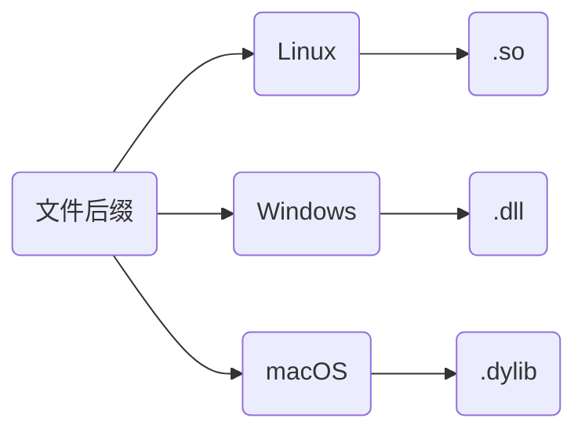
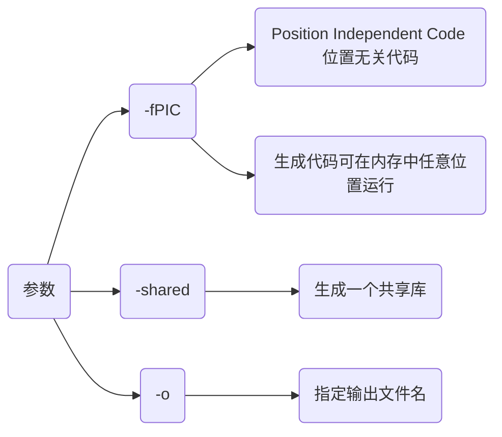
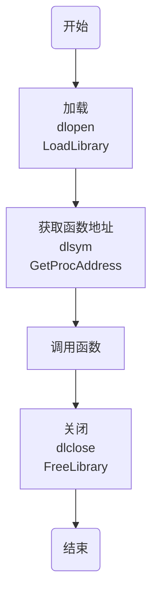

## 概念

动态库, 又称动态链接库($Dynamic$ $Link$ $Library$, $DLL$), 是包含程序代码和数据的可执行文件, 在运行时被程序加载和链接

动态库通过将功能封装, 实现代码模块化, 使程序更加灵活和易于维护, 还有助于共享数据和资源, 以减少内存占用, 并提高程序运行效率

其与静态库主要区别在于动态库代码并不在程序编译时直接包含, 而是在程序执行时根据需要动态加载



### 特点

- 运行时加载

运行时才被加载到内存, 而非编译时就包含在可执行文件中, 可节省内存

- 共享性

多程序可共享同个动态库, 共享内存中相同代码, 减少资源占用

- 版本控制

动态库可单独更新, 若功能更改只需替换库文件, 而不必重新编译所有相关程序

- 支持多语言

动态库通常可被多种编程语言调用, 可在不同开发环境中灵活使用

## 开发

设以下示例代码, 生成动态库 HelloAPI.dll/so

```c++
// HelloAPI.hpp
#include <iostream>
#ifndef __INCLUDE_HELLO_API_HPP__
#define __INCLUDE_HELLO_API_HPP__

#if defined(_WIN32)
    #define __EXPORT __declspec(dllexport)
#elif defined(__linux__)
    #define __EXPORT __attribute__((visibility("default")))
#endif

#ifdef __cplusplus
extern "C" {
#endif
    __EXPORT void Hello();
#ifdef __cplusplus
}
#endif

#endif
```

```c++
// HelloAPI.cpp
#include "HelloAPI.hpp"
void Hello() {
    std::cout << "Hello World" << std::endl;
}
```

### 特性

在创建C和C++动态库时有一些关键差异特性

#### 命名修饰(Name Mangling)

- 定义

C++编译器为支持函数重载, 会对函数名称进行特殊编码, 以区分不同函数签名, 称为名称修饰

- 处理

C语言并无命名修饰机制, 因此直接调用C++动态库会导致链接错误

若要支持C调用, 需在函数名前添加 `extern "C"`, 或以 `extern "C" {...}`包裹, 使函数按C方式处理

```c++
// 若是C++编译器
#ifdef __cplusplus
extern "C" {
#endif
    // C语言可调用的函数声明
    void Func();
#ifdef __cplusplus
}
#endif
```

- 注意

(1) `extern "C"`只能用于函数和全局变量的声明, 不能用于类成员或模板

(2) `extern "C"`修饰函数内不能出现C++所有特性

#### 导出符号(Export Symbol)

- 定义

为将函数从动态库中导出被其他程序调用, 需在函数前添加导出符号

windows中为`__declspec(dllexport)`关键字, linux中为`__attribute__((visibility("default")))`

- 使用

```c++
#ifdef _WIN32
    #define __EXPORT __declspec(dllexport)
#elif defined(__linux__)
    #define __EXPORT __attribute__((visibility("default")))
#endif

__EXPORT void Hello();
```

- 注意

若没有正确导出符号, 动态库中函数、变量或对象将无法被其他程序或库调用, 引发链接错误

### 编译

> [完整代码路径](https://github.com/dmjcb/self_assets/tree/main/code/example/c_c%2B%2B/library_demo/HelloAPII)

#### 命令行

```sh
g++ <*.cpp> -fPIC -shared -o <*.so/*.dll>
```



将HelloAPI.hpp与HelloAPI.cpp生成HelloAPI动态库


#### cmake

```cmake
# CMakeLists.txt
cmake_minimum_required(VERSION 3.16)
project(HelloAPI)

add_library(${PROJECT_NAME} SHARED "")
target_sources(${PROJECT_NAME} PUBLIC ${CMAKE_SOURCE_DIR}/HelloAPI.cpp)
```


#### xmake

```lua
-- xmake.lua
add_rules("mode.debug", "mode.release")

target("HelloAPI")
    set_kind("shared")
    add_files("HelloAPI.cpp")
```


### 分类

#### 源文件不含类

不含类时生成动态库可直接调用, 例如上面HelloAPI.hpp与HelloAPI.cpp

#### 源文件含类

> [完整代码路径](https://github.com/dmjcb/self_assets/tree/main/code/example/c_c%2B%2B/library_demoMyClassDLL)

```c++
// MyClass.hpp
#include <iostream>
class MyClass {
public:
    MyClass() = default;
    ~MyClass() = default;
    void SetValue(const int val);
    void Print() const;
private:
    int mValue;
};
```

```c++
// MyClass.cpp
#include "MyClass.hpp"
void MyClass::SetValue(const int val) {
    this->mValue = val;
}
void MyClass::Print() const {
    std::cout << "mValue = " << mValue << std::endl;
}
```

- 类调用(仅支持C++)

以类调用时需增加导出符号, 修改MyClass.hpp如下

```c++
#include <iostream>
#ifdef _WIN32
    #define __EXPORT __declspec(dllexport)
#else
    #define __EXPORT __attribute__((visibility("default")))
#endif

class __EXPORT MyClass {
public:
    MyClass() = default;
    ~MyClass() = default;
    void SetValue(const int val);
    void Print() const;
private:
    int mValue;
};
```

测试

```c++
// Main.cpp
#include "MyClass.hpp"
int main() {
    MyClass myClass;
    myClass.SetValue(0xFFFF);
    myClass.Print();
    return 0;
}
```

```cmake
# CMakeLists.txt
cmake_minimum_required(VERSION 3.16)
project(MyClassAPI)

add_library(${PROJECT_NAME} SHARED "")
target_sources(${PROJECT_NAME} PUBLIC${CMAKE_SOURCE_DIR}/MyClass.cpp)

add_executable(Main Main.cpp)
target_link_libraries(Main ${PROJECT_NAME})
```


- 函数式调用(可支持C/C++)

类外再封装一层C接口

```c
// MyClassDLL.hpp
#include "MyClass.hpp"
#ifdef _WIN32
    #define __EXPORT __declspec(dllexport)
#else
    #define __EXPORT __attribute__((visibility("default")))
#endif

#ifdef __cplusplus
extern "C" {
#endif
    __EXPORT void* MyClassCreate();
    __EXPORT void  MyClassDestroy(void* handle);
    __EXPORT void  MyClassSetValue(void* handle, int val);
    __EXPORT void  MyClassPrint(void* handle);   
#ifdef __cplusplus
}
#endif
```

```c++
// MyClassDLL.cpp
#include "MyClassDLL.hpp"
__EXPORT void* MyClassCreate() {
    return new MyClass();
}
__EXPORT void MyClassDestroy(void* handle) {
    delete static_cast<MyClass*>(handle);
}
__EXPORT void MyClassSetValue(void* handle, int val) {
    MyClass* obj = static_cast<MyClass*>(handle);
    obj->SetValue(val);
}
__EXPORT void MyClassPrint(void* handle) {
    MyClass* obj = static_cast<MyClass*>(handle);
    obj->Print();
}
```

测试

```c++
// Main.cpp
#include "MyClassDLL.hpp"
int main() {
    void* handle = MyClassCreate();
    MyClassSetValue(handle, 0xFFFF);
    MyClassPrint(handle);
    MyClassDestroy(handle);
    return 0;
}
```

```cmake
# CMakeLists.txt
cmake_minimum_required(VERSION 3.16)
project(MyClassDLLAPI)

add_library(${PROJECT_NAME} SHARED "")
target_sources(${PROJECT_NAME} PUBLIC
    ${CMAKE_SOURCE_DIR}/MyClass.cpp
    ${CMAKE_SOURCE_DIR}/MyClassDLL.cpp
)

add_executable(Main Main.cpp)
target_link_libraries(Main ${PROJECT_NAME})
```


#### 模板

> [完整代码路径](https://github.com/dmjcb/self_assets/tree/main/code/example/c_c%2B%2B/library_demo/TemplateDLL)

```c++
// TemplateDLL.hpp
#ifndef __INCLUDE_TEMPLATE_DLL_HPP__
#define __INCLUDE_TEMPLATE_DLL_HPP__
#include <iostream>
#ifdef _WIN32
    #define __EXPORT __declspec(dllexport)
#else
    #define __EXPORT __attribute__((visibility("default")))
#endif

template<typename T>
T Sub(T x, T y);

template<typename T>
class TemplateDLL {
public:
    TemplateDLL() = default;
    ~TemplateDLL() = default;
    static T Add(T x, T y);
};
#endif
```

```c++
// TemplateDLL.cpp
#include "TemplateDLL.hpp"
template __EXPORT int Sub<int>(int, int);
template __EXPORT double Sub<double>(double, double);

template class __EXPORT TemplateDLL<int>;
template class __EXPORT TemplateDLL<double>;
template class __EXPORT TemplateDLL<std::string>;

template<typename T>
T Sub(T x, T y) {
    return T(x - y);
}
template<typename T>
T TemplateDLL<T>::Add(T x, T y) {
    return T(x + y);
}
```

- 测试

```c++
// Main.cpp
#include "TemplateDLL.hpp"
int main() {
    std::cout << Sub<int>(0xA, 0xB) << std::endl;
    std::cout << Sub<double>(1.234, 9.876) << std::endl;
    std::cout << TemplateDLL<int>::Add(0xA, 0xB) << std::endl;
    std::cout << TemplateDLL<double>::Add(1.234, 9.876) << std::endl;
    std::cout << TemplateDLL<std::string>::Add("Hello", "World") << std::endl;
    return 0;
}
```

```cmake
# CMakeLists.txt
cmake_minimum_required(VERSION 3.16)
project(TemplateDLL)

add_library(${PROJECT_NAME} SHARED "")
target_sources(${PROJECT_NAME} PUBLIC ${CMAKE_SOURCE_DIR}/TemplateDLL.cpp)

add_executable(Main Main.cpp)
target_link_libraries(Main ${PROJECT_NAME})
```


## 调用

### 隐式链接

隐式链接会在链接时让编译器将动态库链接到可执行文件中, 运行时自动加载

```c++
// Main.cpp
#include "HelloAPI.hpp"
int main(void) {
    Hello();
    return 0;
}
```

隐式调用上面HelloAPI动态库

#### 命令行

```sh
g++ [源文件] [库文件] -o [可执行文件]
```


若报找不到库文件错误, 移动文件到`/usr/lib`目录

#### cmake

```cmake
# CMakeLists.txt
cmake_minimum_required(VERSION 3.16)
project(Main)

add_library(HelloAPI SHARED "")
target_sources(HelloAPI PUBLIC ${CMAKE_SOURCE_DIR}/HelloAPI.cpp)

add_executable(${PROJECT_NAME} "")
target_sources(${PROJECT_NAME} PRIVATE ${CMAKE_SOURCE_DIR}/Main.cpp)
target_link_libraries(${PROJECT_NAME} HelloAPI)
```


### 显式链接

显式链接是通过接口函数显式链接动态库并直接调用库中函数, 调用流程如下



显式调用上面HelloAPI动态库

```c++
#include<iostream>
#if defined (_WIN32) | defined (_WIN64)
    #include<windows.h>
#elif defined (__linux__)
    #include <dlfcn.h>
#endif

typedef void(*VoidFunc)();

int main() {
    // 加载
#if defined (_WIN32) | defined (_WIN64)
HMODULE handle = LoadLibrary("HelloAPI.dll");
    if (!handle) {
        std::cerr << "无法加载动态库: " << GetLastError() << std::endl;
    }
    VoidFunc helloFunc = (VoidFunc)GetProcAddress(handle, "Hello");
    if (helloFunc == nullptr) {
        std::cerr << "无法找到函数: " << GetLastError() << std::endl;
FreeLibrary(handle);
    }
#elif defined (__linux__)
void* handle = dlopen("HelloAPI.so", RTLD_LAZY | RTLD_LOCAL);
    if (!handle) {
        std::cerr << "无法加载动态库: " << dlerror() << std::endl;
    }
    VoidFunc helloFunc = (VoidFunc)dlsym(handle, "Hello");
    if (helloFunc == nullptr) {
        std::cerr << "无法找到函数: " << dlerror() << std::endl;
        dlclose(handle);
    }
#endif
    // 调用
    helloFunc();
    // 卸载
#if defined (_WIN32) | defined (_WIN64)
    FreeLibrary(handle);
#elif defined (__linux__)
    dlclose(handle);
#endif
    return 0;
}
```

Linux环境下显示链接时需额外链接加载器库`dl`

#### 命令行

```sh
g++ Main.cpp -o Main (-ldl)
```


#### cmake

```cmake
# CMakeLists.txt
cmake_minimum_required(VERSION 3.16)
project(Main)

add_executable(${PROJECT_NAME} "")
target_sources(${PROJECT_NAME} PRIVATE ${CMAKE_SOURCE_DIR}/Main.cpp)

if(CMAKE_HOST_SYSTEM_NAME MATCHES "Linux")
    target_link_libraries(${PROJECT_NAME} dl)
endif()
```


#### xmake

```lua
-- xmake.lua
add_rules("mode.debug", "mode.release")

target("Main")
    set_kind("binary")
    add_files("Main.cpp")
    add_links("HelloAPI")
    add_linkdirs(".")
    if is_os("linux") then
        add_syslinks("dl")
    end
```


### IDE调用

#### VS2022

创建解决方案Project与动态链接库项目DllTest, 在Project项目中调用DllTest中生成的动态库


- 编写

DllTest/pch.h

```c++
#include <iostream>
#define __EXPORT __declspec(dllexport)

#ifdef __cplusplus
extern "C" {
#endif
    __EXPORT void PrintInfo();
    __EXPORT int Add(int x, int y);
#ifdef __cplusplus
}
#endif
```

DllTest/pch.cpp

```c++
void PrintInfo() {
    std::cout << "Hello World" << std::endl;
}
int Add(int x, int y) {
    return x + y;
}
```


生成动态库DllTest.dll与动态库的导入库DllTest.lib


- 使用

```c++
// Main.cpp
#include "pch.h"
int main() {
    PrintInfo();
    std::cout << Add(1, 2) << std::endl;
}
```
将pch.h 与生成的DllTest.dll、DllTest.liub拷贝到Project项目中


添加DllTest.lib路径, 用于导入动态库


