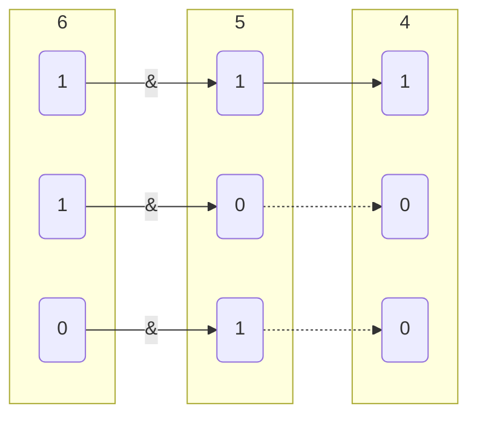
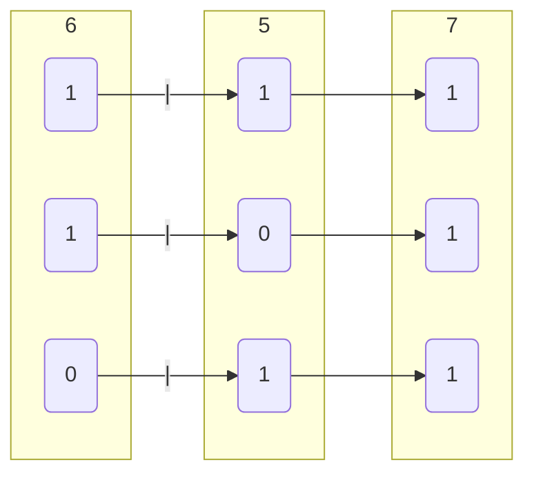
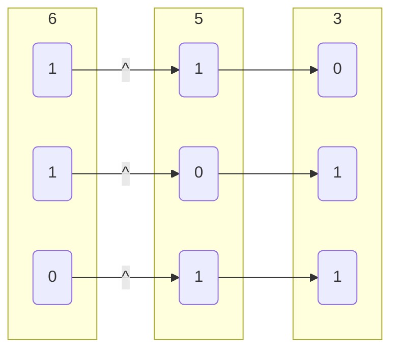
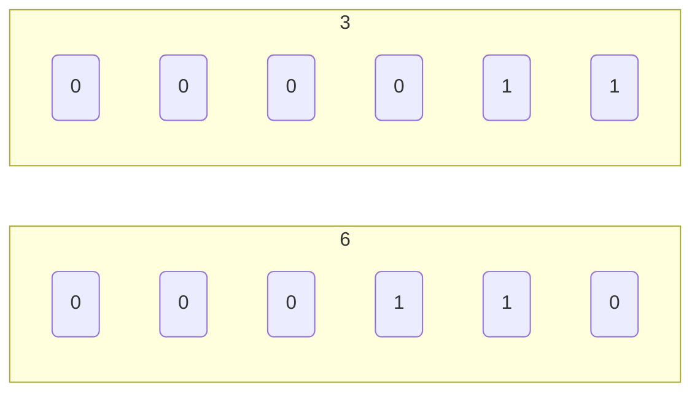
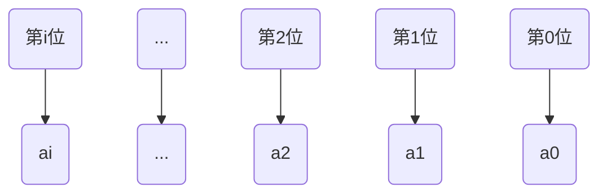
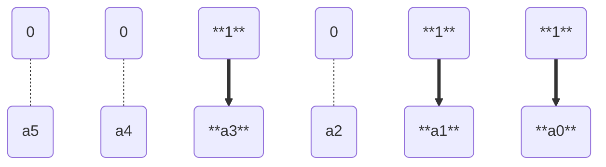

# 位操作

## 运算符

### 单目

#### 按位取反~

对操作数的各二进制位按位取反, 即0变为1, 1变为0

### 双目

#### 位与 &

| A \ B | 0 | 1 |
|-------|---|---|
| **0** | 0 | 0 |
| **1** | 0 | 1 |

```c
// 4
6 & 5
```



- 获取数字区间值

```c
a = 0x12345678;

// 获取数字低8位值
a & 0xFF

// 获取数字低10位值
a & 0x3FF

// 获取数字10-19位值
(a >> 10) & 0x3FF
```

#### 位或 |

| A \ B | 0 | 1 |
|-------|---|---|
| **0** | 0 | 1 |
| **1** | 1 | 1 |

```c
// 7
6 | 5
```



- 组合数字

```c++
int r = 0;
unsigned char v[4] = {0x12, 0x34, 0x56, 0x78};

r |= (v[1] << 24);
r |= (v[2] << 16);
r |= (v[3] << 8);
r |= v[4];

// 0x12345678
printf("%x\n", r);
```

#### 异或 ^

| A \ B | 0 | 1 |
|-------|---|---|
| **0** | 0 | 1 |
| **1** | 1 | 0 |

```c
// 3
6 ^ 5
```



- 交换变量值

```c
void swap(int &a, nt &b){
a = a ^ b;
b = b ^ a;
a = a ^ b;
}
```

### 移位

#### 左移

变量二进制值左移$n$位, 相当于乘$2^{n}$

```c
// 6
3 << 1

// 0110
00110 << 1

// 12
3 << 2

// 1100
001100 << 2
```



#### 右移

二进制值右移$n$位, 相当于除$2^{n}$

```c
// 3
6 >> 1

// 0011
0110 >> 1
```


- 获取$x$的第$i$位值

```c
x >> (i - 1)
// 或者
x & (1 << (i - 1))
```
## 二进制枚举

设存在含$n$个元素($a_1$, $a_2$ $\cdots$ $a_n$)集合$S$

### 子集

#### 数量

对于$S$中每个元素, 它要么在子集中, 要么不在子集中, 由于每个元素都有两种可能状态, 因此 n 个元素所有可能组合就是$2^n$

所以含$n$个元素集合$S$子集个数为$2^n$

#### 对应关系

对于第 $i$ 个子集, 可用$i$($1$~$2^n$ ($\underbrace{0000 \cdots 0001}_n$ ～ $\underbrace{1111 \cdots 1111}_n$))的二进制值每一位表示元素包含情况,

- 推导过程

$S$ = {$a_0$, $a_1$ $\cdots$ $a_n$}

将集合中从0开始计数第i个元素与二进制数从右往左数第i位一一对应

元素$a_1$对应二进制数第0位, 元素$a_2$对应二进制数第1位



于是集合$S$所有子集可以表示为,

- 空集: $(0000...0000)_2$, 即0

- ${a_0}$: $(0000...0001)_2$, 即1

- ${a_1}$: $(0000...0010)_2$, 即2

- ${a_0, a_1}$: $(0000...0011)_2$, 即3

.....

| 子集序号值 | 序号二进制值 | 子集大小 | 包含元素 |
| -------- | ------------------------------- | -------- | --------------------- |
| $1$ | $\underbrace{00 \cdots 0001}_n$ | $1$ | $a_0$ |
| $2$ | $\underbrace{00 \cdots 0010}_n$ | $1$ | $a_1$ |
| $3$ | $\underbrace{00 \cdots 0011}_n$ | $2$ | $a_0, a_1$ |
| $4$ | $\underbrace{00 \cdots 0100}_n$ | $1$ | $a_2$ |
| $5$ | $\underbrace{00 \cdots 0101}_n$ | $2$ | $a_0, a_2$ |
| $6$ | $\underbrace{00 \cdots 0110}_n$ | $2$ | $a_1, a_2$ |
| $7$ | $\underbrace{00 \cdots 0111}_n$ | $3$ | $a_0, a_1, a_2$ |
| $\cdots$ | $\cdots$ | $\cdots$ | $\cdots$ |
| $2^n$ | $\underbrace{11 \cdots 1111}_n$ | $n$ | $a_0, a_1 \cdots a_n$ |

通过上表总结对于子集 $i$, 若 $i$ 二进制值第 $x$ 位为 $1$, 则子集包含$a_x$元素, 若为 $0$则子集不包含$a_x$元素

子集 $i$, $i$ 二进制值中含1数量为子集大小

### 程序

例如对于含 $5$ 个元素集合$S$, 其第 $11$ 个子集

因$(11)_2 = 01011$, 第$0, 1, 3$位为$1$, 因此包含$a_0, a_1, a_3$三个元素



- C

```c++
// 元素数量
const int n = 5;

int a[5] = {1, 2, 3, 4, 5};

for(int i = 1; i <= (1 << n); i++){
for(int j = 0; j < n; j++){
// 若子集i中第j位为1, 则子集i包含a(j)
if ((i >> j) & 1){
// 选择a(j)
}
}
}
```

- Python

```py
n = 3

a = [...]

for i in range(1, 1 << n):
for j in range(n):
if (i >> j) & 1:
...
```
未选择文件
