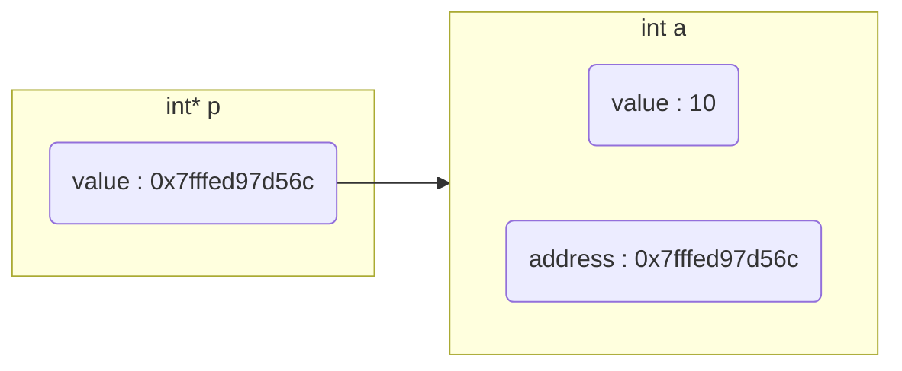
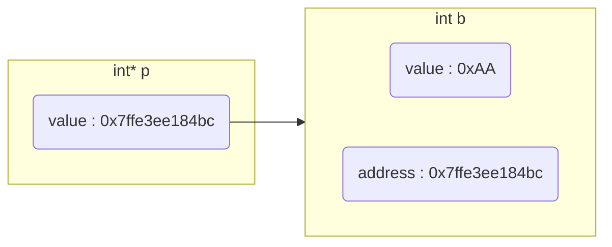
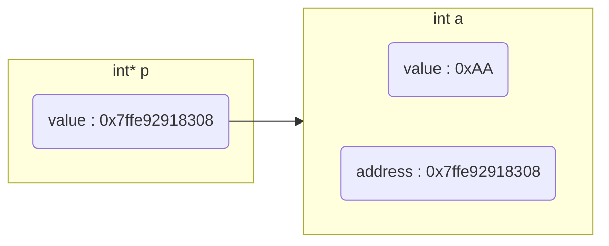

## 概念

指针是定义, C/C++中每个变量在内存里都有唯一地址, 该地址也称为指针

指针变量是指针具体实现, 其存储其他变量、函数甚至其他指针内存地址, 并可通过变量地址间接操作变量 

指针变量大小只与系统位数有关, 与类型无关, 32位系统指针大小为4字节, 64位系统指针大小位8字节

### 操作

#### 定义

```c
类型* 名称;
```

指针变量是变量, 值是所存储变量的地址

```c
int *p;

char *p;

double *p;
```

#### 取地址

C/C++中使用`&`运算符获取变量地址

- 示例, 获取变量a地址, 并存储在指针变量p中

```c
int a = 0xFF;
int *p = &a;
```

#### 解引用

设指针p存储变量a的地址

C/C++中使用`*`运算符通过指针存储地址值间接获取该地址对应变量值

```c
int a = 0xA;
int *p = &a;

// 0xA
*p;
```

## 属性

### 指针指向(指针值)

指针的值是其存储变量地址, 也称为指针指向该变量

- 示例, 指针变量p存储变量a的地址, 即p指向a



```c++
#include <stdio.h>

int main() {
    int a = 10;
    // 等价 int *p; p = &a;
    int *p = &a;
    printf("a = %d, &a = %p\n", a, &a);
    printf("*p = %d, p = %p\n", *p, p);

    return 0;
}
```


#### 改变指针指向

改变指针值, 存储新变量, 也称改变指向

- 示例, 指针变量p原本存储变量a的地址

现让其存储变量b的地址, 改变指针指向




```c
#include <stdio.h>
int main() {
    int a = 0xFF;
    int* p = &a;
    printf("p = %p, *p = %d\n", p, *p);

    int b = 0xAA;
    p = &b;
    printf("p = %p, *p = %d\n", p, *p);

    return 0;
}
```


#### 改变指针指向值

通过指针所存储变量的地址, 间接操作变量, 修改变量值

- 示例, 指针p存储变量a地址

通过地址间接修改变量 




```c
#include <stdio.h>
int main() {
    int a = 0xFF;
    int* p = &a;
    printf("p = %p, *p = %d\n", p, *p);

    int b = 0xAA;
    *p = b;
    printf("p = %p, *p = %d\n", p, *p);
    printf("a = %d", a);

    return 0;
}
```


### 指针类型

指针变量去掉`变量名`后是指针类型

| 指针变量     | 指针类型   |
| ----------- | ---------- |
| int *p1     | int *      |
| char *p2    | char *     |
| double **p3 | double **  |

```c
#include <stdio.h>

int main() {
    int* p = NULL;
    double* p1 = NULL;

    printf("sizeof p = %d\nsizeof p1 = %d\n", sizeof(p), sizeof(p1));
}
```

### 指针指向类型

指针变量去掉`* 变量名`表示指向类型

| 指针变量     | 指针指向类型  |
| ----------- | ------------ |
| int *p1     | int          |
| char *p2    | char         |
| double **p3 | double *     |

### 指针指向区域大小

```c
// 指针指向4字节大小区域
int a = 3;
int *p = &a;

// 指针指向1024 字节 大小区域
const int SIZE = 1024;
char *p = (char *)malloc(sizeof(char) * SIZE); 
```

## 特殊指针

### 常量指针

常量指针是指针, 指向常量(存储常量地址), 指向可变(可存储其他变量), 指向值不可变(无法通过地址间接修改变量)

```c
const int *p;
```

指针类型 `int *`, 指针指向类型 `const int`

- 示例, 尝试改变常量指针指向和指向值

```c++
#include<stdio.h>

int main(void) {
    const int a = -1;
    const int b = 1;
    const int *p = &a;
    printf("%d\n", *p);

    // 尝试改变指针指向
    p = &b;
    printf("%d\n", *p);

    // 尝试指针指向的值, 报错
    *p = -1;
    printf("%d\n", *p);
    return 0;
}
```


### 指针常量

指针常量是常量, 指针本身是`常量`(指针是常量类型), 指向不可变(不能在存储其他变量地址), 指向值可变(可通过地址间接修改变量值)

```c
int *const p;
```

指针类型 `int *const`, 指针指向类型 `int`

- 示例, 修改指针常量

```c++
#include<stdio.h>

int main(void) {
    int a = -1;
    int *const p = &a;
    printf("%d\n", *p);

    // 尝试改变指针指向值
    *p = 1;
    printf("%d\n", *p);
    
    int b = 1;
    // 尝试改变指针指向, 报错
    p = &b;
    printf("%d\n", *p);
    return 0;
}
```


### 函数指针

指向函数(存储函数地址), 可间接调用函数

```c
#include <stdio.h>
int GetMax(int x, int y) {
    return x > y ? x : y;
}

int main() {
    int (*p)(int, int) = NULL;
    p = GetMax;

    printf("%d", p(1, 2));
}
```

### 指针数组

指针数组是数组, 数组中元素为指针

```c
int *p[3];
```

指针类型 `int *`, 指针指向类型 `int`

```c
#include <stdio.h>
int main(void) {
    int *p[3];
    int a = 1;
    int b = 2;
    int c = 3;
    p[0] = &a;
    p[1] = &b;
    p[2] = &c;

    for (int i = 0; i < 3; i++) {
        printf("p[%d] = %d, &p[%d] = %p\n", i, *p[i], i, &p[i]);
    }
    return 0;
}
```


### 数组指针

数组指针是指针, 指针指向数组(存储数组首元素地址)

```c
int (*p)[3];
```

指针类型 `int *`, 指针指向类型 `int [3]`

```c
#include <stdio.h>
int main(void) {
    int a[3] = {1, 2, 3};
    int (*p)[3] = &a;

    for (int i = 0; i < 3; i++) {
        printf("&a[%d] = %p, a[%d] = %d\n", i, &a[i], i, a[i]);
    }
    for (int i = 0; i < 3; i++) {
        printf("(*p + %d) = %p, *(*p + %d) = %d\n", i, (*p + i), i,*(*p + i));
    }
    return 0;
}
```

