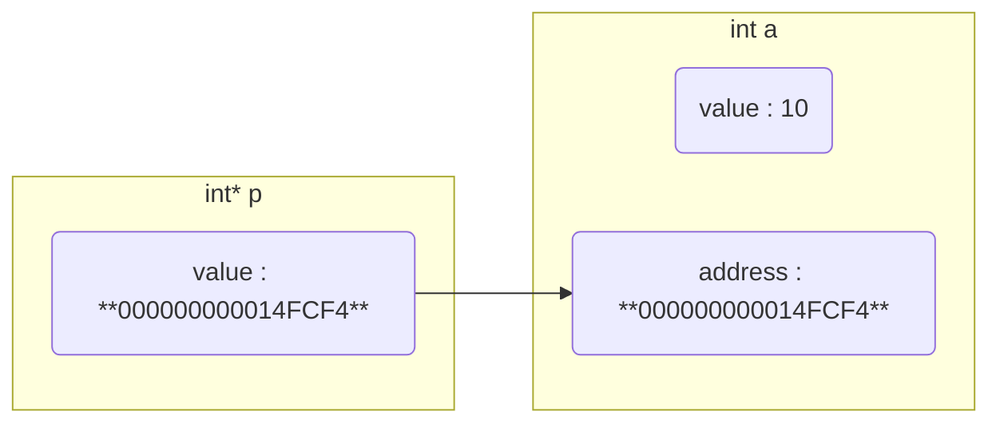
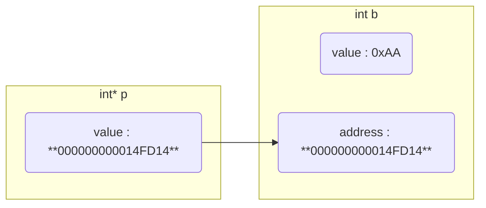
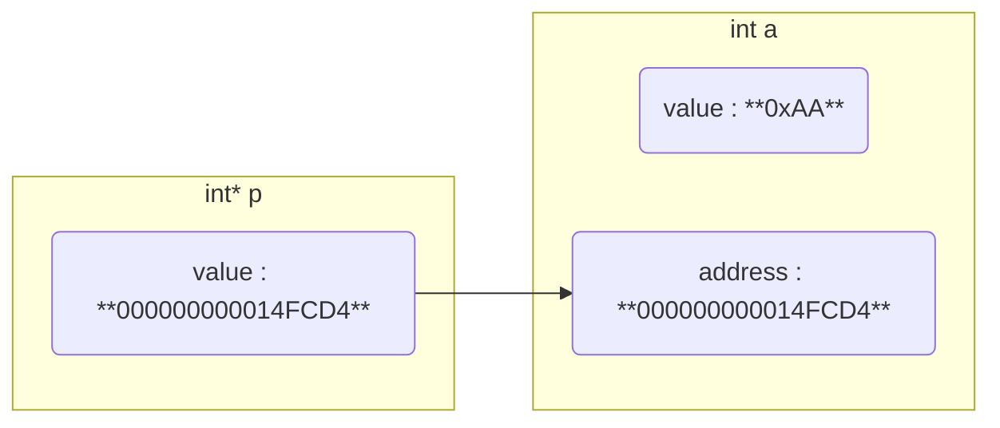
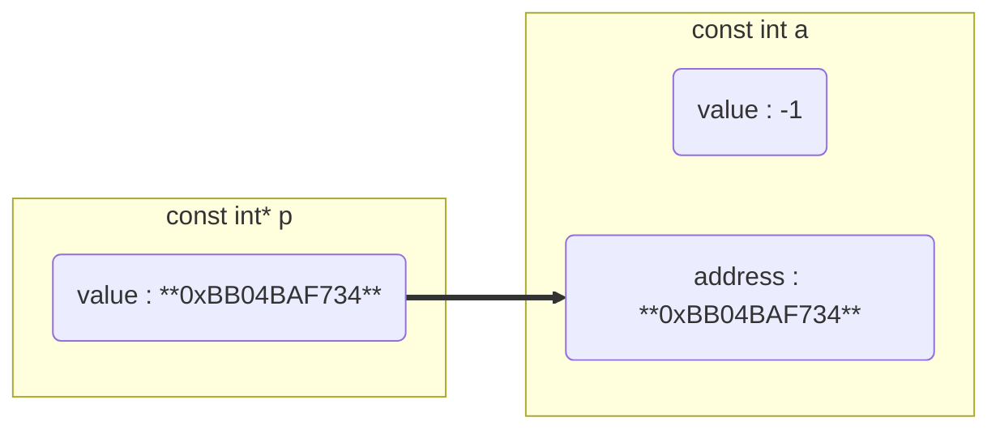
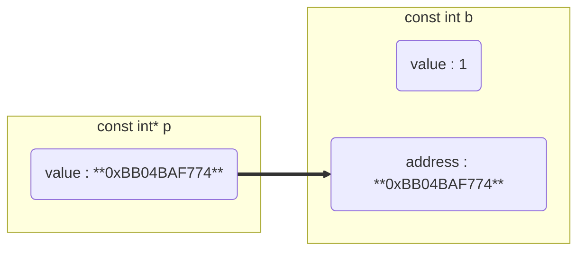
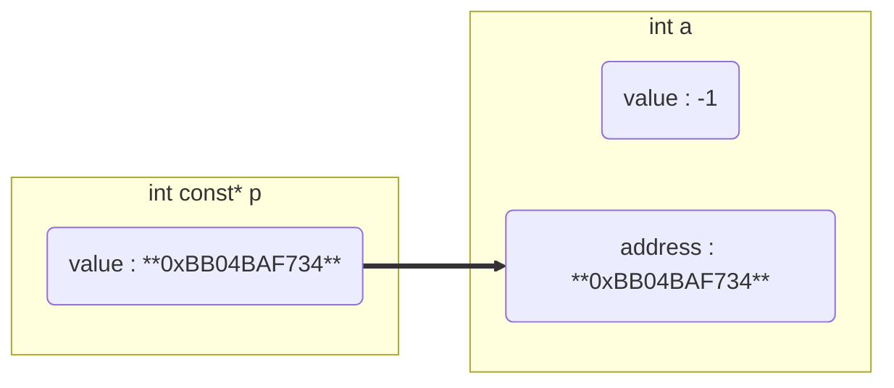
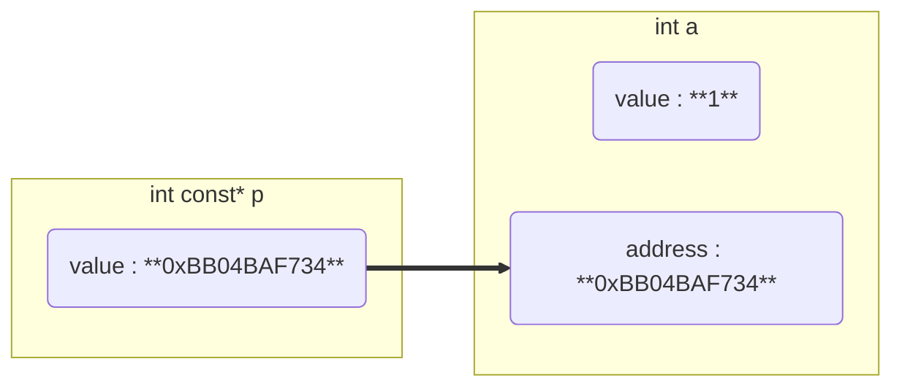

# 指针

- 指针

指针是定义, C_C++中每个变量在内存里都有唯一地址, 该地址也称为指针

- 指针变量

指针变量是具体实现, 其是变量, 用与存储其他变量`地址`

指针变量值是其指向变量的地址, 也称指针指向

## 概念

### 指针指向(指针值)

指针值为其指向变量地址

```c++
#include <stdio.h>

int main() {
    int a = 10;
    // 指针变量p存储变量a地址, 即p指向a
    // 等价 int *p; p = &a;
    int *p = &a;

    printf("a = %d, &a = %p\n", a, &a);
    printf("*p = %d, p = %p\n", *p, p);
    return 0;
}
```

运行结果

```sh
a = 10, &a = 000000000014FCF4
*p = 10, p = 000000000014FCF4
```



- 改变指针指向

```c
#include <stdio.h>

int main() {
    int a = 0xFF;
    int* p = &a;
    printf("p = %p, *p = %d\n", p, *p);

    int b = 0xAA;
    p = &b;
    printf("p = %p, *p = %d\n", p, *p);
}
```

运行结果

```sh
p = 000000000014FCD4, *p = 255
p = 000000000014FD14, *p = 170
```




- 改变指针指向值

```c
#include <stdio.h>
int main() {
    int a = 0xFF;
    int* p = &a;
    printf("p = %p, *p = %d\n", p, *p);

    int b = 0xAA;
    *p = b;
    printf("p = %p, *p = %d\n", p, *p);
    printf("a = %d", a);
}
```

运行结果

```sh
p = 000000000014FCD4, *p = 255
p = 000000000014FCD4, *p = 170
a = 170
```




### 指针类型

指针变量去掉`变量名`后是指针类型

| 指针变量    | 指针类型 |
| ----------- | ---------- |
| int *p1     | int *      |
| char *p2    | char *     |
| double **p3 | double **  |

指针大小只与系统位数有关, 与指针类型无关

32位系统指针大小为4字节, 64位系统指针大小位8字节

```c
#include <stdio.h>

int main() {
    int* p = NULL;
    double* p1 = NULL;

    printf("sizeof p = %d\nsizeof p1 = %d\n", sizeof(p), sizeof(p1));
}
```

### 指针指向类型

指针变量去掉`* 变量名`表示指向类型

| 指针变量    | 指针指向类型 |
| ----------- | ------------ |
| int *p1     | int          |
| char *p2    | char         |
| double **p3 | double *     |

### 指针指向区域大小

```c
// 指针指向4字节大小区域
int a = 3;
int *p = &a;

// 指针指向1024 字节 大小区域
const int SIZE = 1024;
char *p = (char *)malloc(sizeof(char) * SIZE); 
```

## 特殊指针

### 常量指针

常量指针是指针, 指向常量, 指向可变, 指向值不可变

```c
const int *p;
```

指针类型 `int *`, 指针指向类型 `const int`

```c++
#include<stdio.h>

int main(void) {
    const int a = -1;
    const int b = 1;
    const int *p = &a;
    printf("%d\n", *p);

    // 尝试改变指针指向
    p = &b;
    printf("%d\n", *p);

    // 尝试指针指向的值, 报错
    *p = -1;
    printf("%d\n", *p);
    return 0;
}
```

运行结果

```sh
dmjcb@Casper:~$ gcc Main.c -o Main
Main.c: In function ‘main’:
Main.c:14:8: error: assignment of read-only location ‘*p’
   14 |     *p = -1;
      |        ^
```





### 指针常量

指针常量是常量, 指针本身是`常量`, 指向不可变, 指向值可变

```c
int *const p;
```

指针类型 `int *const`, 指针指向类型 `int`

```c++
#include<stdio.h>

int main(void) {
    int a = -1;
    int *const p = &a;
    printf("%d\n", *p);

    // 尝试改变指针指向值
    *p = 1;
    printf("%d\n", *p);
    
    int b = 1;
    // 尝试改变指针指向, 报错
    p = &b;
    printf("%d\n", *p);
    return 0;
}
```

运行结果

```sh
dmjcb@Casper:~$ gcc Main.c -o Main
Main.c: In function ‘main’:
Main.c:14:7: error: assignment of read-only variable ‘p’
   14 |     p = &b;
      |       ^
```





### 函数指针

所谓函数指针即定义一个指向函数的指针变量, 可间接调用函数

```c
#include <stdio.h>

int GetMax(int x, int y) {
    return x > y ? x : y;
}

int main() {
    int (*p)(int, int) = NULL;
    p = GetMax;

    printf("%d", p(1, 2));
}
```

### 指针数组

指针数组是数组, 数组中元素为指针

```c
int *p[3];
```

指针类型 `int *`, 指针指向类型 `int`

```c
#include <stdio.h>

int main(void) {
    int *p[3];
    int a = 1;
    int b = 2;
    int c = 3;
    
    p[0] = &a;
    p[1] = &b;
    p[2] = &c;

    for (int i = 0; i < 3; i++) {
        printf("p[%d] = %d, &p[%d] = %p\n", i, *p[i], i, &p[i]);
    }

    return 0;
}
```

运行结果

```sh
p[0] = 1, &p[0] = 000000000014FC88
p[1] = 2, &p[1] = 000000000014FC90
p[2] = 3, &p[2] = 000000000014FC98
```

### 数组指针

数组指针是指针, 指针指向数组, 指针值是数组地址

```c
int (*p)[3];
```

指针类型 `int *`, 指针指向类型 `int [3]`

```c
#include <stdio.h>

int main(void) {
    int a[3] = {1, 2, 3};
    int (*p)[3] = &a;

    for (int i = 0; i < 3; i++) {
        printf("&a[%d] = %p, a[%d] = %d\n", i, &a[i], i, a[i]);
    }
    
    for (int i = 0; i < 3; i++) {
        printf("(*p + %d) = %p, *(*p + %d) = %d\n", i, (*p + i), i,*(*p + i));
    }
    return 0;
}
```

运行结果

```sh
&a[0] = 000000000014FCA8, a[0] = 1
&a[1] = 000000000014FCAC, a[1] = 2
&a[2] = 000000000014FCB0, a[2] = 3
(*p + 0) = 000000000014FCA8, *(*p + 0) = 1
(*p + 1) = 000000000014FCAC, *(*p + 1) = 2
(*p + 2) = 000000000014FCB0, *(*p + 2) = 3
```