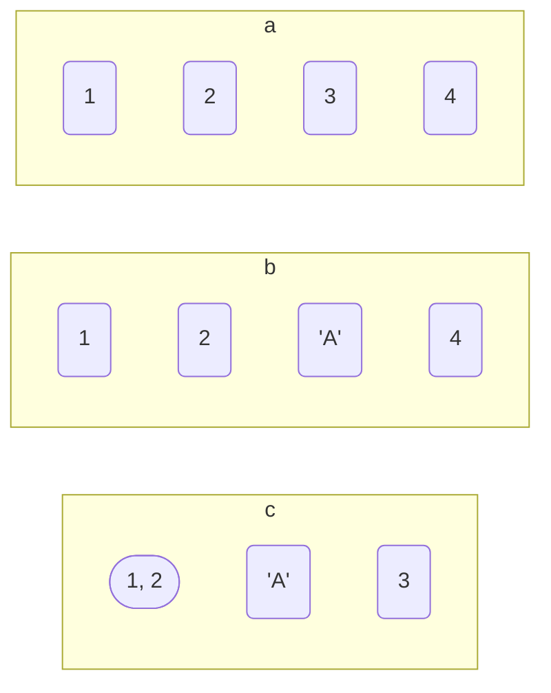
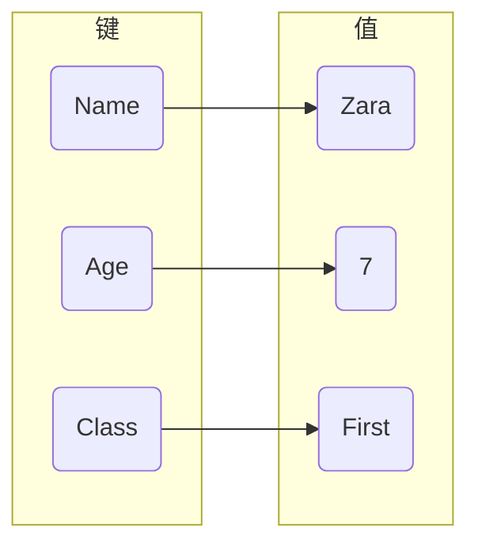

## list

### 建立

#### 一维

```py
a = [1, 2, 3, 4]

b = [1, 2, 'A', 4]

c = [[1, 2], 'A', 3]
```



#### 多维

- 建立 $x*y$ 大小数组, 初始值为 $z$

```py
[[z for i in range(x)] for j in range(y)]
```

建立$3*3$二维数组, 初始值0

```py
a = [[0 for i in range(3)] for j in range(3)]

a[0][0] = 1

a[1][1] = 3


# [[1, 0, 0], [0, 3, 0], [0, 0, 0]]
print(a)
```

### 函数

#### 添加

- 末尾添加

```py
a = [1, 2, 3]

# [1, 2, 3, 4]
a.append(4)
```

- 末尾追加其他序列

```py
a = [1, 2, 3]

b = [5, 6, 7]

# [1, 2, 3, 4, 5, 6, 7]
a.extend(b)
```

#### 删除

- 删除索引下标元素

索引index为空时删除末尾元素

```py
a = [1, 2, 3, 4]

# 4
a.pop()

# 2
a.pop(1)
```

#### 统计次数

```py
a = [1, 1, 2, 3]

# 2
a.count(1)
```

#### 反向列表元素

```py
reverse()
```

#### 合并

```py
extend()
```

```py
a = [1, 2]
b = [3, 4]
c = a + b

x = [1, 2]
y = [3, 4]
x.extend(y)
```

#### 切片

获取list中范围内值

| 语法        | 获取范围      |
| ----------- | ------------ |
| [start:end] | [start, end) |
| [start:]    | [start, 末尾] |
| [:end]      | [开头, end)   |

```py
a = [1, 2, 3, 4, 5, 6, 7]

# [3, 4, 5]
a[2:5]

# [4, 5, 6, 7]
a[3:]

# [1, 2, 3, 4, 5]
a[:5]
```

### sorted

```py
sorted(iterable, cmp=None, key=None, reverse=False)
```

sorted函数将按列表升序进行排序, 返回新list对象, 原list保持不变

| 参数     | 含义                                               |
| -------- | -------------------------------------------------- |
| iterable | 可迭代对象                                          |
| cmp      | 比较函数, 返回值大于则返回1, 小于则返回-1, 等于则返回0 |
| key      | 比较元素, 指定可迭代对象中一个元素来进行排序       |
| reverse  | 排序规则, True 降序, False 升序(默认)               |

- sort 与 sorted 区别

sort 应用于 list, sorted 可对所有可迭代对象进行排序

sort 方法仅操作列表, sorted 方法返回新list

#### 默认情况

```py
a = [3, 4, 5, 2, 1]

x = sorted(a)

# [1, 2, 3, 4, 5]
print(x)
```

- 降序排序

若按照降序排列, 需指定参数reverse=True

```py
a = [3, 4, 5, 2, 1]

# [5, 4, 3, 2, 1]
sorted(a, reverse = True)
```

#### 规则排序

若按照某个规则排序, 需指定参数key, key是一个函数对象

- 按照字符串长度排序

```py
c = ['Andrew', 'This', 'a', 'from', 'is', 'string', 'test']

# ['a', 'is', 'from', 'test', 'This', 'Andrew', 'string']
sorted(c, key = len)
```

len是内建函数, sorted函数在排序时会用len去获取每个字符串长度来排序

#### 复杂排序

如由元组构成的列表, 若要按照元组中第二个元素排序, 可用lambda定义匿名函数

```py
# 按照字母A-C-D顺序排列
s = [('zhang', 'A'), ('li', 'D'), ('wang', 'C')]

# [('zhang', 'A'), ('wang', 'C'), ('li', 'D')]
sorted(s, key = lambda x : x[1])
```

#### 类排序

排序元素是自定义类, 例如按照年龄来排序

```py
class Stu:
    def __init__(self, name: str, grade: str, age: int):
        self.name = name
        self.grade = grade
        self.age = age
    def __repr__(self):
        return repr((self.name, self.grade, self.age))

s = [Stu('john', 'A', 15), Stu('jane', 'B', 12), Stu('dave', 'B', 13)]
```

- lambda

```py
# [('jane', 'B', 12), ('dave', 'B', 13), ('john', 'A', 15)]
sorted(s, key = lambda t : t.age)
```

- attrgetter

```py
# [('jane', 'B', 12), ('dave', 'B', 13), ('john', 'A', 15)]
sorted(s, key = attrgetter('age'))
```

#### 多字段排序

sorted也可以根据多个字段来排序, 例如要先根据age排序, 若age相同则根据grade排序

```py
# [('dave', 'B', 10), ('lily', 'A', 12), ('jane', 'B', 12), ('john', 'A', 15)]
sorted(s, key = lambda t : (t.age, t.grade))

sorted(s, key = attrgetter('age', 'grade')
```

#### 不可比较情况

前面排序场景都是建立在两个元素可以互相比较前提下, 例如数值按大小比较, 字母按顺序比较

若遇到本身是不可比较, 需要我们自己来定义比较规则

python 3中, 字符串和数值是不能比较

```py
"2.5" > 2

TypeError: '>' not supported between instances of 'str' and 'int'
```

需要使用functools模块中cmp_to_key来指定比较函数是什么

```py
import functools

def cmp(x1, x2):
    if isinstance(x1, str):
        x1 = float(x1)
    if isinstance(x2, str):
        x2 = float(x2)
    return x1 - x2
```

```py
# [1.5, 2, '2', 2.5, '2.5']
sorted(nums, key=functools.cmp_to_key(cmp))
```

### 数据结构

#### 栈

List末尾作为栈顶, 模拟入栈出栈操作

- 入栈

```py
stack = [3, 4, 5]

stack.append(6)

# [3, 4, 5, 6]
print(stack)
```

- 出栈

```py
stack = [3, 4, 5, 6]

stack.pop()

# [3, 4, 5]
print(stack)
```

## dict

字典是另一种可变容器模型, 且可存储任意类型对象

字典每个键值以`:`分割, 每个键值对之间用`,`分割, 字典包括在花括号 `{}` 中

### 访问

#### 键值对

```py
d = {'Name': 'Zara', 'Age': 7, 'Class': 'First'}

# 7
d['Age']
```



#### 内置函数

| 函数                   | 描述                                    |
| ---------------------- | -------------------------------------- |
| get(key, default=None) | 返回指定键值, 若值不在字典中返回default值 |
| has_key(key)           | 若键在字典dict里返回true, 否则返回fale   |
| items()                | 以列表返回可遍历(键, 值) 元组数组        |
| keys()                 | 以列表返回一个字典所有键                 |
| values()               | 以列表返回字典中所有值                   |

- 遍历

```py
for k, v in d.items():
    print(k, v)
```

```py
d = {'name': 'Wang', 'age': 19, 'sex': 'male'}

# Wang
d.get('name', 'XXX')

# 30
d.get('height', 30)
```

### 修改

#### 普通修改

```py
dict[key] = value
```

```py
d = {'Name': 'Zara', 'Age': 7, 'Class': 'First'}

# 修改
d['Name] = 'Wang';
```

#### 字典函数

| 函数                   | 描述                                    |
| ---------------------- | -------------------------------------- |
| update(dict2)          | 把字典dict2键/值对更新到dict里           |

#### 转换

通过import json导入

| 函数    | 作用                           |
| ------- | ----------------------------- |
| loads() | 将json转化成dict               |
| dumps() | 将dict转化成json               |
| load()  | 读取json, 转成dict             |
| dump()  | 将dict转化成json后写入jsonw文件 |

### 删除

#### 普通删除

```py
del dict[key]
```

```py
d = {'Name': 'Zara', 'Age': 7, 'Class': 'First'}

del d['Age']

# {'Name': 'Zara', 'Class': 'First'}
print(d)
```

#### 字典函数

| 函数                   | 描述                                    |
| ---------------------- | -------------------------------------- |
| clear()                | 删除字典内所有元素                       |
| pop(key[, default])    | 删除字典给定键 key 所对应值              |
| popitem()              | 返回并删除字典中最后一对值                |


#### 删除字典

```py
del dict
```

## str

```py
s = "Hello World"
```


### input

python input() 接受输入数据均为字符串格式

```py
s = input()

# Helle World
print(s)

# <class 'str'>
print(type(s))
```

### 切片

| 语法          | 范围          |
| ------------- | ------------- |
| $[start:end]$ | [start, end)  |
| $[start:]$    | [start, 末尾] |
| $[:end]$      | [开头, end)   |

```py
s = "HELLO WORLD!"

# ELLO
s[1:6]

# LO WORLD!
s[3:]

# HELLO
s[:5]
```

### 函数

#### 分割

```py
split('字符')
```

```py
s = "a b c"

# ['a', 'b', 'c'] 
s.split()

# <class 'list'>
type(s.split())
```

### 查找

#### 子串查找

```py
find(s, start, end)
```

在字符串[start, end]范围里查找子串s, 若存在返回首个索引, 否则返回-1

```py
s = "abcdefg"

x = s.find("cd", 0, -1)

# 2
print(x)
```

#### 次数查找

```py
conut(s, start, end)
```

返回字符串[start, end]范围内s出现次数

### 过滤

#### 子符过滤

```py
strip(str)
```

过滤字符串开头与结尾中位于str中字符

```py
a = "a12312a"

# 12312
print(a.strip('a'))

# 2312
print(a.strip("a1"))

# 3
print(a.strip("12a"))
```

### 格式化

```py
name = "dmjcb"

age = 21
```

#### %

```py
s = "My name is %s, I am %d years old"%(name, age)
```

#### format

```py
s = "My name is {0}, I am {1} years old".format(name, age)
```

#### dict

```py
d = {'name':"dmjcb", 'age':21}

s = "My name is %(name)s, I am %(age)d years old"%data
```

## sys

$sys$ 即 $system$, 该模块提供接口用于访问 python 解释器自身使用和维护的变量, 同时模块中还提供函数可与解释器进行比较深度交互

### argv

$argv$ 即 $argument$ $value$, 是列表对象, 其中存储在命令行调用脚本时所提供"命令行参数"

列表中首个参数是被调用脚本名称

```py
import sys

print(sys.argv)
```

运行结果

```sh
dmjcb@Casper:~/PyTest$ python3 Main.py
['Main.py']
dmjcb@Casper:~/PyTest$ python3 Main.py A B C D
['Main.py', 'A', 'B', 'C', 'D']
```

### platform

得到关于运行平台详细信息

```py
import sys

print(sys.platform)
```

运行结果

```sh
dmjcb@Casper:~/PyTest$ python3 Main.py
linux
```

### byteorder

byteorder"即"字节序", 指在计算机内部存储数据时, 数据低位字节存储在存储空间中高位还是低位

小端存储时, 数据低位也存储在存储空间低位地址中, 此时sys.byteorder值为"little"

```py
import sys

print(sys.byteorder)
```

另一种存储顺序是"大端存储", 即数据高位字节存储在存储空间低位地址上, 此时sys.byteorder值为"big"

### executable

该属性是字符串, 在正常情况下值是当前运行Python 解释器对应可执行程序所在绝对路径

```py
import sys

print(sys.executable)
```

运行结果

```sh
dmjcb@Casper:~/PyTest$ python3 Main.py
/usr/bin/python3
```

## collections

$collections$ 是 $python$ 内置模块, 提供很多方便且高性能关于集合操作

### namedtuple

$namedtuple()$ 返回一个新元组子类

其规定元组元素个数, 同时除了使用下标获取元素之外, 还可通过属性直接获取

```py
from collections import namedtuple

User = namedtuple("User",["name", "age", "weight"])

user = User("admin", "20", "60")

name, age, weight = user

# admin
print(user[0])

# admin 20 60
print(name, age, weight)

# admin 20 60
print(user.name, user.age, user.weight)
```

$namedtuple()$ 相当于直接定义了一个新类, 其比直接定义 $class$ 方式省很多空间, 同时其返回值是一个 $tuple$, 支持 $tuple$ 各种操作

- 将序列直接转换为新 $tuple$ 对象

```py
user = ["root", 32, 65]
user = User._make(user) 

# User(name='root', age=32, weight=65)
print(user) 
```

- 返回一个 $dict$

```py
user = User("admin", 20, 60)

# OrderedDict([('name', 'admin'), ('age', 20), ('weight', 60)])
print(user._asdict()) 
```

### ChainMap

$ChainMap()$ 可以将多个字典集合到一个字典中去, 对外提供统一视图

该操作并是不将所有字典做了一次拷贝, 而是在多个字典上层又进行了一次封装

```py
from collections import ChainMap

user1 = {"name":"admin", "age":"20"}
user2 = {"name":"root", "weight": 65}

users = ChainMap(user1, user2)

# [{'name': 'admin', 'age': '20'}, {'name': 'root', 'weight': 65}]
print(users.maps)

users.maps[0]["name"] = "tiger"

# [{'name': 'tiger', 'age': '20'}, {'name': 'root', 'weight': 65}]
print(users.maps)

# name tiger
# weight 65
# age 20
for key, value in users.items():
    print(key, value)
```

若 $ChainMap()$ 中多个字典有重复 $key$, 查看时可看到所有 $key$, 但遍历时却只会遍历 $key$ 第一次出现位置, 其余忽略

同时可通过返回新视图来更新原来字典数据, 进一步验证了该操作不是做拷贝, 而是直接指向原字典

### deque

$dqueue$ 指 $double-ended$ $queue$, 是一种类似列表($list$)容器, 实现了在两端快速添加($append$)和弹出(pop)操作, 大大加快了遍历速度

```py
from collections import deque

q = deque([1, 2, 3])

q.append('4')

q.appendleft('0')

# deque(['0', 1, 2, 3, '4'])
print(q)

# 0
print(q.popleft())
```

### Counter

$Counter$ 可以简单理解为一个计数器, 可以统计每个元素出现次数

```py
from collections import Counter

animals = ["cat", "dog", "cat", "bird", "horse", "tiger", "horse", "cat"]
animals_counter = Counter(animals)

# Counter({'cat': 3, 'horse': 2, 'dog': 1, 'bird': 1, 'tiger': 1}) 
print(animals_counter)

# [('cat', 3), ('horse', 2)]
print(animals_counter.most_common(2))
```