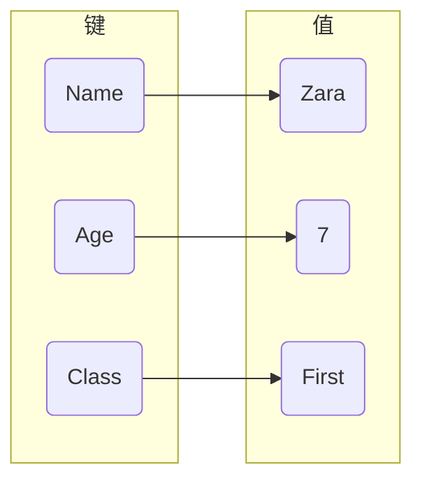

# 字典

字典是另一种可变容器模型, 且可存储任意类型对象

字典每个键值以`:`分割, 每个键值对之间用`,`分割, 字典包括在花括号 `{}` 中

## 查询

### 访问

#### 键值对

```py
d = {'Name': 'Zara', 'Age': 7, 'Class': 'First'}

# 7
d['Age']
```



#### 内置函数

| 函数                   | 描述                                    |
| ---------------------- | -------------------------------------- |
| get(key, default=None) | 返回指定键值, 若值不在字典中返回default值 |
| has_key(key)           | 若键在字典dict里返回true, 否则返回fale   |
| items()                | 以列表返回可遍历(键, 值) 元组数组        |
| keys()                 | 以列表返回一个字典所有键                 |
| values()               | 以列表返回字典中所有值                   |

- 遍历

```py
for k, v in d.items():
    print(k, v)
```

```py
d = {'name': 'Wang', 'age': 19, 'sex': 'male'}

# Wang
d.get('name', 'XXX')

# 30
d.get('height', 30)
```

## 修改

### 普通修改

```py
dict[key] = value
```

```py
d = {'Name': 'Zara', 'Age': 7, 'Class': 'First'}

# 修改
d['Name] = 'Wang';
```

### 字典函数

| 函数                   | 描述                                    |
| ---------------------- | -------------------------------------- |
| update(dict2)          | 把字典dict2键/值对更新到dict里           |

#### 转换

通过import json导入

| 函数    | 作用                           |
| ------- | ----------------------------- |
| loads() | 将json转化成dict               |
| dumps() | 将dict转化成json               |
| load()  | 读取json, 转成dict             |
| dump()  | 将dict转化成json后写入jsonw文件 |

## 删除

### 普通删除

```py
del dict[key]
```

```py
d = {'Name': 'Zara', 'Age': 7, 'Class': 'First'}

del d['Age']

# {'Name': 'Zara', 'Class': 'First'}
print(d)
```

### 字典函数

| 函数                   | 描述                                    |
| ---------------------- | -------------------------------------- |
| clear()                | 删除字典内所有元素                       |
| pop(key[, default])    | 删除字典给定键 key 所对应值              |
| popitem()              | 返回并删除字典中最后一对值                |


### 删除字典

```py
del dict
```

