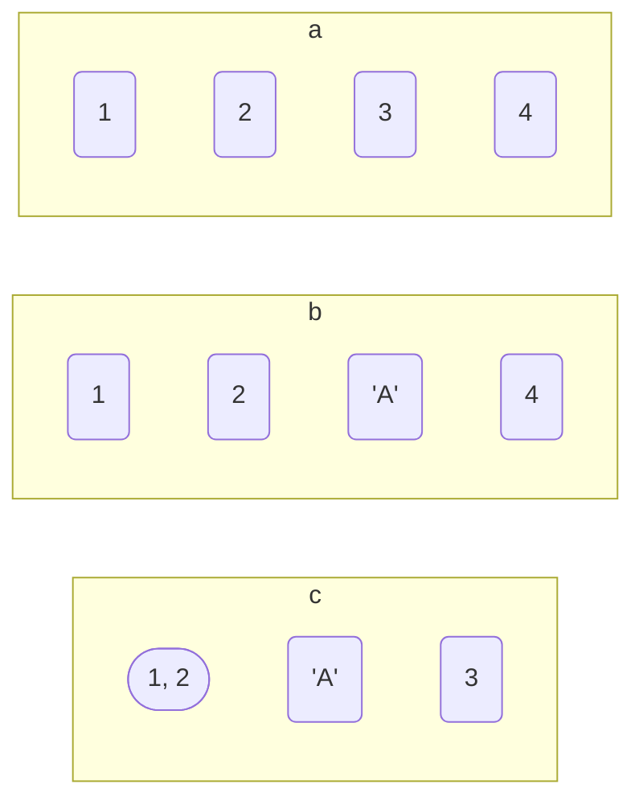

## 使用

### 建立

#### 一维

```py
a = [1, 2, 3, 4]

b = [1, 2, 'A', 4]

c = [[1, 2], 'A', 3]
```



#### 多维

- 建立 $x*y$ 大小数组, 初始值为 $z$

```py
[[z for i in range(x)] for j in range(y)]
```

建立$3*3$二维数组, 初始值0

```py
a = [[0 for i in range(3)] for j in range(3)]

a[0][0] = 1

a[1][1] = 3


# [[1, 0, 0], [0, 3, 0], [0, 0, 0]]
print(a)
```

### 函数

#### 添加

- 末尾添加

```py
a = [1, 2, 3]

# [1, 2, 3, 4]
a.append(4)
```

- 末尾追加其他序列

```py
a = [1, 2, 3]

b = [5, 6, 7]

# [1, 2, 3, 4, 5, 6, 7]
a.extend(b)
```

#### 删除

- 删除索引下标元素

索引index为空时删除末尾元素

```py
a = [1, 2, 3, 4]

# 4
a.pop()

# 2
a.pop(1)
```

#### 统计次数

```py
a = [1, 1, 2, 3]

# 2
a.count(1)
```

#### 反向列表元素

```py
reverse()
```

#### 合并

```py
extend()
```

```py
a = [1, 2]
b = [3, 4]
c = a + b

x = [1, 2]
y = [3, 4]
x.extend(y)
```

#### 切片

获取list中范围内值

| 语法        | 获取范围      |
| ----------- | ------------ |
| [start:end] | [start, end) |
| [start:]    | [start, 末尾] |
| [:end]      | [开头, end)   |

```py
a = [1, 2, 3, 4, 5, 6, 7]

# [3, 4, 5]
a[2:5]

# [4, 5, 6, 7]
a[3:]

# [1, 2, 3, 4, 5]
a[:5]
```

### sorted

```py
sorted(iterable, cmp=None, key=None, reverse=False)
```

sorted函数将按列表升序进行排序, 返回新list对象, 原list保持不变

| 参数     | 含义                                               |
| -------- | -------------------------------------------------- |
| iterable | 可迭代对象                                          |
| cmp      | 比较函数, 返回值大于则返回1, 小于则返回-1, 等于则返回0 |
| key      | 比较元素, 指定可迭代对象中一个元素来进行排序       |
| reverse  | 排序规则, True 降序, False 升序(默认)               |

- sort 与 sorted 区别

sort 应用于 list, sorted 可对所有可迭代对象进行排序

sort 方法仅操作列表, sorted 方法返回新list

#### 默认情况

```py
a = [3, 4, 5, 2, 1]

x = sorted(a)

# [1, 2, 3, 4, 5]
print(x)
```

- 降序排序

若按照降序排列, 需指定参数reverse=True

```py
a = [3, 4, 5, 2, 1]

# [5, 4, 3, 2, 1]
sorted(a, reverse = True)
```

#### 规则排序

若按照某个规则排序, 需指定参数key, key是一个函数对象

- 按照字符串长度排序

```py
c = ['Andrew', 'This', 'a', 'from', 'is', 'string', 'test']

# ['a', 'is', 'from', 'test', 'This', 'Andrew', 'string']
sorted(c, key = len)
```

len是内建函数, sorted函数在排序时会用len去获取每个字符串长度来排序

#### 复杂排序

如由元组构成的列表, 若要按照元组中第二个元素排序, 可用lambda定义匿名函数

```py
# 按照字母A-C-D顺序排列
s = [('zhang', 'A'), ('li', 'D'), ('wang', 'C')]

# [('zhang', 'A'), ('wang', 'C'), ('li', 'D')]
sorted(s, key = lambda x : x[1])
```

#### 类排序

排序元素是自定义类, 例如按照年龄来排序

```py
class Stu:
    def __init__(self, name: str, grade: str, age: int):
        self.name = name
        self.grade = grade
        self.age = age
    def __repr__(self):
        return repr((self.name, self.grade, self.age))

s = [Stu('john', 'A', 15), Stu('jane', 'B', 12), Stu('dave', 'B', 13)]
```

- lambda

```py
# [('jane', 'B', 12), ('dave', 'B', 13), ('john', 'A', 15)]
sorted(s, key = lambda t : t.age)
```

- attrgetter

```py
# [('jane', 'B', 12), ('dave', 'B', 13), ('john', 'A', 15)]
sorted(s, key = attrgetter('age'))
```

#### 多字段排序

sorted也可以根据多个字段来排序, 例如要先根据age排序, 若age相同则根据grade排序

```py
# [('dave', 'B', 10), ('lily', 'A', 12), ('jane', 'B', 12), ('john', 'A', 15)]
sorted(s, key = lambda t : (t.age, t.grade))

sorted(s, key = attrgetter('age', 'grade')
```

#### 不可比较情况

前面排序场景都是建立在两个元素可以互相比较前提下, 例如数值按大小比较, 字母按顺序比较

若遇到本身是不可比较, 需要我们自己来定义比较规则

Python 3中, 字符串和数值是不能比较

```py
"2.5" > 2

TypeError: '>' not supported between instances of 'str' and 'int'
```

需要使用functools模块中cmp_to_key来指定比较函数是什么

```py
import functools

def cmp(x1, x2):
    if isinstance(x1, str):
        x1 = float(x1)
    if isinstance(x2, str):
        x2 = float(x2)
    return x1 - x2
```

```py
# [1.5, 2, '2', 2.5, '2.5']
sorted(nums, key=functools.cmp_to_key(cmp))
```

## 数据结构

### 栈

List末尾作为栈顶, 模拟入栈出栈操作

- 入栈

```py
stack = [3, 4, 5]

stack.append(6)

# [3, 4, 5, 6]
print(stack)
```

- 出栈

```py
stack = [3, 4, 5, 6]

stack.pop()

# [3, 4, 5]
print(stack)
```
