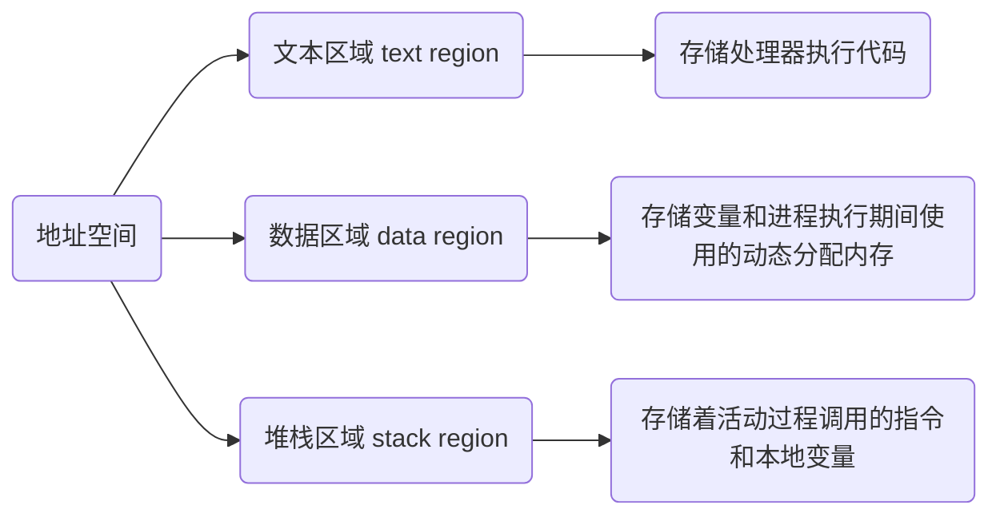

> [进程间通信和线程间通信几种方式](https://www.cnblogs.com/fanguangdexiaoyuer/p/10834737.html#_label6_1)

程序是一组指令(或代码)集合, 它描述计算机应如何执行一系列操作

程序本身是静态, 存在于存储介质(如硬盘)中, 不占用CPU和内存等资源

## 进程

进程(Process)指在计算机中已经运行或等待运行的程序实例, 是系统进行资源分配和调度的基本单位

进程是程序一次执行过程, 是动态概念, 一个程序可以多次运行, 每次运行都会创建一个新进程

进程包含了程序计数器、寄存器当前值以及内存状态(包括程序代码和数据)

### 特性

#### 独立性

进程是系统中资源分配的基本单位, 每个进程都拥有自己独立地址空间, 互不干扰

#### 动态性

进程有生命周期, 包括创建、就绪、运行、阻塞、挂起和终止等状态

#### 并发性

多个进程可以在单个或多个处理器上并发执行, 实现多任务处理

#### 交互性

进程在执行过程中可能需要与其他进程或系统进行交互, 例如通过消息传递、管道、共享内存等方式

### 状态

#### 就绪状态

进程已经获得除CPU以外所有资源, 等待CPU分配

#### 运行状态

进程正在CPU上执行

#### 阻塞状态

进程因为等待某个事件(如I/O操作完成)而暂时不能继续执行

#### 挂起状态

进程被操作系统从内存中移出, 放入磁盘交换空间, 等待重新调入内存执行

### 表示

#### 结构

进程控制块(PCB), 是操作系统用于描述和控制进程的数据结构, 包含了进程标识、状态、优先级、程序计数器、寄存器、内存管理信息、资源清单等

程序段, 是进程代码部分, 被组织成可执行指令序列

数据段, 包含了进程在执行过程中所用各种数据, 包括全局变量、静态变量等

#### 地址空间

每个进程都有自己地址空间, 包括,



#### 进程ID

每个进程都有一个非负整形表示唯一进程ID

- 进程ID 1

init进程, 在自举过程结束时用内核调用

- 进程ID 2

页守护进程, 负责支持虚拟存储器系统分页操作

### 操作

#### 创建

```c
#include<unistd.h>
pid_t fork(void);
```

一个现有进程可调用fork函数创建一个新进程

- 调用一次返回两次

| 返回值          | 含义    |
| --------------- | ------ |
| 0               | 子进程 |
| 新建子进程进程ID | 父进程 |

- 并发执行

fork之后是父进程先执行还是子进程先执行不确定

- 相同但独立地址空间

- 共享文件

子进程继承父进程所有打开文件

子进程与父进程继续执行fork调用之后指令

```c
#include <stdio.h>
#include <unistd.h>

int main(void) {
    pid_t pid = fork();
    if (pid == 0) {
        printf("子进程\n");
    } else {
        printf("父进程\n");
    }
    return 0;
}
```

进程创建后, 父子进程都有各自不同地址空间, 其中一个进程在其地址空间修改对另一个进程不可见

子进程初始化空间是父进程一个副本, 涉及两个不同地址空间, 不可写内存区共享, 某些UNIX实现使程序正文在两者间共享, 因为它是不可修改

还有一种写时复制共享技术, 子进程共享父进程所有内存, 一旦两者之一想要修改部分内存, 则这块内存被复制确保修改发生在当前进程私有内存区域

```c
#include<stdio.h>
#include<stdlib.h>
#include<unistd.h>

int g_var = 6;

int main(void){
    int var = 88;
    pid_t pid = fork();
    // 子进程修改值
    if(pid == 0){
        g_var++;
        var++;
    }
    // 父进程休眠两秒, 让子进程先输出
    else{
        sleep(1);
    }
    // father pid = 114014, pid = 114015, g_var = 7, var = 89
    // father pid = 113970, pid = 114014, g_var = 6, var = 88
    printf("father pid = %ld, pid = %ld, g_var = %d, var = %d\n", getppid(), getpid(), g_var, var);
    return 0;
}
```

#### 获取进程ID

- 返回调用进程ID

```c
pid_t getpid(void)
```

- 返回调用进程父进程ID

```c
pid_t getppid(void)
```

### 进程间通信

#### 管道(pipe)

一种半双工通信方式, 数据从一端写入, 另一端读取

#### 消息队列(nessage queue)

允许进程之间以消息形式进行通信, 消息按先进先出顺序排列

#### 共享内存(shared memory)

多个进程可以访问同一块内存区域, 实现高效通信

#### 信号量(semaphore)

用于进程间同步和互斥, 防止资源竞争和死锁

#### 套接字(socket)

支持跨网络进程间通信, 广泛应用于网络通信

## 线程

线程是进程中一个执行流, 是CPU调度和分派基本单位, 是程序执行的最小单位

线程是操作系统调度的基本单位, 一个进程通常包含多个线程, 这些线程可以并发执行, 从而提高程序执行效率

线程是进程中一个实体, 被系统独立调度和分派, 但不拥有系统资源, 只拥有如程序计数器、栈等

线程与同属一个进程的其它线程共享进程所拥有全部资源, 如内存、文件描述符等

### 特性

#### 独立性

线程在进程内部独立执行, 但与其他线程共享进程资源

#### 并发性

多个线程可以在同一个进程内并发执行, 充分利用多处理器并行处理能力

#### 动态性

线程有生命周期, 包括新建、就绪、运行、阻塞和死亡等状态

#### 共享性

线程共享进程资源, 这使得线程间通信和同步变得相对容易

### 状态

线程也有就绪、阻塞和运行三种基本状态

#### 就绪状态

指线程具备运行的所有条件, 逻辑上可以运行, 在等待处理机

#### 运行状态

指线程占有处理机正在运行

#### 阻塞状态

指线程在等待一个事件(如某个信号量), 逻辑上不可执行

### 操作

#### 创建

```c
// 创建成功返回0, 否则返回Exxx(正数)
int pthread_create(pthread_t *tid, const pthread_attr_t *attr, void *(*func) (void *), void *arg);
```

| 参数 | 含义 |
| -------------------------- | ---------------------------------------------------------------------- |
| pthread_t \*tid | 线程id类型为pthread_t, 通常为无符号整型, 函数调用成功时, 通过*tid指针返回 |
| const pthread_attr_t *attr | 指定创建线程属性, 如线程优先级、初始栈大小、是否为守护进程等, NULL为默认值 |
| void *(*func) (void *) | 函数指针func, 指定当新线程创建后, 将执行的函数 |
| void *arg | 线程将执行函数的参数, 若传递多个参数, 需封装到结构体中 |

```c
// 1.有一int型全局变量g_flag初始值为0;
// 2.在主线称中起动线程1, 打印"this is thread1", 并将g_flag设置为1
// 3.在主线称中启动线程2, 打印"this is thread2", 并将g_flag设置为2
#include <stdio.h>
#include <stdlib.h>
#include <pthread.h>
#include <errno.h>
#include <unistd.h>

int g_flag = 0;

void *thread1(void *arg){
    printf("进入线程1\n");
    printf("线程1, g_flag: %d, 线程pid %u\n", g_flag, (unsigned int)pthread_self());
    g_flag = 1;
    printf("线程1, g_flag: %d, 线程pid %u\n", g_flag, (unsigned int)pthread_self());
    printf("线程1结束\n");
    pthread_exit(0);
}

void *thread2(void *arg){
    printf("进入线程2\n");
    printf("线程2, g_flag: %d, 线程pid %u\n", g_flag, (unsigned int)pthread_self());
    g_flag = 2;
    printf("线程2, g_flag: %d, 线程pid %u\n", g_flag, (unsigned int)pthread_self());
    printf("线程2结束\n");
    pthread_exit(0);
}

int main(int argc, char** argv){
    pthread_t tid1, tid2;
    int rc2 = pthread_create(&tid2, NULL, thread2, NULL);
    if(rc2 != 0){
        printf("%s: %d\n", __func__, strerror(rc2));
    }
    int rc1 = pthread_create(&tid1, NULL, thread1, &tid2);
    if(rc1 != 0){
        printf("%s: %d\n", __func__, strerror(rc1));
    }
    return 0;
}
```

### 线程间通信

线程间通信主要通过`共享内存`, 上下文切换很快, 资源开销较少, 但相比进程不够稳定容易丢失数据

一个线程可以创建和撤消另一个线程, 同一进程中多个线程之间可以并发执行

由于线程之间相互制约, 致使线程在运行中呈现出间断性

### 锁机制

包括互斥锁、条件变量、读写锁

#### 互斥锁

提供以排他方式防止数据结构被并发修改的方法

#### 读写锁

允许多个线程同时读共享数据, 而对写操作是互斥

#### 条件变量

可以以原子方式阻塞进程, 直到某个特定条件为真为止. 对条件测试是在互斥锁保护下进行

条件变量始终与互斥锁一起使用

## 协程

协程(Coroutine)是一种用户态轻量级线程, 允许程序在不同执行点之间自由切换, 而不需要操作系统内核干预, 其调度完全由用户控制

协程调度切换时, 会将寄存器上下文和栈别处保存, 在切回时, 恢复先前保存寄存器上下文和栈, 因为直接操作栈则基本没有内核切换开销, 可以不加锁访问全局变量, 所以上下文切换非常快
未选择文件
