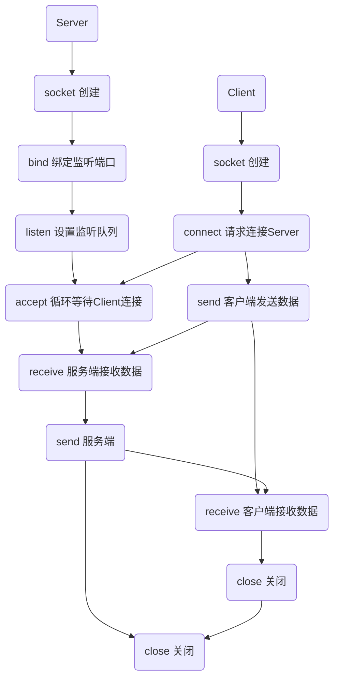
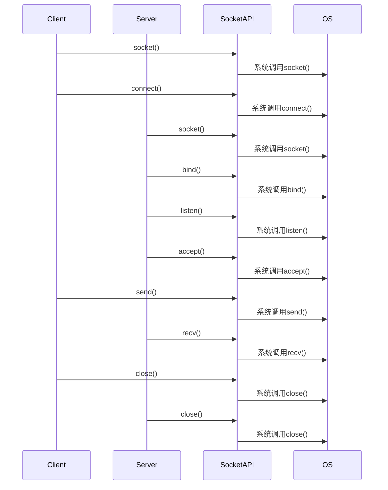

## 本地进程通信

- 消息传递(管道、消息队列、$FIFO$)

- 同步(互斥量、条件变量、读写锁、文件和写记录锁、信号量)

- 共享内存(匿名的和具名的, 如$channel$)

- 远程过程调用($RPC$)

## 网络中进程通信

- 如何标识一台主机, 即怎样确定我们将要通信的进程是在那一台主机上运行

- 如何标识唯一进程?本地通过 pid 标识, 网络中应该怎样标识

解决办法:

- 网络层的ip地址可以唯一标识网络中的主机

- 传输层协议, 端口可以唯一标识主机中的应用程序(进程), 因此利用ip地址, 协议, 端口就可标识网络的进程, 网络中的进程通信就可利用此标志与其它进程进行交互

## 流程图

