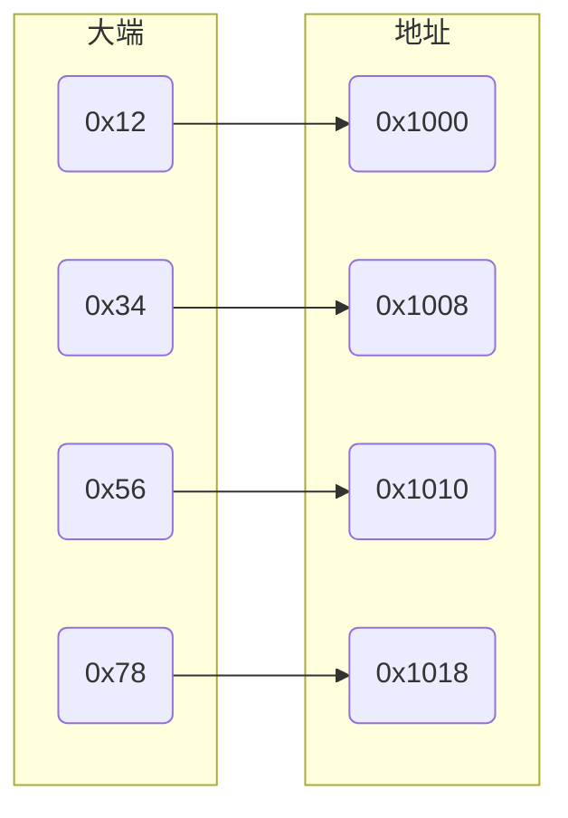

> [维基百科-加法器](https://zh.wikipedia.org/wiki/%E5%8A%A0%E6%B3%95%E5%99%A8)
> [半加器的分解](https://spcp.xiaogd.net/half-adder/half-adder-divide-two-part.html)

## 存储

### 大小端

在CPU内存中有两种存放方式, 假设数据0x12345678从地址0x1000开始存放

#### 大端

大端是**高字节**存放到内存**低地址**

$0x12345678$ 中 $0x12$存到低地址, $0x78$存到高地址



#### 小端

小端是**高字节**存放到内存**高地址**
$0x12345678$ 中 $0x12$存到高地址, $0x78$存到低地址


#### 有效字节

- MSB

Most Significant Byte, 最高有效字节

- LSB

Least Significant Byte, 最低有效字节

32位int型数$0x12345678$, MSB为$0x12$, LSB为$0x78$

### 大小

#### 位

`bit` 意为位或比特, 是电子计算机中最小数据单位

每一位状态只能是 `0` 或 $1$

#### 字节

`Byte`意为字节, 是计算机处理数据的基本单位

1字节为8位, 1Byte = 8bit

### 格式

- ASCII码

一个英文字母占一个字节空间, 如一个ASCII码就是一个字节

- UTF-8编码

一个英文字符等于一个字节, 一个中文(含繁体)等于三个字节

中文标点占三个字节, 英文标点占一个字节

- Unicode编码

一个英文等于两个字节, 一个中文(含繁体)等于两个字节, 中文标点占两个字节, 英文标点占两个字节

### 编码

#### 原码

- 正数

按照绝对值大小转换成二进制数, $32$位计算中, $5$原码为

$00000000$ $00000000$ $00000000$ $00000101$

- 负数

按照绝对值大小转换成二进制数, 且`最高位`补$1$, $32$位计算中, $-5$原码为

$10000000$ $00000000$ $00000000$ $00000101$

#### 反码

- 正数

反码与原码相同

- 负数

对原码中除符号位之外每位取反, $32$位计算中, $-5$反码为

$1111111$ $11111111$ $11111111$ $11111010$

#### 补码

- 正数

补码与原码相同

- 负数

补码为反码最后一位加1, $32$位计算中, $-5$补码为

$1111111$ $11111111$ $11111111$ $11111011$

#### 加法

- 整数

[$A$]$_补$ $+$ [$B$]$_补$ $=$ [$A+B$]$_补$ $mod$ $2^{n+1}$

- 小数

[$A$]$_补$ $+$ [$B$]$_补$ $=$ [$A+B$]$_补$ $mod$ $2$

#### 减法

- 整数

[$A-B$]$_补$ $=$ [$A$]$_补$ $+$ [$-B$]$_补$ $mod$ $2^{n+1}$

- 小数

[$A-B$]$_补$ $=$ [$A$]$_补$ $+$ [$-B$]$_补$ $mod$ $2$

## 计算

### 半加器


将两个一位二进制数相加

- 输入端口 $A$, $B$

- 输出端口 进位 $C$ = $A$ & $B$, 和 $S$ = $A$ ^ $B$

| 输入A | 输入B | 进位 C | 和 S |
| ----- | ----- | ------ | ---- |
| 0     | 0     | 0      | 0    |
| 1     | 0     | 0      | 1    |
| 0     | 1     | 0      | 1    |
| 1     | 1     | 1      | 0    |

### 全加器

全加器(full adder)将两个一位二进制数相加, 并根据接收到的低位进位信号, 输出和、进位输出

全加器三个输入信号为两个加数A、B和低位进位Cin

全加器通常可以通过级联(cascade)方式, 构成多位(如8位、16位、32位)二进制数加法器的基本部分


| $A$ | $B$ | $Cin$ | $Cout$ | $S$ |
| --- | --- | ----- | ------ | --- |
| 0   | 0   | 0     | 0      | 0   |
| 1   | 0   | 0     | 0      | 1   |
| 0   | 1   | 0     | 0      | 1   |
| 1   | 1   | 0     | 1      | 0   |
| 0   | 0   | 1     | 0      | 1   |
| 1   | 0   | 1     | 1      | 0   |
| 0   | 1   | 1     | 1      | 0   |
| 1   | 1   | 1     | 1      | 1   |

### 脉动进位加法器


```c
// 全加器代码
int add(int a, int b) {
    int c;
    int s;
    if (a == 0 || b == 0) {
        return 0;
    }
    // 进位标志
    c = a & b;

    // 进位c左移1位
    c <<= 1;
    // 当前和s
    s = a ^ b;
    // 结束标志是输入值一个为0
    return add(s, c);
}
```

3 + 9 = 12 $->$ 0011 + 1001 = 1100


## 寄存器

### 通用寄存器

| 名称 | 作用       |
| ---- | --------- |
| ax   | 累积暂存器 |
| bx   | 基底暂存器 |
| cx   | 计数暂存器 |
| dx   | 资料暂存器 |

| 名称 | 作用                                                     |
| ---- | ------------------------------------------------------- |
| eax  | 累加器(accumulator), 是很多加法乘法指令的缺省寄存器        |
| ebx  | 基地址(base)寄存器, 在内存寻址时存放基地址                 |
| ecx  | 计数器(counter), 是重复(REP)前缀指令和LOOP指令的内定计数器 |
| edx  | 用来放整数除法产生的余数                                  |

### 索引暂存器

| 名称 | 作用           |
| ---- | ------------- |
| si   | 来源索引暂存器 |
| di   | 目的索引暂存器 |

| 名称 | 作用                              |
| ---- | -------------------------------- |
| esi  | 源索引寄存器(source index)        |
| edi  | 目标索引寄存器(destination index) |

用于字符串操作指令, esi指向源串, edi指向目标串

### 堆叠、基底暂存器

| 名称 | 作用           |
| ---- | ------------- |
| sp   | 堆叠指标暂存器 |
| bp   | 基底指标暂存器 |

| 名称 | 作用                                                  |
| ---- | ---------------------------------------------------- |
| esp  | 堆栈指针                                              |
| ebp  | 基址指针(base pointer), 用作高级语言函数调用的"框架指针" |

esp 专门用作堆栈指针, 被形象地称为栈顶指针, 堆栈顶部是地址小区域, 压入堆栈数据时, 在32位平台上esp每次减少4字节

> [从零开始写OS内核-BIOS启动到实模式](https://segmentfault.com/a/1190000040131294)

## 启动

### 读取 BIOS

按下电源按钮后, 计算机首先读取一块存储有基本输入输出系統即 BIOS 程序的芯片

开机后 CPU 初始模式是实模式, 地址宽度为 20 位, 即最大地址空间 1MB, 其划分固定, 每一块都被映射到不同设备上


#### BIOS作用

(1) 开机后 CPU 指令寄存器 IP 被强置为地址 0xFFFF0, 该地址被映射到 BIOS 固件上代码, 是计算机开机后第一条指令地址

(2) CPU 开始执行 BIOS 上代码, 这一部分主要是硬件输入输出设备相关的检查, 以及建立一个最初中断向量表

(3) BIOS 代码最后阶段工作, 是检查启动盘上 MBR 分区, 即磁盘上第一个 512B 内容, 又叫引导分区

BIOS 会对这 512B 做一个检查, 其最后2个字节必须是0x55 和 0xaa, 否则就不是合法启动盘

(4) 检查通过后, BIOS 将这 512B 加载到内存 0x7C00 处, 到 0x7E00 为止, 然后指令跳转到 0x7C00 开始执行


#### 内存布局规划

TODO