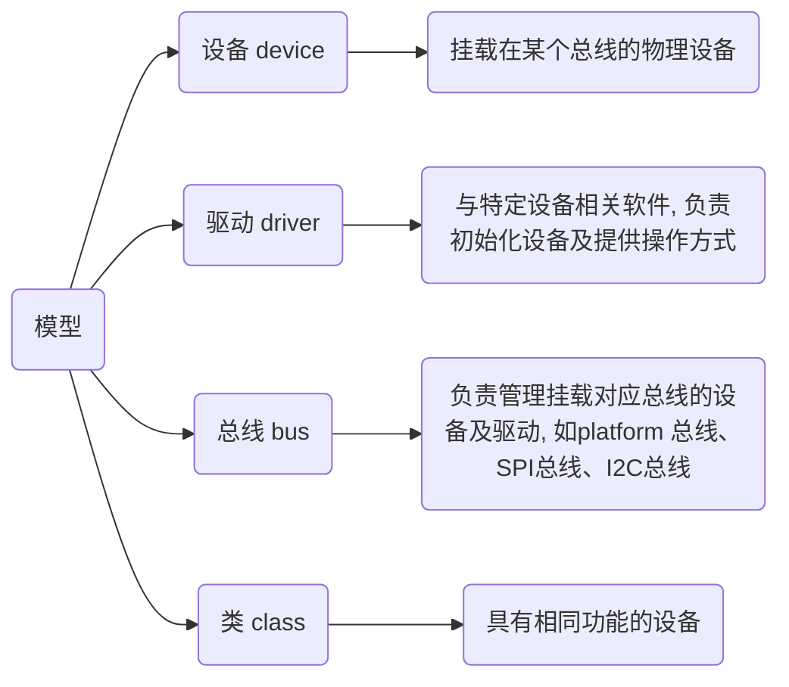

## 设备种类

### 字符设备

字符设备是指只能逐字节读写的设备, 面向流, 不能随机读取设备内存中的某一数据, 读取数据需要按照先后数据

常见字符设备有鼠标、键盘、串口、控制台、LED设备等

### 块设备

块设备是指可以从设备的任意位置读取一定长度数据的设备, 常见块设备包括电脑硬盘、SD卡、U盘、光盘等

### 网络设备

网络事务都经过一个网络接口形成, 即一个能够和其他主机交换数据的设备

访问网络接口的方法仍然是给它们分配一个唯一名字(如eth0), 但这个名字在文件系统中不存在对应的节点

常见网络设备包括网卡设备、蓝牙设备等

## 设备管理

Linux用户程序通过设备文件(或称设备节点)来使用驱动程序操作字符设备和块设备

Linux下的各种硬件设备以文件的形式存放于/dev目录下, 可以使用`ls /dev` 查看

Linux把对硬件的操作全部抽象成对文件的操作

在设备管理中, 除了设备类型外, 内核还需要一对被称为主从设备号的参数, 才能唯一标识一个设备

### 主设备号

用于标识驱动程序, 相同的主设备号使用相同的驱动程序, 例如: S3C2440 有串口、LCD、触摸屏三种设备, 他们的主设备号各不相同

### 从设备号

用于标识同一驱动程序的不同硬件

例PC的IDE设备, 主设备号用于标识该硬盘, 从设备号用于标识每个分区, 2440有三个串口, 每个串口的主设备号相同, 从设备号用于区分具体属于那一个串口

## /dev

- /dev/null

空设备, 也称为位桶($bit bucket$)、回收站、无底洞, 向它输出任何数据都会被`抛弃`

若不想让消息以标准输出显示或写入文件, 那么可以将消息重定向到位桶

- /dev/zero

输入设备, 可用于向设备或文件无限写入字符串0, 初始化文件
