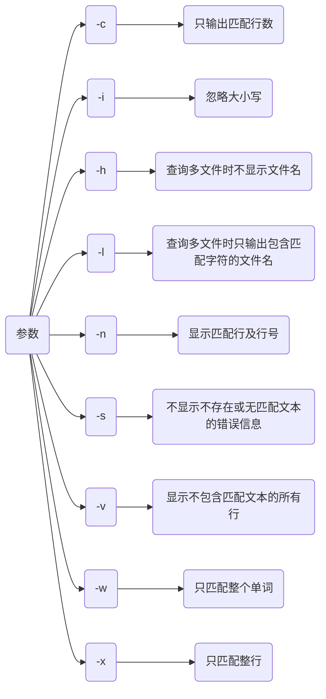
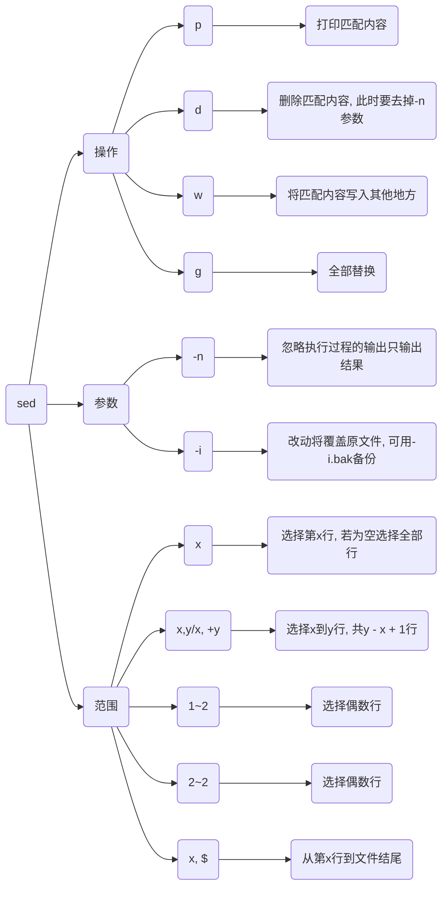
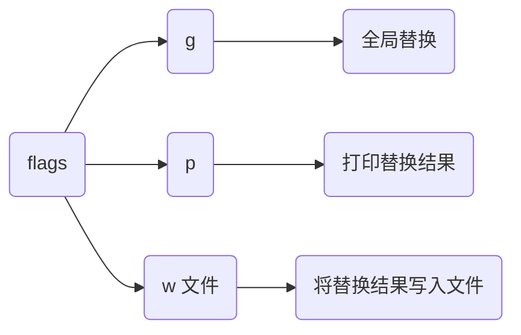
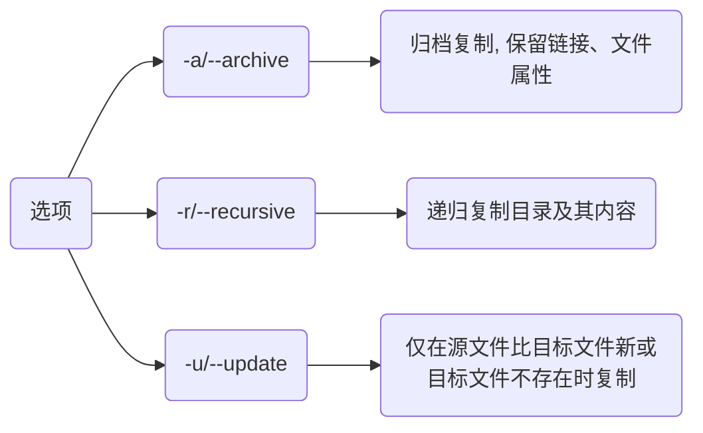
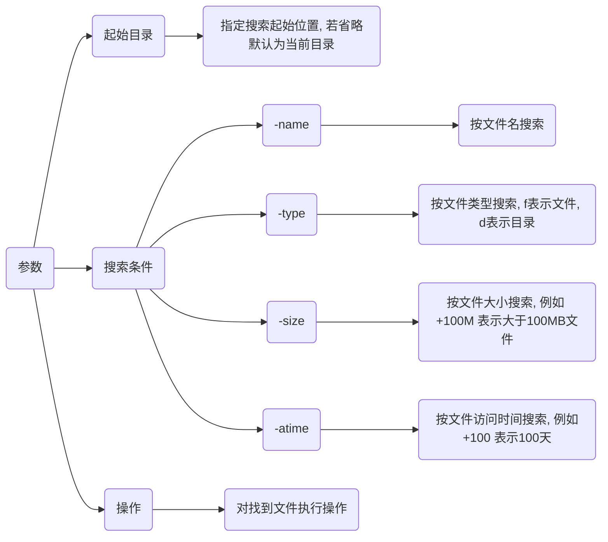

## 文件工具

### awk

逐行读入文件, 以空格为默认分隔符将每行切片, 并进行各种分析处理

```sh
awk 'pattern { action }' 文件名
```

| 参数    | 含义               |
| ------- | ------------------ |
| pattern | 指定要匹配模式      |
| action  | 匹配到内容时执行命令 |

| 内置变量 | 含义             |
| ------- | ---------------- |
| NR      | 当前记录数(行号)  |
| NF      | 当前记录中的字段数 |
| $0      | 当前记录(整行)    |
| $1, $2..| 当前记录字段      |

- 打印行号和每行内容

```sh
awk '{ print NR, $0 }' filename
```

- 打印文件第一列

```sh
awk '{ print $1 }' filename
```

#### BEGIN 和 END 块

BEGIN 块在处理任何输入行之前执行, END 块在处理完所有输入行之后执行

```sh
awk 'BEGIN { print "Start" } { print $1 } END { print "End" }' filename
```

### grep

用于搜索文本中匹配指定模式字符串

```sh
grep 参数 匹配项 (文件名, 若为空则从标准输入读取数据)
```



#### 单查询

- 模糊匹配

含有匹配项的字段都会匹配

```sh
grep (模式) 匹配项
```

```sh
# 匹配结果为abc abcd abcdef
grep "abc"
```

- 精确匹配

```sh
grep -w 匹配项
```

```sh
# 结果为abc
grep -w "abc"
```

#### 与查询

在前一个查询结果中继续查询

```sh
grep '模式1' 匹配项 | grep '模式2'
```

- 查询3月10日16点30时间段内ssh登录成功情况

```sh
grep 'Mar 10 16:3' /var/log/secure | grep Accepted
```

#### 或查询

```sh
grep '模式1|模式2' 匹配项

# 或者
grep -E '模式1|模式2' 匹配项
```

#### 非查询

去除包含模式1进程行, 避免影响最终数据正确性

```sh
grep -v 模式1 匹配项
```

- 查询python进程信息时排除grep本身影响
 
```sh
ps -aux | grep python | grep -v grep
```


#### 正则

- 查看以pattern开头行

```sh
grep ^pattern
```

- 查找以pattern结尾行

```sh
grep pattern$
```

- 查找UniversalDeclarationOfHumanRights.txt文件中含有human句子

```sh
grep human UniversalDeclarationOfHumanRights.txt
```


- 查找UniversalDeclarationOfHumanRights.txt文件中以The开头句子

```sh
grep ^The UniversalDeclarationOfHumanRights.txt
```


### sed

对文本进行过滤和转换

```sh
sed 参数 '起始范围, 结束范围 操作' 文件
```



#### 替换

```sh
s/旧文本/新文本/flags
```



- 将file.txt中foo替换为bar

```sh
sed 's/foo/bar/' file.txt
```

- Ubuntu换源, 修改/etc/apt/sources.list

```sh
sed -i 's#security.ubuntu.com#mirrors.aliyun.com#g' /etc/apt/sources.list
sed -i 's#cn.archive.ubuntu.com#mirrors.aliyun.com#g' /etc/apt/sources.list
```

#### 打印

若字符串中带有路径符号 `/`, 可用 `#` 分隔

- 打印file.txt 1-5行
 
```sh
sed -n '1, 5 p' file.txt
```

#### 添加

- 第一行前添加

```sh
sed -i '1i内容' 路径
```

- 最后一行行前添加

```sh
sed -i '$i内容' 路径
```

- 最后一行行后添加

```sh
sed -i '$a内容' 路径
```

### xargs

管道符 `|` 是将前个命令标准输出作为后个命令标准输入

`xargs` 将前命令标准输出作为后命令参数, 可单独使用, 也可与管道符、重定位符等与其他命令配合使用, 默认动作是echo, 默认分隔符为空白字符(空格, TAB, 换行符)

真正执行命令在xargs后面, 接受xargs传参

```sh
xargs 命令
```

- 根据VLC进程ID结束进程

```sh
ps -aux | grep vlc | grep -v grep | awk '{print $2}' | sudo xargs kill -9
```

## 文件命令

### 修改

#### 追加

- 追加单行

```sh
echo 内容 >> 文件路径
```

- 追加多行

```sh
sudo bash -c cat >> 文件路径 <<EOF
....
EOF
```


#### 覆盖

```sh
cat 内容 > 文件路径
```


#### 复制

```sh
cp (选项) 源文件 目标文件
```



- 复制单个文件

```sh
cp source_file destination_file
```

- 复制目录

```sh
cp -r source_directory destination_directory
```

### 搜索

```sh
find 起始目录 搜索条件 (操作)
```



- 在目录 /home/user1 中搜索.bin结尾文件

```sh
find /home/user1 -name *.bin
```

- 搜索在过去100天内未被使用过执行文件

```sh
find /usr/bin -type f -atime +100
```


### tar

打包是将众多文件或目录变成一个总文件, 压缩是将大文件通过压缩算法变成小文件

tar(Tape Archive)打包工具可以将多个文件和目录打包成一个文件，也可压缩

#### 打包

```sh
tar -cvf *.tar 源目录
```

`-c` 表示创建新归档文件, `-v` 表示显示详细信息,`-f` 后面跟归档文件名

#### 压缩

- 打包并压缩为gzip格式

```sh
tar -czvf *.tar 源目录
```

`-z`表示使用gzip压缩

#### 解压

- 解压 .tar 文件

```sh
tar -xvf archive_name.tar
```

- 解压 .tar.gz 或 .tgz 文件

```sh
tar -xzvf archive_name.tar.gz
```

### 链接

| 软链接                  | 硬链接                        |
| ---------------------- | ----------------------------- |
| 以路径形式存在(快捷方式) | 以文件副本形式存在, 不占实际空间 |
| 可对目录进行链接        |  不可给目录创建链接             |
| 可跨文件系统            | 不可跨文件系统                 |

#### 软链接

```sh
ln -s 源文件 链接文件
```

#### 硬链接

```sh
ln 源文件 链接文件
```