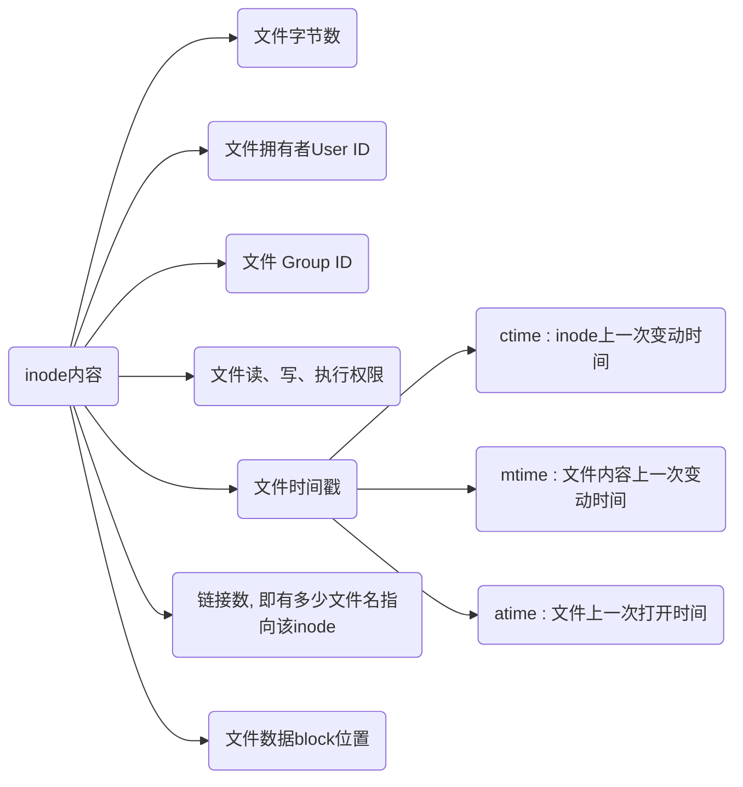

## 定义

inode(索引节点)是一个数据结构, 用于存储文件或目录元数据信息, 而不是文件数据本身

元数据包括文件大小、拥有者、权限、创建时间、修改时间和访问时间等, 以及文件链接数和指向文件数据块指针等



### 块(block)

扇区(sector)是硬盘最小存储单位, 每个扇区储存$512$字节(0.5KB), 操作系统读取硬盘时为提高效率会一次连续读取多个扇区

块由多个扇区组成, 是文件存取最小单位, 大小常见为$4KB$, 即连续八个扇区组成

### inode区

硬盘格式化时候OS自动将硬盘分为,

- 数据区, 存放文件数据

- $inode$区($inode$ $table$), 存放inode所包含信息

每个$inode$节点大小一般是128字节或256字节, 硬盘格式化时就会给定$inode$节点总数, 一般是每1KB或2KB设置一个$inode$

如1GB硬盘中, 每个$inode$节点大小为128字节, 每1KB就设置一个$inode$, 那么$inode$ $table$大小为128MB, 占硬盘空间12.8\%

## 命令

### 信息

#### 查看分区inode信息
 
```sh
df -i
```


#### 查看文件inode信息
 
```sh
stat 文件
```


#### 查看文件inode号码
 
```sh
ls -il
```


#### 硬链接

```sh
ln 源文件 链接文件
```

inode号码与源文件相同, 例如下面a.txt 与 a

#### 软链接

```sh
ln -s 源文件 链接文件
```

inode号码不同, 但是inode号码指向源文件名, 例如下面a.txt 与 a

### 删除

- 查找具有特定inode号码文件并删除

```sh
find 搜索路径 -inum inode号码 -delete
```