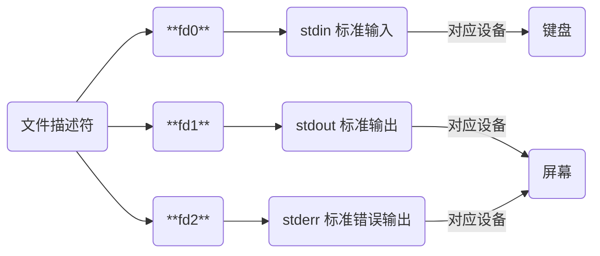

## 概念

文件是被命名的相关信息的集合体, 通常存放在外存(如磁盘、磁带)上, 可以作为一个独立单位存放和实施相应的操作(如打开、关闭、读、写等)

Linux中一切皆文件, 目录, 设备(包括字符设备, 块设备), 进程, 线程, 套接字, 管道都是文件

### 组成

#### 索引节点(inode)

每个文件都有唯一inode, 系统利用inode中文件权限、文件主、文件大小、存放位置、建立日期等信息对相应文件实施控制和管理

#### 数据

文件的实际内容

### 类型

Linux支持多种类型文件, 每种文件类型都有其特定用途和特征


文件属性首字符代表文件类型

| 类型         | 说明                                  | 首字符 | 颜色  |
| ------------ | -------------------------------------| ------ | ---- |
| 普通文件     | 包括纯文本、二进制、数据格式、压缩文件等 | `[-]`  | 白色  |
| 目录文件     | 类似Windows中目录                     | `[d]`  | 蓝色  |
| 字符设备文件 | 串行端口接口设备, 如键盘、鼠标等         | `[c]`  | 黄色  |
| 块设备文件   | 存储数据以供系统存取的接口设备, 既硬盘   | `[b]`  |       |
| 套接字文件   | 通常用在网络数据连接                    | `[s]`  |       |
| 管道文件     | `FIFO`(先进先出), 解决多程序同时存取文件 | `[p]` |        |
| 链接文件     | 类似Windows快捷方式                    | `[l]`  | 浅蓝色 |

```sh
# bin是链接文件
lrwxrwxrwx    1 root root   7  12月 18 23: 21 bin -> usr/bin
```

## 文件描述符

文件描述符`fd`($file$ $descriptor$)是内核为管理已被打开文件所创建的索引, 是一个非负整数

其用于指代被打开文件, 所有执行I/O操作(如读写操作)的系统调用都是通过文件描述符完成

### 分配

程序运行时, 系统会默认分配三个文件描述符,



#### 获取

打开或创建文件时, 内核向进程返回一个文件描述符

读写文件时, 使用open调用后返回一个系统为打开文件分配的文件描述符, 后续可将其作为参数传给read或write

### 文件描述符表

文件描述符表是内核为每个进程维护的一个数据结构, 位于进程控制块(PCB)中, 用于记录该进程当前已打开所有文件或资源(如套接字、管道等)的文件描述符及其相关信息, 包括指向内核中文件对象的指针、文件状态(如读写位置、权限等)以及文件描述符本身

#### 什么周期

- 创建

进程创建时, 操作系统会为该进程分配一个空文件描述符表, 并初始化标准输入、标准输出和标准错误的文件描述符

- 使用

进程运行中, 每当进程打开文件或资源时, 操作系统都会在文件描述符表中创建一个新表项来存储该文件描述符及其相关信息, 进程通过文件描述符表来访问和操作这些文件或资源

- 销毁

进程终止时, 操作系统会销毁该进程的文件描述符表, 并释放所有打开的文件或资源, 包括关闭文件描述符、释放内存和文件系统等资源

### 操作

#### 读写

使用read函数可以从文件中读取数据, 使用write函数可以向文件中写入数据

这两个函数都需要传入文件描述符来指定要操作的文件

#### 重定向

重定向可改变文件描述符`fd`所指向文件

| 方向       | 符号        |
| --------- | ----------- |
| 输入重定向 | `<` 和 `<<` |
| 输出重定向 | `>` 和 `>>` |

```sh
echo "666" > a.txt

# fd作为标准输出可以省略, 上命令可写为
echo "666" 1> a.txt
```

echo本是`fd1`(标准输出), 默认指向屏幕, 经重定向后`fd1`指向a.txt, 字符输出到此文件

```sh
echo "6666666" > a.txt

# 6666666
cat a.txt
```

- 通过输出重定向丢弃信息

```sh
for i in {1..254};do
    ip="192.168.1.${i}"
    # 将标准/错误输出全部重定向到/dev/null中(丢弃产生的所有信息)
    ping -c 2 ${ip} > /dev/null &
done
```

## 权限

Linux文件权限控制用户对文件或目录的访问和操作

### 类型

#### 读权限(r)

用户具有读权限可以查看文件内容, 可以列出目录中的文件和子目录

#### 写权限(w)

用户具有写权限可以修改文件内容, 可以在目录中创建、删除或重命名文件和子目录

#### 执行权限(x)

用户具有执行权限可将文件作为程序运行, 可以进入目录

### 权限分组

Linux系统中每个文件或目录都有三类权限, 分别针对所有者(Owner)、组成员(Group)和其他人(Others)设置

#### 所有者(Owner)

文件所有者, 通常是文件创建者

所有者对文件拥有最高权限, 可以执行所有类型的操作(读、写、执行)

#### 组成员(Group)

文件所属组, 组内所有用户共享权限

组成员权限由文件所有者设置, 通常包括读权限和执行权限, 但不一定包括写权限

#### 其他用户(Others)

既不是文件所有者, 也不属于文件所属组用户

其他用户权限由文件所有者设置, 通常是最受限制

#### 表现形式


文件类型后字符设三个一组, 每组依次代表


每组内依次包含读-写-执行权限,

| 权限   | 含义                                          | 符号          | 代表数字 |
| ------ | -------------------------------------------- | ------------- | -------- |
| 可读   | 允许查看文件与目录列表                         | `r` (read)    | 4        |
| 可写   | 允许修改与在目录中新建、删除、移动文件或子目录   | `w` (write)   | 2        |
| 可执行 | 允许运行程序, 切换目录                         | `x` (execute) | 1        |
| 无权限 | 没有权限                                      | `-`           | 0        |

- boot目录文件属性信息

```sh
# 首字符d表示是目录文件
# 第一组rwx表示文件所有者拥有可读, 可写, 可执行权限
# 第二组r-x表示所有者同组用户拥有可读, 不可写, 可执行权限
# 第三组r-x表示其他用户拥有可读, 不可写, 可执行权限
drwxr-xr-x   4 root root       4096 10月 13 18:09 boot
```

### 修改

#### 符号表示

```sh
chmod 符号 操作符 rwx 文件/目录
```

符号与操作符内容如下表

| 符号 | 用户类型  | 权限范围               |
| ---- | -------- | --------------------- |
| `u`  | user     | 文件所有者(属主)       |
| `g`  | group    | 文件所有者所在组(属组) |
| `o`  | other    | 所有其他用户           |
| `a`  | all      | 所用用户, 相当于 ugo   |

| 操作符 | 含义     |
| ------ | -------- |
| `+`    | 增加权限 |
| `-`    | 减去权限 |
| `=`    | 设置权限 |

- 给run.c 添加执行权限

```sh
chmod +x run.c
```

#### 数字表示

```sh
chmod rwx(数字) 文件/目录
```

- 给a.txt添加全部权限

```sh
chmod 777 a.txt
```