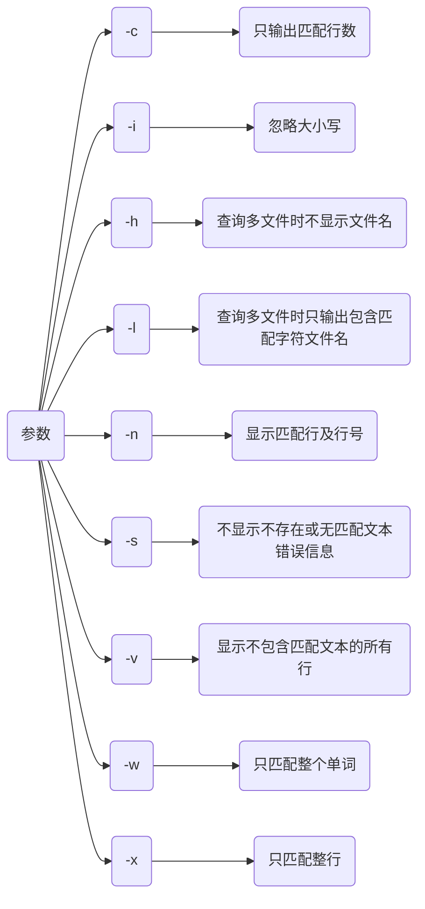
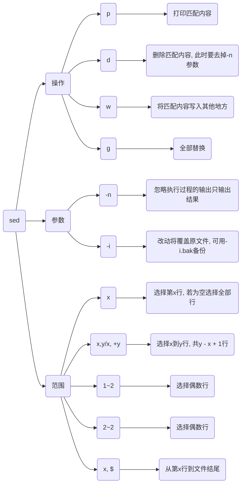
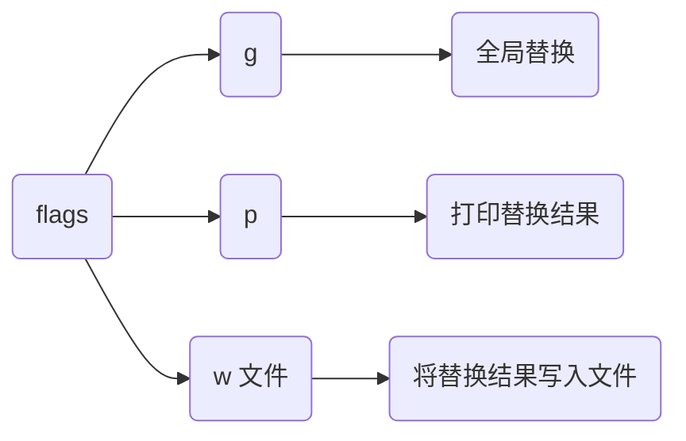
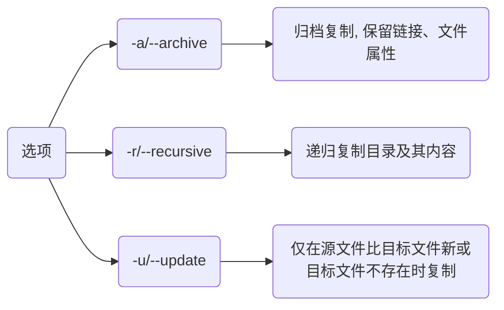
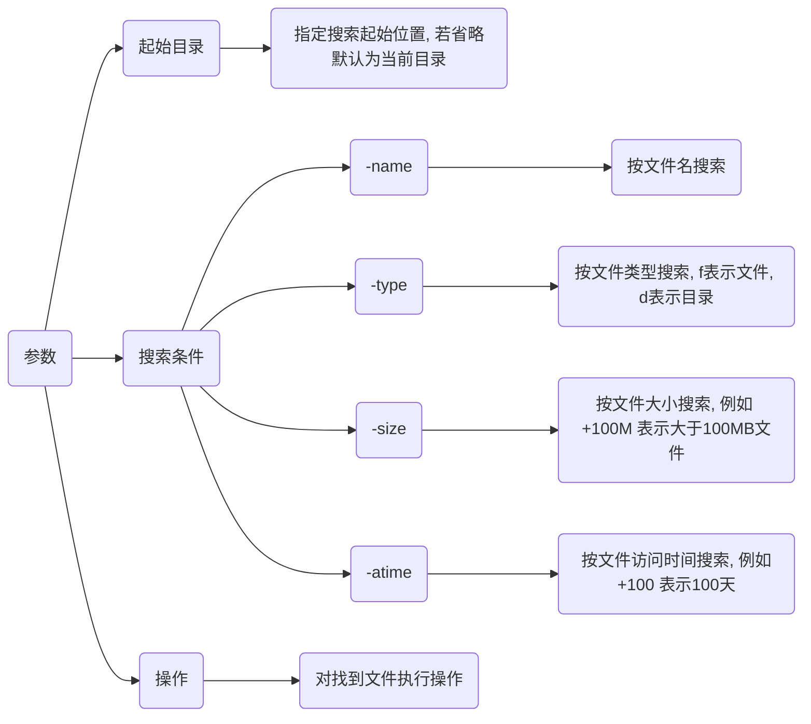

## 概念

文件是被命名相关信息的集合体, 通常存放在外存(如磁盘、磁带)上, 可以作为一个独立单位存放和实施相应操作(如打开、关闭、读、写等)

linux中一切皆文件, 目录、设备(包括字符设备, 块设备)、进程、线程、套接字、管道都是文件

### 组成

#### 目录项(文件名)

目录项使用户可通过文件名来访问文件系统中文件, 而无需直接知道文件物理存储位置

#### inode

inode文件索引节点, 包含与文件相关所有额外信息, 如文件类型、权限、硬链接数、所有者及所属组、文件大小、时间信息等

一个文件名只能与一个inode关联, 但一个inode可以关联多个文件名(通过硬链接)

inode与数据块之间是一一对应, 每个inode都指向一个或多个数据块, 数据块中存储文件具体内容

#### 数据块

存放文件内容

linux中文件具体内容被分割成多个数据块存储在硬盘相应位置, 访问文件时, 系统会先通过inode找到数据块位置, 然后从数据块中读取内容

### 类型

linux支持多种类型文件, 每种文件类型都有其特定用途和特征


首字符代表文件类型

| 类型        | 首字符|
| ----------- | ---- |
| 普通文件     | `-`  |
| 目录文件     | `d`  |
| 字符设备文件 | `c`  |
| 块设备文件   | `b`  |
| 套接字文件   | `s`  |
| 管道文件     | `p`  |
| 链接文件     | `l`  |

```sh
# bin是链接文件
lrwxrwxrwx    1 root root   7  12月 18 23: 21 bin -> usr/bin
```

#### 普通文件(regular file)

普通文件是最常见文件类型, 可以包含任何类型数据, 如文本、图像、音频, 有三种类型

##### 纯文本文件(ASCII)

内容可以直接读取数据, 如数字、字母等

##### 二进制文件(binary)

系统认识且可以执行, 例如可执行程序

##### 数据格式文件(data)

特定格式文件, 某些程序运行时读取

#### 目录文件(directory)

目录文件用于存储和管理其他文件和目录, 类似Windows中目录, 包含一个或多个文件和子目录列表

目录文件通常以`./`开头表示当前目录, `../`表示上一级目录


#### 链接文件(link)

链接文件指向另一个文件位置, 有三种类型

##### 硬链接(hard link)

独立文件, 与被链接文件共享相同inode节点

##### 软链接(soft link)

包含被链接文件路径信息, 只能在同一文件系统中使用

##### 符号链接(symbolic link)

包含被链接文件路径信息, 可以跨文件系统使用, 相当于Windows快捷方式

#### 设备文件(device file)

设备文件用于表示linux中设备, 如硬盘、鼠标、键盘等, 有两种类型

##### 字符设备文件(character device file)

用于表示字符设备, 如打印机、鼠标等, 只能顺序访问, 不支持随机访问, 分为独占和共享两种,

独占字符设备只能由一个进程使用, 共享字符设备可以被多个进程共享

##### 块设备文件(block device file)

用于表示块设备, 如硬盘、U盘等, 支持以block为单位进行随机访问, 分为固定大小和可变大小两种,

固定大小块设备文件大小固定, 不能更改;可变大小块设备文件大小可以动态调整

#### 管道文件(Pipe)

管道文件用于实现进程间通信, 有两种类型

##### 匿名管道(anonymous pipe)

用于父子进程之间通信

##### 命名管道(named pipe)/FIFO(first in first out)管道

可在任意两个进程之间建立连接, 用于实现进程间同步和异步通信

命名FIFO管道可以在任意两个进程之间建立连接, 非命名FIFO管道只能在创建它的进程及其子进程中使用

#### 套接字文件(socket)

套接字文件用于实现网络通信, 有两种类型

##### UNIX域套接字(unix domain socket)

主要用于同一台计算机上进程间通信

##### 网络套接字(network socket)

用于不同计算机之间进程间通信

## 文件描述符

文件描述符`fd`($file$ $descriptor$)是内核为管理已被打开文件所创建的索引, 是一个非负整数

其用于指代被打开文件, 所有执行I/O操作(如读写操作)系统调用都是通过文件描述符完成

### 属性

#### 种类

程序运行时, 系统会默认分配三个文件描述符, 在程序运行期间始终存在, 并可以被重定向或使用于各种I/O操作

- 标准输入(`stdin`)

文件描述符为0, 通常对应键盘输入, 重定向中可以对应其他文件或数据流

- 标准输出(`stdout`)

文件描述符为1, 通常对应屏幕输出, 重定向中可以对应文件或其他数据流

- 标准错误(`stderr`)

文件描述符为2, 通常对应屏幕输出, 用于显示错误信息, 重定向时可以单独处理

#### 作用

##### 唯一标识

文件描述符在内核中用于唯一标识一个打开文件

每个进程都有一个文件描述符表, 记录该进程使用所有文件描述符及相关信息

##### 访问文件

通过文件描述符, 应用程序可以使用系统调用来读取、写入、关闭文件等操作

##### 管理资源

文件描述符还用于管理套接字、管道等I/O资源, 使得进程能够高效地进行网络通信和进程间通信

#### 使用

- open/close函数

open打开一个文件并获取其文件描述符, close函数将释放文件描述符

- read/write函数

通过文件描述符向文件中读取/写入数据

```c
#include <fcntl.h>
#include <unistd.h>
#include <stdio.h>
#include <errno.h>

int main() {
    int fd;
    // 以只读模式打开文件
    fd = open("example.txt", O_RDONLY);
    if (fd == -1) {
        perror("open");
        return 1;
    }
   
    // 写入文件
    const char *text = "Hello, World!\n";
    ssize_t bytesWritten;
   
    bytesWritten = write(fd, text, strlen(text));
    if (bytesWritten == -1) {
        perror("write");
    }

    // 读取文件
    ssize_t bytesRead;
    char buffer[1024];
    while ((bytesRead = read(fd, buffer, sizeof(buffer) - 1)) > 0) {
        buffer[bytesRead] = '\0';
        printf("%s", buffer);
    }
   
    if (bytesRead == -1) {
        perror("read");
    }

    // 关闭文件描述符
    close(fd);
    return 0;
}
```

### 文件描述符表

文件描述符表是内核为每个进程维护的一个数据结构, 位于进程控制块(PCB)中, 用于记录该进程当前已打开所有文件或资源(如套接字、管道等)文件描述符及其相关信息, 包括指向内核中文件对象指针、文件状态(如读写位置、权限等)以及文件描述符本身

#### 创建

进程创建时, 操作系统会为该进程分配一个空文件描述符表, 并初始化标准输入、标准输出和标准错误文件描述符

#### 使用

进程运行中, 每当进程打开文件或资源时, 操作系统都会在文件描述符表中创建一个新表项来存储该文件描述符及其相关信息, 进程通过文件描述符表来访问和操作这些文件或资源

#### 销毁

进程终止时, 操作系统会销毁该进程文件描述符表, 并释放所有打开文件或资源, 包括关闭文件描述符、释放内存和文件系统等资源

### 重定向

重定向是指将某文件描述符内容重定向到另一个文件描述符中, 或者重定向到文件、设备中

#### 输出重定向

将命令输出(`stdout`或`stderr`)重定向到文件或另一个数据流中

(1) 使用`>`将stdout重定向到文件, 若文件已存在则会被覆盖

(2) 使用`>>`将stdout追加到文件末尾

(3) 对于stderr, 可以使用`2>`或`2>>`进行类似重定向

- 示例, 将stdout重定向到文件

```sh
echo "666" > a.txt

# 或者
echo "666" 1> a.txt
```

- 示例, 将标准错误重定向到文件

```sh
ls test_file 2> error.txt
```

尝试列出名为test_file文件, 若文件不存在会产生一个错误消息并被重定向到error.txt中, 而不显示在终端上

- 示例, 通过输出重定向丢弃信息

```sh
#!/bin/bash

for i in {1..254};do
    ip="192.168.3.${i}"
    # 将标准/错误输出全部重定向到/dev/null中(丢弃产生所有信息)
    ping -c 2 ${ip} > /dev/null &
done
```

#### 输入重定向

使用`<`将文件内容作为命令输入

- 示例, 从文件读取输入

```sh
wc < input.txt
```

从input.txt文件中读取内容, 并使用wc命令(通常用于统计字数)进行处理

## 权限

linux文件权限控制用户对文件或目录访问和操作

### 类型

| 权限   | 含义                                          | 符号          | 数字值   |
| ------ | -------------------------------------------- | ------------- | -------- |
| 可读   | 允许查看文件与目录列表                         | `r` (read)    | 4        |
| 可写   | 允许修改与在目录中新建、删除、移动文件或子目录   | `w` (write)   | 2        |
| 可执行 | 允许运行程序, 切换目录                         | `x` (execute) | 1        |
| 无权限 | 没有权限                                      | `-`           | 0        |

#### 读权限(r)

用户具有读权限可以查看文件内容, 可以列出目录中文件和子目录

#### 写权限(w)

用户具有写权限可以修改文件内容, 可以在目录中创建、删除或重命名文件和子目录

#### 执行权限(x)

用户具有执行权限可将文件作为程序运行, 可以进入目录

### 权限分组

linux系统中每个文件或目录都有三类权限, 分别针对所有者(Owner)、组成员(Group)和其他人(Others)设置

#### 所有者(owner)

文件所有者, 通常是文件创建者

所有者对文件拥有最高权限, 可以执行所有类型操作(读、写、执行)

#### 组成员(group)

文件所属组, 组内所有用户共享权限

组成员权限由文件所有者设置, 通常包括读权限和执行权限, 但不一定包括写权限

#### 其他用户(others)

既不是文件所有者, 也不属于文件所属组用户

其他用户权限由文件所有者设置, 通常是最受限制

#### 表现形式


Access后9个字符每3个为一组, 每组依次代表文件所有者(属主)权限、同组所有者(属组)权限、其他用户权限

每组内部三个字符依次代表读、写、执行权限

- 示例, boot目录文件属性

```sh
# 首字符d表示是目录文件
# 第一组rwx表示文件所有者拥有可读, 可写, 可执行权限
# 第二组r-x表示所有者同组用户拥有可读, 不可写, 可执行权限
# 第三组r-x表示其他用户拥有可读, 不可写, 可执行权限
drwxr-xr-x   4 root root       4096 10月 13 18:09 boot
```

### 命令

#### chmod

用于修改文件或目录权限

##### 符号模式

由权限字符和操作符组成, 可以用来增加、删除或设置权限

```sh
chmod 符号 操作符 权限 文件/目录
```

| 符号 | 用户类型  | 权限范围               |
| ---- | -------- | --------------------- |
| `u`  | user     | 文件所有者(属主)       |
| `g`  | group    | 文件所有者所在组(属组)  |
| `o`  | other    | 所有其他用户           |
| `a`  | all      | 所用用户, 相当于 ugo   |

| 操作符 | 含义     |
| ------ | ------- |
| `+`    | 增加权限 |
| `-`    | 减去权限 |
| `=`    | 设置权限 |

- 示例, 给run.c所有者添加执行权限

```sh
chmod u+x run.c
```

##### 绝对模式

是一个三位数数字, 其中每一位表示文件所有者、群组用户和其他用户权限

| 值   | 权限      | 含义                      |
| ---- | -------- | ------------------------- |
|  7   | rwx      | 读、写和执行权限 (4+2+1=7) |
|  6   | rw-      | 读和写权限 (4+2=6)        |
|  5   | r-x      | 读和执行权限 (4+1=5)      |
|  4   | r--      | 只读权限 (4)              |
|  3   | -wx      | 写和执行权限 (2+1=3)      |
|  2   | -w-      | 只写权限 (2)              |
|  1   | --x      | 只执行权限 (1)            |
|  0   | ---      | 无权限 (0)                |

```sh
chmod rwx(数字) 文件/目录
```

- 示例, 给a.txt添加全部权限

```sh
chmod 777 a.txt
```

- 示例, 权限设置为所有者具有读、写和执行权限, 文件所属组和其他用户具有读和执行权限

```sh
chmod 755 file
```

#### chown

用于修改文件或目录所有者

```sh
chown (选项) 所有者 文件/目录
```

- 示例, 将文件file.txt所有者修改为user

```sh
chown user file.txt
```

## 文件工具

### awk

逐行读入文件, 以空格为默认分隔符将每行切片, 并进行各种分析处理

```sh
awk 'pattern { action }' 文件名
```

| 参数    | 含义                |
| ------- | ------------------ |
| pattern | 指定要匹配模式      |
| action  | 匹配到内容时执行命令 |

| 内置变量 | 含义             |
| ------- | ---------------- |
| NR      | 当前记录数(行号)  |
| NF      | 当前记录中字段数  |
| $0      | 当前记录(整行)    |
| $1, $2..| 当前记录字段      |

- 示例, 打印行号和每行内容

```sh
awk '{ print NR, $0 }' filename
```

- 示例, 打印文件第一列

```sh
awk '{ print $1 }' filename
```

#### BEGIN 和 END 块

BEGIN 块在处理任何输入行之前执行, END 块在处理完所有输入行之后执行

```sh
awk 'BEGIN { print "Start" } { print $1 } END { print "End" }' filename
```

### grep

用于搜索文本中匹配指定模式字符串

```sh
grep 参数 匹配项 (文件名, 若为空则从标准输入读取)
```



#### 单查询

##### 模糊匹配

含有匹配项字段都会匹配

```sh
grep (模式) 匹配项
```

- 示例, 模糊匹配"abc"

```sh
# 匹配结果为abc abcd abcdef
grep "abc"
```

##### 精确匹配

```sh
grep -w 匹配项
```

- 示例, 精确匹配"abc"

```sh
# 结果为abc
grep -w "abc"
```

#### 与查询

在前一个查询结果中继续查询

```sh
grep '模式1' 匹配项 | grep '模式2'
```

- 示例, 查询3月10日16点30时间段内ssh登录成功情况

```sh
grep 'Mar 10 16:3' /var/log/secure | grep Accepted
```

#### 或查询

```sh
grep '模式1|模式2' 匹配项

# 或者
grep -E '模式1|模式2' 匹配项
```

#### 非查询

去除包含模式1进程行, 避免影响最终数据正确性

```sh
grep -v 模式1 匹配项
```

- 示例, 查询python进程信息时排除grep本身影响

```sh
ps -aux | grep python | grep -v grep
```


#### 正则

##### 查看以pattern开头行

```sh
grep ^pattern
```

##### 查找以pattern结尾行

```sh
grep pattern$
```

- 示例, 查找UniversalDeclarationOfHumanRights.txt文件中含有human句子

```sh
grep human UniversalDeclarationOfHumanRights.txt
```


- 示例, 查找UniversalDeclarationOfHumanRights.txt文件中以The开头句子

```sh
grep ^The UniversalDeclarationOfHumanRights.txt
```


### sed

对文本进行过滤和转换

```sh
sed 参数 '起始范围, 结束范围 操作' 文件
```



#### 替换

```sh
sed s#旧文本#新文本#flags
```



- 示例, 将file.txt中foo替换为bar

```sh
sed 's#foo#bar#' file.txt
```

- 示例, ubuntu换源

```sh
sed -i 's#security.ubuntu.com#mirrors.aliyun.com#g' /etc/apt/sources.list
sed -i 's#cn.archive.ubuntu.com#mirrors.aliyun.com#g' /etc/apt/sources.list
```

#### 打印

若字符串中带有路径符号 `/`, 可用 `#` 分隔

- 示例, 打印file.txt 1-5行

```sh
sed -n '1, 5 p' file.txt
```

#### 添加

##### 末前添加

```sh
sed -i '1i内容' 路径
```

##### 末行行前添加

```sh
sed -i '$i内容' 路径
```

##### 末行后添加

```sh
sed -i '$a内容' 路径
```

### xargs

管道符 `|` 是将前个命令标准输出作为后个命令标准输入

`xargs` 将前命令标准输出作为后命令参数, 可单独使用, 也可与管道符、重定位符等与其他命令配合使用, 默认动作是echo, 默认分隔符为空白字符(空格, TAB, 换行符)

真正执行命令在xargs后面, 接受xargs传参

```sh
xargs 命令
```

- 示例, 根据VLC进程ID结束进程

```sh
ps -aux | grep vlc | grep -v grep | awk '{print $2}' | sudo xargs kill -9
```

## 文件命令

### 内容

#### 追加

##### 追加单行

```sh
echo 内容 >> 文件路径
```

##### 追加多行

```sh
sudo bash -c cat >> 文件路径 <<EOF
....
EOF
```

- 示例, 单行多行追加 


#### 覆盖

```sh
echo 内容 > 文件路径
```

- 示例, 覆盖文件


#### 复制

```sh
cp (选项) 源文件 目标文件
```



- 复制单个文件

```sh
cp 文件源路径 文件目标路径
```

- 复制目录

```sh
cp -r 目录源路径 目录目标路径
```

### 搜索

```sh
find 起始目录 搜索条件 (操作)
```



- 示例, 在/home/dmjcb 中搜索.bin结尾文件

```sh
find /home/dmjcb -name *.bin
```


- 示例, 搜索在过去100天内未被使用过执行文件

```sh
find /usr/bin -type f -atime +100
```


### tar

打包是将众多文件或目录变成一个总文件, 压缩是将大文件通过压缩算法变成小文件

tar(tape archive)打包工具可以将多个文件和目录打包成一个文件, 也可压缩

#### 打包

```sh
tar -cvf *.tar 源目录
```

`-c` 表示创建新归档文件, `-v` 表示显示详细信息,`-f` 后面跟归档文件名

#### 压缩

##### 打包并压缩为gzip格式

```sh
tar -czvf *.tar 源目录
```

`-z`表示使用gzip压缩

#### 解压

##### 解压 .tar

```sh
tar -xvf archive_name.tar
```

##### 解压 .tar.gz 或 .tgz

```sh
tar -xzvf archive_name.tar.gz
```

### 链接

| 软链接                  | 硬链接                        |
| ---------------------- | ----------------------------- |
| 以路径形式存在(快捷方式) | 以文件副本形式存在, 不占实际空间 |
| 可对目录进行链接        |  不可给目录创建链接             |
| 可跨文件系统            | 不可跨文件系统                 |

#### 软链接

```sh
ln -s 源文件 链接文件
```

#### 硬链接

```sh
ln 源文件 链接文件
```