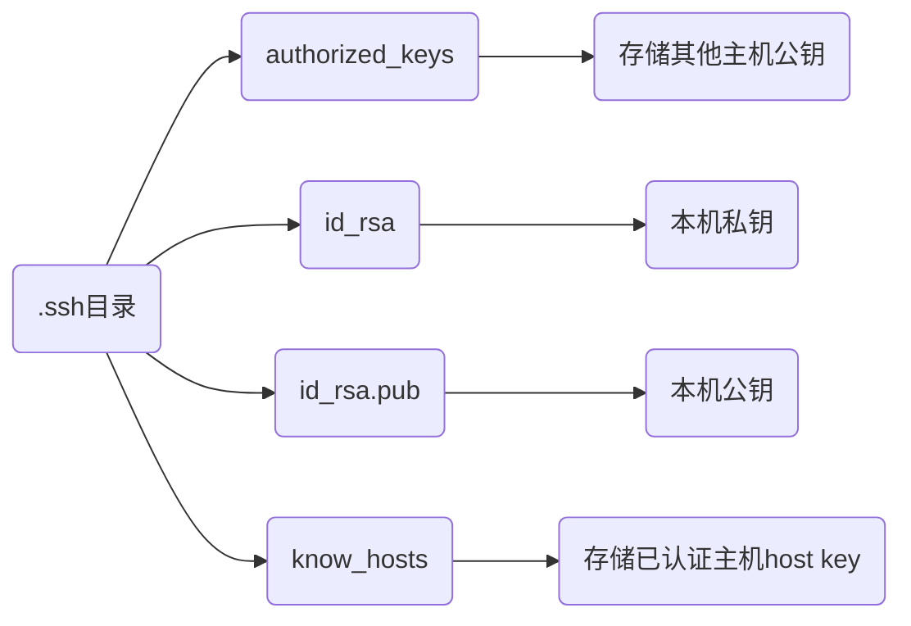

> [SSH 穿越多个跳板机的连接方法](https://murphypei.github.io/blog/2021/12/ssh-proxyjump.html)
>
> [win10 ssh 上传密钥过程, 出现 无法将"ssh-copy-id"项识别](https://blog.csdn.net/Defiler_Lee/article/details/116278442)

## 配置

### 安装

```sh
# apt
sudo apt install openssh-server

# apk
sudo apk add openssh
```

### 命令

#### 开启

```sh
sudo service ssh start
```

#### 停止

```sh
sudo service ssh stop
```

#### 重启

```sh
sudo service ssh restart

# 或者
sudo systemctl restart sshd
```

#### 生成密钥

```sh
ssh-keygen -t rsa -b 4096 -C "your_email@example.com"
```

提示输入文件保存位置(默认是~/.ssh/id_rsa)和密钥密码(可选)

生成密钥后在根目录(/root/或/home/用户名)下生成 .ssh目录, 包含:



#### 清除密钥

```sh
ssh-keygen -R [远程主机IP]
```

### 配置文件

```sh
/etc/ssh/sshd_config
```

#### 禁用密码登陆(可选)

禁用密码后只能通过密钥进行SSH连接, 可避免密码被破译风险

修改配置项如下

```sh
# 禁用密码认证
PasswordAuthentication no

# 启用公钥认证(通常是默认启用的)
PubkeyAuthentication yes

# 允许挑战响应认证(如果不需要也可以禁用)
ChallengeResponseAuthentication no

# 还可考虑禁用GSSAPI认证(如果不需要)
GSSAPIAuthentication no
```

## 操作

### 连接

#### 密码连接

- 默认20端口

```sh
ssh 用户名@远程主机IP
```

- 指定端口

```sh
ssh 用户名@远程主机IP -p 端口
```

连接192.168.3.3 dmjcb用户, 默认20端口号


#### 密钥连接

(1) 手动将本地`id_rsa.pub` 复制到远程主机`.ssh/authorized_keys`里

(2) 命令行上传

若是windows系统, 需powershell中额外执行,

```powershell
function ssh-copy-id([string]$userAtMachine, $args){
    $publicKey = "$ENV:USERPROFILE" + "/.ssh/id_rsa.pub"
    if (!(Test-Path "$publicKey")){
        Write-Error "ERROR: failed to open ID file '$publicKey': No such file"
    }
    else {
        & cat "$publicKey" | ssh $args $userAtMachine "umask 077; test -d .ssh || mkdir .ssh ; cat >> .ssh/authorized_keys || exit 1"
    }
}
```

之后执行

```sh
ssh-copy-id -i 用户名@远程主机IP
```

输入密码, 最后重启ssh服务


#### 长连接

- 方法1, 修改server端etc/ssh/sshd_config

```sh
# server每隔60秒发送一次请求给client, 然后client响应, 从而保持连接
ClientAliveInterval 60 

# server发出请求后, 客户端没有响应得次数达到3, 就自动断开连接, 正常情况下, client不会不响应
ClientAliveCountMax 3 
```

- 方法2, client添加参数

```sh
ssh -o ServerAliveInterval=60 用户名@远程主机IP
```

### 远程操作

#### 远程执行指令

```sh
ssh 用户名@远程主机IP '命令'
```

- 远程执行`ls -l`

```sh
ssh 用户名@远程主机IP 'ls -l'
```

#### 文件传输

SCP(Secure Copy)是SSH一个内置命令, 用于本地和远程机器之间传输文件

- 上传

```sh
scp 本地路径 用户名@远程主机IP:远程路径
```

- 下载

```sh
scp 用户名@远程主机IP:远程路径 本地路径
```

### 转发

#### 端口转发

通过SSH可以进行端口转发, 将本地机器上的端口映射到远程机器上, 或者将远程机器上的端口映射到本地机器上

- 本地端口转发

```sh
ssh -L本地端口:目标地址:目标端口 用户名@远程地址
```

- 远程端口转发

```sh
ssh -R远程端口:目标地址:目标端口 用户名@远程地址
```

- 动态端口转发

```sh
ssh -D本地端口 用户名@IP
```

#### X11转发

SSH支持X11转发, 可在远程机器上运行图形化程序, 并在本地机器上显示

```sh
ssh -X 用户名@IP
```