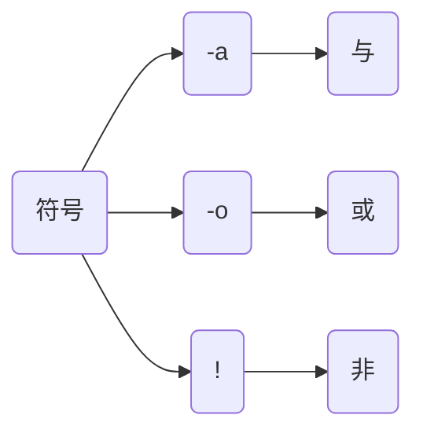

## #!

约定标记, 告知系统需何解释器执行

```sh
#!/bin/bash
```

#### 赋予脚本权限

```sh
sudo chmod +x 脚本.sh
```

## 变量

```sh
变量名=值
```

```sh
a=123
```

### 只读变量
  
```sh
readonly 变量名=值
```

```sh
#!/bin/bash

readonly a=1
a=2
```


### 使用

```sh
${变量名}
```

```sh
#!/bin/bash

a=123
echo ${a}
```

### 字符串

#### 单引号

```sh
s='this is a string'
```

单引号里任何字符都会原样输出

单引号字符串中不能出现单独一个的单引号(对单引号使用转义符后也不行), 但可成对出现, 作为字符串拼接使用

#### 双引号

```sh
n="runoob"
s="Hello, I know you are "${n}""
```

双引号字符串中可出现变量

```sh
#!/bin/bash

a=123
s1='x ${a}'
s2="x "${a}""

echo ${s1}
echo ${s2}
```


#### 函数

##### 获取字符串长度
  
```sh
${#字符串}
```

- 示例

```sh
s="abcdefg"
# 7
${#s}
```

##### 截取n个字符
  
从index下标截取n个字符
```sh
${字符串:index:n}
```

- 示例

```sh
s="abcdefg"

# cde
${s:2:3}
```

##### 字符转换

| 函数         | 作用                     |
| ------------ | ----------------------- |
| ${字符串, }  | 首字符换成小写            |
| ${字符串,, } | 所有大写字母全部替换为小写 |
| ${字符串^}   | 首字符换成大写            |
| ${字符串^^}  | 所有小写字母全部替换为大写 |

##### 判断字符串是否空

```sh
# 1.直接判断
if ! ${n};then
...
fi

# 2.test命令判断
if test -z "${n}";then
...
fi

# 3.空判断
if "${n}" = "";then
...
fi
```

### 数组

数组用括号表示, 元素用空格分割

#### 定义

##### 括号

```sh
array=(元素1 元素2 ...)
```

##### 下标

```sh
array[0]=v1
array[1]=v2
...
```

#### 读取

##### 单个读取
  
```sh
${array[下标]}
```

- 示例

```sh
a=(1 2 3 4 5)

# 1
${a[0]}

# 3
${a[2]}
```

##### 全部获取

```sh
${array[*]} 或 ${array[@]}
```

- 示例

```sh
a=(1 2 3 4 5)

# 1 2 3 4 5
${a[*]}
```

#### 函数

##### 获取长度

```sh
${#array[*]} 或  ${#array[@]}
```

- 示例

```sh
a=(1 2 3 4 5)

# 5
${#a[*]}
```

## 流程控制

### if

```sh
if command;then
   ...
elif command;then
   ...
else
   ...
fi
```

#### 判断文件是否存在
  
```sh
if ! -f "${path}";then
    ...    
fi
```

文件类型代表参数如下

| 参数 | 判断对象             |
| ---- | ------------------- |
| -e   | 对象                 |
| -d   | 目录                 |
| -f   | 文件                 |
| -L   | 符号链接             |
| -h   | 软链接               |
| -s   | 长度不为0对象        |
| -r   | 可读对象             |
| -w   | 可写对象             |
| -x   | 可执行对象           |
| -O   | 属于当前用户对象     |
| -G   | 属于当前用户组对象   |

### case

```sh
case 值 in
模式1)
    ...
    ;;
模式2)
    ...
    ;;
esac
```

### for

#### 累积循环

```sh
for i in {start..end};do
    # ...
done
```

- 示例

```sh
#!/bin/bash

for i in {1..3};do
    echo ${i}
done
```

#### 遍历

```sh
for i in 参数1 参数2 参数3;do
    # ...
done
```

- 示例

```sh
#!/bin/bash

for i in This is a string;do
    echo ${i}
done
```


### while

```sh
while();do
   ...
done
```

- 示例

```sh
#!/bin/bash
i=1
while((${i}<=3));do
    echo ${i}
    let "i++" 
done
```

## 条件判断

test 检查某个条件是否成立

### 数值判断

```sh
test 数据1 [参数] 数据2
```

| 参数  | 说明           |
| ----- | ------------- |
| `-eq` | 等于则为真     |
| `-ne` | 不等于则为真   |
| `-gt` | 大于则为真     |
| `-ge` | 大于等于则为真 |
| `-lt` | 小于则为真     |
| `-le` | 小于等于则为真 |

- 示例

```sh
#!/bin/bash
n1=100
n2=100

if test ${n1} -eq ${n2};then
    echo "n1 n2 相等"
else
    echo "n1 n2 不相等"
fi
```

### 字符串判断

| 参数 | 说明                   |
| ---- | --------------------- |
| `=`  | 等于则为真             |
| `!=` | 不相等则为真           |
| `-z` | 字符串长度为零则为真   |
| `-n` | 字符串长度不为零则为真 |

- 示例

```sh
#!bin/bash
n1="aaa"
n2="bbb"
if test ${n1} = ${n2};then
    echo "n1 n2 相等"
else
    echo "n1 n2 不相等"
fi
```

### 文件判断

```sh
test 参数 文件名
```

| 参数   | 说明                       |
| ------ | ------------------------- |
| `-e`   | 若文件存在则为真           |
| `-r/w` | 若文件存在且可读/写则为真   |
| `-x`   | 若文件存在且可执行则为真    |
| `-d`   | 若文件存在且为目录则为真    |
| `-f`   | 若文件存在且为普通文件则为真 |

- 示例

```sh
#!bin/bash
if test -e ./bash;then
    echo "./bash文件存在"
else
    echo "./bash文件不存在"
fi
```

### 逻辑操作符



- 示例

```sh
#!bin/bash
n1=10
n2=20
n3=10

if test ${n1} -ge ${n2} -o ${n1} -eq ${n3};then
    echo "n1 大于等于 n2 或等于n3"
else
    #...
fi
```

## 指令

### 子命令

#### {}/()

`()`将命令置于子Shell中执行

`{}`将命令在同哥Shell内完成

- 示例, 获取VLC pid, 关闭进程

```sh
#!/bin/bash

pid=${ps -aux | grep vlc | grep -v grep | awk '{print $2}'}

if ! "${pid}";then
    sudo kill -9 ${pid}
fi
```

### 并发

shell不支持多线程, 只能采用多进程方式, 即在并发指令后加`&`

- 示例, 后台打印

```sh
#!/bin/bash

for i in {1..5};do
    # 将命令转入后台执行
    echo ${i} &
done

# 多线程同步
wait
echo "end"
```

- 示例, 查询当前网段下所有主机

```sh
#!/bin/bash

for i in {1..254};do
    ip="192.168.3.${i}"
    # 将标准/错误输出全部重定向到/dev/null中(将产生的所有信息丢弃)
    ping -c 2 ${ip} > /dev/null && echo ${ip} is up &
done
wait
```

### 脚本

#### 配置定时任务

```sh
#!/bin/bash

# 每小时第mintue分钟执行任务
read -p "输入分钟(00‐59):" mintue
# 每天第hour小时执行任务
read -p "输入小时(00‐24):" hour
# 每月第date天执行任务
read -p "输入日期(01‐31):" date
# 每年第month月执行任务
read -p "输入月份(01‐12):" month
# 每周第weak天执行任务
read -p "输入星期(00‐06):" weak

read -p "输入计划任务命令或脚本:" program
# 追加命令至/etc/crontab文件中
echo "$mintue $hour $date $month $weak $program" >> /etc/crontab
```

#### 创建文件

```sh
#!/bin/bash

read -p "输入文件路径与文件名:" path
if ! -f "${path}";then
    touch ${path}
else
    
fi
```