> [cmake使用详细教程(日常使用这一篇就足够了)](https://blog.csdn.net/iuu77/article/details/129229361)

## 配置

cmake是跨平台C/C++构建文件生成工具, 通过CMakeList.txt生成项目构建文件

### 安装

#### linux

##### 命令行

```sh
sudo apt install -y cmake
```

##### 源码安装

- 示例, 安装cmake-3.25.0

```sh
wget https://cmake.org/files/v3.25/cmake-3.25.0-linux-aarch64.tar.gz

tar -xvzf cmake-3.25.0-linux-aarch64.tar.gz                                    

cd cmake-3.25.0-linux-aarch64 && mkdir build && cd build

../bootstrap

# 编译安装
make && make install      
```

### 命令

#### 查看版本

```sh
cmake --version
```


## 流程


### 编写

`CMakeLists.txt`是cmake配置文件，用于定义项目构建过程

cmake根据其中指令生成构建系统(如 Makefile 等), 随后通过构建工具进行编译和链接, 生成可执行文件或库

- 示例, 通过cmake编译main.c

```c
// main.c
#include <stdio.h>

int main() {
    printf("Hello\n");
    return 0;
}
```

```cmake
# CMakeLists.txt
# 设置CMake最低版本要求
cmake_minimum_required(VERSION 3.10)
# 设置项目名称
project(main)

# 设置C++标准(C++11)
set(CMAKE_CXX_STANDARD 11)

# 定义可执行文件
add_executable(main main.c)

# 可执行文件安装位置为根目录bin/
install(TARGETS main RUNTIME DESTINATION ${CMAKE_SOURCE_DIR}/bin)
```

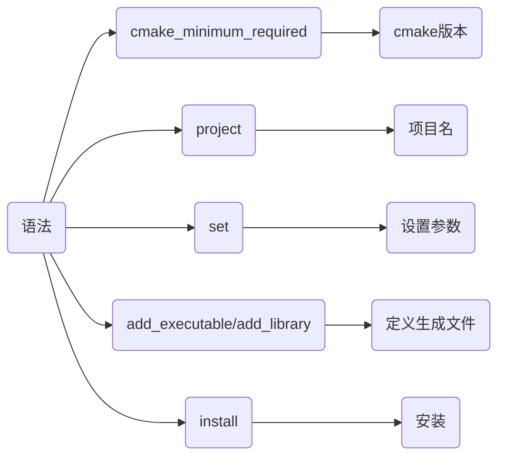

### 生成

cmake读取解析CMakeLists.txt, 检查系统环境、依赖库、编译器等设置, 生成对应平台构建文件, 例如在Unix系统上会生成Makefile


#### 命令

##### 当前目录生成(不推荐)

```sh
.
├── CMakeLists.txt
└── main.c
```

会产生大量中间文件, 影响整洁

```sh
cmake .
```


##### 在build目录下生成(推荐)

```sh
.
├── CMakeLists.txt
├── build
└── main.c
```

```sh
cmake -B build
```


或者

```sh
mkdir build && cd build
cmake ../
```


##### 使用其他目录CMakeLists.txt

使用source/CMakeList.txt, 在build/下生成构建文件

```sh
.
├── source
│   ├── main.c
│   └── CMakeLists.txt
└── build
```

```sh
cmake -S source -B build
```

### 构建

构建工具(如make)调用构建文件进行实际编译和链接


#### 命令

##### cmake调用

- 使用当前目录下构建文件

```sh
cmake --build .
```


- 使用build目录下构建文件

```sh
cmake --build build
```


##### make调用

进入构建文件目录

```sh
make
```


### 安装

将构建产物按CMakeLists.txt中设置安装到指定位置

#### 命令

##### cmake调用

```sh
cmake --install 构建目录 (--prefix 安装根路径, 仅在CMakeLists.txt中未指定安装根路径时)
```

- 示例, 构建目录为build/, 安装构建产物

```sh
cmake --install build
```


- 示例, CMakeLists.txt中未指定根路径情况

若CMakeLists.txt中未指定安装根路径, 可通过--prefix手动指定

```cmake
install(TARGETS main RUNTIME DESTINATION bin)
```

设构建目录为build, 安装时使用test/作为根路径

```sh
cmake --install build --prefix test
```

可执行文件会安装到test/bin路径下

##### make调用

进入构建目录

```sh
make install
```


## 语法

### 设置

#### cmake最低版本

```cmake
cmake_minimum_required(VERSION major.minor)
```

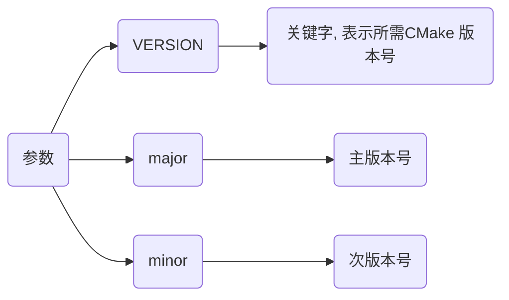

- 示例, 设置工程最低cmake版本为3.10

```cmake
cmake_minimum_required(VERSION 3.10)
...
```

#### 项目名

```cmake
project(项目名 (VERSION 版本信息, 可选))
```

- 示例, 设置项目名为main

```cmake
cmake_minimum_required(VERSION 3.10)
project(main)
...
```

#### 变量

```cmake
set(variable value [PARENT_SCOPE])
```

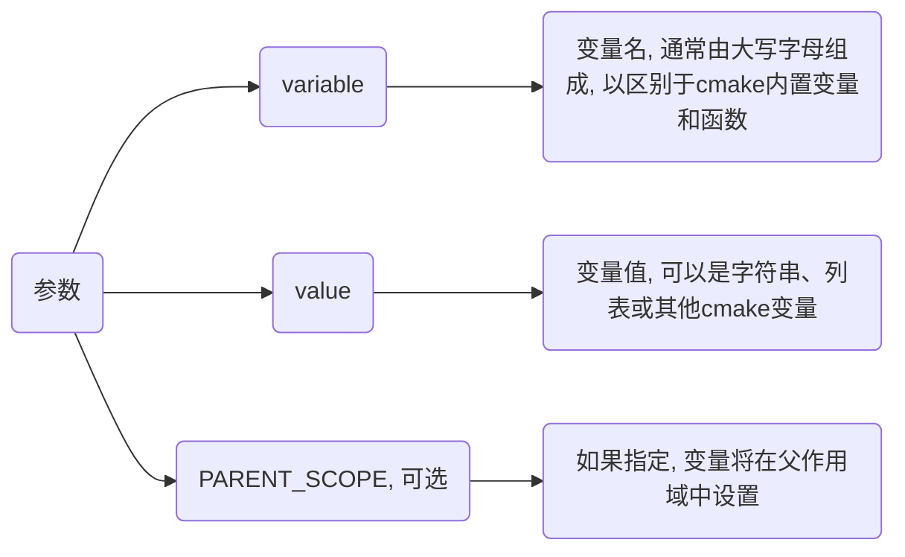

##### 一般变量

- 示例, 设置变量MY_VAR

```cmake
set(MY_VAR "Hello, World!")
```

##### 列表变量

- 示例, 设置SRC_LIST存储源文件名

```cmake
set(SRC_LIST main.cpp test.cpp)
```

```cmake
set(MY_LIST "item1" "item2" "item3")

foreach(item IN LISTS MY_LIST)
    message(STATUS "List item: ${item}")
endforeach()
```

##### 父作用域中设置

- 示例, 父作用域设置变量

```cmake
function(my_func)
    set(MY_VAR_INSIDE "inside function" PARENT_SCOPE)
endfunction()

my_func()
message(STATUS "The value of MY_VAR_INSIDE after function call is: ${MY_VAR_INSIDE}")
```

my_func 函数内指定 PARENT_SCOPE 选项在父作用域中设置 MY_VAR_INSIDE 变量

即使在函数调用之后, MY_VAR_INSIDE 也可以在外部作用域中访问

#### 使用

cmake中通过`${变量名}`获取变量值

- 示例, 使用变量ANOTHER_VAR

```cmake
set(ANOTHER_VAR "Another Value")

set(MY_VAR2 ${ANOTHER_VAR})
```

### 常量

#### 运行环境

##### 项目名

对应指令project所声明项目名称

```sh
PROJECT_NAME
```

- 示例, 指定项目名称为main

```cmake
project(main)

message(${PROJECT_NAME})
```

##### 目标平台

CMake编译生成目标文件所运行操作系统名称, 交叉编译时可用来指定目标平台类型

```sh
CMAKE_SYSTEM_NAME
```

- 示例, 指定目标平台为linux

```sh
cmake -DCMAKE_SYSTEM_NAME=Linux ..
```

或者

```cmake
# CMakeLists.txt
...
set(CMAKE_SYSTEM_NAME "Linux")
...
```

#### 编译器

##### C/C++编译器

```sh
CMAKE_C_COMPILER

CMAKE_CXX_COMPILER
```

- 示例, 指定编译器为aarch64-linux-gnu-gcc

```sh
cmake -DCMAKE_C_COMPILER=/usr/bin/aarch64-linux-gnu-gcc -DCMAKE_CXX_COMPILER=/usr/bin/aarch64-linux-gnu-g++
```

或者

```cmake
# CMakeLists.txt
...
set(CMAKE_C_COMPILER "/usr/bin/aarch64-linux-gnu-gcc")
set(CMAKE_CXX_COMPILER "/usr/bin/aarch64-linux-gnu-g++")
...
```

#### 路径

##### 编译目录

```sh
CMAKE_BINARY_DIR

PROJECT_BINARY_DIR
```

如果是在源代码目录中编译, 指工程顶层目录

如果是在源代码目录之外的目录中编译，指工程编译发生的目录

##### 工程根目录

```sh
CMAKE_SOURCE_DIR

PROJECT_SOURCE_DIR
```

##### 当前路径

CMakeLists.txt文件所在完整路径

```sh
CMAKE_CURRENT_SOURCE_DIR
```

### 创建

#### 可执行文件

将一组源文件编译成可执行文件

```cmake
add_executable(target item1 ...)
```

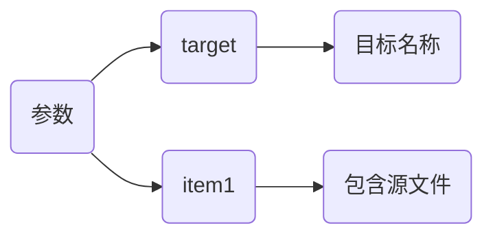

- 示例, 生成可执行文件main

```c
// main.c
#include <stdio.h>

int main() {
    printf("Hello\n");
    return 0;
}
```

```cmake
# CMakeLists.txt
cmake_minimum_required(VERSION 3.10)
project(main)

add_executable(main main.c)
```

#### 库文件

创建库文件

库名对应于逻辑目标名称, 在工程全局域内必须唯一

```cmake
add_library(target [STATIC | SHARED | MODULE] [EXCLUDE_FROM_ALL] source1 source2 ...)
```

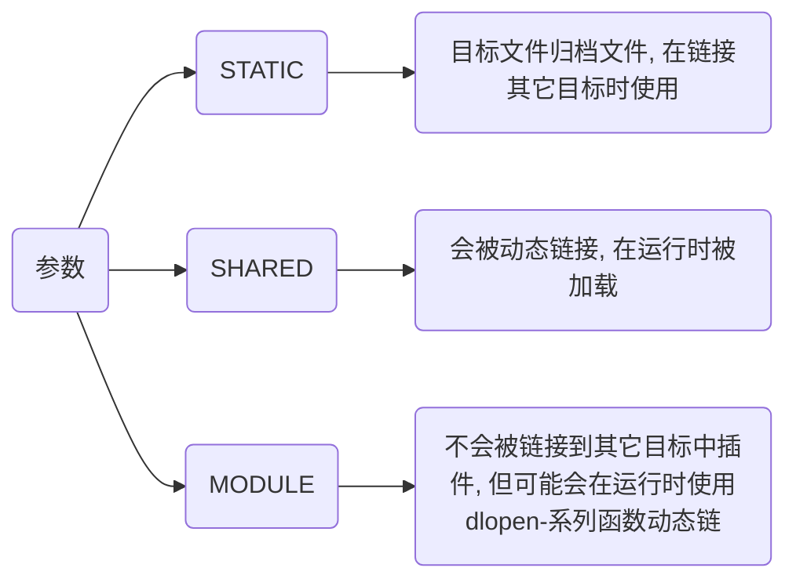

- 示例, 生成main.so文件

```c++
// main.h
#include <stdio.h>

void Hello();
```

```c++
// main.c
#include "main.h"

void Hello() {
    printf("Hello\n");
}
```

```cmake
# CMakeLists.txt
cmake_minimum_required(VERSION 3.10)
project(main)

add_library(main SHARED main.c)
```

### 添加

#### 头文件目录

指定编译目标(可执行文件或库)应包含头文件目录

```cmake
target_include_directories(
    target
    [SYSTEM]
    [AFTER|BEFORE]
    <PRIVATE|PUBLIC|INTERFACE>
    <directories>
)
```

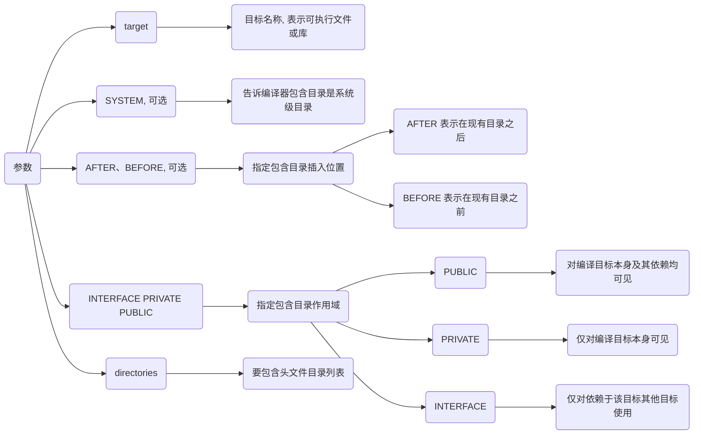

- 示例, 为main目标文件添加头文件目录

```sh
.
├── CMakeLists.txt
├── src
│   ├── main.c
│   └── module
│       └── test_api
│           └── include
│               └── test_api.h
└── third_party
    └── hello_lib
        └── hello.h
```

```c++
// third_party/hello_lib/hello.h
#include <stdio.h>

void Hello() {
    printf("Hello OK\n");
}
```

```c++
// src/module/test_api/include/test_api.h
#include <stdio.h>

void Test() {
    printf("Test OK\n");
}
```

```c++
// src/main.c
#include "hello.h"
#include "test_api.h"

int main() {
    Hello();
    Test();
    return 0;
}
```

```cmake
# CMakeLists.txt
cmake_minimum_required(VERSION 3.10)
project(main)

add_executable(${PROJECT_NAME} src/main.c)
target_include_directories(${PROJECT_NAME} PRIVATE
    ${CMAKE_SOURCE_DIR}/third_party/hello_lib
    ${CMAKE_SOURCE_DIR}/src/module/test_api/include
)
```


#### 源文件路径

给目标文件添加依赖源文件路径

```cmake
target_sources(<target> <INTERFACE|PUBLIC|PRIVATE> [items1...])
```

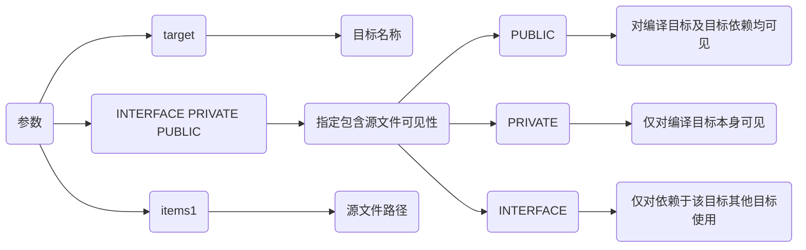

- 示例, 添加源文件hello.c、main.c编译

```sh
.
├── CMakeLists.txt
└── src
    ├── hello
    │   ├── hello.c
    │   └── hello.h
    └── main.c
```

```c
// src/hello/hello.h
#include <stdio.h>

void Hello();
```

```c
// src/hello/hello.c
#include "hello.h"

void Hello() {
    printf("Hello\n");
}
```

```c
// src/main.c
#include "hello/hello.h"

int main() {
    Hello();
    return 0;
}
```

```cmake
# CMakeLists.txt
cmake_minimum_required(VERSION 3.10)
project(main)

add_executable(${PROJECT_NAME} "")
target_sources(${PROJECT_NAME} PRIVATE
    ${CMAKE_SOURCE_DIR}/src/main.c
    ${CMAKE_SOURCE_DIR}/src/hello/hello.c
)
```


#### 链接依赖

指定链接给定目标和/或其依赖项

```cmake
target_link_libraries(<target> <INTERFACE|PUBLIC|PRIVATE> items...)
```

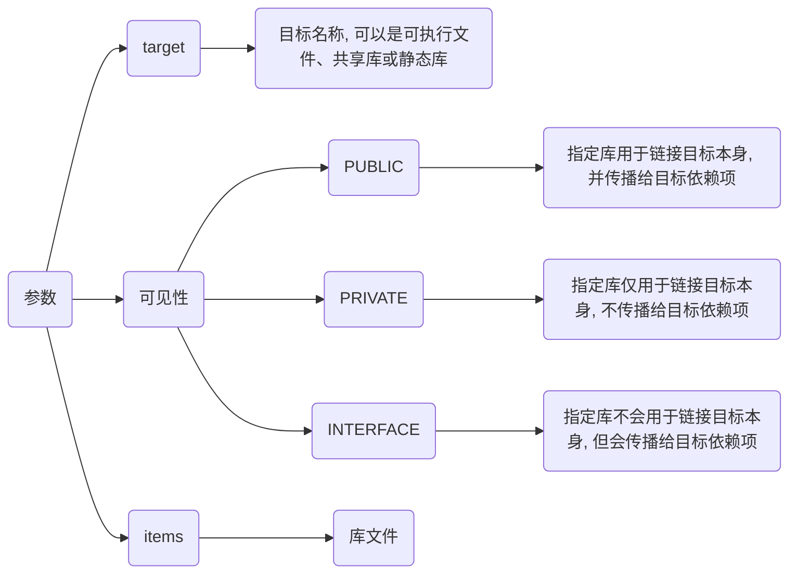

如果项目需要链接系统库, 可以直接使用库名称(如 pthread、dl、m 等)或系统库变量(如 ${CMAKE_THREAD_LIBS_INIT})

- 示例, 链接系统POSIX线程库

```c++
// main.c
#include <stdio.h>
#include <pthread.h>
#include <unistd.h>

void* threadFunction(void* arg) {
    int threadNum = *(int*)arg;
    printf("Hello from thread  %d!\n", threadNum);
    sleep(1);
    return NULL;
}

int main() {
    const int numThreads = 5;
    pthread_t threads[numThreads];
    int threadArgs[numThreads];

    for (int i = 0; i < numThreads; ++i) {
        threadArgs[i] = i;
        pthread_create(&threads[i], NULL, threadFunction, &threadArgs[i]);
    }

    for (int i = 0; i < numThreads; ++i) {
        pthread_join(threads[i], NULL);
    }

    std::cout << "all threads completed\n";
    return 0;
}
```

```cmake
# CMakeLists.txt
cmake_minimum_required(VERSION 3.10)
project(main)

add_executable(main main.c)

# 链接 POSIX 线程库
target_link_libraries(main pthread)
```

### 生成

#### 子路径生成

为构建添加一个子路径

```cmake
add_subdirectory([source_dir] [binary_dir] [EXCLUDE_FROM_ALL])
```

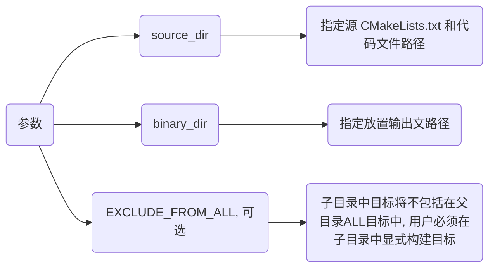

### 安装

#### 目标文件

##### 可执行文件

```sh
install(TARGETS 文件名 RUNTIME DESTINATION 安装路径)
```

- 示例, 安装可执行文件main到根目录bin/

```c
// main.c
#include <stdio.h>

int main() {
    printf("Hello\n");
    return 0;
}
```

```cmake
# CMakeLists.txt
cmake_minimum_required(VERSION 3.10)
project(main)

add_executable(${PROJECT_NAME} main.c)

install(
    TARGETS
    ${PROJECT_NAME}
    RUNTIME
    DESTINATION ${CMAKE_SOURCE_DIR}/bin)
```


##### 动态库

```cmake
install(TARGETS LIBRARY DESTINATION )
```

##### 静态库

```cmake
install(TARGETS ARCHIVE DESTINATION )
```

#### 目录

```cmake
install(DIRECTORY DESTINATION )
```

##### 文件匹配过滤

```cmake
install(DIRECTORY DESTINATION FILES_MATCHING PATTERN )
```

- 示例, 仅安装.h和.hpp

```cmake
install(DIRECTORY ${CMAKE_SOURCE_DIR}/src DESTINATION shared FILES_MATCHING PATTERN "*.h" PATTERN "*.hpp")
```

## 示例

### 单文件

将单个.cpp生成可执行文件

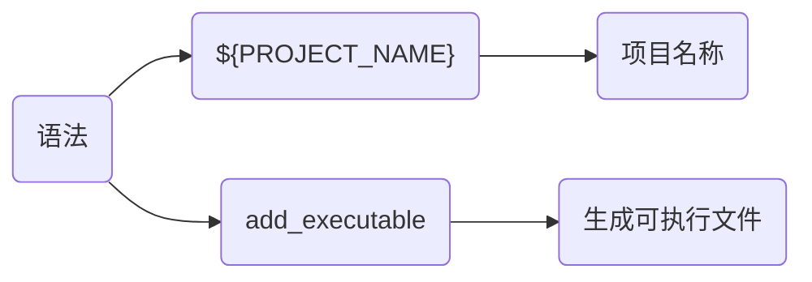

- 示例, 编译main.cpp

```c
// main.cpp
#include <iostream>

int main() {
    std::cout << "Hello World" << std::endl;
    return 0;
}
```

```cmake
# CMakeLists.txt
cmake_minimum_required(VERSION 3.16)
project(main)

add_executable(${PROJECT_NAME} main.cpp)
```


### 多目录

将多个目录下.cpp文件生成可执行文件

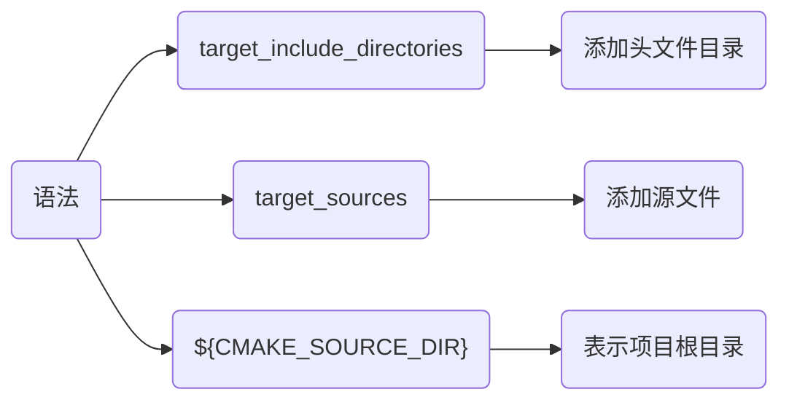

- 示例, 将source_1、source_2目录下文件生成可执行文件

```sh
.
├── CMakeLists.txt
├── main.cpp
├── include_1
│   └── hello_1.hpp
├── include_2
│   └── hello_2.hpp
├── source_1
│   └── hello_1.cpp
└── source_2
    └── hello_2.cpp
```

```c++
// include_1/hello_1.hpp
#include <iostream>
void Hello_1();
```

```c
// include_2/hello_2.hpp
#include <iostream>
void Hello_2();
```

```c
// source_1/hello_1.cpp
#include "hello_1.hpp"
void Hello_1() {
    std::cout << "Hello_1" << std::endl;
}
```

```c
// source_2/hello_2.cpp
#include "hello_2.hpp"
void Hello_2() {
    std::cout << "Hello_2" << std::endl;
}
```

```c
// main.cpp
#include "hello_1.hpp"
#include "hello_2.hpp"

int main() {
    Hello_1();
    Hello_2();
    return 0;
}
```

```cmake
# CMakeLists.txt
cmake_minimum_required(VERSION 3.16)
project(main)

add_executable(${PROJECT_NAME} "")

# 添加可执行文件依赖头文件目录
target_include_directories(${PROJECT_NAME} PRIVATE
    ${CMAKE_SOURCE_DIR}/include_1
    ${CMAKE_SOURCE_DIR}/include_2
)

# 依赖源文件
target_sources(${PROJECT_NAME} PRIVATE
    ${CMAKE_SOURCE_DIR}/source_1/hello_1.cpp
    ${CMAKE_SOURCE_DIR}/source_2/hello_2.cpp
    ${CMAKE_SOURCE_DIR}/main.cpp
)
```


### 生成库

将源文件生成库文件

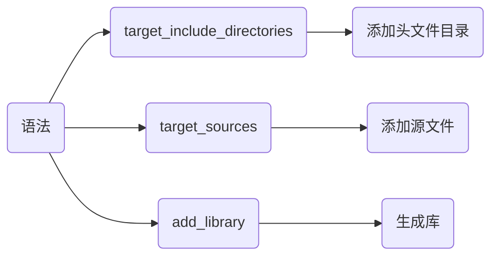

- 示例, 将test_api.cpp生成静态库与动态库

```shell
.
├── CMakeLists.txt
├── main.cpp
├── include
│   └── test_api.hpp
└── source
    └── test_api.cpp
```

```c++
// include/test_api.hpp
#ifndef __INCLUDE_TEST_API_HPP__
#define __INCLUDE_TEST_API_HPP__
#include <iostream>

#ifdef _WIN32
    #define __EXPORT __declspec(dllexport)
#else
    #define __EXPORT __attribute__((visibility("default")))
#endif

#ifdef __cplusplus
extern "C" {
#endif
    void Display();
    int Add(int x, int y);
#ifdef __cplusplus
}
#endif
#endif // __INCLUDE_TEST_API_HPP__
```

```c
// source/test_api.cpp
#include "test_api.hpp"

void Display() {
    std::cout << "Print test_api success!" << std::endl;
}

int Add(int x, int y) {
    return x + y;
}
```

```cmake
# CMakeLists.txt
cmake_minimum_required(VERSION 3.16)
project(test_api)

# 设置库生成目录为lib/
set(LIBRARY_OUTPUT_PATH ${CMAKE_SOURCE_DIR}/lib)

# 生成库文件
add_library(${PROJECT_NAME}_shared SHARED "")
add_library(${PROJECT_NAME}_static STATIC "")

# 将动态库与静态库名称保存在LIB_NAME
foreach(LIB_NAME ${PROJECT_NAME}_shared ${PROJECT_NAME}_static)
    target_include_directories(${LIB_NAME} PRIVATE ${CMAKE_SOURCE_DIR}/include)
    target_sources(${LIB_NAME} PRIVATE ${CMAKE_SOURCE_DIR}/source/test_api.cpp)
    # 设置将库名
    set_target_properties(${LIB_NAME} PROPERTIES OUTPUT_NAME ${PROJECT_NAME})
endforeach()
```


### 链接库

生成可执行文件时链接现有库文件

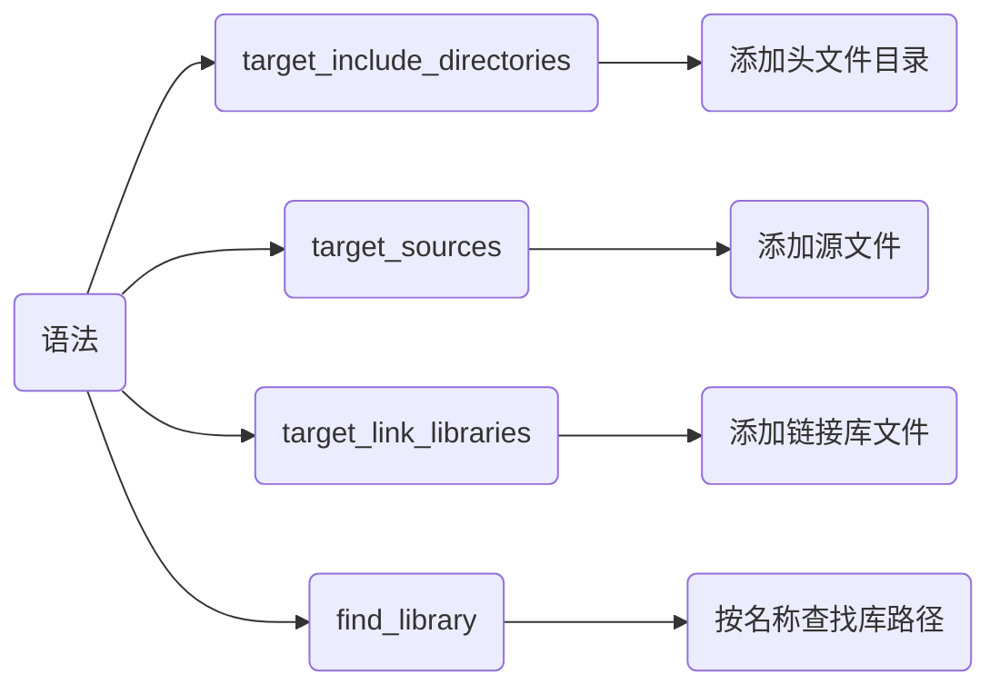

- 示例, 生成可执行文件, 链接lib/下libtest_api库

```c
// main.cpp
#include "test_api.hpp"

int main(void) {
    int res = Add(1, 2);
    std::cout << "res = " << res << std::endl;
    Display();
    return 0;
}
```

```cmake
# CMakeLists.txt
cmake_minimum_required(VERSION 3.16)
project(main)

# 查找test_api库路径, 存储在FUNC_LIB中
find_library(FUNC_LIB test_api ${CMAKE_SOURCE_DIR}/lib)

add_executable(${PROJECT_NAME} "")

target_include_directories(${PROJECT_NAME} PRIVATE ${CMAKE_SOURCE_DIR}/include)
target_sources(${PROJECT_NAME} PRIVATE ${CMAKE_SOURCE_DIR}/main.cpp )
# 链接库
target_link_libraries(${PROJECT_NAME} PRIVATE ${FUNC_LIB})
```

### 子目录编译

可通过划分子目录与主目录CMakeLists.txt, 实现构建文件生成像结构

例如通过多CMakeLists.txt, 实现生成库并链接库生成可执行文件


- 示例, 在test_api/生成libtest_api库, 并和main.cpp链接生成可执行文件

```sh
.
├── CMakeLists.txt
├── test_api
│   ├── CMakeLists.txt
│   ├── include
│   │   └── test_api.hpp
│   └── source
│       └── test_api.cpp
└── main.cpp
```

test_api目录

```c++
// test_api/include/test_api.hpp
#ifndef __INCLUDE_TEST_API_HPP__
#define __INCLUDE_TEST_API_HPP__
#include <iostream>

#ifdef _WIN32
    #define __EXPORT __declspec(dllexport)
#else
    #define __EXPORT __attribute__((visibility("default")))
#endif

#ifdef __cplusplus
extern "C" {
#endif
    int Add(int x, int y);
    void Print();
#ifdef __cplusplus
}
#endif
#endif // __INCLUDE_TEST_API_HPP__
```

```c++
// test_api/include/test_api.cpp
#include "test_api.hpp"

void Print() {
    std::cout << "Print test_api success!" << std::endl;
}

int Add(int x, int y) {
    return x + y;
}
```

```cmake
# test_api/CMakeLists.txt
cmake_minimum_required(VERSION 3.16)
project(test_api)

set(LIBRARY_OUTPUT_PATH ${CMAKE_SOURCE_DIR}/lib)

add_library(${PROJECT_NAME} SHARED "")
target_include_directories(${PROJECT_NAME} PRIVATE ${PROJECT_SOURCE_DIR}/include)
target_sources(${PROJECT_NAME} PRIVATE ${PROJECT_SOURCE_DIR}/source/test_api.cpp)
```

主目录

```cmake
# CMakeLists.txt
cmake_minimum_required(VERSION 3.16)
project(main)

# 设置预链接库名称
set(EXTRA_LIBS ${EXTRA_LIBS} test_api)

# 添加子目录cmake
add_subdirectory(test_api)

add_executable(${PROJECT_NAME} "")
target_include_directories(${PROJECT_NAME} PRIVATE ${CMAKE_SOURCE_DIR}/test_api/include)
target_sources(${PROJECT_NAME} PRIVATE ${CMAKE_SOURCE_DIR}/main.cpp)
target_link_libraries(${PROJECT_NAME} ${EXTRA_LIBS})
```


### 三方库移植

#### FetchContent

CMake 3.11及以上版本引入FetchContent模块, 可直接下载第三方库编译

- 示例, 下载编译三方库fmt

```c++
// main.cpp
#include "fmt/core.h"

int main(){
    std::string world = fmt::format("Hello {0}", "World");
    fmt::print("{}\n", world);
}
```

##### 主CMakeLists.txt调用

```sh
.
├── CMakeLists.txt
├── main.cpp
└── extern
```

```cmake
# CMakeLists.txt
cmake_minimum_required(VERSION 3.17)
project(main)

set(CMAKE_CXX_STANDARD 14)

# 引入FetchContent
include(FetchContent)
FetchContent_Declare(fmt
    GIT_REPOSITORY https://github.com/fmtlib/fmt.git
    GIT_TAG 9.1.0
    # 源码存放位置
    SOURCE_DIR ${CMAKE_SOURCE_DIR}/extern/fmt
)
# 构建库
FetchContent_MakeAvailable(fmt)

add_executable(${PROJECT_NAME} "")
target_include_directories(${PROJECT_NAME} PRIVATE ${CMAKE_SOURCE_DIR}/extern/fmt/include)
target_sources(${PROJECT_NAME} PUBLIC main.cpp)
target_link_libraries(${PROJECT_NAME} PRIVATE fmt::fmt)
```


##### cmake模块调用

可通过.cmake模块实现三方库下载过程, 并在主CMakeLists.txt中调用

```sh
.
├── CMakeLists.txt
├── Main.cpp
├── cmake
│   └── FMT.cmake
└── extern
```

新建cmake/FMT.cmake

```cmake
# cmake/FMT.cmake
include(FetchContent)

set(FMT_LIB fmt)

FetchContent_Declare(${FMT_LIB}
    GIT_REPOSITORY https://github.com/fmtlib/fmt.git
    GIT_TAG 9.1.0
    SOURCE_DIR ${CMAKE_SOURCE_DIR}/Extern/${FMT_LIB}
)
FetchContent_MakeAvailable(${FMT_LIB})
```

修改根目录CMakeLists.txt, 将fmt库安装逻辑解耦

```cmake
# CMakeLists.txt
cmake_minimum_required(VERSION 3.17)
project(main)

set(CMAKE_CXX_STANDARD 14)
set(CMAKE_MODULE_PATH ${CMAKE_SOURCE_DIR}/cmake)

# 导入FMT.cmake模块
include(FMT)

add_executable(${PROJECT_NAME} "")
target_include_directories(${PROJECT_NAME} PRIVATE ${CMAKE_SOURCE_DIR}/extern/fmt/include)
target_sources(${PROJECT_NAME} PUBLIC ${CMAKE_SOURCE_DIR}/main.cpp)
target_link_libraries(${PROJECT_NAME} PRIVATE ${FMT_LIB}::${FMT_LIB})
```

### cross compiling(交叉编译)

通过交叉编译器可在AMD64平台编译生成ARM架构文件

#### 配置工具链

```sh
# 32位
sudo apt install -y arm-linux-gnueabihf-g++

# 64位
sudo apt install -y g++-aarch64-linux-gnu
```

查看版本

```sh
aarch64-linux-gnu-gcc -v
```


查看工具链路径


- 示例, 交叉编译arm64架构可执行文件

```c
// main.c
#include <stdio.h>

int main() {
    printf("Hello World\n");
    return 0;
}
```

```cmake
# CMakeLists.txt
cmake_minimum_required(VERSION 3.16)
project(main)

add_executable(${PROJECT_NAME} main.cpp)
```

#### 命令调用

命令行中通过条件编译宏指定交叉编译器

```sh
cmake -DCMAKE_C_COMPILER=gcc路径 -DCMAKE_CXX_COMPILER=g++路径 -DCMAKE_SYSTEM_NAME=Linux -DCMAKE_SYSTEM_PROCESSOR=armv8
```


#### .cmake调用

通过`-DCMAKE_TOOLCHAIN_FILE`指定工具链

```cmake
# 指定 C 编译器
set(CMAKE_C_COMPILER /path/to/cross/gcc)

# 指定 C++ 编译器
set(CMAKE_CXX_COMPILER /path/to/cross/g++)

# 指定目标系统(可选)
set(CMAKE_SYSTEM_NAME Linux)
set(CMAKE_SYSTEM_PROCESSOR arm)
```

```sh
cmake -DCMAKE_TOOLCHAIN_FILE=toolchain.cmake路径 ......
```

新建cmake/toolchain.cmake

```cmake
# cmake/toolchain.cmake
set(CMAKE_C_COMPILER aarch64-linux-gnu-gcc)
set(CMAKE_CXX_COMPILER aarch64-linux-gnu-g++)

set(CMAKE_SYSTEM_NAME Linux)
set(CMAKE_SYSTEM_PROCESSOR aarch64)
```

