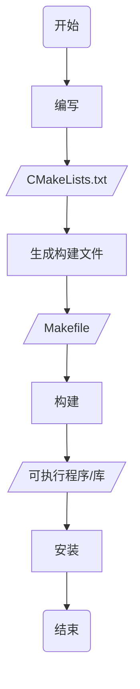

> [cmake使用详细教程(日常使用这一篇就足够了)](https://blog.csdn.net/iuu77/article/details/129229361)

# 使用

## 流程

CMake是C_C++构建文件生成工具, 用于生成项目构建文件



### 编写

Main.cpp

```c
#include
int main() {
std::cout << "Hello World" << std::endl;
return 0;
}
```

CMakeList.txt

```cmake
# 设置CMake的最低版本要求
cmake_minimum_required(VERSION 3.10)
# 设置项目名称
project(Main)

# 设置C++标准(C++11)
set(CMAKE_CXX_STANDARD 11)

# 定义可执行文件
add_executable(Main Main.cpp)
```

### 生成

CMake读取并解析 CMakeLists.txt, 检查系统环境、依赖库、编译器设置等, 生成对应平台构建文件

例如在 Unix 系统上会生成 Makefile

#### 命令

- 使用当前目录CMakeList.txt, 在当目录生成构建文件

该方法会在当前目录下产生大量中间文件, 不推荐

```sh
cmake .
```


- 使用当前目录CMakeList.txt, 在Build目录下生成构建文件

```sh
cmake -B Build
```


- 使用Source目录下CMakeList.txt, 在Build目录下生成构建文件

```sh
cmake -S Source -B Build
```

### 构建

构建文件将被构建工具(如make)调用, 开始实际编译和链接

#### 命令

- 当前目录构建

```sh
cmake --build .
```

- 在Build目录下构建

```sh
cmake --build Build
```


### 安装

#### 命令

- 在Build目录下安装

```sh
cmake --install Build
```

## 开发

### 单CMakeLists.txt

#### 单文件

Main.cpp

```c
#include<iostream>
int main() {
    std::cout << "Hello World" << std::endl;
    return 0;
}
```

CMakeLists.txt

```cmake
# 最低版本号
cmake_minimum_required(VERSION 3.30)

# 项目名
project(Main)

# 生成可执行文件
add_executable(Main Main.cpp)
```


#### 多目录

```sh
.
├── Bin
├── CMakeLists.txt
├── Include_1
│ └── TestFunc_1.hpp
├── Include_2
│ └── TestFunc_2.hpp
├── Main.cpp
├── Source_1
│ └── TestFunc_1.cpp
└── Source_2
└── TestFunc_2.cpp
```

Include_1/TestFunc_1.hpp

```c++
#include<iostream>
void Hello_1();
```

Include_2/TestFunc_2.hpp

```c
#include<iostream>
void Hello_2();
```

Source_1/TestFunc_1.cpp

```c
#include "TestFunc_1.hpp"
void Hello_1() {
    std::cout << "Hello_1" << std::endl;
}
```

Source_2/TestFunc_2.cpp

```c
#include "TestFunc_2.hpp"
void Hello_12() {
    std::cout << "Hello_2" << std::endl;
}
```

Main.cpp

```c
#include "TestFunc_1.hpp"
#include "TestFunc_2.hpp"
int main() {
    Hello_1();
    Hello_2();
    return 0;
}
```

CMakeLists.txt

```cmake
cmake_minimum_required(VERSION 3.16)
project(Main)

add_executable(${PROJECT_NAME} "")
# 添加可执行文件依赖头文件目录
target_include_directories(${PROJECT_NAME} PRIVATE
    ${CMAKE_SOURCE_DIR}/Include_1
    ${CMAKE_SOURCE_DIR}/Include_2
)
# 添加可执行文件依赖源文件
target_sources(${PROJECT_NAME} PRIVATE
    ${CMAKE_SOURCE_DIR}/Source_1/TestFunc_1.cpp
    ${CMAKE_SOURCE_DIR}/Source_2/TestFunc_2.cpp
    ${CMAKE_SOURCE_DIR}/Main.cpp
)
```


#### 生成库

```sh
.
├── CMakeLists.txt
├── Include
│ └── API.hpp
├── Main.cpp
└── Source
└── API.cpp
```

Include/API.hpp

```c++
#ifndef __INCLUDE_API_HPP__
#define __INCLUDE_API_HPP__

#include<iostream>
#ifdef _WIN32
#define __EXPORT __declspec(dllexport)
#else
#define __EXPORT __attribute__((visibility("default")))
#endif

#ifdef __cplusplus
extern "C" {
#endif
    void Display();
    int Add(int x, int y);
#ifdef __cplusplus
}
#endif
#endif
```

Source/API.cpp

```c
#include "API.hpp"
void Display() {
    std::cout << "Print API success!" << std::endl;
}
int Add(int x, int y) {
    return x + y;
}
```

CMakeLists.txt

```cmake
cmake_minimum_required(VERSION 3.16)
project(API)

# 设置库生成目录为工程目录下Library
set(LIBRARY_OUTPUT_PATH ${PROJECT_SOURCE_DIR}/Library)

# 生成库文件
add_library(${PROJECT_NAME}_Shared SHARED "")
add_library(${PROJECT_NAME}_Static STATIC "")
# 将动态库与静态库名称存在LIB_NAME变量
foreach(LIB_NAME ${PROJECT_NAME}_Shared ${PROJECT_NAME}_Static)
    target_include_directories(${LIB_NAME} PRIVATE ${CMAKE_SOURCE_DIR}/Include)
    target_sources( ${LIB_NAME} PRIVATE ${CMAKE_SOURCE_DIR}/Source/API.cpp)
    # 设置库依赖项, 将库名称设置为PROJECT_NAME值
    set_target_properties( ${LIB_NAME} PROPERTIES OUTPUT_NAME ${PROJECT_NAME})
endforeach()
```


#### 链接库

设Library目录下存在libAPI库, Include目录下存在API.hpp, 链接库

Main.cpp

```c
#include "API.hpp"
int main(void) {
    int res = Add(1, 2);
    std::cout << "res = " << res << std::endl;
    Display();
return 0;
}
```

CMakeLists.txt

```cmake
cmake_minimum_required(VERSION 3.16)
project(Main)

# 设置可执行文件生成目录
set(EXECUTABLE_OUTPUT_PATH ${PROJECT_SOURCE_DIR}/Bin)

# 将从Library目录中API库路径与名称值存储于FUNC_LIB
find_library(FUNC_LIB API ${PROJECT_SOURCE_DIR}/Library)

add_executable(${PROJECT_NAME} "")
target_include_directories(${PROJECT_NAME} PRIVATE ${CMAKE_SOURCE_DIR}/Include)
target_sources(${PROJECT_NAME} PRIVATE ${CMAKE_SOURCE_DIR}/Main.cpp )
# 链接库
target_link_libraries(${PROJECT_NAME} PRIVATE ${FUNC_LIB})
```


### 多CMakeLists.txt

#### 生成库链接

目标在Hello目录中生成libAPI库并链接

```sh
.
├── CMakeLists.txt
├── Hello
│ ├── CMakeLists.txt
│ ├── Include
│ │ └── API.hpp
│ └── Source
│ └── API.cpp
└── Main.cpp
```

Hello/CMakeLists.txt

```cmake
cmake_minimum_required(VERSION 3.16)
project(Hello)

set(LIBRARY_OUTPUT_PATH ${CMAKE_SOURCE_DIR}/Library)

# 生成动态库
add_library(${PROJECT_NAME} SHARED "")
# 添加目标文件所引用头文件
target_include_directories(${PROJECT_NAME} PRIVATE ${PROJECT_SOURCE_DIR}/Include)
# 添加目标文件所引用源文件
target_sources( ${PROJECT_NAME} PRIVATE${PROJECT_SOURCE_DIR}/Source/API.cpp)
```

根目录CMakeLists.txt

```cmake
cmake_minimum_required(VERSION 3.16)
project(Main)

# 设置可执行文件输出路径
set(EXECUTABLE_OUTPUT_PATH ${PROJECT_SOURCE_DIR}/Bin)
# 设置预链接库名称
set(EXTRA_LIBS ${EXTRA_LIBS} API)

# 添加子目录CMake执行
add_subdirectory(API)

# 生成可执行文件
add_executable(${PROJECT_NAME} "")
target_include_directories(${PROJECT_NAME} PRIVATE ${CMAKE_SOURCE_DIR}/API/Include)
target_sources( ${PROJECT_NAME} PRIVATE ${CMAKE_SOURCE_DIR}/Main.cpp)
target_link_libraries( ${PROJECT_NAME} ${EXTRA_LIBS})
```


### 三方库

#### 源码编译

若第三方库没有CMake配置文件, 且能访问源码, 则可将库源代码直接添加到项目中, 并使用add_subdirectory编译

```cmake
add_subdirectory(SomeLibrary)
target_link_libraries(MyExecutable PRIVATE SomeLibrary)
```

#### FetchContent

CMake 3.11及以上版本引入FetchContent模块, 可直接下载第三方库编译

例如编译fmt库, 可通过以下两种方式实现

- 方式一, 主CMakeLists.txt调用

```sh
.
├── CMakeLists.txt
├── Main.cpp
└── Extern
```

CMakeLists.txt

```cmake
cmake_minimum_required(VERSION 3.17)
project(Main)

set(CMAKE_CXX_STANDARD 14)

# 引入FetchContent
include(FetchContent)
FetchContent_Declare(fmt
    GIT_REPOSITORY https://github.com/fmtlib/fmt.git
    GIT_TAG 9.1.0
    # 源码存放位置
    SOURCE_DIR ${CMAKE_SOURCE_DIR}/Extern/fmt
)
# 构建库
FetchContent_MakeAvailable(fmt)

add_executable(${PROJECT_NAME} "")
target_include_directories(${PROJECT_NAME} PRIVATE ${CMAKE_SOURCE_DIR}/Extern/fmt/include)
target_sources( ${PROJECT_NAME} PUBLIC Main.cpp)
target_link_libraries( ${PROJECT_NAME} PRIVATE fmt::fmt)
```

Main.cpp

```c++
#include "fmt/core.h"
#include
int main(){
    std::string world = fmt::format("Hello {0}", "World");
    fmt::print("{}\n", world);
}
```


编译后发现第三方库已经下载


- 方式二, .cmake模块调用

新建CMake/FMT.cmake, 将fmt库安装与主CMakeLists.txt解耦

```sh
.
├── CMakeLists.txt
├── Main.cpp
├── CMake
│ └── FMT.cmake
└── Extern
```

FMT.cmake

```cmake
include(FetchContent)

set(FMT_LIB fmt)

FetchContent_Declare(${FMT_LIB}
    GIT_REPOSITORY https://github.com/fmtlib/fmt.git
    GIT_TAG 9.1.0
    SOURCE_DIR ${CMAKE_SOURCE_DIR}/Extern/${FMT_LIB}
)
FetchContent_MakeAvailable(${FMT_LIB})
```

CMakeLists.txt

```cmake
cmake_minimum_required(VERSION 3.17)
project(Main)

set(CMAKE_CXX_STANDARD 14)
set(CMAKE_MODULE_PATH ${CMAKE_SOURCE_DIR}/CMake)

# 导入FMT.cmake模块
include(FMT)

add_executable(${PROJECT_NAME} "")
target_include_directories(${PROJECT_NAME} PRIVATE ${CMAKE_SOURCE_DIR}/Extern/fmt/include)
target_sources( ${PROJECT_NAME} PUBLIC ${CMAKE_SOURCE_DIR}/Main.cpp)
target_link_libraries( ${PROJECT_NAME} PRIVATE ${FMT_LIB}::${FMT_LIB})
```


