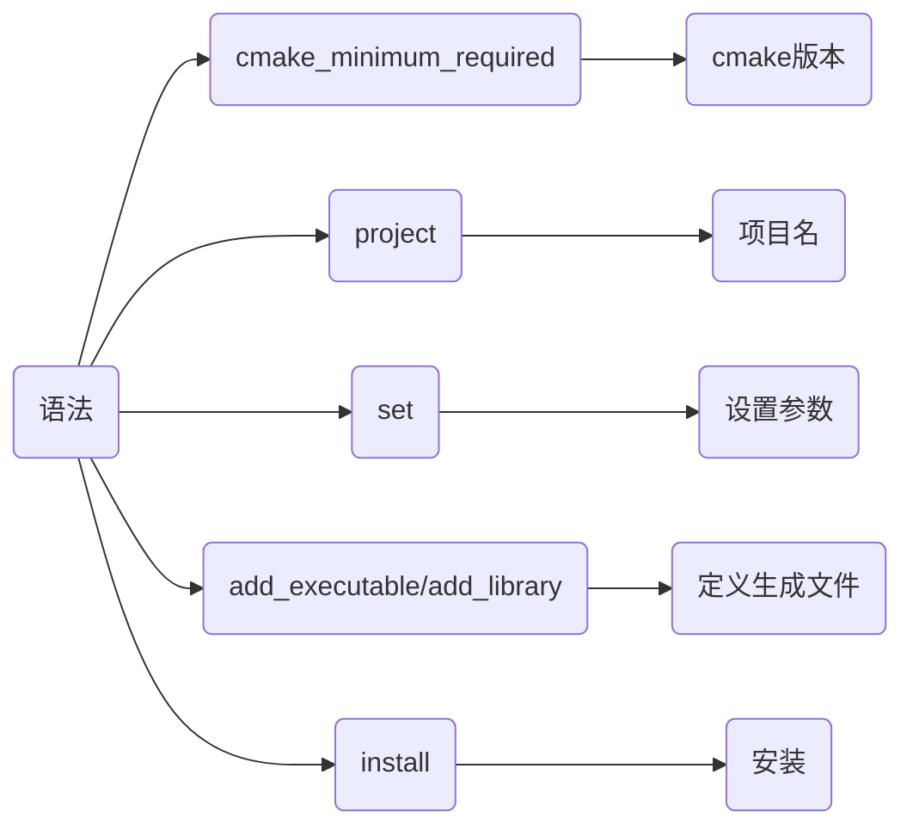
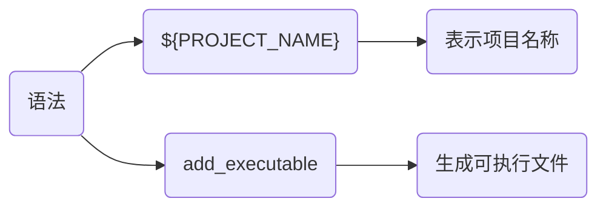
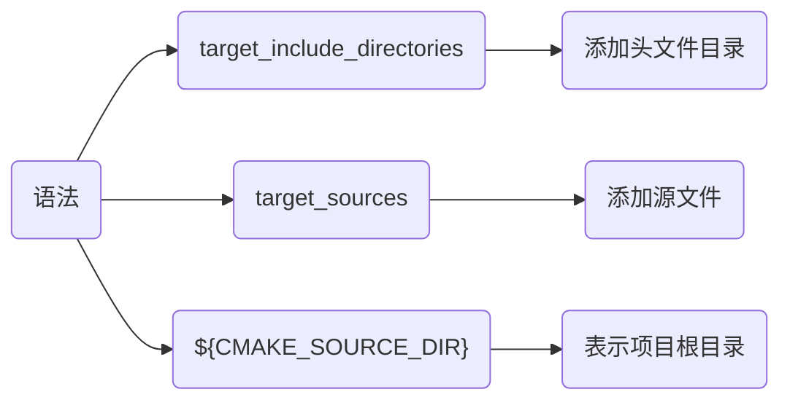
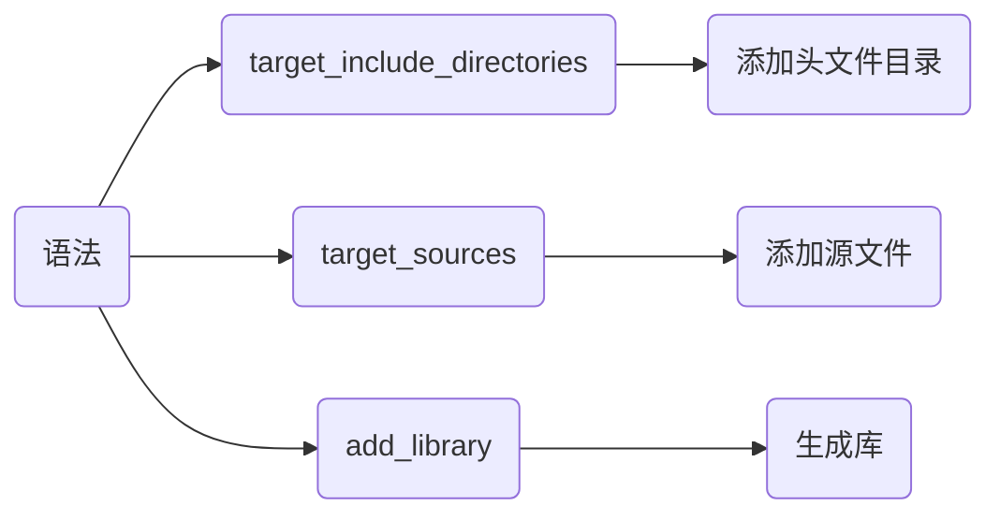
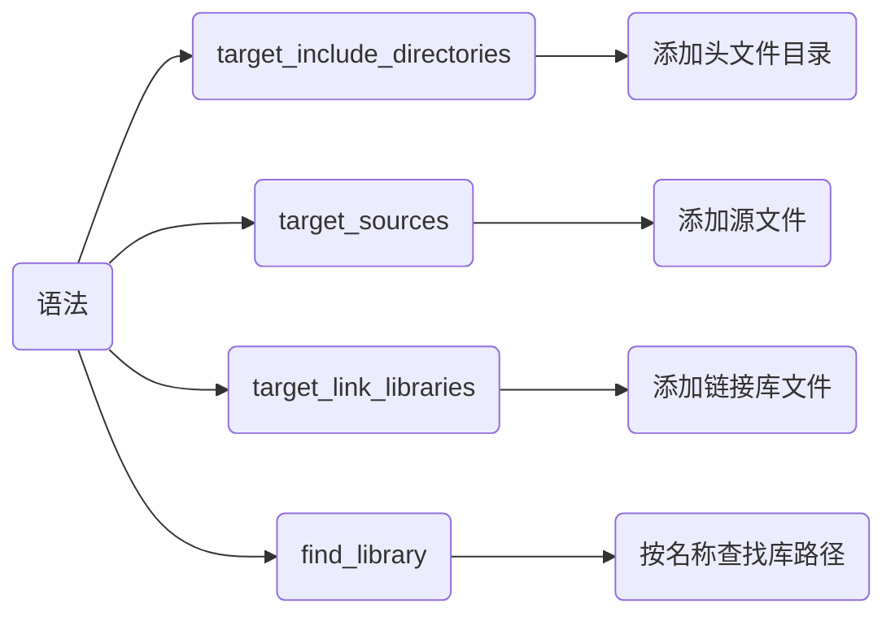

> [cmake使用详细教程(日常使用这一篇就足够了)](https://blog.csdn.net/iuu77/article/details/129229361)

## 配置

cmake是C/C++构建文件生成工具, 通过CMakeList.txt生成项目构建文件

### 安装

#### linux

##### 命令行

```sh
sudo apt install -y cmake
```

##### 源码安装

```sh
wget https://cmake.org/files/v3.25/cmake-3.25.0-linux-aarch64.tar.gz

tar -xvzf cmake-3.25.0-linux-aarch64.tar.gz                                     

cd cmake-3.25.0-linux-aarch64 && mkdir build && cd build

../bootstrap

# 编译安装
make -j4 && make install       
```

查看cmake版本

```sh
cmake --version
```

### 流程


- 示例, 通过cmake编译main.cpp

```c
// main.cpp
#include <iostream>

int main() {
    std::cout << "Hello World" << std::endl;
    return 0;
}
```

#### 编写CMakeLists.txt



```cmake
# CMakeLists.txt
# 设置CMake的最低版本要求
cmake_minimum_required(VERSION 3.10)
# 设置项目名称
project(main)

# 设置C++标准(C++11)
set(CMAKE_CXX_STANDARD 11)

# 定义可执行文件
add_executable(${PROJECT_NAME} main.cpp)

# 可执行文件安装位置
install(TARGETS ${PROJECT_NAME} RUNTIME DESTINATION bin)
```

#### 生成

cmake读取解析CMakeLists.txt, 检查系统环境、依赖库、编译器等设置, 生成对应平台构建文件, 例如在Unix系统上会生成Makefile


- 使用当前目录CMakeList.txt, 当前目录生成

会在当前目录下产生大量中间文件, 不推荐

```sh
cmake .
```


- 使用当前目录CMakeList.txt, 在build/下生成

```sh
cmake -B build

# 或者
cd build
cmake . .
```


- 使用source/CMakeList.txt, 在build/下生成

```sh
cmake -S source -B build
```

#### 构建

构建工具(如make)调用构建文件进行编译和链接


- 当前目录构建

```sh
cmake --build .
```

- 在build/下构建

```sh
cmake --build build
```


#### 安装

将构建产物按CMakeLists.txt中设置安装到指定位置

```sh
cmake --install 构建目录 --prefix 安装根路径
```

- 示例, 设构建目录为build/, 安装根路径为当前目录

```sh
cmake --install build --prefix .
```


## 示例

### 单文件

将单个.cpp生成可执行文件



```c
// main.cpp
#include <iostream>

int main() {
    std::cout << "Hello World" << std::endl;
    return 0;
}
```

```cmake
# CMakeLists.txt
cmake_minimum_required(VERSION 3.16)
project(main)

add_executable(${PROJECT_NAME} main.cpp)
```


### 多目录

将多个目录下.cpp文件生成可执行文件



- 示例, 将source_1、source_2目录下文件生成可执行文件

```sh
.
├── CMakeLists.txt
├── main.cpp
├── include_1
│   └── hello_1.hpp
├── include_2
│   └── hello_2.hpp
├── source_1
│   └── hello_1.cpp
└── source_2
    └── hello_2.cpp
```

```c++
// include_1/hello_1.hpp
#include <iostream>
void Hello_1();
```

```c
// include_2/hello_2.hpp
#include <iostream>
void Hello_2();
```

```c
// source_1/hello_1.cpp
#include "hello_1.hpp"
void Hello_1() {
    std::cout << "Hello_1" << std::endl;
}
```

```c
// source_2/hello_2.cpp
#include "hello_2.hpp"
void Hello_2() {
    std::cout << "Hello_2" << std::endl;
}
```

```c
// main.cpp
#include "hello_1.hpp"
#include "hello_2.hpp"

int main() {
    Hello_1();
    Hello_2();
    return 0;
}
```

```cmake
# CMakeLists.txt
cmake_minimum_required(VERSION 3.16)
project(main)

add_executable(${PROJECT_NAME} "")

# 添加可执行文件依赖头文件目录
target_include_directories(${PROJECT_NAME} PRIVATE
    ${CMAKE_SOURCE_DIR}/include_1
    ${CMAKE_SOURCE_DIR}/include_2
)

# 依赖源文件
target_sources(${PROJECT_NAME} PRIVATE
    ${CMAKE_SOURCE_DIR}/source_1/hello_1.cpp
    ${CMAKE_SOURCE_DIR}/source_2/hello_2.cpp
    ${CMAKE_SOURCE_DIR}/main.cpp
)
```


### 生成库

将.cpp生成库文件



- 示例, 将test_api.cpp生成静态库与动态库

```shell
.
├── CMakeLists.txt
├── main.cpp
├── include
│   └── test_api.hpp
└── source
    └── test_api.cpp
```

```c++
// include/test_api.hpp
#ifndef __INCLUDE_TEST_API_HPP__
#define __INCLUDE_TEST_API_HPP__
#include <iostream>

#ifdef _WIN32
    #define __EXPORT __declspec(dllexport)
#else
    #define __EXPORT __attribute__((visibility("default")))
#endif

#ifdef __cplusplus
extern "C" {
#endif
    void Display();
    int Add(int x, int y);
#ifdef __cplusplus
}
#endif
#endif // __INCLUDE_TEST_API_HPP__
```

```c
// source/test_api.cpp
#include "test_api.hpp"

void Display() {
    std::cout << "Print test_api success!" << std::endl;
}

int Add(int x, int y) {
    return x + y;
}
```

```cmake
# CMakeLists.txt
cmake_minimum_required(VERSION 3.16)
project(test_api)

# 设置库生成目录为lib/
set(LIBRARY_OUTPUT_PATH ${CMAKE_SOURCE_DIR}/lib)

# 生成库文件
add_library(${PROJECT_NAME}_shared SHARED "")
add_library(${PROJECT_NAME}_static STATIC "")

# 将动态库与静态库名称保存在LIB_NAME
foreach(LIB_NAME ${PROJECT_NAME}_shared ${PROJECT_NAME}_static)
    target_include_directories(${LIB_NAME} PRIVATE ${CMAKE_SOURCE_DIR}/include)
    target_sources(${LIB_NAME} PRIVATE ${CMAKE_SOURCE_DIR}/source/test_api.cpp)
    # 设置将库名
    set_target_properties(${LIB_NAME} PROPERTIES OUTPUT_NAME ${PROJECT_NAME})
endforeach()
```


### 使用库

生成可执行文件时链接现有库文件



- 示例, 生成可执行文件, 链接lib/下libtest_api库

```c
// main.cpp
#include "test_api.hpp"

int main(void) {
    int res = Add(1, 2);
    std::cout << "res = " << res << std::endl;
    Display();
    return 0;
}
```

```cmake
# CMakeLists.txt
cmake_minimum_required(VERSION 3.16)
project(main)

# 查找test_api库路径, 存储在FUNC_LIB中
find_library(FUNC_LIB test_api ${CMAKE_SOURCE_DIR}/lib)

add_executable(${PROJECT_NAME} "")

target_include_directories(${PROJECT_NAME} PRIVATE ${CMAKE_SOURCE_DIR}/include)
target_sources(${PROJECT_NAME} PRIVATE ${CMAKE_SOURCE_DIR}/main.cpp )
# 链接库
target_link_libraries(${PROJECT_NAME} PRIVATE ${FUNC_LIB})
```

### 生成库使用

通过多CMakeLists.txt, 实现生成库并链接库生成可执行文件


- 示例, 在test_api/生成libtest_api库, 并和main.cpp链接生成可执行文件

```sh
.
├── CMakeLists.txt
├── test_api
│   ├── CMakeLists.txt
│   ├── include
│   │   └── test_api.hpp
│   └── source
│       └── test_api.cpp
└── main.cpp
```

test_api目录

```c++
// test_api/include/test_api.hpp
#ifndef __INCLUDE_TEST_API_HPP__
#define __INCLUDE_TEST_API_HPP__
#include <iostream>

#ifdef _WIN32
    #define __EXPORT __declspec(dllexport)
#else
    #define __EXPORT __attribute__((visibility("default")))
#endif

#ifdef __cplusplus
extern "C" {
#endif
    int Add(int x, int y);
    void Print();
#ifdef __cplusplus
}
#endif
#endif // __INCLUDE_TEST_API_HPP__
```

```c++
// test_api/include/test_api.cpp
#include "test_api.hpp"

void Print() {
    std::cout << "Print test_api success!" << std::endl;
}

int Add(int x, int y) {
    return x + y;
}
```

```cmake
# test_api/CMakeLists.txt
cmake_minimum_required(VERSION 3.16)
project(test_api)

set(LIBRARY_OUTPUT_PATH ${CMAKE_SOURCE_DIR}/lib)

add_library(${PROJECT_NAME} SHARED "")
target_include_directories(${PROJECT_NAME} PRIVATE ${PROJECT_SOURCE_DIR}/include)
target_sources(${PROJECT_NAME} PRIVATE ${PROJECT_SOURCE_DIR}/source/test_api.cpp)
```

主目录

```cmake
# CMakeLists.txt
cmake_minimum_required(VERSION 3.16)
project(main)

# 设置预链接库名称
set(EXTRA_LIBS ${EXTRA_LIBS} test_api)

# 添加子目录cmake
add_subdirectory(test_api)

add_executable(${PROJECT_NAME} "")
target_include_directories(${PROJECT_NAME} PRIVATE ${CMAKE_SOURCE_DIR}/test_api/include)
target_sources(${PROJECT_NAME} PRIVATE ${CMAKE_SOURCE_DIR}/main.cpp)
target_link_libraries(${PROJECT_NAME} ${EXTRA_LIBS})
```


### FetchContent

CMake 3.11及以上版本引入FetchContent模块, 可直接下载第三方库编译

- 示例, 下载编译三方库fmt

```c++
// main.cpp
#include "fmt/core.h"

int main(){
    std::string world = fmt::format("Hello {0}", "World");
    fmt::print("{}\n", world);
}
```

#### 主CMakeLists.txt调用

```sh
.
├── CMakeLists.txt
├── main.cpp
└── extern
```

```cmake
# CMakeLists.txt
cmake_minimum_required(VERSION 3.17)
project(main)

set(CMAKE_CXX_STANDARD 14)

# 引入FetchContent
include(FetchContent)
FetchContent_Declare(fmt
    GIT_REPOSITORY https://github.com/fmtlib/fmt.git
    GIT_TAG 9.1.0
    # 源码存放位置
    SOURCE_DIR ${CMAKE_SOURCE_DIR}/extern/fmt
)
# 构建库
FetchContent_MakeAvailable(fmt)

add_executable(${PROJECT_NAME} "")
target_include_directories(${PROJECT_NAME} PRIVATE ${CMAKE_SOURCE_DIR}/extern/fmt/include)
target_sources(${PROJECT_NAME} PUBLIC main.cpp)
target_link_libraries(${PROJECT_NAME} PRIVATE fmt::fmt)
```


#### cmake模块调用

通过.cmake模块实现安装过程

```sh
.
├── CMakeLists.txt
├── Main.cpp
├── cmake
│   └── FMT.cmake
└── extern
```

新建cmake/FMT.cmake

```cmake
# cmake/FMT.cmake
include(FetchContent)

set(FMT_LIB fmt)

FetchContent_Declare(${FMT_LIB}
    GIT_REPOSITORY https://github.com/fmtlib/fmt.git
    GIT_TAG 9.1.0
    SOURCE_DIR ${CMAKE_SOURCE_DIR}/Extern/${FMT_LIB}
)
FetchContent_MakeAvailable(${FMT_LIB})
```

修改根目录CMakeLists.txt, 将fmt库安装逻辑解耦

```cmake
# CMakeLists.txt
cmake_minimum_required(VERSION 3.17)
project(main)

set(CMAKE_CXX_STANDARD 14)
set(CMAKE_MODULE_PATH ${CMAKE_SOURCE_DIR}/cmake)

# 导入FMT.cmake模块
include(FMT)

add_executable(${PROJECT_NAME} "")
target_include_directories(${PROJECT_NAME} PRIVATE ${CMAKE_SOURCE_DIR}/extern/fmt/include)
target_sources(${PROJECT_NAME} PUBLIC ${CMAKE_SOURCE_DIR}/main.cpp)
target_link_libraries(${PROJECT_NAME} PRIVATE ${FMT_LIB}::${FMT_LIB})
```

### 交叉编译(cross compiling)

通过交叉编译器可在AMD64平台编译生成ARM架构文件

#### 配置工具链

```sh
# 32位
sudo apt install -y arm-linux-gnueabihf-g++

# 64位
sudo apt install g++-aarch64-linux-gnu
```

查看版本

```sh
aarch64-linux-gnu-gcc -v
```


查看工具链路径


- 示例, 交叉编译arm64架构可执行文件

```c
// main.c
#include <stdio.h>

int main() {
    printf("Hello World\n");
    return 0;
}
```

```cmake
# CMakeLists.txt
cmake_minimum_required(VERSION 3.16)
project(main)

add_executable(${PROJECT_NAME} main.cpp)
```

#### 命令调用

命令行中通过条件编译宏指定交叉编译器

```sh
cmake -DCMAKE_C_COMPILER=gcc路径 -DCMAKE_CXX_COMPILER=g++路径 -DCMAKE_SYSTEM_NAME=Linux -DCMAKE_SYSTEM_PROCESSOR=armv8
```


#### .cmake调用

通过`-DCMAKE_TOOLCHAIN_FILE`指定工具链

```cmake
# 指定 C 编译器
set(CMAKE_C_COMPILER /path/to/cross/gcc)

# 指定 C++ 编译器
set(CMAKE_CXX_COMPILER /path/to/cross/g++)

# 指定目标系统(可选)
set(CMAKE_SYSTEM_NAME Linux)
set(CMAKE_SYSTEM_PROCESSOR arm)
```

```sh
cmake -DCMAKE_TOOLCHAIN_FILE=toolchain.cmake路径 ......
```

新建cmake/toolchain.cmake

```cmake
# cmake/toolchain.cmake
set(CMAKE_C_COMPILER aarch64-linux-gnu-gcc)
set(CMAKE_CXX_COMPILER aarch64-linux-gnu-g++)

set(CMAKE_SYSTEM_NAME Linux)
set(CMAKE_SYSTEM_PROCESSOR aarch64)
```

