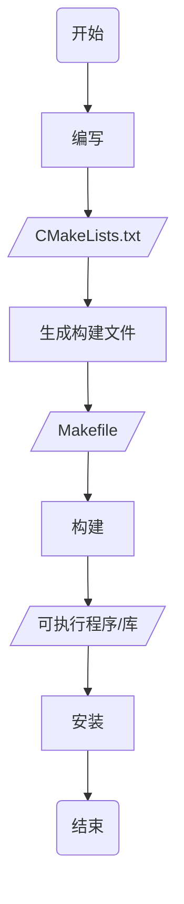
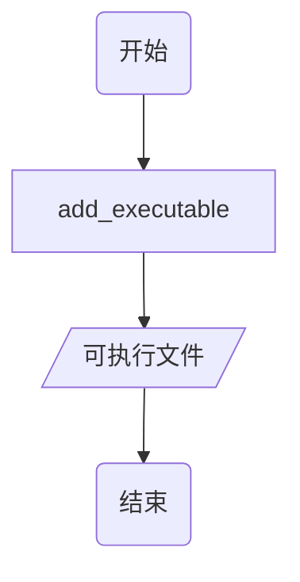
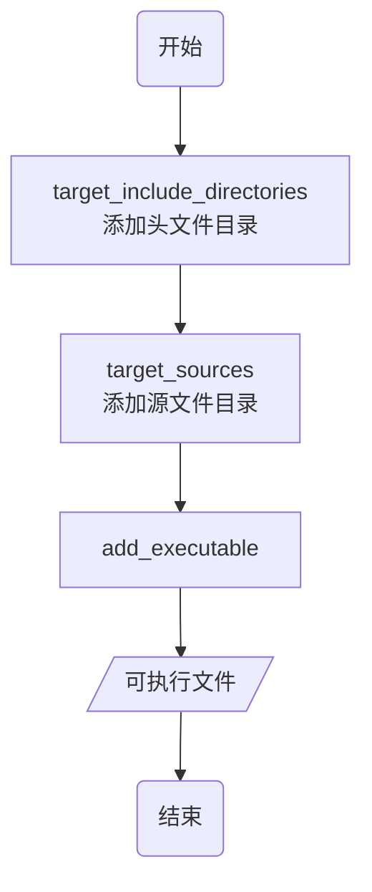
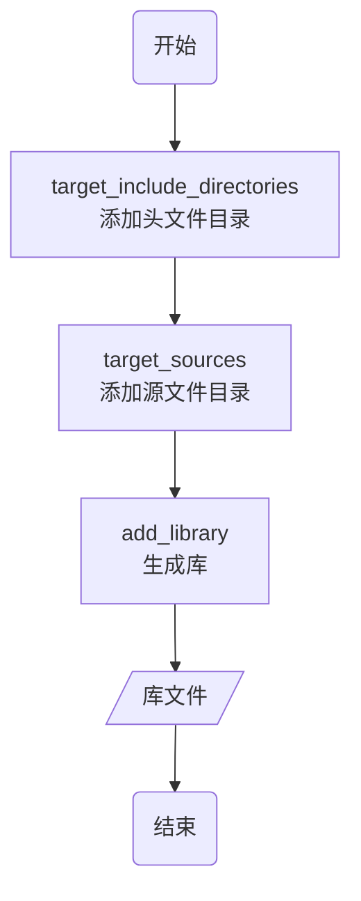
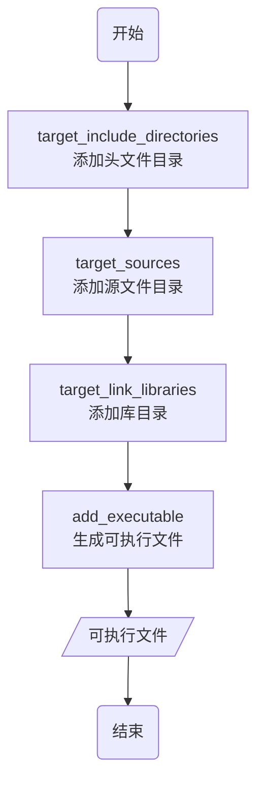

> [cmake使用详细教程(日常使用这一篇就足够了)](https://blog.csdn.net/iuu77/article/details/129229361)

## 安装

### linux

#### 软件安装

```sh
sudo apt install -y cmake
```

#### 源码安装

- 下载

```sh
wget https://cmake.org/files/v3.25/cmake-3.25.0-linux-aarch64.tar.gz

tar -xvzf cmake-3.25.0-linux-aarch64.tar.gz                                      
```

- 编译

```sh
cd cmake-3.25.0-linux-aarch64 && mkdir build && cd build 

# 配置编译环境
../bootstrap

# 编译安装
make && make install        
```

- 查看cmake版本

```sh
cmake --version
```

## 开发

cmake是C/C++构建文件生成工具, 通过CMakeList.txt生成项目构建文件



### 编写

```c
// main.cpp
#include<iostream>

int main() {
    std::cout << "Hello World" << std::endl;
    return 0;
}
```

```cmake
# CMakeLists.txt
# 设置CMake的最低版本要求
cmake_minimum_required(VERSION 3.10)
# 设置项目名称
project(main)

# 设置C++标准(C++11)
set(CMAKE_CXX_STANDARD 11)

# 定义可执行文件
add_executable(${PROJECT_NAME} main.cpp)

# 可执行文件安装位置
install(TARGETS ${PROJECT_NAME} RUNTIME DESTINATION bin)
```

### 生成

cmake读取解析CMakeLists.txt, 检查系统环境、依赖库、编译器等设置, 生成对应平台构建文件, 例如在Unix系统上会生成Makefile


#### 命令

- 读取当前目录CMakeList.txt, 在当目录生成

该方法会在当前目录下产生大量中间文件, 不推荐

```sh
cmake .
```


- 读取当前目录CMakeList.txt, 在build/下生成

```sh
cmake -B build

# 或者
cd build
cmake . .
```


- 读取source/CMakeList.txt, 在build/下生成

```sh
cmake -S source -B build
```

### 构建

构建工具(如make)调用构建文件进行编译和链接


#### 命令

```sh
cmake --build 构建目录
```

- 当前目录构建

```sh
cmake --build .
```

- 在build/下构建

```sh
cmake --build build
```


### 安装

cmake将构建产物安装CMakeLists.txt设置安装到指定位置

#### 命令

```sh
cmake --install 构建目录 --prefix 安装根路径
```

- 示例, 设构建目录为build/, 安装根路径为当前目录

```sh
cmake --install build --prefix .
```


## 开发

### 单CMakeLists.txt

#### 单文件

最简单情况, 将单个.cpp生成可执行文件

```c
// main.cpp
#include<iostream>

int main() {
    std::cout << "Hello World" << std::endl;
    return 0;
}
```



```cmake
# CMakeLists.txt
# 最低版本号
cmake_minimum_required(VERSION 3.16)

# 项目名
project(main)

# 生成可执行文件
add_executable(${PROJECT_NAME} main.cpp)
```


#### 多目录

设将多个目录下.cpp文件生成可执行文件



```sh
.
├── CMakeLists.txt
├── include_1
│   └── hello_1.hpp
├── include_2
│   └── hello_2.hpp
├── main.cpp
├── source_1
│   └── hello_1.cpp
└── source_2
    └── hello_2.cpp
```

```c++
// include_1/hello_1.hpp
#include<iostream>
void Hello_1();
```

```c
// include_2/hello_2.hpp
#include<iostream>
void Hello_2();
```

```c
// source_1/hello_1.cpp
#include "hello_1.hpp"
void Hello_1() {
    std::cout << "Hello_1" << std::endl;
}
```

```c
// source_2/hello_2.cpp
#include "hello_2.hpp"
void Hello_2() {
    std::cout << "Hello_2" << std::endl;
}
```

```c
// main.cpp
#include "hello_1.hpp"
#include "hello_1.hpp"
int main() {
    Hello_1();
    Hello_2();
    return 0;
}
```

```cmake
# CMakeLists.txt
cmake_minimum_required(VERSION 3.16)
project(main)

add_executable(${PROJECT_NAME} "")
# 添加可执行文件依赖头文件目录
target_include_directories(${PROJECT_NAME} PRIVATE
    ${CMAKE_SOURCE_DIR}/include_1
    ${CMAKE_SOURCE_DIR}/include_2
)
# 添加可执行文件依赖源文件
target_sources(${PROJECT_NAME} PRIVATE
    ${CMAKE_SOURCE_DIR}/source_1/hello_1.cpp
    ${CMAKE_SOURCE_DIR}/source_2/hello_2.cpp
    ${CMAKE_SOURCE_DIR}/main.cpp
)
```


#### 生成库

设将目标.cpp生成库文件



```sh
.
├── CMakeLists.txt
├── include
│   └── test_api.hpp
├── main.cpp
└── source
    └── test_api.cpp
```

```c++
// include/test_api.hpp
#ifndef __INCLUDE_TEST_API_HPP__
#define __INCLUDE_TEST_API_HPP__

#include<iostream>
#ifdef _WIN32
    #define __EXPORT __declspec(dllexport)
#else
    #define __EXPORT __attribute__((visibility("default")))
#endif

#ifdef __cplusplus
extern "C" {
#endif
    void Display();
    int Add(int x, int y);
#ifdef __cplusplus
}
#endif

#endif
```

```c
// source/test_api.cpp
#include "test_api.hpp"

void Display() {
    std::cout << "Print test_api success!" << std::endl;
}
int Add(int x, int y) {
    return x + y;
}
```

```cmake
# CMakeLists.txt
cmake_minimum_required(VERSION 3.16)
project(test_api)

# 设置库生成目录为lib/
set(LIBRARY_OUTPUT_PATH ${CMAKE_SOURCE_DIR}/lib)

# 生成库文件
add_library(${PROJECT_NAME}_Shared SHARED "")
add_library(${PROJECT_NAME}_Static STATIC "")
# 将动态库与静态库名称存在LIB_NAME变量
foreach(LIB_NAME ${PROJECT_NAME}_Shared ${PROJECT_NAME}_Static)
    target_include_directories(${LIB_NAME} PRIVATE ${CMAKE_SOURCE_DIR}/include)
    target_sources(            ${LIB_NAME} PRIVATE ${CMAKE_SOURCE_DIR}/source/test_api.cpp)
    # 设置库依赖项, 将库名称设置为PROJECT_NAME值
    set_target_properties(     ${LIB_NAME} PROPERTIES OUTPUT_NAME ${PROJECT_NAME})
endforeach()
```


#### 链接库

设lib/下已有libtest_api库, include/test_api.hpp是其头文件, 先生成可执行文件并链接该库



```c
// main.cpp
#include "test_api.hpp"

int main(void) {
    int res = Add(1, 2);
    std::cout << "res = " << res << std::endl;
    Display();
    return 0;
}
```

```cmake
# CMakeLists.txt
cmake_minimum_required(VERSION 3.16)
project(main)

# 查找test_api库路径, 存储在变量FUNC_LIB中
find_library(FUNC_LIB test_api ${PROJECT_SOURCE_DIR}/lib)

add_executable(${PROJECT_NAME} "")
target_include_directories(${PROJECT_NAME} PRIVATE ${CMAKE_SOURCE_DIR}/include)
target_sources(${PROJECT_NAME} PRIVATE ${CMAKE_SOURCE_DIR}/main.cpp )
# 链接库
target_link_libraries(${PROJECT_NAME} PRIVATE ${FUNC_LIB})
```

### 多CMakeLists.txt

#### 生成库链接

在test_api/生成libtest_api库, 并main.cpp链接生成可执行文件

```sh
.
├── CMakeLists.txt
├── test_api
│   ├── CMakeLists.txt
│   ├── include
│   │   └── test_api.hpp
│   └── source
│       └── test_api.cpp
└── main.cpp
```

```c++
// test_api/include/test_api.hpp
#ifndef __INCLUDE_TEST_API_HPP__
#define __INCLUDE_TEST_API_HPP__

#include<iostream>
#ifdef _WIN32
    #define __EXPORT __declspec(dllexport)
#else
    #define __EXPORT __attribute__((visibility("default")))
#endif

#ifdef __cplusplus
extern "C" {
#endif
    int Add(int x, int y);

    void Print();
#ifdef __cplusplus
}
#endif

#endif
```

```c++
// test_api/include/test_api.cpp
#include "test_api.hpp"

void Print() {
    std::cout << "Print test_api success!" << std::endl;
}

int Add(int x, int y) {
    return x + y;
}
```

```cmake
# test_api/CMakeLists.txt
cmake_minimum_required(VERSION 3.16)
project(test_api)

set(LIBRARY_OUTPUT_PATH ${CMAKE_SOURCE_DIR}/lib)

# 生成动态库
add_library(${PROJECT_NAME} SHARED "")
# 添加目标文件所引用头文件
target_include_directories(${PROJECT_NAME} PRIVATE ${PROJECT_SOURCE_DIR}/include)
# 添加目标文件所引用源文件
target_sources(${PROJECT_NAME} PRIVATE ${PROJECT_SOURCE_DIR}/source/test_api.cpp)
```

```cmake
# CMakeLists.txt
cmake_minimum_required(VERSION 3.16)
project(main)

# 设置预链接库名称
set(EXTRA_LIBS ${EXTRA_LIBS} test_api)

# 添加子目录CMake执行
add_subdirectory(test_api)

# 生成可执行文件
add_executable(${PROJECT_NAME} "")
target_include_directories(${PROJECT_NAME} PRIVATE ${CMAKE_SOURCE_DIR}/test_api/include)
target_sources(${PROJECT_NAME} PRIVATE ${CMAKE_SOURCE_DIR}/main.cpp)
target_link_libraries(${PROJECT_NAME} ${EXTRA_LIBS})
```


### 三方库

#### 源码编译

若三方库有CMake配置文件, 且能访问源码, 可直接添加到项目并用add_subdirectory编译

```cmake
add_subdirectory(三方库目录)
target_link_libraries(可执行文件 PRIVATE 三方库目录)
```

#### FetchContent

CMake 3.11及以上版本引入FetchContent模块, 可直接下载第三方库编译

例如编译fmt库, 可通过以下两种方式实现

```c++
// main.cpp
#include "fmt/core.h"

int main(){
    std::string world = fmt::format("Hello {0}", "World");
    fmt::print("{}\n", world);
}
```

- 方式一, 主CMakeLists.txt调用

```sh
.
├── CMakeLists.txt
├── main.cpp
└── extern
```

```cmake
# CMakeLists.txt
cmake_minimum_required(VERSION 3.17)
project(main)

set(CMAKE_CXX_STANDARD 14)

# 引入FetchContent
include(FetchContent)
FetchContent_Declare(fmt
    GIT_REPOSITORY https://github.com/fmtlib/fmt.git
    GIT_TAG 9.1.0
    # 源码存放位置
    SOURCE_DIR ${CMAKE_SOURCE_DIR}/extern/fmt
)
# 构建库
FetchContent_MakeAvailable(fmt)

add_executable(${PROJECT_NAME} "")
target_include_directories(${PROJECT_NAME} PRIVATE ${CMAKE_SOURCE_DIR}/extern/fmt/include)
target_sources(            ${PROJECT_NAME} PUBLIC main.cpp)
target_link_libraries(     ${PROJECT_NAME} PRIVATE fmt::fmt)
```


第三方库已下载


- 方式二, .cmake模块调用

新建cmake/FMT.cmake

```sh
.
├── CMakeLists.txt
├── Main.cpp
├── cmake
│   └── FMT.cmake
└── extern
```

```cmake
# FMT.cmake
include(FetchContent)

set(FMT_LIB fmt)

FetchContent_Declare(${FMT_LIB}
    GIT_REPOSITORY https://github.com/fmtlib/fmt.git
    GIT_TAG 9.1.0
    SOURCE_DIR ${CMAKE_SOURCE_DIR}/Extern/${FMT_LIB}
)
FetchContent_MakeAvailable(${FMT_LIB})
```

修改根目录CMakeLists.txt, 将fmt库安装逻辑解耦

```cmake
# CMakeLists.txt
cmake_minimum_required(VERSION 3.17)
project(main)

set(CMAKE_CXX_STANDARD 14)
set(CMAKE_MODULE_PATH ${CMAKE_SOURCE_DIR}/cmake)

# 导入FMT.cmake模块
include(FMT)

add_executable(${PROJECT_NAME} "")
target_include_directories(${PROJECT_NAME} PRIVATE ${CMAKE_SOURCE_DIR}/extern/fmt/include)
target_sources(            ${PROJECT_NAME} PUBLIC ${CMAKE_SOURCE_DIR}/main.cpp)
target_link_libraries(     ${PROJECT_NAME} PRIVATE ${FMT_LIB}::${FMT_LIB})
```