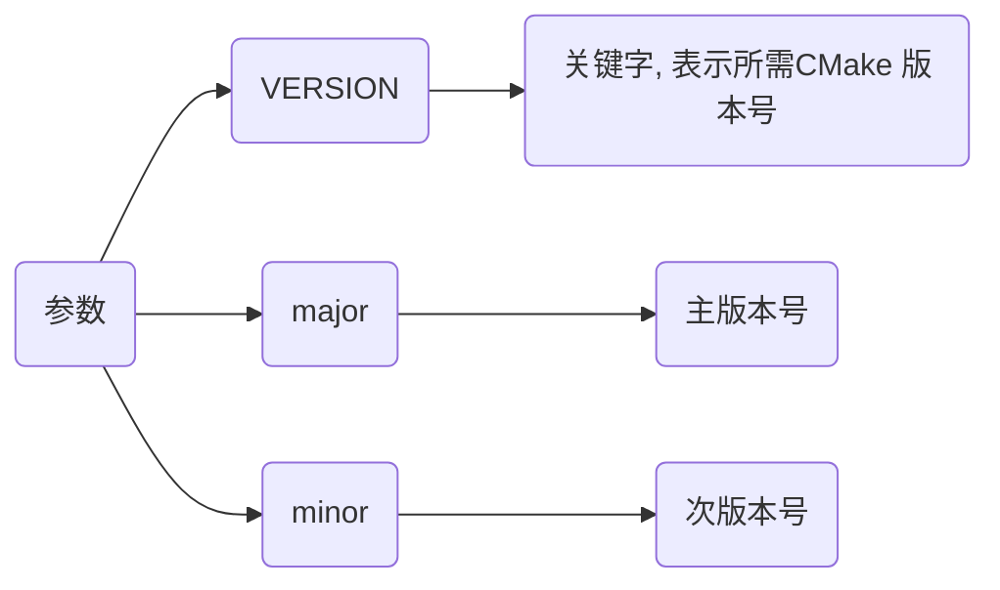
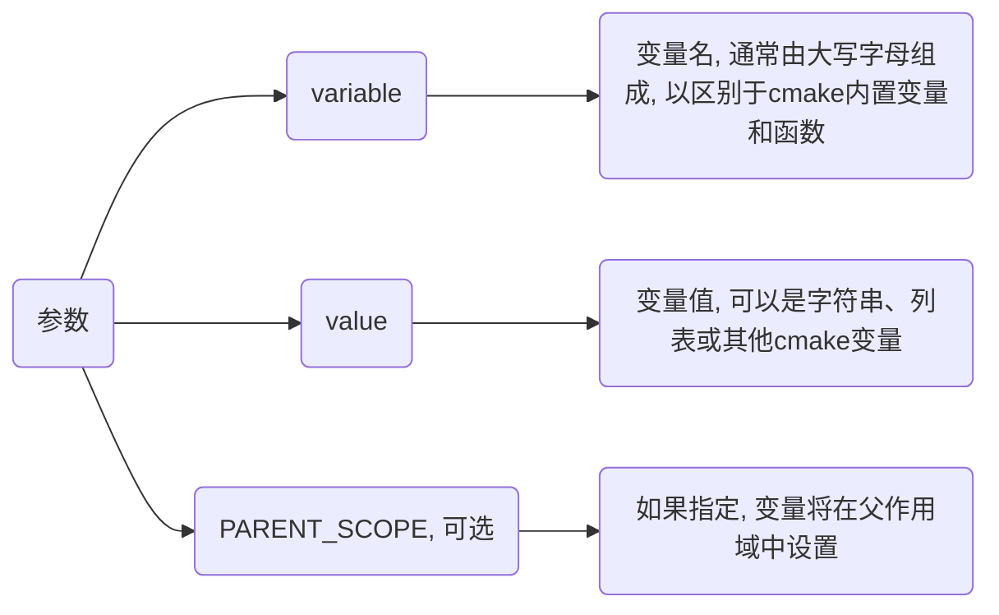
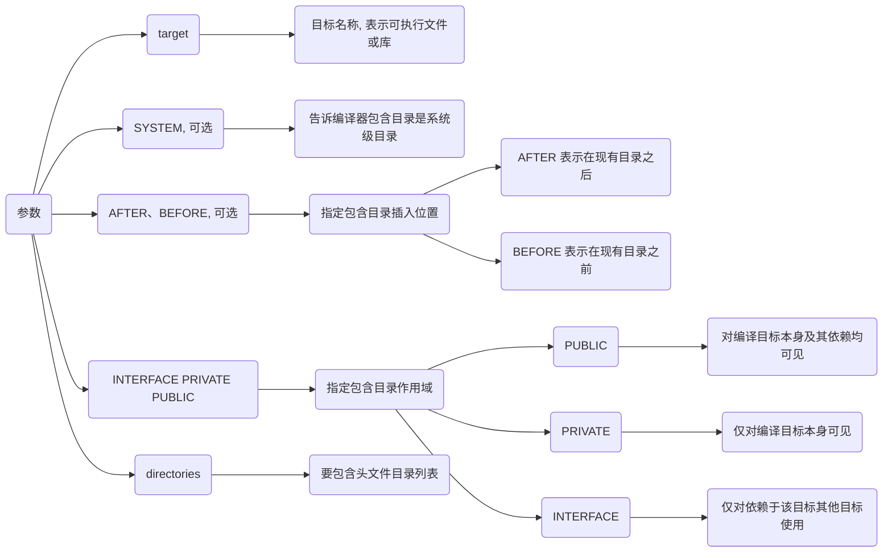
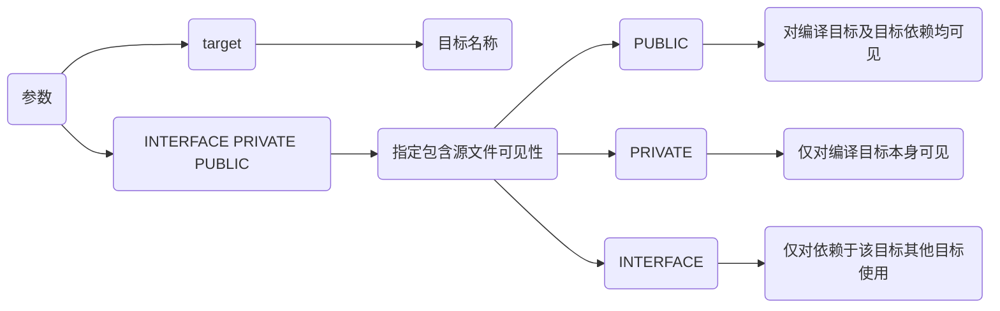
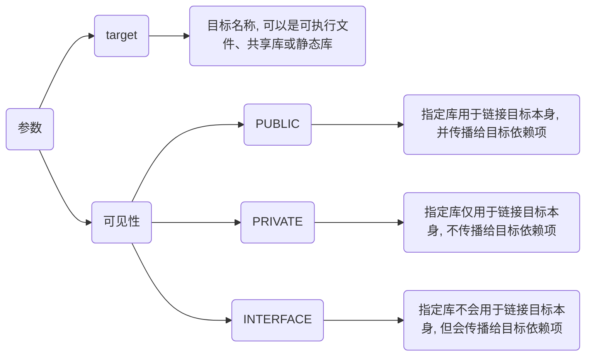
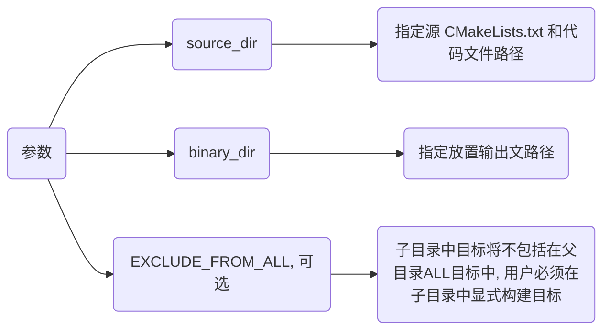
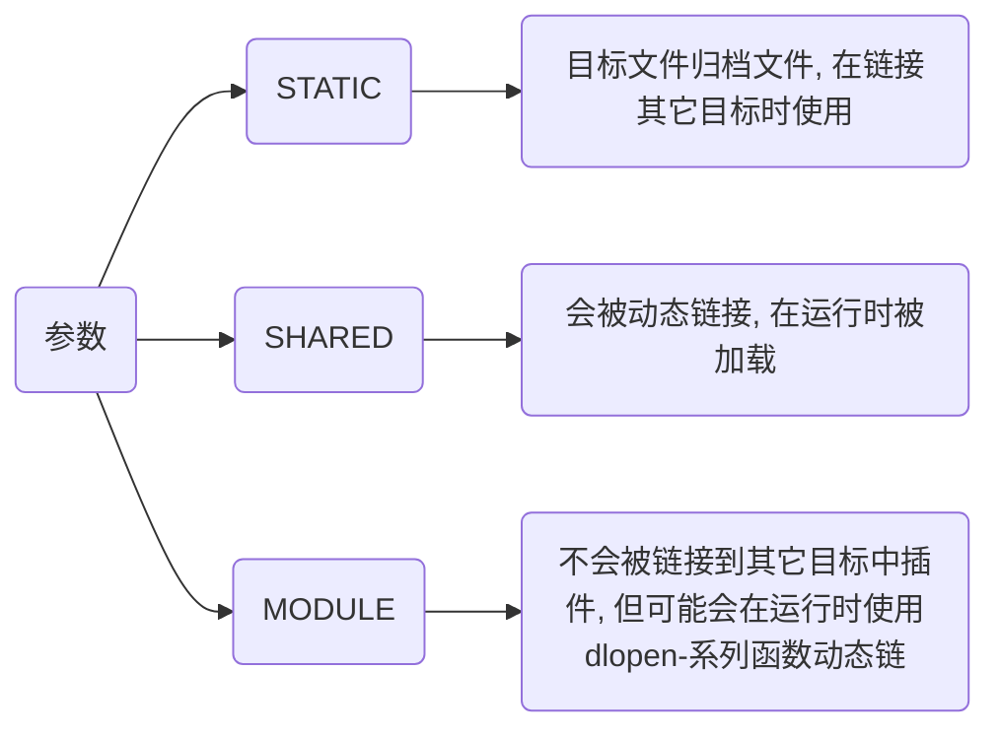

## 设置

### cmake最低版本

```cmake
cmake_minimum_required(VERSION major.minor)
```



- 示例, 设置工程最低cmake版本为3.10

```cmake
cmake_minimum_required(VERSION 3.10)
...
```

### 项目名

```cmake
project(项目名 (VERSION 版本信息, 可选))
```

- 示例, 设置项目名为main

```cmake
cmake_minimum_required(VERSION 3.10)
project(main)
...
```

### 变量

```cmake
set(variable value [PARENT_SCOPE])
```



#### 设置

##### 一般变量

- 示例, 设置变量MY_VAR

```cmake
set(MY_VAR "Hello, World!")
```

##### 列表变量

- 示例, 设置SRC_LIST存储源文件名

```cmake
set(SRC_LIST main.cpp test.cpp)
```

```cmake
set(MY_LIST "item1" "item2" "item3")

foreach(item IN LISTS MY_LIST)
    message(STATUS "List item: ${item}")
endforeach()
```

#### 父作用域中设置

- 示例, 父作用域设置变量

```cmake
function(my_func)
    set(MY_VAR_INSIDE "inside function" PARENT_SCOPE)
endfunction()

my_func()
message(STATUS "The value of MY_VAR_INSIDE after function call is: ${MY_VAR_INSIDE}")
```

my_func 函数内指定 PARENT_SCOPE 选项在父作用域中设置 MY_VAR_INSIDE 变量

即使在函数调用之后, MY_VAR_INSIDE 也可以在外部作用域中访问

#### 使用

cmake中通过`${变量名}`获取变量值

- 示例, 使用变量ANOTHER_VAR

```cmake
set(ANOTHER_VAR "Another Value")

set(MY_VAR2 ${ANOTHER_VAR})
```

## 添加

### 头文件目录

指定编译目标(可执行文件或库)应包含头文件目录

```cmake
target_include_directories(
    target
    [SYSTEM]
    [AFTER|BEFORE]
    <PRIVATE|PUBLIC|INTERFACE>
    <directories>
)
```



- 示例, 为main目标文件添加头文件目录

```sh
.
├── CMakeLists.txt
├── src
│   ├── main.c
│   └── module
│       └── test_api
│           └── include
│               └── test_api.h
└── third_party
    └── hello_lib
        └── hello.h
```

```c++
// third_party/hello_lib/hello.h
#include <stdio.h>

void Hello() {
    printf("Hello OK\n");
}
```

```c++
// src/module/test_api/include/test_api.h
#include <stdio.h>

void Test() {
    printf("Test OK\n");
}
```

```c++
// src/main.c
#include "hello.h"
#include "test_api.h"

int main() {
    Hello();
    Test();
    return 0;
}
```

```cmake
# CMakeLists.txt
cmake_minimum_required(VERSION 3.10)
project(main)

add_executable(main src/main.c)

target_include_directories(
    main
    PRIVATE
    ${CMAKE_SOURCE_DIR}/third_party/hello_lib
    ${CMAKE_SOURCE_DIR}/src/module/test_api/include
)
```


### 源文件路径

给目标文件添加依赖源文件路径

```cmake
target_sources(<target> <INTERFACE|PUBLIC|PRIVATE> [items1...])
```



- 示例, 添加源文件编译

```sh
.
├── CMakeLists.txt
└── src
    ├── hello
    │   ├── hello.c
    │   └── hello.h
    └── main.c
```

```c
// src/hello/hello.h
#include <stdio.h>

void Hello();
```

```c
// src/hello/hello.c
#include "hello.h"

void Hello() {
    printf("Hello\n");
}
```

```c
// src/main.c
#include "hello/hello.h"

int main() {
    Hello();
    return 0;
}
```

```cmake
# CMakeLists.txt
cmake_minimum_required(VERSION 3.10)
project(main)

add_executable(main "")

target_sources(
    main
    PRIVATE
    ${CMAKE_SOURCE_DIR}/src/main.c
    ${CMAKE_SOURCE_DIR}/src/hello/hello.c
)
```


### 链接依赖

指定链接给定目标和/或其依赖项

```cmake
target_link_libraries(target <INTERFACE|PUBLIC|PRIVATE> item...)
```



#### 链接系统库

如果项目需要链接系统库, 可以直接使用库名称(如 pthread、dl、m 等)或系统库变量(如 ${CMAKE_THREAD_LIBS_INIT})

- 示例, 链接系统POSIX线程库

```cmake
target_link_libraries(mytarget pthread)

# cmake线程支持模块
target_link_libraries(mytarget ${CMAKE_THREAD_LIBS_INIT})
```

#### 链接自定义库

- 示例, 链接自定义库

```cmake
target_link_libraries(mytarget PRIVATE mylibrary)
target_link_libraries(mytarget PUBLIC ${CMAKE_SOURCE_DIR}/lib/libexample.a)
target_link_libraries(mytarget INTERFACE ${CMAKE_SOURCE_DIR}/lib/libanother.so)
```

## 生成

### 子路径生成

为构建添加一个子路径

```cmake
add_subdirectory([source_dir] [binary_dir] [EXCLUDE_FROM_ALL])
```



### 库文件

创建库文件, 库名对应于逻辑目标名称, 在工程全局域内必须唯一

```cmake
add_library(target [STATIC | SHARED | MODULE] [EXCLUDE_FROM_ALL] source1 source2 ...)
```



### 可执行文件

```cmake
add_executable(target src_1 ...)
```

## 安装

### 目标文件

#### 可执行文件

```sh
install(TARGETS 文件名 RUNTIME DESTINATION 安装路径)
```

- 示例, 安装可执行文件main到根目录bin/

```c
// main.c
#include <stdio.h>

int main() {
    printf("Hello\n");
    return 0;
}
```

```cmake
# CMakeLists.txt
cmake_minimum_required(VERSION 3.10)
project(main)

add_executable(main main.c)

install(TARGETS main RUNTIME DESTINATION ${CMAKE_SOURCE_DIR}/bin)
```


#### 动态库

```cmake
install(TARGETS LIBRARY DESTINATION )
```

#### 静态库

```cmake
install(TARGETS ARCHIVE DESTINATION )
```

### 目录

```cmake
install(DIRECTORY DESTINATION )
```

#### 文件匹配过滤

```cmake
install(DIRECTORY DESTINATION FILES_MATCHING PATTERN )
```

- 示例, 仅安装.h和.hpp

```cmake
install(DIRECTORY ${CMAKE_SOURCE_DIR}/src DESTINATION shared FILES_MATCHING PATTERN "*.h" PATTERN "*.hpp")
```

## 常量

TODO
